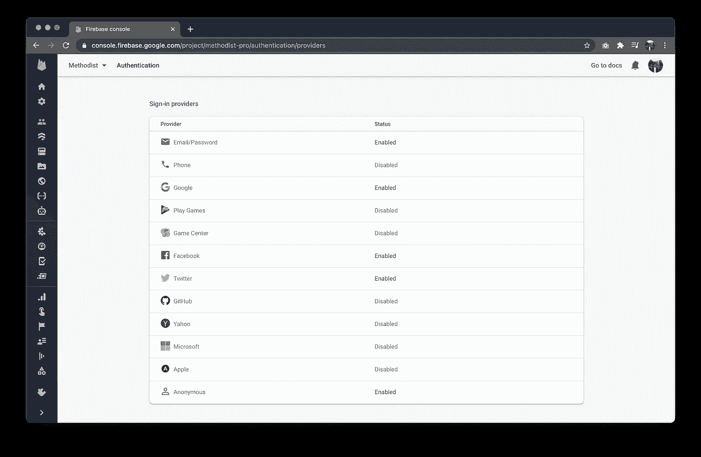
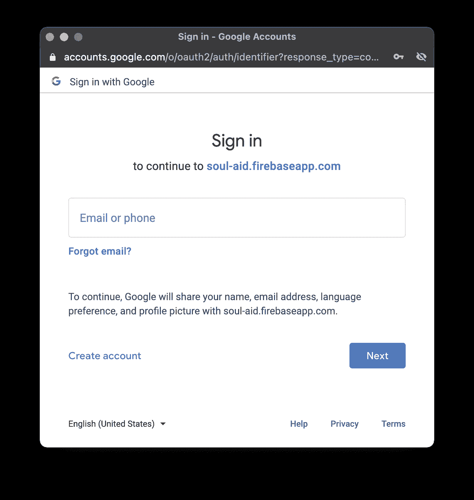
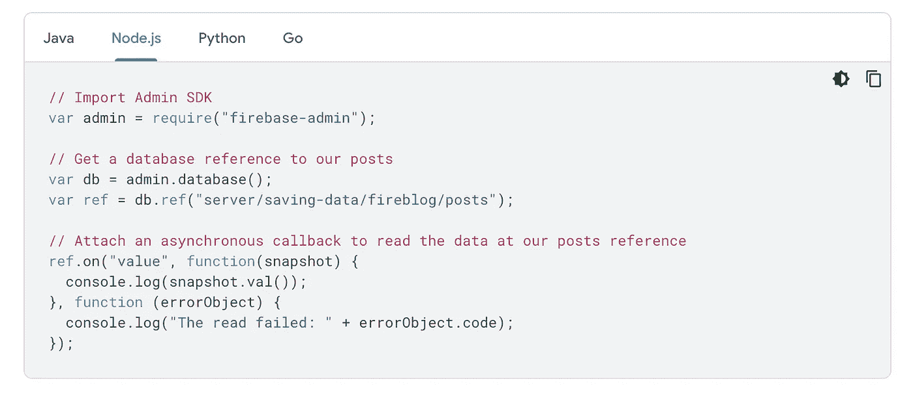
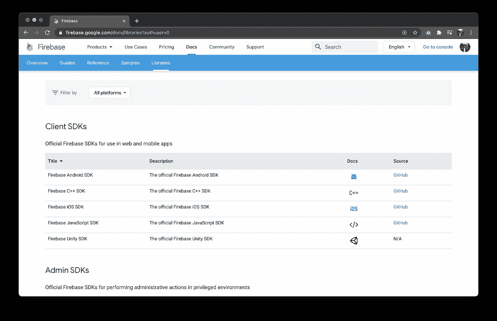
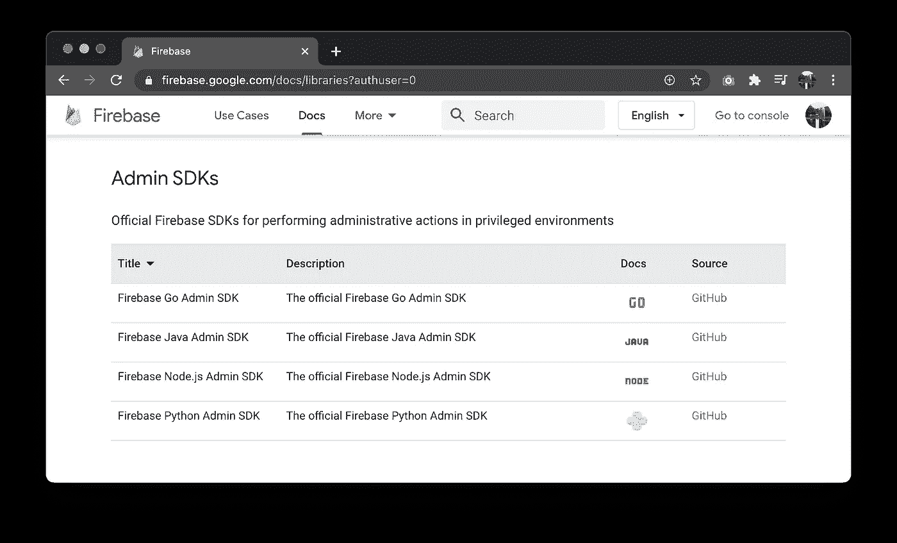

# SaaS 与火基地。两年后的利弊

> 原文：<https://levelup.gitconnected.com/saas-with-firebase-pros-cons-after-2-years-4e8c76a538eb>

## 我基于 Firebase 创建了一个有 4k+月活跃用户的盈利性单人 SaaS 应用程序，并希望分享经验。

像许多开发人员一样，我一直想开发自己的小型 SaaS 应用程序，这可以成为额外的收入来源。两年前，我基于 Firebase、GCP 和 Angular 创建了 MVP。每个月我都会做一些更新和添加新功能。现在，超过 800 个团队定期使用我的应用程序，我想分享我使用技术的经验。

首先我想说，这不是不同 web 平台之间的比较。有很多关于他们的文章。我的文章更像是两年前我创办 [Methodist.io](https://methodist.io/) 时以“赞成”和“反对”的形式进行的回顾。

## 涵盖的主题:

*   在数据库中存储数据
*   用户认证
*   SEO 和服务器端渲染
*   证明文件
*   库和 SDK
*   后端

# 在数据库中存储数据

Firebase 中的数据库是讨论最多的话题。因为它们有很多优点和缺点。

Firebase 有两种类型的数据库:

*   实时数据库
*   云 Firestore

它们之间最显著的区别之一是定价。
第一数据库基于流量计费，第二数据库—取决于读取/写入次数。清楚地了解你应该在什么时候使用什么是非常重要的。因为开发一个在线游戏或者用云 Firestore 聊天是一个巨大的错误和浪费你的钱，但是用一个实时数据库，它会非常便宜，甚至可能是免费的。

如果你决定用 Firebase 做类似 Foursquare 或猫途鹰的地图应用，你需要结合这些数据库。应该使用一个实时数据库来显示地图上的标记，当用户点击任何标记时——从 Cloud Firestore 加载详细信息。

听起来一切都很清楚，应该行得通吧？但是有一个陷阱。实时数据库只能按一个字段筛选项目列表。可以按价格筛选餐厅，但不能按价格和工作时间筛选。同样的限制也适用于坐标。不能按经纬度查询，因为是两个字段。帮助地理查询可以是一个小库[地火](https://github.com/firebase/geofire-js)，但是现在你被其他东西限制了过滤。

Firestore 在构建查询方面有更多的能力，如果你对定价没问题，那么还有一个陷阱。Cloud Firestore 就像一个实时数据库，是 NoSQL 数据库，所以用相关数据建立社交网络或其他应用程序可能不是最好的主意。

在所有其他情况下，这些数据库是惊人的！您可以真正快速地实现安全性良好的实时应用程序。

## 赞成的意见

*   两个数据库的即时开箱即用
*   安全规则
*   廉价实时数据库
*   Cloud Firestore 在设计上类似于 MongoDB
*   后端可以订阅数据库更改以验证操作或调用另一个函数

## 骗局

*   在实时数据库中构建查询的纯粹能力
*   仅 NoSQL 数据库
*   构建 four square/猫途鹰这样的定位应用和 Twitter 这样的社交网络是错误的选择。
*   由于每秒的读/写限制，对数据库(Cron 作业)的一些操作可能会被中断
*   不清楚如何编写单元测试或如何拥有不同的环境(但这是可能的)

# 用户认证

这个特性将为您或您的开发人员节省大量时间。只需几次点击和几行代码，您就可以为您的应用程序启用不同的提供商。当然，你必须在想要的网络中创建一个社交应用，Firebase 有关于如何设置它们的简单说明。

额外的亮点值得电话验证。你可以完全免费验证每月多达 10k 个电话号码。超过该限制后，美国号码的验证费用为 0.01 美元，其他国家的验证费用为 0.06 美元。

但是这些指南是简化的，对于投入生产来说，这肯定是不够的。例如，默认情况下，登录的弹出窗口会询问您的服务应用程序名称的权限。而且你知道，如何把这个名字改成你真正的域名并不明显。

我在 Twitter 上创建了一个小[帖子，讨论如何处理这个问题。](https://twitter.com/golosay/status/1350809574434025477?s=20)

## 赞成的意见

*   许多不同的身份验证提供商
*   电话号码身份验证和验证，包括免费层
*   匿名认证，可以提升为注册用户
*   有一个例子，如何使用自定义提供程序

## 骗局

*   不明显如何为生产设计登录弹出窗口(为什么不把主域作为 app 域？)
*   除了短信，没有其他方法来验证电话号码

# SEO 和服务器端渲染

Firebase 提供静态托管，非常简单而且免费。最多可以免费存储 1GB。对于单页应用程序来说，它是无限的😌托管。此外，Firebase 主机将提供一个自动更新的免费 SSL 证书。

如果你的应用需要认证用户，最好的选择可能是创建一个带有静态登陆页面的主机。并把你的 SPA 与域 app.your_domain.com 分开托管。这将是搜索引擎优化友好和非常快。

如果您的动态页面需要 SEO，这需要一些努力，但是您可以实现服务器端呈现或服务器端预呈现。
你可以在 CI 上预渲染页面，使用静态托管。我尝试了这种方法，但遇到了 PWA 功能的问题。这就是为什么我决定用 SSR 和 Google Cloud Run。我给[做了详细的指导，怎么处理](https://medium.com/javascript-in-plain-english/how-to-make-a-fast-angular-seo-friendly-app-a6d769bfd8d2)。
**我做了两年后的主要结论——没有最快的 SSR 比没有 SEO 的快速 SPA 要好。**

## 赞成的意见

*   1GB 空间的免费静态托管
*   您可以创建多个主机数量
*   您可以随意停放多个域
*   带自动更新的免费 SSL
*   简单的部署流程
*   托管可以存储备份

## 骗局

*   静态主机对 SPA 的搜索引擎优化不友好，并且不提供任何开箱即用的解决方案

# 证明文件

上市时间——是新项目最重要的统计数据之一。这是你开发和向市场发布 MVP 所需要的时间。所选技术的文档确实会影响它。此外，文档会影响产品的质量和开发人员的资历水平。

Firebase 有很棒的文档。它是结构化的，有许多不同平台的真实例子。

如何从后端的 Firebase 数据库中读取数据

Btw，关于例子！有一个知识库，里面有一堆[有用的云函数样本](https://github.com/firebase/functions-samples)。例如，你可以找到如何添加 [PayPal 支付](https://github.com/firebase/functions-samples/tree/master/paypal)或如何发送[电子邮件确认](https://github.com/firebase/functions-samples/tree/master/email-confirmation)的现成解决方案。此外，Firebase 还有一些应用程序示例，如实时消息网络应用( [firechat](https://github.com/FirebaseExtended/firechat) )或记事本( [firepad](https://github.com/FirebaseExtended/firepad) )。

但是文档中有一些空白。例如，你可以用 Firebase 发送推送通知，完全免费。在文档中解释了纯移动解决方案。也许这是个秘密，但是有了 Firebase，你可以毫无问题地向网络浏览器发送推送通知。

## 赞成的意见

*   按类别和平台组织良好的文档
*   按平台划分的几乎所有功能的代码示例
*   真实案例的云函数示例

## 骗局

*   没有关于网络推送通知的解释
*   面向 ES5 的 Node.js 文档(2021 年的语法很老了)
*   所有初学者指南和示例都不使用 TypeScript

# 库和 SDK

Firebase 有针对流行平台的 SDK

## SDK

Firebase 提供了构建 web 或移动应用程序所需的大量 SDK。SDK 有两种类型。

一个用于**客户端**，可以在 UI 上安全使用。您可以限制某些用户的访问，并且不允许他们从数据库中读取受保护的数据。客户端 SDK 提供了您需要的一切:用户认证、数据库访问、实时更新、文件上传、推送通知等等。

第二为**后端侧**。它是 admin SDK，它总是可以完全访问您项目的任何数据。

不同环境的管理 SDK

使用 admin SDK，您可以为您的应用程序实现端点，或者您可以从数据库中侦听事件，并对更改的数据做一些事情。此外，我使用 SDK 进行数据库维护。可以设置 CRON 作业并从数据库中清除临时数据或不必要的数据。例如，我删除不活动的未注册用户的数据。

## 结构

这真的是 Firebase 最强的一面。一个大型的社区为最流行的 UI 框架创建了许多令人惊叹的框架和库。开发人员可以轻松地将框架添加到他们的应用程序中，并使用符合其框架和架构的服务。

有一些很小但非常有用的库，比如 GeoFire。由于实时数据库的限制，您不能通过两个参数搜索项目，如纬度和经度，但使用 GeoFire，您甚至可以通过实时更新来实现地理查询。

## 赞成的意见

*   许多流行平台的官方 SDK，如 android、iOS、C++、unity 和 JavaScript
*   流行 UI 框架的高质量社区框架
*   有用的库，如 GeoFire，用于构建带有实时支持的数据库地理查询
*   跨平台开发框架:颤振和反应原生

## 骗局

*   由于数据库的限制，您不能一次按位置和任何其他字段进行查询(相对于数据库，cons 更多)
*   JS SDKs 的所有文档都是用 ES5 语法编写的

# 后端

在文档中，Firebase 建议使用云功能作为后端需求的解决方案。云函数可以由 HTTP 请求或数据库更改等事件调用。

云函数非常简单。应该传递给 Admin SDK 的是回调。支持 Javascript 和 TypeScript 语言。只有一个陷阱——冷启动。如果超过 5 分钟未调用该功能，Google 将关闭运行该功能的环境。因此，下一次用户需要等待大约 1 秒钟，让环境唤醒。

云功能便宜。你甚至可以和他们做 SSR。免费等级包括每月 100 万次通话。

作为替代，您可以使用 GCP 服务作为后端。例如应用引擎、云运行或计算引擎。他们还有一个免费层。

## 赞成的意见

*   免费或非常便宜的云功能
*   开发简单
*   易于部署
*   详细日志
*   来自 Google 云平台的许多替代方案(应用引擎、云运行或计算引擎)

## 骗局

*   云功能冷启动
*   App engine 挺贵的

# 结论

Firebase 一开始很便宜甚至免费。因此，为了测试您的 PoC 或一个人的项目，这绝对是一个好的解决方案。如果该项目将拍摄，与优化，定价也将是好的。Firebase 有一个[惊人的价格计算器](https://firebase.google.com/pricing#blaze-plan-calculator)，你可以在那里检查你的项目在未来的实际成本。只要确保使用适合您需求的服务，比如正确的数据库。

感谢阅读！