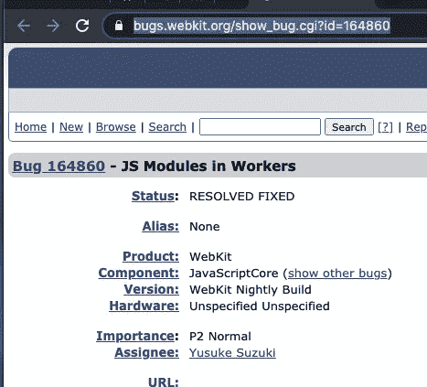
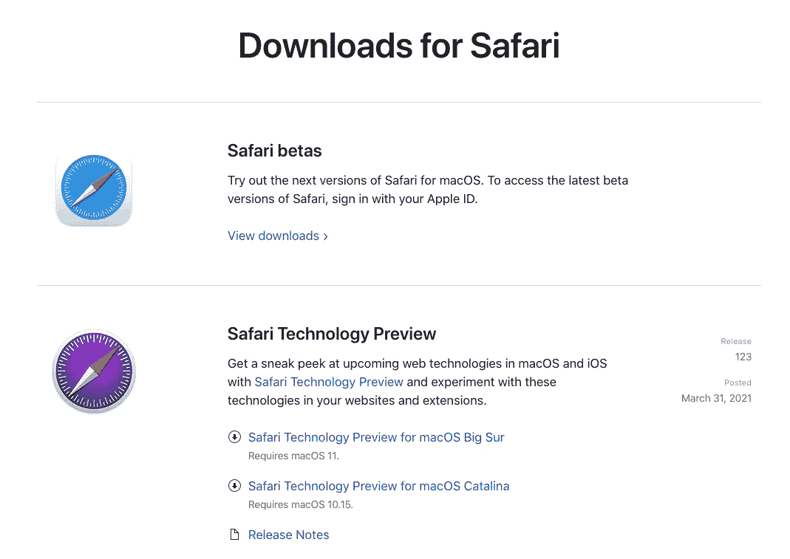
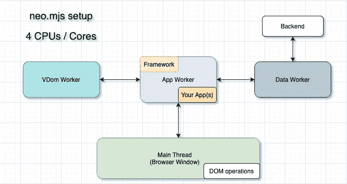
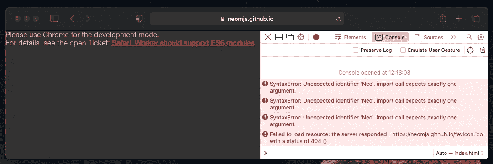
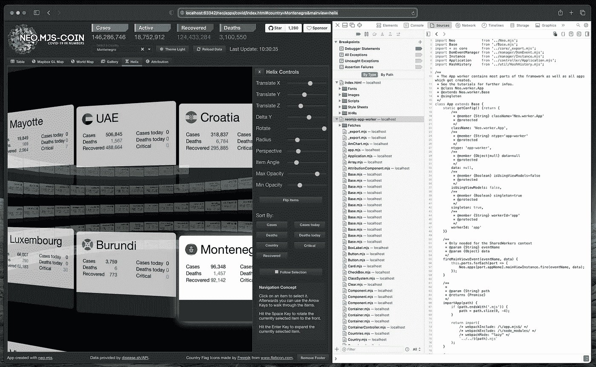

# Safari (Webkit)即将在 worker 范围内发布对 JS 模块的支持

> 原文：<https://levelup.gitconnected.com/safari-webkit-about-to-release-support-for-js-modules-inside-the-worker-scope-9dd33fc20190>

这是让 UI 开发回到它所属的地方的一大步:
进入浏览器。

# 内容

1.  相关票证
2.  安装“Safari 技术预览版”
3.  如何从 JS 模块创建一个 worker？
4.  在大型用例中验证逻辑
5.  比较 Chrome、Safari 和 Firefox 的渲染性能
6.  Safari (Webkit)缺什么？
7.  最后的想法

# 1.相关票证

当我打开票的时候，我非常兴奋，看到它变成了“已解决”。

 [## 164860-Workers 中的 JS 模块

### 编辑描述

bugs.webkit.org](https://bugs.webkit.org/show_bug.cgi?id=164860) 

# 2.安装“Safari 技术预览版”

安装极其简单:

[](https://developer.apple.com/safari/download/) [## 下载— Safari —苹果开发者

### 由 WebKit 引擎支持，Safari 提供了领先的性能、兼容性和一组出色的内置 web…

developer.apple.com](https://developer.apple.com/safari/download/) 

# 3.如何从 JS 模块创建一个 worker？

您可以像这样创建一个非基于模块的工作线程:

```
const worker = new Worker('worker.js');
```

如果您确实想要一个 JS 模块作为起点，只需使用 type 选项:

```
const worker = new Worker('worker.mjs', {
  type: 'module'
});
```

# 4.在大型用例中验证逻辑

neo.mjs 很可能是最大的项目，它依赖于在 worker 范围内使用 js 模块。毕竟，你的应用和组件都在那里。



到目前为止，在 Chromiun (Chrome & Edge)中，只有在没有任何构建和编译的情况下，才可能使用开发模式→真实代码。

当然，我们以前也可以在 Safari 中使用基于 webpack 的 dist/development 和 dist/production 输出，但如果您想为 Webkit 设计或修复特定的东西，这并不有趣。

我的测试案例是 Covid Dashboard，这是一个相当复杂的应用程序。

你可以在这里找到源代码: [apps/covid](https://github.com/neomjs/neo/tree/dev/apps/covid)

 [## 数字中的新冠肺炎

### 编辑描述

neomjs.github.io](https://neomjs.github.io/pages/node_modules/neo.mjs/apps/covid/index.html) 

在普通 Safari 版本中打开它会导致:



现在，如果我们使用技术预览再次打开它:



(我正在使用本地版本删除自定义警告文本)

您在这里可以看到:

1.  我们可以在 app worker 范围内打开一个文件
2.  这是一个真正的 JS 模块
3.  没有源地图

# 5.比较 Chrome、Safari 和 Firefox 的渲染性能

我已经有一段时间没有在 Safari 中测试性能了。我不得不承认:
我印象深刻。和现在的铬绝对是一个级别的。

我创建螺旋和 3d 画廊主要是为了真正强调浏览器的渲染引擎。我的目标是看看使用 neo.mjs workers 设置可以实现多少 dom 操作。

两种视图都使用 dom 节点和 css-transform。没有画布，SVG 或 webGL。在 Chromium 中，我可以在本地每秒进行超过 30，000 次 dom 操作。

我现在没有在这里做任何真正的基准测试，但想给你一个感觉，它显示了 3 个短视频。请记住，录制视频会影响性能。

铬合金:

Safari 技术预览:

干得好！我注意到，在 Chrome 中，将“翻转项目”旋转 180 度仍然更好:不是性能，而是旋转方向感觉随机。

这是一张新票，还不确定它最适合哪一类。

火狐每夜:

Firefox 还不支持 worker 范围内的 JS 模块。

 [## 1247687 -实施工人模块

### 核心领域的新成员:工人。最后更新于 2021 年 4 月 8 日。

bugzilla.mozilla.org](https://bugzilla.mozilla.org/show_bug.cgi?id=1247687) 

所以我们需要使用该应用的 dist/production 版本:[dist/production/apps/covid/](https://neomjs.github.io/pages/node_modules/neo.mjs/dist/production/apps/covid/index.html#mainview=table)

这里的渲染表现感觉真的很差，所以还有工作要做！

# 6.Safari (Webkit)缺什么？

我们仍然需要对共享工作者的支持:

 [## 149850 -恢复对共享工作者的支持

### 错误 149850:恢复对共享工作人员的支持

bugs.webkit.org](https://bugs.webkit.org/show_bug.cgi?id=149850) 

Chromium 和 Firefox 都支持它们。

这一点尤其重要，因为 iOS 上的所有浏览器都必须使用它。

我也希望看到多窗口 covid 应用程序在这里运行:

共享工作者对移动设备也很重要，因为许多应用程序使用包含多个 web 视图的本机外壳(无头浏览器)。

我们可以在他们之间直接交流。

# 7.最后的想法

不知道哪个 Safari 发布版本会包含这个新功能。

我会密切关注它，一旦它将 Safari 添加到 neo.mjs 开发模式支持的浏览器列表中。

[](https://github.com/neomjs/neo) [## 近地天体

### neo.mjs 使您能够使用一个以上的 CPU 创建可扩展的高性能应用程序，而无需使用…

github.com](https://github.com/neomjs/neo) 

【边节点】neo.mjs 刚刚发布版本 2:

[](https://itnext.io/the-webworkers-driven-ui-framework-neo-mjs-version-2-release-announcement-b91b476d6f16) [## webworkers 驱动的 UI 框架 neo.mjs 第 2 版发布公告

### 新产品的概念必须是颠覆性的，否则就没什么必要。然而，使用它们的方法…

itnext.io](https://itnext.io/the-webworkers-driven-ui-framework-neo-mjs-version-2-release-announcement-b91b476d6f16) 

感谢[铃木佑介](https://www.linkedin.com/in/yusukes/)和 Webkit 团队完成了这一切！

问候&快乐编码，
托拜厄斯