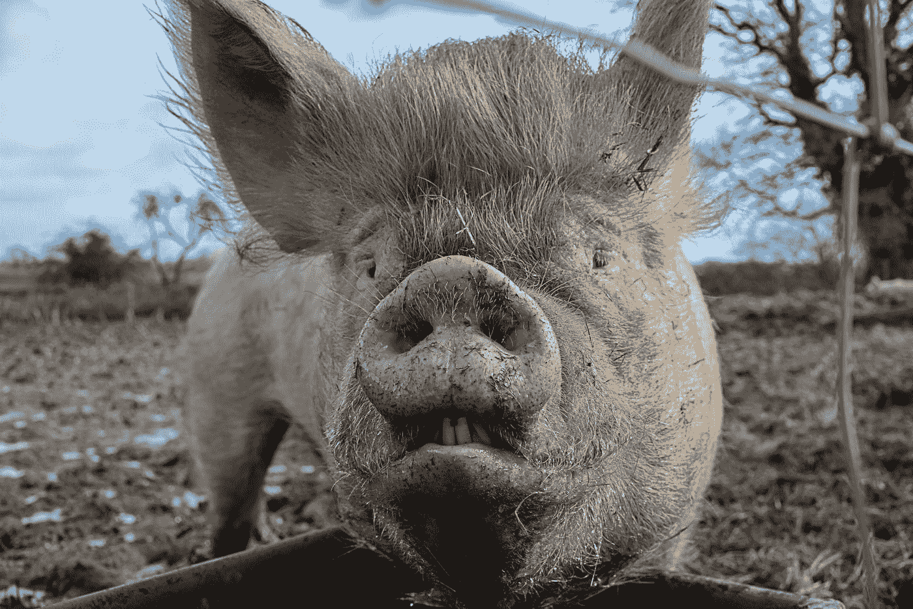
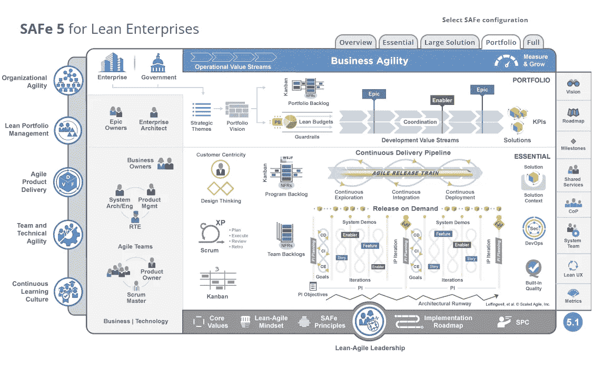
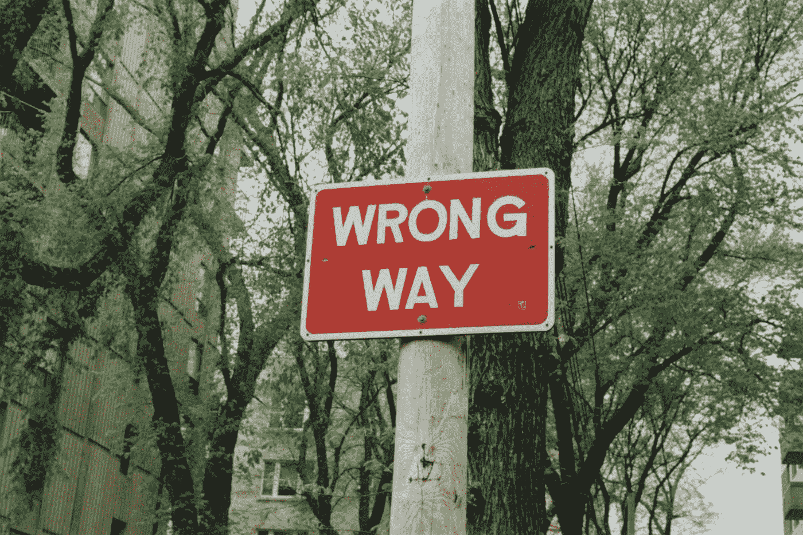
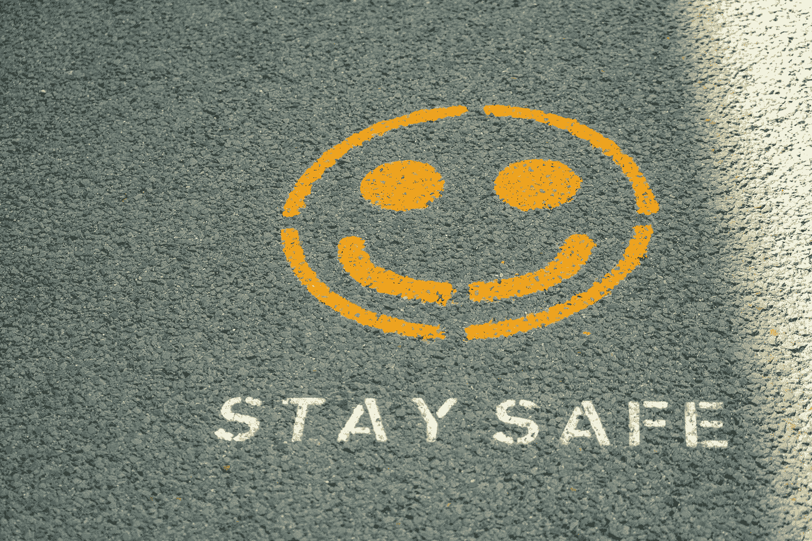

# 安全:涂着敏捷口红的瀑布猪

> 原文：<https://levelup.gitconnected.com/safe-a-waterfall-pig-with-agile-lipstick-dd13a200b008>

安全与强大的产品公司使用的产品截然相反。这就是所谓的“大规模敏捷”。这不是敏捷。只是营销而已。

莫妮卡·库巴拉在 [Unsplash](https://unsplash.com?utm_source=medium&utm_medium=referral) 上的照片

> “如此多的大公司沉迷于过程，他们认为答案是过程……尽管他们可能使用敏捷这个词，但他们经常使用这些荒谬的过程，如安全或不安全。这些与一个好的产品公司所使用的截然相反。事实上，我找不到任何一家强大的产品公司使用这些技术。他们被称为大规模敏捷。他们一点都不敏捷。这只是市场营销，所有这些人都被市场营销所迷惑
> 
> —马蒂·卡甘，2022

[马蒂·卡甘](https://www.svpg.com/team/marty-cagan/)是[硅谷产品集团](https://www.svpg.com/) (SPVG)的创始人和合伙人，也是畅销书[激励](https://www.amazon.co.uk/INSPIRED-Create-Tech-Products-Customers-ebook/dp/B077NRB36N)和[授权](https://www.amazon.co.uk/EMPOWERED-Ordinary-Extraordinary-Products-Silicon-ebook/dp/B08LPKRD5L/ref=sr_1_1?crid=1S6ED3J3RH9IH&keywords=EMPOWERED&qid=1654594344&s=digital-text&sprefix=empowered%2Cdigital-text%2C100&sr=1-1)的作者。Marty 作为产品领导者拥有 20 年的行业经验，现在与全球各地的技术公司合作，帮助他们以创新、速度和灵活性推动产品转型。他经常被称为“产品领域最有影响力的人”。

# TLDR；

现代敏捷方法引入了复杂的系统来跟踪团队是否完成了他们在 PI 级别上承诺的工作。如果没有适当的产品管理策略(因为这不可能每季度发生几天)，工程师会花费大量时间谎报他们的估计，低估和试图游戏化通用指标。这给工程师带来了巨大的激励问题。自我效能是已建立的心理健康模型([齐默尔曼的](https://www.semanticscholar.org/author/B.-Zimmerman/12321217)模型解释[自我调节](https://en.wikipedia.org/wiki/Self-regulated_learning))的一部分，是你能做某事的信念和围绕它的动机。如果你的时间表和估计没有意义，你花了太多时间撒谎，那么你就不能建立信念结构或做这件事的动机，这会影响你尝试和做这件事的兴趣。

# 什么是安全的？

照片由 [Immo Wegmann](https://unsplash.com/@macroman?utm_source=medium&utm_medium=referral) 在 [Unsplash](https://unsplash.com?utm_source=medium&utm_medium=referral) 上拍摄

[Scaled Agile Framework](https://www.atlassian.com/agile/agile-at-scale/what-is-safe#:~:text=The%20Scaled%20Agile%20Framework%C2%AE,work%2C%20and%20values%20to%20uphold)(SAFe)是一套在企业范围内实现敏捷实践的组织和工作流模式。该框架是一个知识体系，包括关于角色和职责、如何计划和管理工作以及要维护的价值观的结构化指导。

外管局声称在 110 多个国家有超过 1，000，000 名专业人员在外管局接受培训。所以这其中一定有蹊跷，对吗？

# 安全实施

[纳达哈巴斯](https://unsplash.com/@nadah?utm_source=medium&utm_medium=referral)在 [Unsplash](https://unsplash.com?utm_source=medium&utm_medium=referral) 上拍摄的照片

外管局框架引用的第一步[是挑选一批员工成为外管局项目顾问。](https://www.scaledagileframework.com/train-lean-agile-change-agents/)

> "培训精益-敏捷变革代理成为认证安全项目顾问(SPCs). "

每个 SPC 的认证费用约为 3，000 美元，这还不包括派遣您的领导和普通员工参加外管局推荐的其他认证的费用。

预期的结果？现在，您有专门的员工来安全地生活和呼吸，并在整个组织中推行安全议程。这实际上是一个传销活动。

# 品牌敏捷

布雷特·乔丹在 [Unsplash](https://unsplash.com?utm_source=medium&utm_medium=referral) 上的照片

以下关于“品牌敏捷”的摘录摘自史蒂夫·丹宁 2019 年发表的[理解伪敏捷](https://www.forbes.com/sites/stevedenning/2019/05/23/understanding-fake-agile/)

> 一种特别不幸的“品牌敏捷”形式涉及到扩展框架。这些计划旨在帮助那些拥有一些实施敏捷实践的团队，并希望解决敏捷团队和组织后台系统(如战略、计划、预算、人力资源、财务)之间的紧张关系的公司，这些系统通常是单一的和官僚的。
> 
> 这种挑战通常表现为“扩展敏捷”。这里的问题是，如果公司正在考虑“扩展敏捷”，那么它已经走错了路。真正的敏捷面临的挑战是如何将大型的、内部集中的系统分解成可以由小型的、自我管理的、以客户为中心的团队来运行的任务。
> 
> 一个特别令人担忧的变体是可伸缩的敏捷框架或 SAFe。本质上，这是一种制度化的官僚作风，顾客几乎完全不在其中。它现在在大公司中很普遍，因为它给了管理层一个命令，称自己为敏捷，并继续做他们一直做的事情。本质上，它使敏捷团队从属于官僚机构，而不是做实现业务敏捷所必须做的事情，也就是说，将大型的内部集中的系统转化为预算、人力资源、财务等灵活的外部集中的安排，以支持敏捷团队的运作。上图中客户的无关紧要的角色表明了这个问题。
> 
> 外管局有怀疑真正的敏捷的风险。这是格雷欣法则的一个例证:劣币驱逐良币。当这种情况发生时，安全就是“伪敏捷”的缩影当 SAFe 由具有真正敏捷思维的管理者实现时，它的负面影响可能会减轻。我的问题是:为什么有真正敏捷思维的人会首先使用 SAFe？

# 一般外管局批评

兰迪·雷伯恩在 [Unsplash](https://unsplash.com?utm_source=medium&utm_medium=referral) 上的照片

以下是一些不值得在本文中单独列出的小要点:

*   外管局将开发团队描述为由“开发人员和测试人员”组成，而不是完全跨职能的
*   外管局试图加强从 XP 改编的代码质量实践。
*   外管局表示“按步就班地开发，按需交付”，但也使用“放行列车”。发布序列是可运输的大增量。这不是按需交付。这是按照计划每 10 周交付一次。
*   外管局建议，第六次冲刺应该是为了“强化、创新和规划”。这是一个起止模式。只要有停顿，就有不必要的浪费。企业和客户不会每 3 个月就有 2 周时间睡觉，这不符合真正的 DevOps 模型。
*   外管局说你至少需要 50+人来做外管局。
*   外管局认为你从事的每个项目都是巨大的，需要多个团队来完成。现实中并非如此。以产品为中心/协调一致的团队能够自己按需交付端到端产品。
*   SAFe 声称自己是精益和敏捷的，但是它违背了许多精益原则，以及几乎所有的敏捷宣言。
*   外管局故意把规格搞得过于复杂，每年都会更新规格，以推广和销售认证。
*   SAFe 的包装和设计是为了吸引那些不理解敏捷并且不想致力于真正的产品转型的经理和高管。

# PI 规划批评

照片由[拉夫(拉维)凯登](https://unsplash.com/es/@ralphkayden?utm_source=medium&utm_medium=referral)在 [Unsplash](https://unsplash.com?utm_source=medium&utm_medium=referral) 拍摄

> 程序增量(PI)是一个时间盒，在此期间，敏捷发布系列(ART)以可工作的、经过测试的软件和系统的形式交付增量价值。PIs 通常持续 8-12 周。PI 最常见的模式是四个开发迭代，然后是一个创新和计划(IP)迭代。— [PI 增量](https://www.scaledagileframework.com/program-increment/)，外管局，2021

创建甘特图并在中间 10 次使用“冲刺”这个词不是敏捷。是瀑布。

安全计划顾问:

> “这不是甘特图。这是一个 PERT 图表。”

外管局似乎在挑战这一点，它宣扬计划、行动、行动的变体，但原则上，你是在准备 12 周的工作，这曾向高级管理层展示了他们正在追踪他们认为正是致力于做这项工作的现实。你可以尽可能多地辩称，这不是 PI 的意图，但在现实世界中，这是管理层通常的解读，而外管局只会鼓励这种不良行为。

你的 PERT 图——或者安全 PI 板，它是 PI 的关键工件之一——可能看起来通过定义和管理团队之间的依赖关系而有价值，但是这是一个错误的敏捷二分法。一个真正以产品为中心的公司建立一个“松散耦合的架构”,允许团队完全独立地测试和部署任何变化，而不必依赖任何其他人的支持和服务。

外管局鼓励的另一个反模式(尽管也可能因为一个糟糕的实现而引起争论)是，你一年只对不断变化的客户需求做出 4 次反应/适应。

PI 是基于相对估计的。见我的文章为什么'[相对估计是浪费时间](/relative-estimation-is-a-waste-of-time-eeedebdfe54f)。

固定的计划间隔与现实不符。在精益中，计划应该按需进行。没有固定的时间间隔。

实际上，当运行固定计划时，总是有两种结果:

1.  工程团队在下一次 PI 之前完成他们的工作。因此，他们在剩下的时间里做更少的工作，没有明确的方向，或者他们在 PI 之外重新开始计划。
2.  工程团队在下一次 PI 后完成他们的工作。在 PI 期间，他们在完成之前的工作之前计划新的工作。当 PI 结束时，他们要么回到之前的工作，要么放弃一部分去做新的事情。这导致了额外的上下文切换问题。

工程师也不参与为期 4 天的 PI 规划会议。运营团队、SRE 团队或 DevOps 团队抱怨他们无法计算休假时间，最终导致工作时间延长。来自不同地点和时区的工程师们被迫或早或晚地加入通话。

如果您按需部署，基于开始和停止信号自动填充和更新您的积压工作，实践连续的需求收集，跟踪上游工作到工程师开发(因此实际的产品管理)，尽早反馈循环，并在连续交付模型中工作，那么没有必要进行如此大规模的规划，因此这是浪费时间。

# 挑战最佳实践

丹·诺斯的一篇博客文章中的最后一句话…

组织通常引入最佳实践作为变革计划或质量倡议的一部分。这些可以采取多种形式，从“烹饪书”和备忘单到成熟的顾问主导的方法，包括必要的审计和认证。

 [## 更好的最佳实践

### 组织通常引入最佳实践作为变革计划或质量计划的一部分。这些可以采取一个数字…

www.infoq.co](https://www.infoq.com/articles/better-best-practices/) 

> 本文介绍了 Dreyfus 学习模型来挑战天真地应用最佳实践的策略，并展示了它们如何不仅不能提供帮助，甚至会对您的优秀员工产生严重的负面影响。
> 
> —丹·诺斯，2008 年

那么，为什么有真正敏捷思维的人会首先使用 SAFe 呢？

照片由 [Unsplash](https://unsplash.com?utm_source=medium&utm_medium=referral) 上的[尼克·费因斯](https://unsplash.com/@jannerboy62?utm_source=medium&utm_medium=referral)拍摄