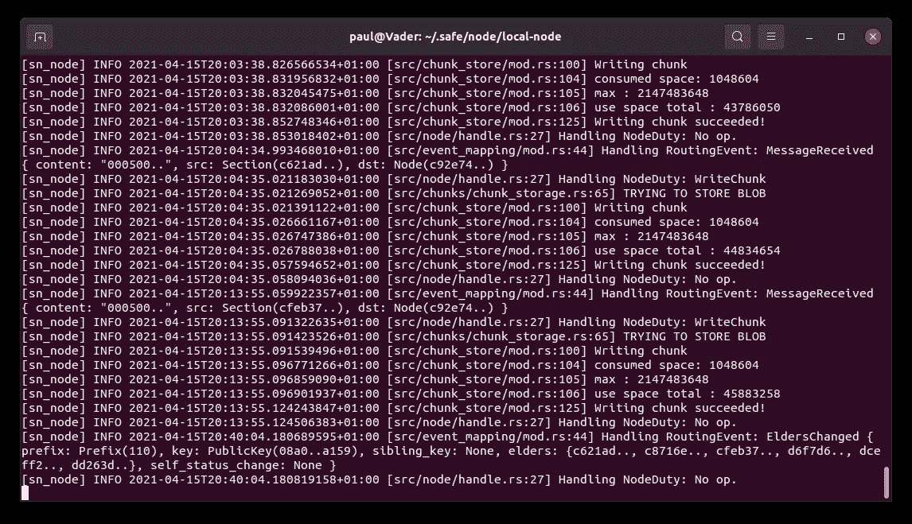

# 安全网络——数字自由之旅

> 原文：<https://levelup.gitconnected.com/safe-network-the-journey-to-digital-freedom-a3b471cc0c8f>

在这个分散的空间里，这是一个激动人心的时刻。新的项目，应对新的挑战每天都在涌现。但是在我们脚下有一个颤抖的地方，开创性的技术即将浮出水面。欢迎，Maidsafe 和他们的安全网络的回归。

安迪·福尔摩斯在 [Unsplash](https://unsplash.com/s/photos/winding-road-mountain-green?utm_source=unsplash&utm_medium=referral&utm_content=creditCopyText) 上的照片

回想一下 2014 年。比特币仍然是一个幼兽，任何存在的替代币基本上都是经过调整的克隆品。比特币的潜力对任何有一定远见或远见的人来说都是显而易见的。还有很多工作要做，但使用二维码在线购物似乎是未来的趋势。一个没有法定货币、没有银行、没有支付处理器的未来。令人兴奋。它具有传染性。感觉就像新的边界正在被突破，新的金融自由正在被释放，不管这个世界是否准备好了。

快进到 2021 年。现在情况看起来相当不同。比特币创新者的前沿精神已经让位于金融业人士对进步的接受。然而，该技术的应用创新正在蓬勃发展。区块链正以各种各样的面目出现，伴随着将它们连接在一起形成一个更大整体的项目。这个空间已经从童年转移到青春期和成年期之间，带来了投资。

但是变化正在发生。不可变事务现在已经过时了。它们不仅被认为是可能的，而且是司空见惯的。问题是——交易就够了吗？不可逆地存储少量数据足以满足分散一切的欲望吗？一句话，不。如果我们想要数字自由，我们需要更多。

# **唤醒野兽**

2014 年感觉很久以前了。从很多方面来说的确如此。有时候，好东西会降临到那些耐心等待的人身上。有了 Maidsafe，他们的野心显然超出了最初的估计。世界上第一个 ICO——在这个术语被创造出来之前——也有自己的麻烦。这并没有阻止 MAID 进入加密图表的前 10 名，并一直保持到 2017 年的繁荣时期。

塞缪尔·斯克林肖在 [Unsplash](https://unsplash.com/s/photos/roar?utm_source=unsplash&utm_medium=referral&utm_content=creditCopyText) 上的照片

我们这些看着他们的人已经看到了许多起起落落，曲折，高潮和低谷。有过错误的开始、实施的死胡同、公司重组和基本的设计变更。David Irvine 在安全网络社区中对这一问题进行了反思。但有时犯错是我们学习正确的唯一途径。它从表格中删除了一种方法，使我们能够专注于剩下的方法。

当获得最终的成功或失败时，通常会反思失败的原因。幸运的是，似乎是前者。欣喜吧，因为功能丰富的测试网正在成为现实，它们之间正在进行狂热的开发。这是一个很好的地方，多年的努力似乎正在得到回报。所谓不可能的网络即将成为可能。

# **这是什么意思？**

鉴于安全网络的范围，很难简明扼要地进行总结。鉴于你可能希望我这样做，我会试试看。温柔点！

想想 Bittorrent 和 IPFS 给分散存储带来了什么。然后把它和比特币对不可变交易的影响混在一起。加入 Tor 为匿名所做的工作。加入少量不可替代的 NFT 酱搅拌。顶层是分布式域名系统(DNS)和内容交付网络(CDN)，然后融入加密数据路由和不可变数据存储。最后，根据个人喜好随意增加安全性、匿名性和可用性。

我做得怎么样？一点也不知道？就像我说的，这很难解释！这个项目持续这么长时间是有原因的，但证据将在布丁中。让我深入一点，更好地了解将要发生的事情。

图片由 Miguelo 提供——安全网络社区成员

# **分散式不可变数据存储**

这个平台的核心——是的，它是一个*去中心化平台*——是永久存储数据的目标。对于公开的、出版的数据，所有人都可以访问，没有审查。你可以选择将数据链接到你的伪身份、真实身份或保持匿名。这可以用密码学来证明。

和比特币很像，交易是不能逆转的。安全网络对非交易数据也做同样的事情。只要网络有能力存储，这些数据可以是任意大小。它还可以处理事务性数据，包括它的内置令牌(更多内容见下文)。

鉴于目前对 NFT 的大肆宣传，这是个大新闻。首先，NFT 的所有权细节可以被不变地存储。当有人停止付费存储它们或者托管公司拔掉服务器插头时，它们不会丢失。其次，NFT *数据*本身也可以不变地存储。无论是包含财产契约的 PDF，一件艺术品，一些音乐，游戏资产，代码…都可以永久保存。你不关心 NFTs？安全网络也不能——你可以存储数据并与他人分享。

当数据上传时，它被赋予一个 XORURL，这实际上是数据的唯一 URL(来自哈希)。这些可以被任何有安全网络客户端的人阅读，永远不会消失。没有更多的这些链接 404！此外，名称解析服务(NRS)可用于为目标提供友好的 URL，很像 DNS，但没有缺点。NRS 名称可以由任何用户创建，只能由该用户修改，它们不会过期，也不能被阻止。

然后想想你的医疗记录，你的家庭照片和视频，你的电子邮件。不可变并不一定意味着*公开*。安全网络还允许存储*私有的*不可变的数据。你不需要相信谷歌、亚马逊或任何拥有你数据的人。你不需要担心你的电脑或移动设备出现故障，并带走数据。

# **安全网络令牌**

当 ICO 在 2014 年拉开帷幕时，不经意间观察者的焦点都在代币上。比特币很大，很新鲜，是新闻，用户和投资者都在吸收类似的知识。因此，当 Maidsafe 宣布令牌将是匿名的，可以自由转移，并且几乎可以以网络速度立即发生时，这是一件大事。这是在比特币还很便宜的时候(便士！)进行交易，不到一个小时的等待是开创性的。

好消息是，令牌在最新的测试网上仍然拥有这些属性。网络速度仍在优化中，但交易已经以*秒*而不是几十分钟来衡量。这是一个非缓存、非优化的网络，旨在消除漏洞。鉴于分片是细粒度的，并且已经融入到设计中，随着网络的发展，这种情况应该会持续下去。加密货币的粉丝们，让我们暂时记住这一点。

# **事实是没有区块链**

这一切怎么可能？区块链让世界意识到去中心化交易的力量，以及它对金钱的意义。尽管这种创新很好，但区块链并不是实现这一目标的唯一途径。早在比特币存在之前，Maidsafe 就开始梦想安全网络。大卫·欧文从 2007 年就开始推销他的想法和建造原型。那时候没有区块链这种东西。关于如何实现拜占庭容错，只有一个空白的讨论和想法，它导致了一个完全不同的方向。

存储批量数据的要求与存储事务性数据的要求非常不同。对于后者，每个人都可以复制相同的数据。虽然随着时间的推移，存储所有事务将不可避免地变得更加繁重，但这种影响是可以控制的。虽然关于大数据块与小数据块、对第 2 层解决方案的需求等问题的争论激烈，但常见的区块链设计是在所有挖掘节点上克隆链。

对于批量数据，这是不可行的。这并不是说一些项目没有尝试这样做，但它不会扩展。一个区块链将很快达到千兆字节，能够承载这样的链的机器将会减少，导致集中化，螺旋上升的成本和最终的资源枯竭。这是分布式系统的对立面。所以不，区块链不会胜任这份工作，所以梅德赛从未考虑过。安全网络不是区块链。那么什么是*呢？*

**

*照片由[米哈里·科斯](https://unsplash.com/@mihaly_koles?utm_source=unsplash&utm_medium=referral&utm_content=creditCopyText)在 [Unsplash](https://unsplash.com/s/photos/complexity?utm_source=unsplash&utm_medium=referral&utm_content=creditCopyText) 拍摄*

*在这里，我将变得更加模糊。我也要走懦夫的路，链接[安全网络入门](https://primer.safenetwork.org/)。是的，这是一个大而详细的文档，但它是由安全网络社区与 Maidsafe 团队共同编写的，是迄今为止最好、最详细的描述。*

*简而言之，数据被分割、加密，然后在负责数据的节点之间分发。为了冗余和容错，保持最小数量的副本。这些节点被分成负责一部分数据的组。节点不能选择它们加入的组。他们也不能读取加密数据。*

*一个节点以很少的责任开始它的旅程，但随着年龄的增长积累更多的责任。当它成为一个长者节点时，它试图与其组中的其他长者达成共识以完成网络事件。行为不端的节点被淘汰，并被新节点取代，新节点必须再次证明自己。*

*太模糊了？可能，但希望它是一个好的品尝者！《初级读本》提供了更多的内容，源代码也是如此(当然，安全网络是开源的)。[社区论坛](https://safenetforum.org/)也是一个极好的资源，有许多想法可供挑选，以前的辩论可供回顾。*

# ***每个人的安全访问(安全)***

*如果上述所有内容都通过一个网关推出，会有什么好处呢？鉴于网关可以被记录、关闭或跟踪或阻止其用户，它们很容易成为破坏的目标。这不应该是去中心化的样子。*

*安全网络不使用任何托管网关。用户可以通过上面提到的任何组直接连接到网络。当用户请求数据时，他们的 IP 地址被清除，然后他们的请求被路由到保存所请求数据的组。即使是公共数据也是自加密的，持有相关数据块的节点无法识别它是哪个文件的一部分。*

*用户客户端管理这个过程，应用程序通过客户端访问网络。这些应用可以是任何东西，从浏览器、聊天应用、钱包、文件管理器到博客应用。客户端提供了一个 API，捆绑的 CLI(命令行界面)使用该 API 实现核心功能。*

# ***弗莱明测试网络***

*那么，安全网络的现状如何？在写的时候，[弗莱明测试网 3](https://safenetforum.org/t/fleming-testnet-v3-release/34457) 刚刚上线(字面！).这个网络又慢又不稳定，而且毫无瑕疵。这是为了摆脱 bug，给人们一个反馈的机会，让开发人员快速进步。*

**

*作者图片—测试网络 3 节点运行*

*你可以上传文件，给他们友好的网址，与他人分享，进行一些支付等。第一次体验这个，理解它是多么容易，是令人兴奋的，也是这篇文章背后的灵感！*

*我将在以后的文章中记录我使用测试网的经历。为什么不试一试呢？*

*[1]安全网初级读本(2020)
[https://primer.safenetwork.org/](https://primer.safenetwork.org/)*

*[2]安全网络社区论坛
[https://safenetforum.org/](https://safenetforum.org/)*

*[3]弗莱明测试网 3 论坛线程
[https://safenetforum.org/t/fleming-testnet-v3-release/34457](https://safenetforum.org/t/fleming-testnet-v3-release/34457)*