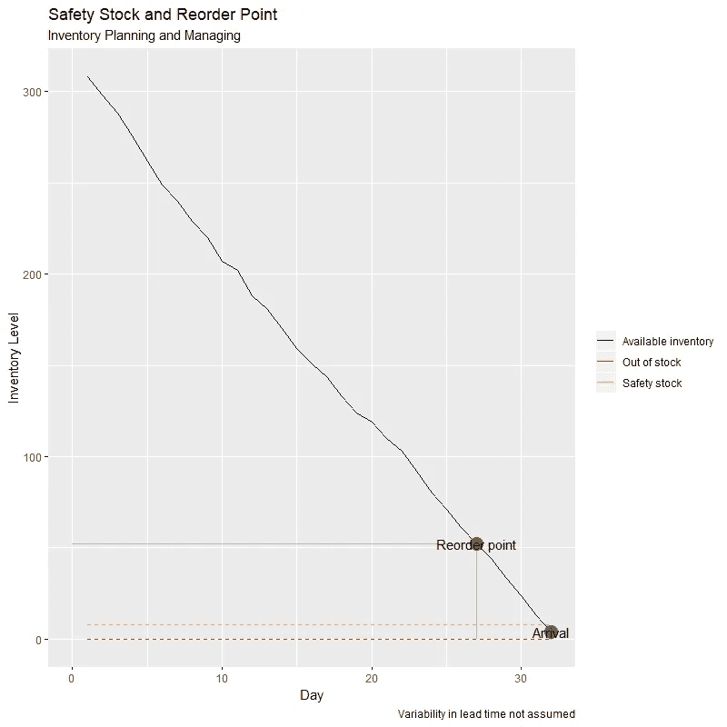

# 带 R 的安全库存和再订购点

> 原文：<https://levelup.gitconnected.com/safety-stock-and-reorder-point-with-r-f10bae4a8b2c>

## r 代表工业工程师

## 探索“sc perf”R 包

Flex 网站上的图片由 Flex 提供

# 安全库存

安全库存是公司持有的一种物品或产品的额外数量，以减少由需求和供应的可变性和不确定性引起的缺货风险。安全库存被视为一种缓冲，以防需求超过预测销售额和/或公司的供应商无法在预期时间交付额外的单位。

拥有安全库存涉及额外的持有成本。然而，为了证明其合理性，其相关的持有成本应低于不满足需求的成本、不按时交付客户订单的成本和/或与停工相关的生产成本。计算安全库存的公式可以表示为:

## 变量

*   *md* :平均需求
*   *sd* :需求的标准差
*   *SL* :服务水平
*   *L* :提前期

**注**:要得到 *F-1* ( *SL* )值，在[标准正态分布函数表](http://www.z-table.com/)中查找其对应的 *z* 值。

# 再订购点

再订购点是库存中触发购买额外物品订单的单位数量，它可以被视为公司不应该低于的阈值。再订购点指示何时下达补货订单。理想的再订购点确保公司不会低于安全库存水平。其计算公式可表示为:

但是，如何确定每个订单的最佳单位数量呢？通过遵循[经济订货量](https://towardsdatascience.com/economic-order-quantity-with-r-f511bfeec400)原则，公司可以获得最优的订购项目数量，在满足需求的同时，最小化持有和订购成本。

R 的 [*SCperf*](https://cran.r-project.org/web/packages/SCperf/SCperf.pdf) 包包含计算安全库存水平和再订购点的特定函数。对于下面的例子，让我们分别考虑以下获得安全库存和再订购点的值: *md* = 10 个单位， *sd* = 2 个单位， *SL* = 0.95， *L* = 5 天。

让我们看看 R 代码！

## **结果:**

既然已经获得了安全库存和再订购点单位值，那么绘制一段时间内的库存消耗(假设正常消耗)将会很有趣。在下面的练习中，将考虑 300 个单位的初始库存。

## 结果:

如上图所示，可以说安全库存和再订购点的计算是正确的，因为库存没有缺货，使公司能够随时满足需求。

# 总结想法

在当今高度竞争和快速变化的世界中，库存规划和管理是每个组织和企业的一项关键任务，应将其作为一项竞争优势，以在满足需求的同时实现最佳订购和/或生产水平。

*SCperf* R 包包括根据库存消耗和需求率计算适当安全库存水平和再订购点的特定函数。未能计算出适当的安全库存水平可能会导致客户不满意、经济损失以及对产品品牌和公司声誉的负面影响。另一方面，过高的安全库存水平会导致与库存管理相关的不必要的风险和持有成本。因此，研究和理解需求率(即其季节性和趋势)是供应链分析师的一项关键任务，以便能够符合公司的目标和目的。

虽然有其他库存计划和管理软件可用，但 R 代表了一个获取简单库存计划和管理任务相关信息的伟大工具。将安全库存和再订购点计算 R 代码存储在您的个人代码库中，只需输入相应变量的初始值，就可以节省您大量的时间。

*— —*

*如果你觉得这篇文章有用，欢迎在* [*GitHub*](https://github.com/rsalaza4/R-for-Industrial-Engineering/blob/master/Inventory%20Planning%20and%20Managing/Safety%20Stock%20and%20Reorder%20Point.R) *上下载我的个人代码。你也可以直接在 rsalaza4@binghamton.edu 给我发邮件，在*[*LinkedIn*](https://www.linkedin.com/in/roberto-salazar-reyna/)*上找到我。有兴趣了解工程领域的数据分析、数据科学和机器学习应用的更多信息吗？通过访问我的媒体* [*个人资料*](https://robertosalazarr.medium.com/) *来浏览我以前的文章。感谢阅读。*

*——罗伯特*