# 不同类型的软件工程和技术专业人员的工资

> 原文：<https://levelup.gitconnected.com/salaries-of-different-types-of-software-engineering-and-tech-professionals-7802bc7457e6>

## 工程经理是去年薪酬最高的职位

亚历山大·密尔斯在 [Unsplash](https://unsplash.com?utm_source=medium&utm_medium=referral) 上拍摄的照片

IT 专业人员有不同类型的工作角色——编程、计算机网络、设计或测试。虽然我的一些非 IT 朋友认为修理电脑和安装 windows/ubuntu 是我们的主要工作。哈哈。

工资是我们工作的主要原因，对吗？了解世界各地的工资水平是很重要的。现在很多程序员做远程工作。

你可以住在世界的一个角落，在世界的另一端做一份工作。多亏了远程工作。但是了解薪水会帮助你在面试或加薪时谈判更多。

在最近的一次求职面试中，我的一个好朋友要求 2000 美元的工资，然后面试官说他们的最低工资是 3500 美元。他们给他 3500 美元。当然，我的朋友接受了。但是如果他要求更多，他可能会得到更多。

先说一下全球和美国的开发者平均工资。

# 工程经理

**工作角色:**工程经理在软件行业是一个非常重要的工作。工程经理确保项目和其他工程职责得以履行。他们还为项目提出预算，培训新的工程师并准备报告。

这个职位需要至少 5 年的工作经验。随着经验丰富的工程师成为工程经理，它已成为 2020 年美国和全球薪酬最高的开发人员职位。

**2020 年工资:**

**美国:15.2 万全球:9.2 万**

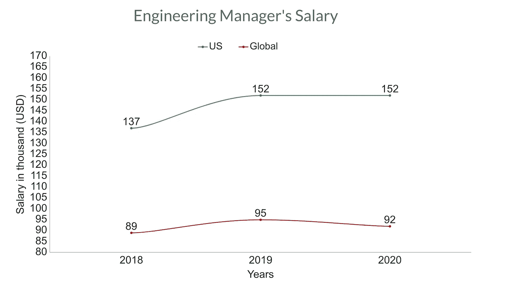

这张图表是作者制作的

# 后端开发人员

**工作角色:**后端开发人员负责 web 服务和 API。Javascript、Python、Ruby、PHP 是一些流行的后端语言。一个好的后端开发者对于一家科技公司来说非常重要。

**2020 年工资:**

**美国:12 万全球:5.3 万**

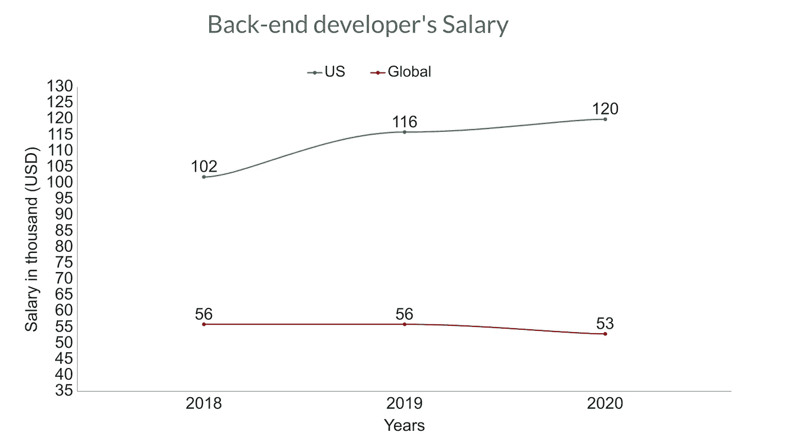

这张图表是作者制作的

# 前端开发人员

**工作角色:**前端开发人员将设计和技术联系起来，负责实现用户通过 web 应用程序参与的可视化和交互式元素。

我们发现前端开发人员的平均工资比后端开发人员低一点。

**2020 年工资:**

美国:11 万英镑全球:4.9 万英镑

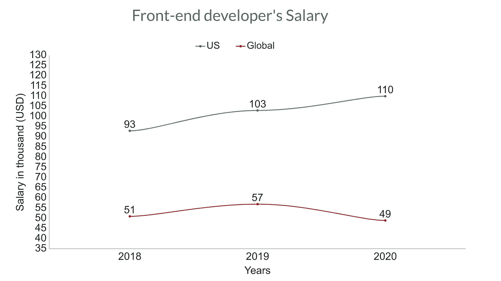

这张图表是作者制作的

# 全栈开发人员

**工作角色:**一个全栈开发者，前端和后端都有工作。成为一名优秀的**全栈开发人员**需要大量的时间、奉献和专注于框架两端的意愿。

**2020 年工资:**

**美国:112k 全球:54k**

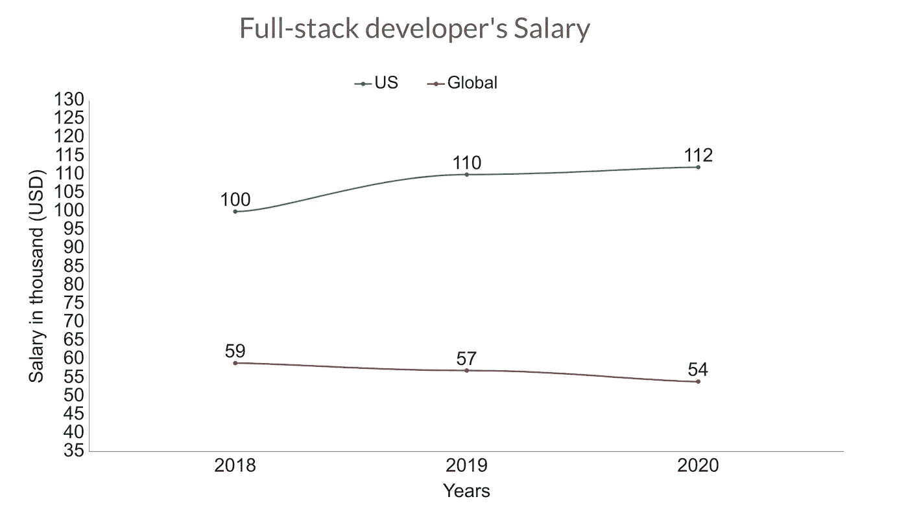

这张图表是作者制作的

# 移动开发者

**工作角色:**移动开发者负责开发移动应用。他们参与应用程序的编码、设计、测试、发布和支持。在过去的 3 年里，美国移动开发人员的工资大幅增加。

**2020 年工资:**

**美国:12 万全球:4.3 万**

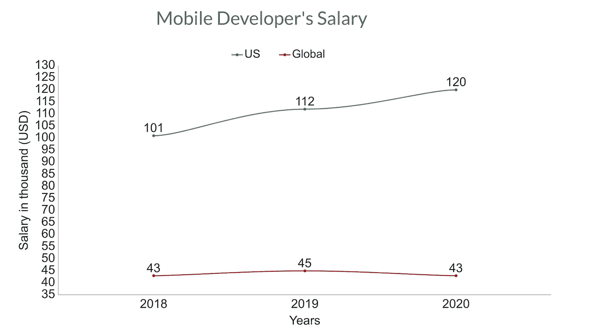

这张图表是作者制作的

# 数据/业务分析师

**工作角色:**数据分析师从原始数据中提取有意义的数据或信息，帮助雇主做出重要的商业决策。小公司可能没有这个职位，但每个大公司都有一个或几个数据分析师。

**2020 年工资:**

**美国:10 万全球:5.5 万**

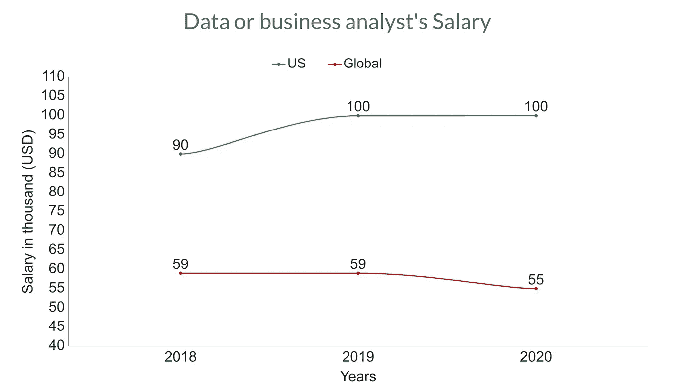

这张图表是作者制作的

# 设计师

**工作角色:**设计师通过理解业务需求、客户声音、用户旅程、客户反馈和可用性发现来创造以用户为中心的设计。一个漂亮而有意义的设计对于一个好的科技产品来说非常重要。

**2020 年工资:**

**美国:10 万全球:4.7 万**

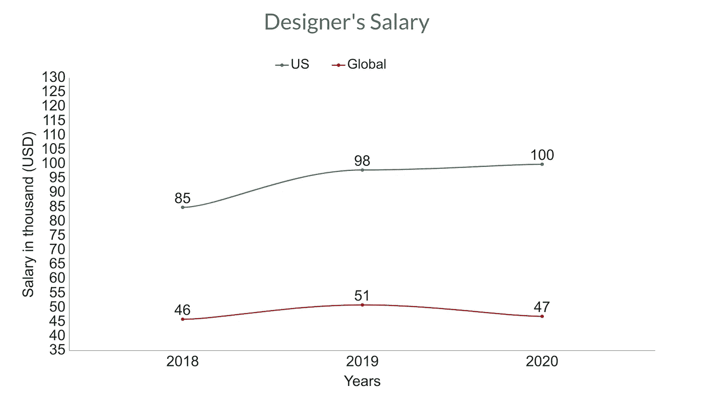

这张图表是作者制作的

# DevOps 专家

工作角色:开发运维专家是 IT 行业薪酬最高、相对较新的工作之一。DevOps 专家的主要工作是实现持续集成到持续交付。开发团队和运营团队之间的桥梁是 DevOps 工程师的主要目的。点击了解更多[。](https://www.bmc.com/blogs/devops-basics-introduction/)

**2020 年工资:**

**美国:12.5 万全球:6.8 万**

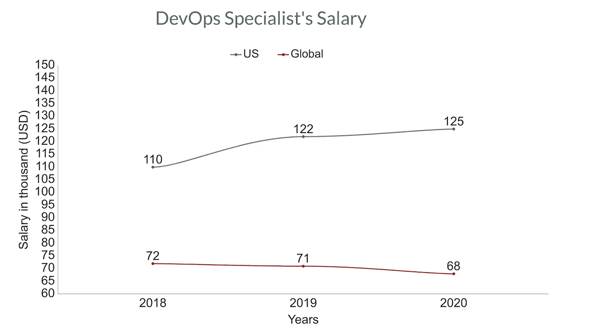

这张图表是作者制作的

# 质量保证/测试开发人员

**工作角色:** QA 开发人员测试软件以检测 bug 和错误，同时检查产品是否符合要求。

**2020 年工资:**

**美国:10.5 万全球:5.3 万**

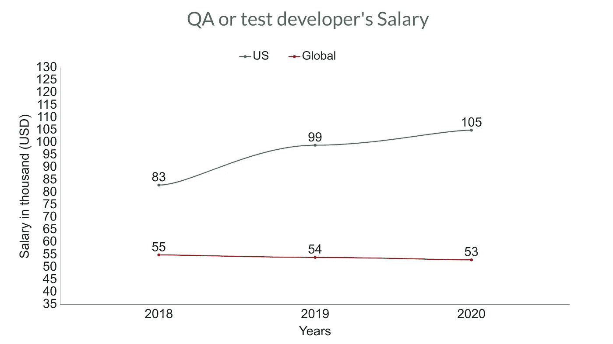

这张图表是作者制作的

# 游戏开发商

**工作角色:**游戏开发者为 PC、移动、主机制作游戏。你可以从图表中看到，因为游戏行业的潜力，游戏开发人员的工资在逐年增加。

**2020 年工资:**

**美国:112k 全球:50k**

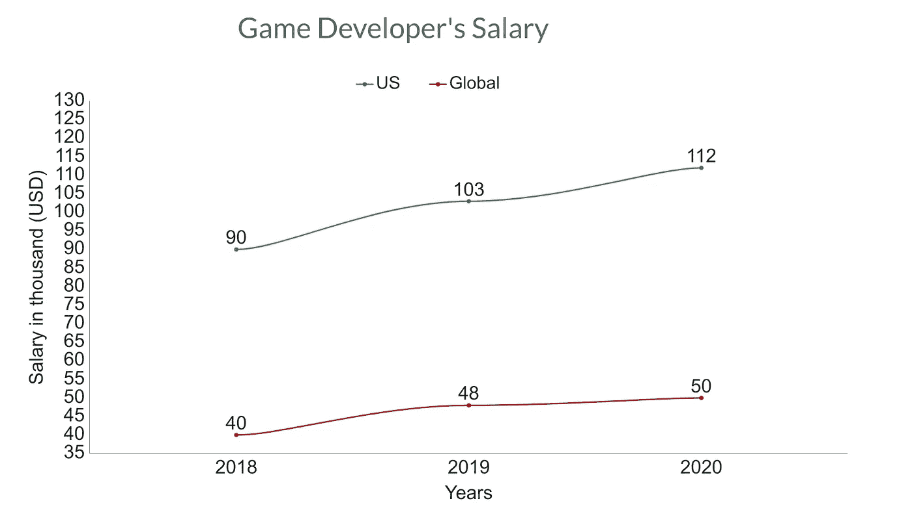

这张图表是作者制作的

# 数据科学家

**工作角色:**数据科学家的角色不同于数据分析师。据[东北](https://www.northeastern.edu/graduate/blog/what-does-a-data-scientist-do/)报道，数据科学家设计数据建模流程，创建算法和预测模型，以提取业务所需的数据，帮助分析数据并与同行分享见解。

**2020 年工资:**

**美国:12.5 万全球:5.8 万**

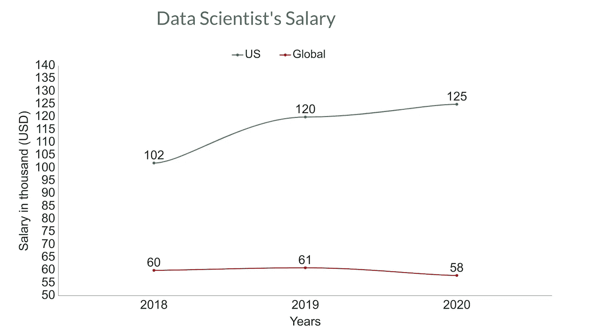

这张图表是作者制作的

# 最后几句话

作为 IT 开发人员，还有许多其他的工作岗位。平均工资可以告诉你很多事情。

我从逐年的薪水中观察到，当一个工作岗位的需求增加时，薪水也随之增加。然后更多的人进入这个行业，需求随着薪水的增加而减少。

但是在所有领域都非常需要高效熟练的开发人员。公司总是会花更多的钱来雇佣一个熟练的开发人员，这从平均工资图表中看不出来。

美国和全球的薪资差异是优秀开发人员移居美国的最大因素。由于美国每年都在产生更多的科技巨头，这种情况从长远来看不会改变，不是吗？

你对 IT 行业的薪资有什么看法？你的国家是什么情况？

资料来源:数据收集自 StackOverflow 于 2020 年、 [2019 年](https://insights.stackoverflow.com/survey/2019#salary)和 [2018 年](https://insights.stackoverflow.com/survey/2018#salary)进行的开发者调查。