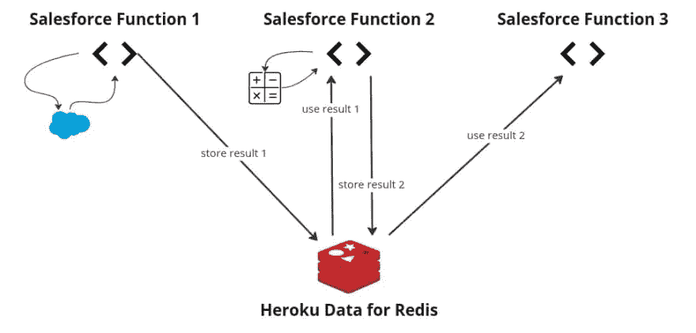
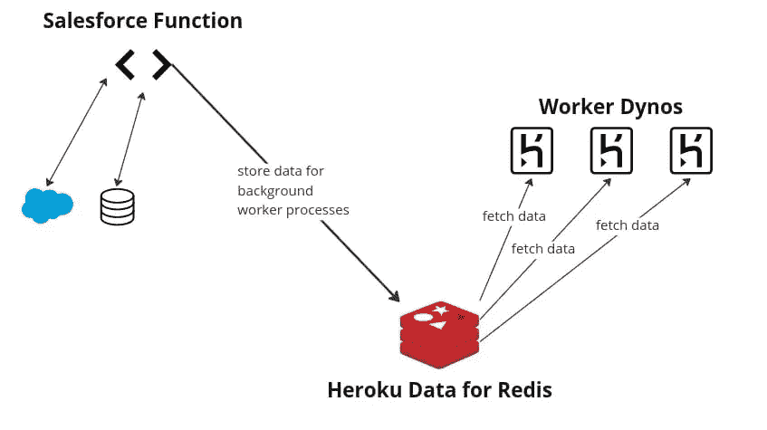
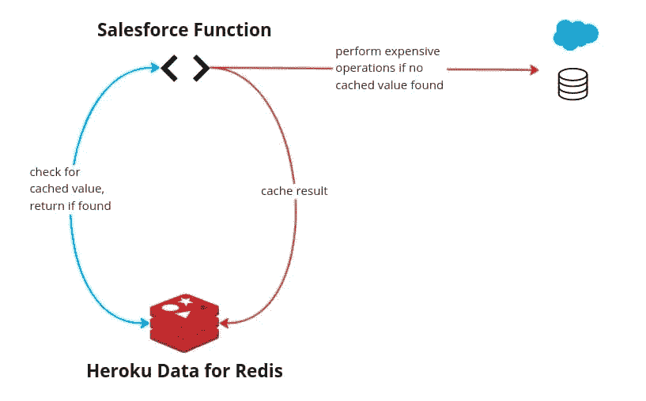

# 针对 Redis 的 Heroku 数据的 Salesforce 函数

> 原文：<https://levelup.gitconnected.com/salesforce-functions-with-heroku-data-for-redis-506ee573491b>

# Salesforce 函数和 Heroku 数据系列:三部分之二

本文是关于在 [Salesforce 功能](https://developer.salesforce.com/docs/platform/functions/overview)中使用 [Heroku 管理数据](https://www.heroku.com/managed-data-services)产品的三部分系列文章的第二部分。[在第一部分](/salesforce-functions-with-heroku-postgres-c79acaeb8c41)中，我们重点介绍了使用 [Heroku Postgres](https://www.heroku.com/postgres) 的 Salesforce 功能。在第二部分中，我们将利用 Redis 的 Heroku 数据探索 Salesforce 函数。最后，在第三部分，我们将介绍 Salesforce 函数和 Heroku 上的 Apache Kafka。

# 核心概念介绍

# 什么是 Salesforce 功能？

Salesforce 功能是一段自定义代码，用于扩展您的 Salesforce 应用程序或流程。当在您的 Salesforce 实例的安全环境中运行时，自定义代码可以利用您选择的语言和库。

例如，您可以利用 JavaScript 库根据 Salesforce 中触发的流程计算并缓存一个值。如果您不熟悉一般功能，请查看"[了解 Salesforce 功能](https://trailhead.salesforce.com/content/learn/modules/salesforce-functions-quick-look/get-to-know-salesforce-functions)"以了解它们是什么以及它们是如何工作的。

# Redis 的 Heroku 数据是什么？

[Redis 的 Heroku 数据](https://www.heroku.com/redis)是一个由 Heroku 完全为您管理的 [Redis](https://redis.io/) 键值数据存储。这意味着 Heroku 负责安全、备份和维护等工作。你需要做的就是使用它。因为 Heroku 是 Salesforce 的一部分，这使得访问和安全性更容易。Heroku 开发中心文档是找到 Redis Heroku 数据更多细节的好地方。

# Salesforce 函数 Redis 的 Heroku 数据示例

Redis 通常用于您希望快速访问的临时数据。示例包括缓存的值、由工作人员执行的任务队列、流程的会话或状态数据，或者访问网站的用户。虽然 Redis 可以将数据持久化到磁盘上，但它主要用作“内存中”的数据存储。让我们回顾几个使用案例，让您更好地了解 Salesforce 功能和 Redis 是如何结合在一起的。

# 用例 1:存储函数运行之间的状态

有时，一个流程可能有多个阶段，每个阶段都需要运行一个函数。当下一个函数运行时，您希望捕获该函数运行的状态，以供下一个运行的函数使用。

这方面的一个例子可能是报价流程，它需要在每个阶段进行一些后端计算。不同的人或团队可能会执行流程中的步骤。他们甚至可能不属于同一个 Salesforce 组织。然而，在每个阶段运行的函数需要知道前一个结果。



# 用例 2:管理工作进程的队列

这个用例关注后台工作的灵活性。因为基于 Salesforce 构建的应用运行在[多租户架构](https://architect.salesforce.com/fundamentals/platform-multitenant-architecture)上，Salesforce 对应用的 CPU 和内存使用进行了限制。长时间运行的程序经常是越界和受限制的。

那么，您如何为您的 Salesforce 组织运行一项长期或繁重的任务呢？答案是 Salesforce 函数。您可以连接您的函数来收集所需的信息，并将其插入 Redis。然后，您的 [Heroku worker 进程](https://devcenter.heroku.com/articles/background-jobs-queueing)可以检索信息并执行任务。



# 用例 3:缓存昂贵操作的结果

在最后一个用例中，让我们假设您有一个昂贵的查询或计算。结果不经常改变，但是需要结果的报告经常运行。例如，也许我们想在大量很少改变的记录中匹配一些标准。我们可以使用 Salesforce 函数来完成这项工作，并使用 Redis 来存储结果。函数的后续执行可以简单地获取缓存的结果。



# 我如何开始？

开始之前，您需要准备好一些东西——包括 Salesforce 功能端和 Heroku 端。

**先决条件**

*   [访问 Salesforce 功能](https://developer.salesforce.com/docs/platform/functions/overview)
*   [访问 Heroku 数据服务](https://signup.heroku.com/)

**sales force 功能入门**

*   [入门](https://developer.salesforce.com/docs/platform/functions/guide/index.html)

# 从 Salesforce 函数访问 Redis 的 Heroku 数据

一旦您了解了先决条件并创建了项目，您就可以运行以下命令来创建一个用于 Redis 访问的 Heroku 数据函数。

要创建新的 JavaScript 函数，请运行以下命令:

```
$ sf generate function -n yourfunction -l javascript
```

这将为您提供一个包含 Node.js 应用程序模板的`/functions`文件夹。

## 连接到您的 Redis 实例

您的函数代码可以使用`[dotenv](https://www.npmjs.com/package/dotenv)`包将 Redis URL 指定为环境变量，使用`[node-redis](https://www.npmjs.com/package/redis)`包作为 Redis 客户端。连接到 Redis 可能如下所示:

```
import "dotenv/config";
import { createClient } from 'redis';
async function redisConnect() {
  const redis = createClient({
    url: process.env.REDIS_URL,
    socket: {
      tls: true,
      rejectUnauthorized: false
    }
  });
  await redis.connect();
  return redis;
}
```

对于本地执行，使用`process.env`和`dotenv`假设您有一个指定您的`REDIS_URL`的`.env`文件。

## 在 Redis 中存储数据

Salesforce 函数的实际主体将包括执行一些计算或数据提取，然后将结果存储在 Redis 中。一个例子可能是这样的:

```
export default async function (event, context) {
  const redis = await redisConnect();
  const CACHE_KEY = `my_cache_key`;
  const CACHE_TTL_SECONDS = 86400;
// Check Redis for cached value
  let cached_value = await redis.get(CACHE_KEY);
  if (cached_value) {
    return { result: cached_value }
  } else {
    // Perform some calculation
    const calculated_value = await perform_long_running_computation();
    // Store in Redis
    redis.set(CACHE_KEY, calculated_value, {
      EX: CACHE_TTL_SECONDS,
      NX: true
    });
    // Return result
    return { result: calculated_value }
  }
}
```

# 在本地测试您的 Salesforce 功能

要在本地测试您的函数，首先运行以下命令:

```
$ sf run function start
```

然后，您可以从另一个终端调用带有有效负载的函数:

```
$ sf run function -l http://localhost:8080 -p '{"payloadID": "info"}'
```

有关本地运行功能的更多信息，请参见本指南。

# 将您的 Salesforce 职能与您的 Heroku 环境联系起来

在本地验证我们的函数按预期运行后，我们可以将 Saleseforce 函数与计算环境相关联。(有关如何创建计算环境和部署功能的更多信息，请参见本[文档](https://developer.salesforce.com/docs/platform/functions/guide/deploy.html)。)

现在，通过将 Heroku 用户作为协作者添加到您的功能计算环境中，将您的功能和 Heroku 环境关联起来:

```
$ sf env compute collaborator add --heroku-user username@example.com
```

这些环境现在可以共享 Heroku 数据。接下来，您将需要计算环境的名称，以便可以将数据存储附加到它。

```
$ sf env list
```

最后，连接数据存储区。

```
$ heroku addons:attach <your-heroku-redis> --app <your-compute-environment-name>
```

在您开始实施 Salesforce 功能和访问 Redis 的 Heroku 数据时，以下是一些可能对您有所帮助的其他资源:

*   [JavaScript 工作单元示例](https://github.com/trailheadapps/functions-recipes/tree/main/functions/03_Context_UnitOfWork_JS)
*   [从 JavaScript 连接到 Redis 的 Heroku 数据](https://devcenter.heroku.com/articles/connecting-heroku-redis)

# 结论

就这样，您启动并运行了一个 Salesforce 功能，它连接到 Redis 的 Heroku 数据！

Salesforce 功能为您提供了在 Salesforce 应用程序中访问 Heroku 数据的灵活性和自由度，无论该数据是在 Postgres、Redis 甚至 Kafka 中。在本系列的第二部分中，我们介绍了如何使用 Salesforce 函数来处理 Redis 的 Heroku 数据。虽然这是一个相当高层次的概述，但是您应该能够看到结合这两个特性的潜力。在这个系列的最后一篇文章中，我们将在 Heroku 上集成 Apache Kafka。

# 分级编码

感谢您成为我们社区的一员！在你离开之前:

*   👏为故事鼓掌，跟着作者走👉
*   📰查看更多内容请参见[升级编码刊物](https://levelup.gitconnected.com/?utm_source=pub&utm_medium=post)
*   🔔关注我们:[Twitter](https://twitter.com/gitconnected)|[LinkedIn](https://www.linkedin.com/company/gitconnected)|[时事通讯](https://newsletter.levelup.dev)

🚀👉 [**加入升级人才集体，找到一份神奇的工作**](https://jobs.levelup.dev/talent/welcome?referral=true)