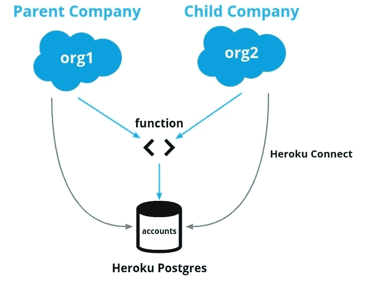

# Heroku Postgres 的 Salesforce 功能

> 原文：<https://levelup.gitconnected.com/salesforce-functions-with-heroku-postgres-c79acaeb8c41>

# Salesforce 函数和 Heroku 数据系列:三部分之一

本文是关于在 [Salesforce 功能](https://developer.salesforce.com/docs/platform/functions/overview)内利用 [Heroku 托管数据](https://www.heroku.com/managed-data-services)产品的三部分系列文章的第一部分。在本文中，我们将关注 [Heroku Postgres](https://www.heroku.com/postgres) 的用例。在第二和第三部分中，我们将讨论创建 Salesforce 函数，这些函数使用 Heroku 上的 Redis 和 Apache Kafka[的 Heroku 数据。](https://www.heroku.com/kafka)

# 核心概念介绍

# 什么是 Salesforce 功能？

Salesforce 功能是一段自定义代码，用于扩展您的 Salesforce 应用程序或流程。自定义代码可以利用您在 Salesforce 实例的安全环境中运行时选择的语言和库。

例如，您可以利用 JavaScript 库根据 Salesforce 中的触发流程更新 Heroku Postgres 数据库。如果您不熟悉 Salesforce 函数，那么“T10 了解 Salesforce 函数 T11”是了解 Salesforce 函数及其工作原理的好地方。

# 什么是 Heroku Postgres？

[Heroku Postgres](https://www.heroku.com/postgres) 是 Heroku 为您管理的一个 [Postgres](https://www.postgresql.org/) 数据库。这意味着 Heroku 负责安全、备份和维护等工作。你所要做的就是使用它。了解 Heroku Postgres 细节的最佳途径是在 Heroku Devcenter 文档中。

# Salesforce 函数+ Heroku Postgres 的示例

现在我们对函数和 Heroku Postgres 有了更多的了解，我们可以一起用它们做什么呢？有几种方式来思考功能，但是最有用的一种方式是将它们视为**帮助整合或扩展你的组织**。例如，当 Salesforce 发生一些事情时，*做一些其他的任务*。

总体而言，如果您有以下情况，您可能希望将 Heroku Postgres 与您的 Salesforce 功能结合使用:

1.  需要访问关系数据库作为函数操作的一部分
2.  需要与作为另一个系统一部分的 Heroku Postgres 实例集成
3.  需要从您的 Salesforce 组织中卸载“繁重”的任务并存储关系数据来实现它

以上模式不是唯一的，但它们可能是最常见的。下面的用例是这些模式运行的例子。

# 使用案例#1:对多个 Salesforce 组织的帐户记录进行重复数据删除

成长型公司中的一个常见问题是拥有多个 Salesforce 组织，客户在它们之间重复。有时，这是因为公司收购了另一家公司，两家公司共享客户。

在其他情况下，公司只是有不同的业务线，而客户是两者的一部分。在现实中，如果我们知道两个客户确实是同一个客户，那么我们希望将他们视为一个客户。合并这些组织数据通常需要很长时间，那么我们该怎么办呢？

一种方法是通过 [Heroku Connect](https://devcenter.heroku.com/articles/heroku-connect) 将来自两个组织的账户信息同步到 [Heroku Postgres](https://devcenter.heroku.com/categories/heroku-postgres) 中，并触发可以寻找重复的 Salesforce 功能。我们可以根据需要为某些活动运行此功能，或者将其设置为在创建新帐户后运行。例如，每当系统遇到“客户的电子邮件已经存在于[母公司]”时。下图说明了这种使用情况:



# 用例 2:添加新库存时更新面向客户的网站

许多公司使用 Salesforce 作为关键信息的“真实来源”，但他们在 Heroku 上有一个面向客户的网站。在此用例中，当在 Salesforce 中更新一个项目(如库存编号)时，会触发 Salesforce 函数来更新 Heroku Postgres，该函数支持向客户显示此信息的网站。

这种模式可以扩展到做其他事情，比如获取额外的信息与 Heroku Postgres 中的记录一起存储，或者清除缓存。当网站需要该信息，但您不需要将其存储在 Salesforce 中时，这可能很有用。

# 用例 3:为大型数据集生成报告

在大量使用 Salesforce 的大型组织中，许多用户可能会有重叠的任务。通常，最终用户意识不到他们对共享系统的影响。将繁重的操作或报告移出组织可以让其他操作执行得更好。一种简单的方法是通过 Heroku Connect 将所需数据同步到 Heroku Postgres，并通过 Salesforce 函数执行操作。这为优化和利用开源工具和库来处理数据提供了选择。

如果需要将结果写回 Salesforce，这种模式也很适用。例如，如果您需要计算销售区域，但将结果存储回 Salesforce 组织。

Salesforce 功能是 Salesforce 生态系统中一项强大的新功能。Heroku Postgres 是托管 Postgres 领域久经考验的市场领导者。它们一起打开了许多用例。结合 Heroku 提供的额外服务，有许多选项可以充分利用您的 Salesforce 数据。在下一节中，我们将简要地研究如何开始使用您自己的用例。

# 我如何开始？

您将需要一些东西—一些在 Salesforce 功能方面，一些在 Heroku 方面。这些资源会给你指明正确的方向。

**先决条件:**

*   [访问 Salesforce 功能](https://developer.salesforce.com/docs/platform/functions/overview)
*   [访问 Heroku 数据服务](https://signup.heroku.com/)

【Salesforce 功能入门

*   [入门](https://developer.salesforce.com/docs/platform/functions/guide/index.html)

# 从 Salesforce 函数访问 Heroku Postgres

一旦您了解了先决条件并创建了项目，您就可以运行以下命令来创建一个具有 Heroku Postgres access 的函数。

要创建新的 JavaScript 函数，请运行以下命令:

```
$ sf generate function -n yourfunction -l javascript
```

这将为您提供一个包含 Node.js 应用程序模板的`/functions`文件夹。

## 连接到您的数据库

当然，您的 Salesforce 功能代码将需要包括一些特定的部分，以确保与数据库的正确连接。最简单的方法是包含用于将数据库 URL 指定为环境变量的 [dotenv](https://www.npmjs.com/package/dotenv) 包和作为 Postgres 客户端的 [pg](https://www.npmjs.com/package/pg) 包。

```
import "dotenv/config";
import pg from "pg";
const { Client } = pg;
```

在函数代码中，您需要连接到 Postgres 数据库。下面是一个连接助手函数的示例:

```
async function pgConnect() {
  const client = new Client({
    connectionString: process.env.DATABASE_URL,
    ssl: {
      rejectUnauthorized: false
    }
  });
  await client.connect();
  return client;
}
```

这假设您有一个指定您的`DATABASE_URL`的`.env`文件。

## 查询和存储

在下面的示例函数中，我们从 Salesforce Org 中检索一些数据，然后将其存储在 Postgres 中。

```
export default async function (event, context, logger) {
  // Send request to Salesforce data API to retrieve data
  const sfid = await context.org.dataApi.query(
    `SELECT Id FROM Account WHERE Name = 'Example Company'`
  );
  // Connect to postgres
  const pg = await pgConnect();
  // Store data result in postgres
  client.query(`INSERT INTO companies (sfid) VALUES ($1)`, [sfid]);
  // Close connection
  pg.end()
}
```

# 在本地测试您的 Salesforce 功能

要在本地测试您的函数，首先运行以下命令:

```
$ sf run function start
```

然后，您可以从另一个终端调用带有有效负载的函数:

```
$ sf run function -l http://localhost:8080 -p '{"payloadID": "info"}'
```

有关本地运行功能的更多信息，请参见本指南。

# 关联您的 Salesforce 功能和 Heroku 环境

现在一切都按预期运行，让我们将该功能与计算环境关联起来。(有关如何创建计算环境和部署功能的更多信息，请查看[文档](https://developer.salesforce.com/docs/platform/functions/guide/deploy.html)。)

通过将 Heroku 用户作为协作者添加到您的职能计算环境，您可以关联您的 Salesforce 职能和 Heroku 环境:

```
$ sf env compute collaborator add --heroku-user username@example.com
```

这些环境现在可以共享 Heroku 数据。

接下来，您将需要计算环境的名称，以便可以将数据存储附加到它。

```
$ sf env list
```

最后，您可以连接数据存储。

```
$ heroku addons:attach <your-heroku-postgres-database> --app <your-compute-environment-name>
```

在您开始实施 Salesforce 职能和访问 Heroku Postgres 时，以下是一些可能对您有所帮助的其他资源:

*   [JavaScript 工作单元示例](https://github.com/trailheadapps/functions-recipes/tree/main/functions/03_Context_UnitOfWork_JS)
*   [从 JavaScript 连接到 Heroku Postgres】](https://devcenter.heroku.com/articles/connecting-heroku-postgres#connecting-in-node-js)

现在，你要去比赛了！

# 结论

Salesforce 功能为在您的 Salesforce 应用程序中访问和操作 Heroku 数据提供了多种可能性。在本系列的第一部分中，我们已经介绍了如何使用 Salesforce 函数来处理 Heroku Postgres。在本系列的下一部分，我们将把 Salesforce 函数与 Redis 的 Heroku 数据集成在一起。然后，在这个系列的最后一篇文章中，我们将在 Heroku 上集成 Apache Kafka。敬请期待！

# 分级编码

感谢您成为我们社区的一员！在你离开之前:

*   👏为故事鼓掌，跟着作者走👉
*   📰查看[升级编码出版物](https://levelup.gitconnected.com/?utm_source=pub&utm_medium=post)中的更多内容
*   🔔关注我们:[Twitter](https://twitter.com/gitconnected)|[LinkedIn](https://www.linkedin.com/company/gitconnected)|[时事通讯](https://newsletter.levelup.dev)

🚀👉 [**加入升级人才集体，找到一份神奇的工作**](https://jobs.levelup.dev/talent/welcome?referral=true)