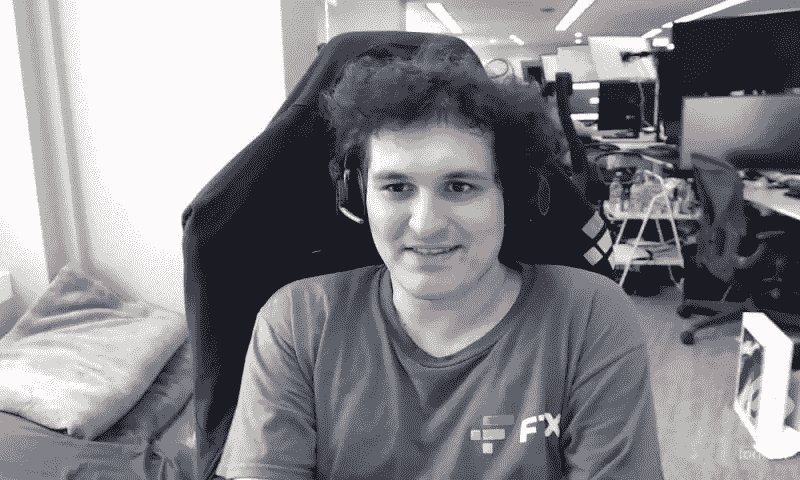
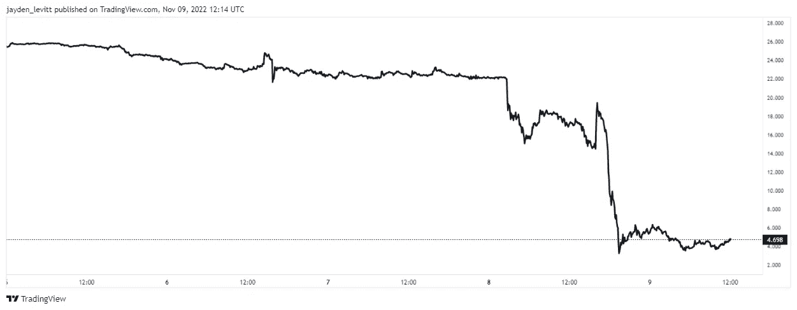
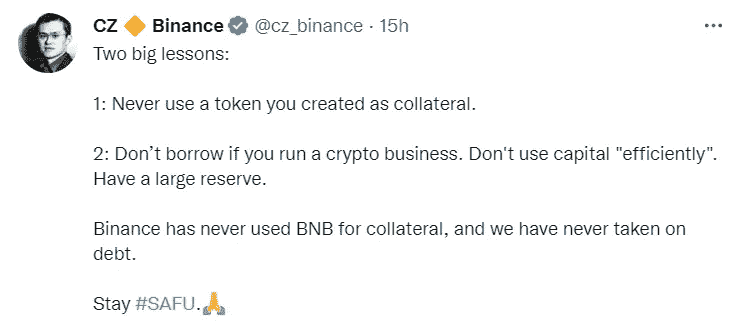
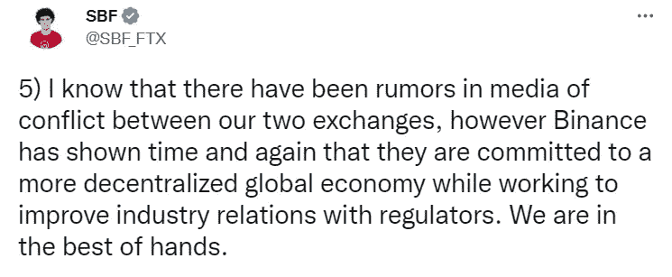
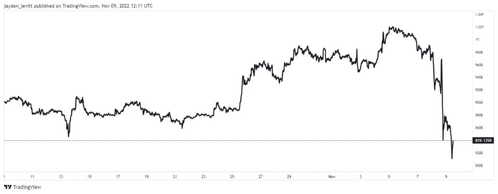

# 山姆·班克曼·弗里德刚刚失去了他的亿万富翁身份，并摧毁了整个加密市场。

> 原文：<https://levelup.gitconnected.com/sam-bankman-fried-just-lost-his-billionaire-status-and-crashed-the-entire-crypto-market-42f548322f25>

在办公室睡在豆包上的人给你上了一堂关于管理风险的宝贵课。

丹·马特在 Flickr 上的照片

山姆·班克曼·弗里德是一个古怪的极简主义者，他和十个室友住在一起，睡在办公室的一个豆袋上。

他已经失去了亿万富翁的身份，因为他的家乡 FTX 的 FTT 正处于自由落体状态。值得一提的是，他的净资产仍然只有区区 90 万美元。

班克曼-弗里德一直声称，他有意追求高收入的职业，以便将收入的很大一部分捐给慈善机构。

目前，它看起来不像他将能够从一个空杯子倒酒。

他是[捐赠我们所能的](https://en.wikipedia.org/wiki/Giving_What_We_Can)成员，该组织旨在鼓励富有的参与者捐出他们 10%的财富。

班克曼-弗里德承诺捐出他职业生涯中的大部分收入，所以很明显，我们面对的不是一个蛇油推销员。

众所周知，Bankman-Fried 利用巧妙的[套利](https://en.wikipedia.org/wiki/Arbitrage)交易每天赚了 2500 万美元，该交易旨在利用日本相对于美国较高的比特币价格。

2022 年 9 月，班克曼-弗里德向埃隆·马斯克(Elon Musk)提供了数十亿美元，以资助他收购 Twitter，到 2022 年 10 月，班克曼-弗里德的净资产估计为 105 亿美元。

FTX 和整个加密市场都在他身边崩溃了，这是一个由竞争对手币安引起的多米诺骨牌效应，他卖掉了所有的 FTT 存货(FTX 的本土代币)。

首席执行官赵昌鹏在推特上解释说，抛售是因为

> "最近曝光的事件和退出后的风险管理，向卢娜学习."

赵提到了失败的稳定硬币 Luna，但强调出售的举动并无恶意。

在赵发布这条推文之前，CoinDesk 报道称，的控股公司阿尔梅达(Almeda)在其资产负债表上持有数十亿 FTT 代币，资产负债达到 80 亿美元。

一家密码交易公司的高管说:

> “这几乎就像一家公司用他们的股权作为贷款的抵押品。
> 
> 你永远不会这么做，因为这关系到你的健康。
> 
> 当你需要抵押品来完成它的工作时，它就变得毫无价值了。"

FTX 本土的 token FTT 在最后一天纠正了 90%以上。

来源— [交易视图](http://www.tradingview.com)

# **流动性危机。**

流动性危机就像罐头上写的那样。

自从币安抛售他们的 FTT 股票后，越来越多的投资者开始从 FTX 交易所撤资。

如果每个人都开始抛售，这可能会导致死亡螺旋。同样的，[号月神](https://www.forbes.com/sites/qai/2022/09/20/what-really-happened-to-luna-crypto/?sh=669b697b4ff1)号也达到了它的灭亡。

市场将死亡螺旋视为一场完美的下跌风暴，除非你有足够的流动性来度过这场风暴，否则很难摆脱它。

今年早些时候，FTX 身价 320 亿美元，班克曼-弗里德是其 90%的股东。

具有讽刺意味的是，本周他被迫向他的竞争对手币安交易所寻求救助，原因是担心无法偿还客户从市场上要求的存款。

如果投资者拿不回他们的资金，班克曼-弗里德的财富和潜在的自由都将岌岌可危。

虽然班克曼-弗里德是一个极简主义者，但他在加密市场上令人难以置信的崛起，他对 FTT 代币股票头寸过多的管理不善，以及他在营销活动上的轻率支出最终导致了他的死亡。

一个例子是他以 2.12 亿美元购买了迈阿密热火队主场的冠名权，该主场现在被称为 FTX 竞技场。

班克曼-弗里德对 FTX 基金的管理不善受到了前竞争对手币安公司首席执行官的批评，他正在进行彻底收购 FTX 的尽职调查。

来源— [赵昌鹏推特](https://twitter.com/cz_binance)

Bankman-Fried 向竞争对手币安加密交易所提出上诉，该交易所在几小时内签署了一项收购 FTX 并担保其客户资金的协议。

Sam Bankman-Fried 在 Twitter 上解释了这次收购，震惊了大多数行业。

它表明，如果你管理不善，没有人是安全的。

他解释说，这是一次与币安首席执行官赵昌鹏的全员参与的会议，非常直截了当，进行得快如闪电。

来源— [山姆·班克曼-弗里德推特](https://twitter.com/SBF_FTX)

# **最后的想法。**

山姆·班克曼-弗里德的日内交易思维帮助他在牛市中获胜，但在流动性非常低的时候导致了他的失败。

你可能会认为加密货币显示出某种形式的复苏。

痛苦才刚刚开始。

无意义的支出太多，政府发行的货币过多。

数十亿美元交易所需要救助的无情事件令人担忧，并对整个市场产生灾难性影响。

FTX 对资金的管理不善和过度杠杆化已经使数字货币的市值蒸发了近 2000 亿美元。

呸。

来源— [交易视图(加密市值)](http://www.tradingview.com)

这些时候，较弱的企业被淘汰出市场，人们一想到投资就会对上帝产生恐惧。

如果你处于有利位置并且有气质，现在是一个难以置信的购买机会。

这也是一个合适的时间来确保你能活下来。

在外面注意安全。

> *如果你想在 Web3 上读到更多我的观点，请考虑成为会员。你的会员费直接支持你读的作家。如果你用我的链接* [*注册，我会赚一小笔佣金。点击这里*](https://medium.com/@jayden_levitt/membership) *。*

*本文仅供参考；不应将其视为财务、税务或法律建议。在做出任何重大的财务决定之前，你可以咨询财务专家。*