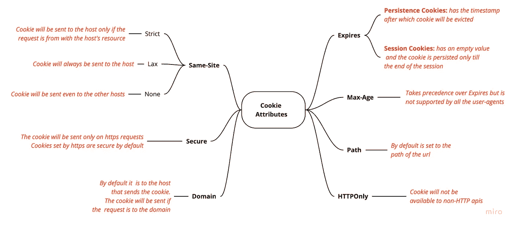

# 每个开发人员都应该知道的 HTTP Cookies。

> 原文：<https://levelup.gitconnected.com/same-site-cookie-and-other-attributes-6a3c705efe0c>

> TLDR:HTTP cookie 在浏览器中存储用户的信息，并在以后的请求中发送给 web 服务器。


HTTP 请求标头中的 cookie

HTTP Cookies 与流行的同名糖果完全无关。它是一种机制，用于在客户端的 web 浏览器(或其他用户代理)上存储数据，以便服务器可以在后续请求中跟踪客户端。

## 历史

HTTP 是用于从 web 服务器获取数据的协议。作为一种无状态协议，web 开发人员发现很难跟踪发送给客户端的数据。在决定使用 HTTP Cookies 之前，已经尝试了许多方法。在使用 Cookies 之前，一个解决办法是将客户数据写入网站的隐藏表单中，并在页面提交时将其发送到服务器。正如所料，这种方法很麻烦，更不用说容易出错了。

早期网络浏览器之一网景公司的开发人员想出了用 cookies 来解决这个问题。 *cookie* 是浏览器发送给网站的可选报头。它包含服务器设置的 cookie 名称和属性。

发送到客户端的 cookies 有以下用途:

1.  会话管理
2.  个性化
3.  跟踪

## Cookies 的设置如下:


HTTP 事务中的 Cookies

例如，如果服务器想要跟踪某个特定设备上的用户正在阅读的博客的名称，它会使用 cookie 将博客的名称保存到用户的机器上。这是通过在每次博客被阅读时，向浏览器发送 HTTP 响应中的 *Set-cookie* 头中的 Cookie 来实现的。浏览器将其保存在设备上，下次用户从同一台机器访问该网站时，浏览器会将保存的 cookie(除非它们已过期)连同请求中的 *cookie* 标头中的值一起发送到服务器。这样，服务器将能够跟踪用户阅读的博客，并在用户每次访问时使用这些数据来显示类似的博客。

## 作为文档属性的 Cookie

cookies 存储在客户端机器上。要列出 cookies，请在浏览器的开发工具中运行脚本。

```
> document.cookie.split('; ')
     .forEach(it => console.log(it))
```

可以通过运行以下命令将新的键值对添加到 cookie 中

```
document.cookie = "blog-name: Cookies in the HTTP World"
```

## HTTP cookies

如上一节所示，cookies 可以被网站中运行的 javascript 片段读取。在这种情况下，由于 cookie 被用于存储包括用户敏感数据在内的身份数据，并且可能会执行跨站点脚本(XSS)攻击来窃取 cookie，因此会引起关注。

为了解决这个问题，发送带有敏感数据的 cookies 时会设置 **HttpOnly** 标志。这些 cookie 也称为 HTTP cookies，不会在上面的代码片段中列出。HTTP cookies 被非 HTTP apis 省略，如 Document 对象中的 cookie 属性。它们只在浏览器发出请求时才被发送到服务器。因此，它有助于避免 XSS 攻击窃取 cookie。


与属性(Chrome 的 Inspect 元素)一起在 HTTP 请求中发送的 Cookies

## 安全 Cookies

**安全**是 cookie 中类似 HttpOnly 的一个字段。只有在 HTTPS 连接上发出请求时，才会将设置了此字段的 cookie 发送到服务器，这比 HTTP 更安全。HTTPS 是一种加密连接，攻击者很难拦截，因此很难窃取传输中的 cookies。此外，服务器通过 HTTPS 连接设置的 cookies 在默认情况下是安全的。

上述标志用于存储敏感信息的 cookies。例如，存储登录用户的会话 id 的 cookie 设置了 HttpOnly 和安全标志。这可以保护它免受 XXS 和中间人攻击。

```
// The server sends the session cookie with
Set-Cookie: SID=31d***********ad42; Path=/; Secure; HttpOnly
```



Cookie 属性

# 其他 Cookie 属性

除了这两个标志之外，其他 cookie 指令有:

## 期满

*过期*属性包含时间戳，在该时间戳之后，cookie 被用户代理驱逐。如果服务器没有传递该属性，则 cookie 会一直保存在内存中，直到用户代理结束会话(浏览器关闭)。这种 cookie 被称为**会话 cookie**。否则，cookie 会一直保留到过期，并被称为**持久性 cookie**。

## 最大年龄

Max-Age 是一个属性，如果设置，它优先于 Expires 属性。但是，并不是所有的用户代理(浏览器)都支持该属性，因此应该谨慎使用。

## 领域

在向 cookie 的域指令中指定的域发出请求时，将发送 cookie。默认情况下，它被设置为设置 cookie 的主机。

## 小路

与域属性一样，如果没有在响应头中显式传递，path 属性也将默认为设置 cookie 的主机的 url 路径。

## 同一地点

默认情况下，每次请求都会将 cookies 发送到服务器，即使请求来自不同的域。这可能被利用来执行类似 CSRF 的攻击。可以设置可选的同站点指令来防止攻击。

同一站点指令可以采用这三个值中的任何一个。为了确保向后兼容性，未使用指令设置的 cookies 默认为 Lax:

1.  Strict:仅当对服务器的请求来自同一个域时，才会发送 cookie。例如，如果您要打开参考资料中提到的任何链接，则保存在您的机器中的带有严格标记的同一个站点的 cookies 将不会发送到服务器。
2.  Lax:这是在没有为同一个站点设置值时设置的默认值。这样做是为了确保与尚未实现该指令的服务器向后兼容。标记为 Lax 的 cookies 会在所有调用中发送到服务器。当你点击链接时，你机器上的 cookies 就会被发送到服务器上。然而，这可能会为 CSRF 打开大门。
3.  None:将相同站点指令设置为 None 的 cookies 发送到所有服务器，而不考虑域。这有助于跨站点使用。但是，应该注意的是，带有该指令的 cookie 需要设置它们的安全标志，否则整个 cookie 将被用户代理丢弃。

# 参考资料:

[](https://developer.mozilla.org/en-US/docs/Web/HTTP/Headers/Set-Cookie) [## Set-Cookie

### HTTP 响应头用于将 cookie 从服务器发送到用户代理，这样用户代理就可以将它发送回来…

developer.mozilla.org](https://developer.mozilla.org/en-US/docs/Web/HTTP/Headers/Set-Cookie) [](https://developer.mozilla.org/en-US/docs/Web/HTTP/Cookies#SameSite_cookies) [## 使用 HTTP cookies

### HTTP cookie (web cookie，浏览器 cookie)是服务器发送给用户的 web 浏览器的一小段数据。的…

developer.mozilla.org](https://developer.mozilla.org/en-US/docs/Web/HTTP/Cookies#SameSite_cookies) [](https://developer.mozilla.org/en-US/docs/Web/API/Document/cookie) [## Document.cookie

### 文档属性 cookie 允许您读写与文档相关联的 cookie。它充当吸气剂和…

developer.mozilla.org](https://developer.mozilla.org/en-US/docs/Web/API/Document/cookie) [](https://developer.mozilla.org/en-US/docs/Web/HTTP/Headers/Cookie) [## 饼干

### HTTP 请求标头包含先前由服务器随标头发送的存储的 HTTP cookies。Cookie 标题…

developer.mozilla.org](https://developer.mozilla.org/en-US/docs/Web/HTTP/Headers/Cookie) [](https://humanwhocodes.com/blog/2009/05/05/http-cookies-explained/) [## HTTP cookies 解释

### HTTP cookies，通常被称为“cookie”，已经存在了一段时间，但仍然没有被很好地理解…

humanwhocodes.com](https://humanwhocodes.com/blog/2009/05/05/http-cookies-explained/) [](https://web.dev/samesite-cookies-explained/) [## SameSite cookies 解释

### 了解如何用 SameSite 属性标记您的 cookies 以供第一方和第三方使用。你可以提高你的…

网络开发](https://web.dev/samesite-cookies-explained/) [](https://blog.webf.zone/ultimate-guide-to-http-cookies-2aa3e083dbae) [## HTTP Cookies 终极指南

### 每个 web 开发人员需要了解的 HTTP Cookies！！！

博客网](https://blog.webf.zone/ultimate-guide-to-http-cookies-2aa3e083dbae) [](https://web.dev/samesite-cookie-recipes/) [## SameSite cookie 食谱

### 随着新的 SameSite=None 属性值的引入，站点现在可以显式地将它们的 cookies 标记为…

网络开发](https://web.dev/samesite-cookie-recipes/)