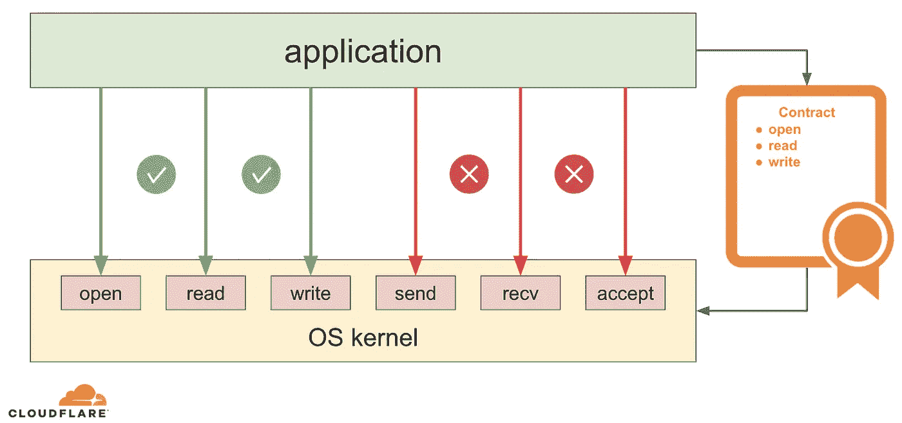

# Linux 中的沙盒，零行代码

> 原文：<https://levelup.gitconnected.com/sandboxing-in-linux-with-zero-lines-of-code-f0412c74c5ae>

*原载于 2020 年 7 月 8 日*[*【https://blog.cloudflare.com】*](https://blog.cloudflare.com/sandboxing-in-linux-with-zero-lines-of-code/)*。*

现代 Linux 操作系统提供了许多工具来更安全地运行代码。有[名称空间](https://www.man7.org/linux/man-pages/man7/namespaces.7.html)(容器的基本构建块) [Linux 安全模块](https://www.kernel.org/doc/html/latest/admin-guide/LSM/index.html)、[完整性度量架构](https://wiki.gentoo.org/wiki/Integrity_Measurement_Architecture)等。

在这篇文章中，我们将回顾 Linux seccomp，并学习如何不用写一行代码就可以运行任何(甚至是专有的)应用程序。


[伊旺·加博维奇的 Tux，GPL](https://www.deviantart.com/qubodup/art/Tux-Flat-SVG-607655623) [沙盒，简化的 Pixabay 许可证](https://pixabay.com/vectors/sandpit-sandbox-container-sand-35536/)

## Linux 系统调用

系统调用(syscalls)是[用户空间应用](https://en.wikipedia.org/wiki/User_space)和[操作系统(OS)内核](https://en.wikipedia.org/wiki/Kernel_(operating_system))之间定义良好的接口。在现代操作系统上，大多数应用程序只提供特定于应用程序的逻辑作为代码。当应用程序需要存储数据或通过网络发送数据时，它们不直接访问底层硬件或网络，大多数时候也不能这样做。相反，它们使用系统调用来要求操作系统内核代表它们执行特定的硬件和网络任务:


除了为应用程序提供与低级硬件交互的通用高级方式之外，系统调用体系结构还允许操作系统内核管理应用程序之间的可用资源，并实施策略，如应用程序权限、网络访问控制列表等。

## Linux seccomp

Linux seccomp[是 Linux 上的另一个系统调用](https://www.man7.org/linux/man-pages/man2/seccomp.2.html)，但是它有点特殊，因为当应用程序使用其他系统调用时，它会影响操作系统内核的行为。默认情况下，操作系统内核几乎不了解用户空间的应用程序逻辑，因此它提供了所有可能的服务。但不是所有的应用程序都需要所有的服务。考虑一个转换图像格式的应用程序:它需要从磁盘读取和写入数据的能力，但最简单的形式可能不需要任何网络访问。使用 seccomp，应用程序可以提前向 Linux 内核声明它的意图。对于这种特殊情况，它可以通知内核它将使用 [read](https://www.man7.org/linux/man-pages/man2/read.2.html) 和 [write](https://www.man7.org/linux/man-pages/man2/write.2.html) 系统调用，但从不使用 [send](https://www.man7.org/linux/man-pages/man2/send.2.html) 和 [recv](https://www.man7.org/linux/man-pages/man2/recv.2.html) 系统调用(因为它的目的是处理本地文件，而不是网络)。这就像在应用程序和操作系统内核之间建立一个契约:



但是，如果应用程序后来违反约定，试图使用它承诺不使用的系统调用之一，会发生什么呢？内核会“惩罚”应用程序，通常是立即终止它。Linux seccomp 还允许内核采取较少限制的动作:

*   可以请求内核只终止发出禁止的系统调用的线程，而不是终止整个应用程序
*   内核可以只向调用线程发送一个`SIGSYS` [信号](https://man7.org/linux/man-pages/man7/signal.7.html)
*   seccomp 策略可以指定一个错误代码，然后内核会将它返回给调用应用程序，而不是执行被禁止的系统调用
*   如果违规进程在 [ptrace](https://man7.org/linux/man-pages/man2/ptrace.2.html) 下(例如在调试器下执行)，内核可以通知跟踪器(调试器)一个被禁止的系统调用即将发生，并让调试器决定做什么
*   可以指示内核允许并执行系统调用，但是记录这个尝试:当我们想要验证我们的 seccomp 策略是否太紧而没有终止应用程序和潜在造成中断的风险时，这是很有用的

尽管在定义应用程序的潜在惩罚方面有很大的灵活性，但从安全角度来看，通常最好坚持在违反 seccomp 政策时完全终止应用程序。原因将在后面的例子中描述。

那么，如果应用程序可以“沉默”并且操作系统内核默认允许它使用任何系统调用，那么为什么要冒突然终止的风险并事先声明它的意图呢？当然，对于一个正常运行的应用程序来说，这是没有意义的，但是事实证明这个特性对于防止恶意应用程序和任意代码执行攻击是非常有效的。

想象一下，我们的图像格式转换器是用一些不安全的语言编写的，而[攻击者能够通过让它处理一些畸形的图像来控制应用程序](https://imagetragick.com/)。攻击者可能会从运行我们转换器的机器上窃取一些敏感信息，并通过网络发送给他们自己。默认情况下，操作系统内核很可能会允许它，这样就会发生数据泄漏。但是，如果我们的图像转换器事先“限制”(或沙箱)自己只读取和写入本地数据，当后者试图通过网络泄漏数据时，内核将终止应用程序，从而防止泄漏并将攻击者锁定在我们的系统之外！

## 将 seccomp 集成到应用程序中

为了了解如何在实践中使用 seccomp，让我们考虑一个玩具示例程序

*myos.c:*

```
**#include <stdio.h>
#include <sys/utsname.h>** 
**int** **main**(**void**)
{
    **struct** **utsname** name;

    **if** (uname(**&**name)) {
        perror("uname failed: ");
        **return** 1;
    }

    printf("My OS is %s!\n", name.sysname);
    **return** 0;
}
```

这是一个简化版的 [uname 命令行工具](https://www.man7.org/linux/man-pages/man1/uname.1.html)，它只打印你的操作系统名称。像它的全功能对应物一样，它使用 [uname 系统调用](https://www.man7.org/linux/man-pages/man2/uname.2.html)从内核中获取当前操作系统的名称。让我们来看看行动:

```
$ gcc -o myos myos.c
$ ./myos
My OS is Linux!
```

太好了！我们在 Linux 上，所以可以进一步试验 [seccomp](https://www.man7.org/linux/man-pages/man2/seccomp.2.html) (这是 Linux 独有的特性)。注意，在调用 [uname 系统调用](https://www.man7.org/linux/man-pages/man2/uname.2.html)之后，我们正在正确处理错误代码。然而，根据[手册页](https://www.man7.org/linux/man-pages/man2/uname.2.html)，只有当传入的缓冲区指针无效时，它才会失败。在这种情况下，设置的错误号将是“EINVAL”，这意味着无效参数。在我们的例子中,“struct utsname”结构是在堆栈上分配的，所以我们的指针总是有效的。换句话说，在正常情况下， [uname 系统调用](https://www.man7.org/linux/man-pages/man2/uname.2.html)应该永远不会在这个特定的程序中失败。

为了说明 seccomp 的功能，我们将在程序的主逻辑之前添加一个“沙箱”功能

*myos_raw_seccomp.c:*

```
**#include <linux/seccomp.h>
#include <linux/filter.h>
#include <linux/audit.h>
#include <sys/ptrace.h>
#include <sys/prctl.h>** 
**#include <stdlib.h>
#include <stdio.h>
#include <stddef.h>
#include <sys/utsname.h>
#include <errno.h>
#include <unistd.h>
#include <sys/syscall.h>** 
**static** **void** **sandbox**(**void**)
{
    **struct** **sock_filter** filter[] **=** {
        */* seccomp(2) says we should always check the arch */*
        */* as syscalls may have different numbers on different architectures */*
        */* see https://fedora.juszkiewicz.com.pl/syscalls.html */*
        */* for simplicity we only allow x86_64 */*
        BPF_STMT(BPF_LD **|** BPF_W **|** BPF_ABS, (offsetof(**struct** **seccomp_data**, arch))),
        */* if not x86_64, tell the kernel to kill the process */*
        BPF_JUMP(BPF_JMP **|** BPF_JEQ **|** BPF_K, AUDIT_ARCH_X86_64, 0, 4),
        */* get the actual syscall number */*
        BPF_STMT(BPF_LD **|** BPF_W **|** BPF_ABS, (offsetof(**struct** **seccomp_data**, nr))),
        */* if "uname", tell the kernel to return EPERM, otherwise just allow */*
        BPF_JUMP(BPF_JMP **|** BPF_JEQ **|** BPF_K, SYS_uname, 0, 1),
        BPF_STMT(BPF_RET **|** BPF_K, SECCOMP_RET_ERRNO **|** (EPERM **&** SECCOMP_RET_DATA)),
        BPF_STMT(BPF_RET **|** BPF_K, SECCOMP_RET_ALLOW),
        BPF_STMT(BPF_RET **|** BPF_K, SECCOMP_RET_KILL),
    };

    **struct** **sock_fprog** prog **=** {
        .len **=** (**unsigned** **short**) (**sizeof**(filter) **/** **sizeof**(filter[0])),
        .filter **=** filter,
    };

    */* see seccomp(2) on why this is needed */*
    **if** (prctl(PR_SET_NO_NEW_PRIVS, 1, 0, 0, 0)) {
        perror("PR_SET_NO_NEW_PRIVS failed");
        exit(1);
    };

    */* glibc does not have a wrapper for seccomp(2) */*
    */* invoke it via the generic syscall wrapper */*
    **if** (syscall(SYS_seccomp, SECCOMP_SET_MODE_FILTER, 0, **&**prog)) {
        perror("seccomp failed");
        exit(1);
    };
}

**int** **main**(**void**)
{
    **struct** **utsname** name;

    sandbox();

    **if** (uname(**&**name)) {
        perror("uname failed");
        **return** 1;
    }

    printf("My OS is %s!\n", name.sysname);
    **return** 0;
}
```

为了用沙箱保护自己，应用程序定义了一个 [BPF 程序](https://www.kernel.org/doc/Documentation/networking/filter.txt)，它实现所需的沙箱保护策略。然后应用程序通过 [seccomp](https://www.man7.org/linux/man-pages/man2/seccomp.2.html) 系统调用将这个程序传递给内核。内核做一些验证检查，以确保 BPF 程序是正确的，然后在应用程序进行的每个系统调用中运行这个程序。内核使用程序的执行结果来确定当前调用是否符合期望的策略。换句话说，BPF 程序是应用程序和内核之间的“契约”。

在我们上面的玩具例子中，BPF 程序只是检查哪个系统调用将被调用。如果应用程序试图使用 [uname 系统调用](https://www.man7.org/linux/man-pages/man2/uname.2.html)，我们告诉内核只返回一个 EPERM(代表“不允许操作”)错误代码。我们还告诉内核允许任何其他系统调用。让我们看看它现在是否有效:

```
$ gcc -o myos myos_raw_seccomp.c
$ ./myos
uname failed: Operation not permitted
```

`uname`现在失败，出现 EPERM 错误代码，并且在 [uname 联机帮助页](https://www.man7.org/linux/man-pages/man2/uname.2.html)中 EPERM 甚至没有被描述为潜在的失败代码！所以我们现在知道发生这种情况是因为我们“告诉”内核禁止我们使用 uname syscall，而是返回 EPERM。我们可以通过用其他一些错误代码替换 EPERM 来仔细检查这一点，这些代码完全不适合这个上下文，例如 enet down(“network down”)。为什么我们需要网络来获取当前正在执行的操作系统？然而，重新编译和运行程序，我们得到:

```
$ gcc -o myos myos_raw_seccomp.c
$ ./myos
uname failed: Network is down
```

我们还可以验证我们“合同”的另一部分是否如预期的那样工作。我们告诉内核允许任何其他系统调用，还记得吗？在我们的程序中，当 uname 失败时，我们用 [perror](https://www.man7.org/linux/man-pages/man3/perror.3.html) 函数将错误代码转换成人类可读的消息并打印在屏幕上。为了在屏幕上打印 [perror](https://www.man7.org/linux/man-pages/man3/perror.3.html) 使用了[写系统调用](https://www.man7.org/linux/man-pages/man2/write.2.html),因为我们实际上可以看到打印的错误消息，我们知道内核首先允许我们的程序进行[写系统调用](https://www.man7.org/linux/man-pages/man2/write.2.html)。

## 带 libseccomp 的 seccomp

虽然可以像上面的例子那样直接使用 seccomp，但是 BPF 程序手写起来很麻烦，而且很难调试、检查和更新。这就是为什么使用更高级的库通常是个好主意，它抽象掉了大多数低级的细节。幸运的是[有这样一个库](https://github.com/seccomp/libseccomp):它叫做 libseccomp，甚至被 [seccomp 手册页](https://www.man7.org/linux/man-pages/man2/seccomp.2.html)推荐。

让我们重写程序的`sandbox()`函数来使用这个库:

*myos_libseccomp.c:*

```
**#define _GNU_SOURCE
#include <stdio.h>
#include <stdlib.h>
#include <sys/utsname.h>
#include <seccomp.h>
#include <err.h>** 
**static** **void** **sandbox**(**void**)
{
    */* allow all syscalls by default */*
    scmp_filter_ctx seccomp_ctx **=** seccomp_init(SCMP_ACT_ALLOW);
    **if** (**!**seccomp_ctx)
        err(1, "seccomp_init failed");

    */* kill the process, if it tries to use "uname" syscall */*
    **if** (seccomp_rule_add_exact(seccomp_ctx, SCMP_ACT_KILL, seccomp_syscall_resolve_name("uname"), 0)) {
        perror("seccomp_rule_add_exact failed");
        exit(1);
    }

    */* apply the composed filter */*
    **if** (seccomp_load(seccomp_ctx)) {
        perror("seccomp_load failed");
        exit(1);
    }

    */* release allocated context */*
    seccomp_release(seccomp_ctx);
}

**int** **main**(**void**)
{
    **struct** **utsname** name;

    sandbox();

    **if** (uname(**&**name)) {
        perror("uname failed: ");
        **return** 1;
    }

    printf("My OS is %s!\n", name.sysname);
    **return** 0;
}
```

我们的`sandbox()`函数不仅变得更短、可读性更强，而且还提供了通过名称而不是内部编号来引用规则中的系统调用的能力，并且不必处理其他问题，比如设置`PR_SET_NO_NEW_PRIVS`位和处理系统架构。

值得注意的是，我们已经修改了我们的 seccomp 政策。在上面的原始 seccomp 示例中，我们指示内核在应用程序试图执行被禁止的系统调用时返回一个错误代码。这有利于演示，但在大多数情况下需要更严格的操作。仅仅返回一个错误代码并允许应用程序继续运行，就给了潜在的恶意代码绕过策略的机会。Linux 中有许多系统调用，其中一些做相同或相似的事情。例如，我们可能希望禁止应用程序从磁盘读取数据，因此我们在策略中拒绝了 [read](https://www.man7.org/linux/man-pages/man2/read.2.html) syscall，并告诉内核返回一个错误代码。但是，如果应用程序被利用，利用代码/逻辑可能如下所示:

```
…
**if** (**-**1 **==** read(fd, buf, count)) {
    */* hm… read failed, but what about pread? */*
    **if** (**-**1 **==** pread(fd, buf, count, offset) {
        */* what about readv? */* ...
    }
    */* bypassed the prohibited read(2) syscall */*
}
…
```

等等什么？！有多个读取系统调用？是的，有 [read](https://www.man7.org/linux/man-pages/man2/read.2.html) ， [pread](https://man7.org/linux/man-pages/man2/pread.2.html) ， [readv](https://man7.org/linux/man-pages/man2/readv.2.html) 还有更隐晦的，像 [io_submit](https://blog.cloudflare.com/io_submit-the-epoll-alternative-youve-never-heard-about/) 和`io_uring_enter`。当然，提供不完整的 seccomp 策略是我们的错，它没有阻止所有可能的读取系统调用。但是，如果我们至少已经指示内核在违反第一个普通`read`时立即终止进程，那么上面的恶意代码就没有机会变得聪明并尝试其他选项。

在上面的 libseccomp 示例中，我们现在有了一个更严格的策略，它告诉内核在违反策略时终止进程。让我们看看它是否有效:

```
$ gcc -o myos myos_libseccomp.c -lseccomp
$ ./myos
Bad system call
```

请注意，在编译应用程序时，我们需要针对 [libseccomp](https://github.com/seccomp/libseccomp) 进行链接。此外，当我们运行应用程序时，我们再也看不到`uname failed: Operation not permitted`错误输出，因为我们甚至没有给应用程序打印失败消息的能力。相反，我们看到一条来自 shell 的`Bad system call`消息，告诉我们应用程序被一个`SIGSYS` [信号](https://man7.org/linux/man-pages/man7/signal.7.html)终止。太好了！

## 零代码秒补偿

前面的例子工作得很好，但是它们都有一个缺点:我们实际上需要修改源代码来将我们想要的 seccomp 策略嵌入到应用程序中。这是因为 [seccomp syscall](https://www.man7.org/linux/man-pages/man2/seccomp.2.html) 影响调用进程及其子进程，但是没有接口从“外部”注入策略。人们期望开发人员将自己的代码作为应用程序逻辑的一部分用沙箱保护起来，但实际上这很少发生。当开发人员开始一个新项目时，大多数时候关注的是主要功能，而安全特性通常要么被推迟，要么被完全忽略。此外，大多数真实世界的软件通常是使用某种高级编程语言和/或框架编写的，其中开发人员不直接处理系统调用，甚至可能不知道他们的代码正在使用哪些系统调用。

另一方面，我们有系统操作员、系统管理员、SRE 和其他人，他们在生产中运行上述代码。他们更愿意保持生产系统的安全，因此可能希望尽可能地用沙箱保护服务。但是大部分时间他们都接触不到源代码。因此，存在不匹配的期望:开发人员有能力用沙箱保护他们的代码，但通常没有动力这样做，而操作人员有动力用沙箱保护代码，但没有这个能力。

这就是“零代码 seccomp”可能有所帮助的地方，外部操作者可以将所需的沙盒策略注入到任何进程中，而无需修改任何源代码。Systemd 是“零代码 seccomp”方法的流行实现之一。Systemd 管理的服务可以在它们的[单元文件](https://www.freedesktop.org/software/systemd/man/systemd.service.html)中定义一个`[SystemCallFilter=](https://www.freedesktop.org/software/systemd/man/systemd.exec.html#SystemCallFilter=)`指令，列出被管理的服务允许进行的所有系统调用。例如，让我们回到没有嵌入任何沙盒代码的玩具应用程序:

```
$ gcc -o myos myos.c
$ ./myos
My OS is Linux!
```

现在我们可以用 systemd 运行相同的代码，但是禁止应用程序使用 [uname](https://www.man7.org/linux/man-pages/man2/uname.2.html) 而不更改或重新编译任何代码(我们使用 [systemd-run](https://www.freedesktop.org/software/systemd/man/systemd-run.html) 为我们创建一个短暂的 systemd 服务单元):

```
$ systemd-run --user --pty --same-dir --wait --collect --service-type=exec --property="SystemCallFilter=~uname" ./myos
Running as unit: run-u0.service
Press ^] three times within 1s to disconnect TTY.
Finished with result: signal
Main processes terminated with: code=killed/status=SYS
Service runtime: 6ms
```

我们再也看不到正常的`My OS is Linux!`输出，systemd 很方便地告诉我们托管进程被一个`SIGSYS`信号终止了。我们甚至可以更进一步，使用另一个指令`[SystemCallErrorNumber=](https://www.freedesktop.org/software/systemd/man/systemd.exec.html#SystemCallErrorNumber=)`来配置我们的 seccomp 策略，不终止应用程序，而是返回一个错误代码，如我们的第一个 seccomp raw 示例所示:

```
$ systemd-run --user --pty --same-dir --wait --collect --service-type=exec --property="SystemCallFilter=~uname" --property="SystemCallErrorNumber=ENETDOWN" ./myos
Running as unit: run-u2.service
Press ^] three times within 1s to disconnect TTY.
uname failed: Network is down
Finished with result: exit-code
Main processes terminated with: code=exited/status=1
Service runtime: 6ms
```

## systemd 小型印刷字体

太好了！我们现在可以将几乎任何 seccomp 策略注入到任何进程中，而无需编写任何代码或重新编译应用程序。不过在 [systemd 文档](https://www.freedesktop.org/software/systemd/man/systemd.exec.html#SystemCallFilter=)中有一句很有意思的话:

> …请注意，`execve, exit, exit_group, getrlimit, rt_sigreturn, sigreturn`系统调用以及查询时间和睡眠的系统调用被隐式列入白名单，不需要显式列出...

有些系统调用是隐式允许的，我们不必列出它们。这主要与 systemd 管理进程和注入 seccomp 策略的方式有关。我们之前已经确定 seccomp 策略适用于当前进程及其子进程。因此，为了注入策略，systemd [分叉](https://www.man7.org/linux/man-pages/man2/fork.2.html)本身，在分叉的进程中调用 [seccomp](https://www.man7.org/linux/man-pages/man2/seccomp.2.html) ，然后[将分叉的进程](https://www.man7.org/linux/man-pages/man2/execve.2.html)执行到目标应用程序中。这就是为什么首先总是允许 [execve](https://www.man7.org/linux/man-pages/man2/execve.2.html) 系统调用是必要的，因为否则 systemd 不能完成它作为服务管理器的工作。

但是如果我们想明确禁止这些系统调用呢？如果我们继续以 [execve](https://www.man7.org/linux/man-pages/man2/execve.2.html) 为例，那实际上可能是大多数应用程序想要禁止的一个危险的系统调用。Seccomp 是保护代码免受任意代码执行攻击的有效工具，还记得吗？如果一个恶意的参与者接管了我们的代码，他们最有可能做的第一件事就是获得一个 shell(或者用任何其他更容易控制的应用程序替换我们的代码),方法是指导我们的代码用想要的二进制文件调用 [execve](https://www.man7.org/linux/man-pages/man2/execve.2.html) 。因此，如果我们的代码不需要 [execve](https://www.man7.org/linux/man-pages/man2/execve.2.html) 来实现它的主要功能，那么禁止它将是一个好主意。不幸的是，使用 systemd `[SystemCallFilter=](https://www.freedesktop.org/software/systemd/man/systemd.exec.html#SystemCallFilter=)`方法是不可能的...

## Cloudflare 沙盒简介

我们非常喜欢 systemd `[SystemCallFilter=](https://www.freedesktop.org/software/systemd/man/systemd.exec.html#SystemCallFilter=)`指令的“零代码 seccomp”方法，但是对它的局限性不满意。我们决定更进一步，在不触及源代码的情况下，从外部禁止任何进程中的任何系统调用，因此推出了 [Cloudflare 沙箱](https://github.com/cloudflare/sandbox)。这是一个简单的独立工具包，由一个共享库和一个可执行文件组成。共享库应该用于动态链接的应用程序，而可执行文件则用于静态链接的应用程序。

## 沙箱动态链接的可执行文件

对于动态链接的可执行文件，可以利用`[LD_PRELOAD](https://www.man7.org/linux/man-pages/man8/ld.so.8.html)`环境变量将定制代码注入到进程中。我们工具包中的`libsandbox.so`共享库还包含一个所谓的[初始化例程](https://gcc.gnu.org/onlinedocs/gccint/Initialization.html)，它应该在主逻辑之前执行。这就是我们如何制作目标应用程序沙箱本身:

*   `[LD_PRELOAD](https://www.man7.org/linux/man-pages/man8/ld.so.8.html)`告诉动态加载器在应用程序启动时加载我们的`libsandbox.so`作为应用程序的一部分
*   运行时在大多数主逻辑之前执行来自`libsandbox.so`的[初始化例程](https://gcc.gnu.org/onlinedocs/gccint/Initialization.html)
*   我们的初始化例程配置在特殊环境变量中描述的沙盒策略
*   当主应用程序逻辑开始执行时，目标进程已经实施了配置的 seccomp 策略

让我们看看它是如何与我们的`myos`玩具工具一起工作的。首先，我们需要确保它实际上是一个动态链接的应用程序:

```
$ ldd ./myos
	linux-vdso.so.1 (0x00007ffd8e1e3000)
	libc.so.6 => /lib/x86_64-linux-gnu/libc.so.6 (0x00007f339ddfb000)
	/lib64/ld-linux-x86-64.so.2 (0x00007f339dfcf000)
```

是的，它是。现在，让我们用我们的工具包禁止它使用 [uname](https://www.man7.org/linux/man-pages/man2/uname.2.html) 系统调用:

```
$ LD_PRELOAD=/usr/lib/x86_64-linux-gnu/libsandbox.so SECCOMP_SYSCALL_DENY=uname ./myos
adding uname to the process seccomp filter
Bad system call
```

我们再次成功地将我们想要的 seccomp 策略注入到`myos`应用程序中，而没有修改或重新编译它。这种方法的优点是它没有 systemd 的`[SystemCallFilter=](https://www.freedesktop.org/software/systemd/man/systemd.exec.html#SystemCallFilter=)`的缺点，我们可以阻塞任何系统调用(幸运的是 [Bash](https://www.gnu.org/software/bash/) 也是一个动态链接的应用程序):

```
$ /bin/bash -c 'echo I will try to execve something...; exec /usr/bin/echo Doing arbitrary code execution!!!'
I will try to execve something...
Doing arbitrary code execution!!!
$ LD_PRELOAD=/usr/lib/x86_64-linux-gnu/libsandbox.so SECCOMP_SYSCALL_DENY=execve /bin/bash -c 'echo I will try to execve something...; exec /usr/bin/echo Doing arbitrary code execution!!!'
adding execve to the process seccomp filter
I will try to execve something...
Bad system call
```

这里唯一的问题是，我们可能会不小心忘记`LD_PRELOAD`我们的`libsandbox.so`库，并可能不受保护地运行。此外，如[手册页](https://www.man7.org/linux/man-pages/man8/ld.so.8.html)中所述，`LD_PRELOAD`也有一些限制。我们可以通过使`libsandbox.so`成为我们目标应用程序的永久部分来克服所有这些问题:

```
$ patchelf --add-needed /usr/lib/x86_64-linux-gnu/libsandbox.so ./myos
$ ldd ./myos
	linux-vdso.so.1 (0x00007fff835ae000)
	/usr/lib/x86_64-linux-gnu/libsandbox.so (0x00007fc4f55f2000)
	libc.so.6 => /lib/x86_64-linux-gnu/libc.so.6 (0x00007fc4f5425000)
	/lib64/ld-linux-x86-64.so.2 (0x00007fc4f5647000)
```

同样，我们在这里不需要访问源代码，而是修补编译后的二进制文件。现在我们可以像以前一样配置我们的 seccomp 策略，而不需要`LD_PRELOAD`:

```
$ ./myos
My OS is Linux!
$ SECCOMP_SYSCALL_DENY=uname ./myos
adding uname to the process seccomp filter
Bad system call
```

## 沙箱静态链接的可执行文件

上面的方法非常方便简单，但是它不适用于静态链接的可执行文件:

```
$ gcc -static -o myos myos.c
$ ldd ./myos
	not a dynamic executable
$ LD_PRELOAD=/usr/lib/x86_64-linux-gnu/libsandbox.so SECCOMP_SYSCALL_DENY=uname ./myos
My OS is Linux!
```

这是因为没有[动态加载器](https://www.man7.org/linux/man-pages/man8/ld.so.8.html)参与启动一个静态链接的可执行文件，所以`LD_PRELOAD`没有影响。对于这种情况，我们的工具包包含一个特殊的应用程序启动器，它将以类似于 systemd 的方式注入 seccomp 规则:

```
$ sandboxify ./myos
My OS is Linux!
$ SECCOMP_SYSCALL_DENY=uname sandboxify ./myos
adding uname to the process seccomp filter
```

注意，我们再也看不到`Bad system call` shell 消息了，因为我们的目标可执行文件是由启动器启动的，而不是由 shell 直接启动的。然而，与 systemd 不同，我们可以使用这个启动器来阻止危险的系统调用，比如 [execve](https://www.man7.org/linux/man-pages/man2/execve.2.html) :

```
$ sandboxify /bin/bash -c 'echo I will try to execve something...; exec /usr/bin/echo Doing arbitrary code execution!!!'
I will try to execve something...
Doing arbitrary code execution!!!
SECCOMP_SYSCALL_DENY=execve sandboxify /bin/bash -c 'echo I will try to execve something...; exec /usr/bin/echo Doing arbitrary code execution!!!'
adding execve to the process seccomp filter
I will try to execve something...
```

## sandboxify vs libsandbox.so

从上面的例子中，你可能会注意到对动态链接的可执行文件使用`sandboxify`也是可能的，那么为什么还要用`libsandbox.so`呢？当我们开始使用“denylist”策略，而不是本文中大多数例子中的“denylist”策略，而是首选的“allowlist”策略时，差异就变得明显了，在 allow list 策略中，我们只显式地允许我们需要的系统调用，而禁止其他所有的调用。

让我们将我们的玩具应用程序转换回动态链接应用程序，并尝试列出它正常运行所需的最少允许系统调用列表:

```
$ gcc -o myos myos.c
$ ldd ./myos
	linux-vdso.so.1 (0x00007ffe027f6000)
	libc.so.6 => /lib/x86_64-linux-gnu/libc.so.6 (0x00007f4f1410a000)
	/lib64/ld-linux-x86-64.so.2 (0x00007f4f142de000)
$ LD_PRELOAD=/usr/lib/x86_64-linux-gnu/libsandbox.so SECCOMP_SYSCALL_ALLOW=exit_group:fstat:uname:write ./myos
adding exit_group to the process seccomp filter
adding fstat to the process seccomp filter
adding uname to the process seccomp filter
adding write to the process seccomp filter
My OS is Linux
```

所以我们需要允许 4 个系统调用:`exit_group:fstat:uname:write`。这是最严密的“沙箱”，仍然没有打破应用。如果我们从这个列表中删除任何系统调用，应用程序将终止并显示`Bad system call`消息(自己试试吧！).

如果我们使用相同的 allowlist，但是使用`sandboxify`启动器，事情就不再工作了:

```
$ SECCOMP_SYSCALL_ALLOW=exit_group:fstat:uname:write sandboxify ./myos
adding exit_group to the process seccomp filter
adding fstat to the process seccomp filter
adding uname to the process seccomp filter
adding write to the process seccomp filter
```

原因是`sandboxify`和`libsandbox.so`在流程生命周期的不同阶段注入 seccomp 规则。考虑以下流程启动的高级图表:


简而言之，每个进程都有两个运行时阶段:“运行时初始化”和“主逻辑”。主要逻辑基本上是代码，它位于程序`main()`函数和应用程序开发人员放在那里的其他代码中。但是在来自`main()`函数的代码能够执行之前，进程通常需要做一些工作——在上图中，我们将这些工作称为“运行时初始化”。开发人员并不直接编写这些代码，但是大多数时候这些代码是由编译器工具链自动生成的，编译器工具链用于编译源代码。

为了完成它的工作,“运行时初始化”阶段使用了许多不同的系统调用，但是在“主逻辑”阶段，大部分都是不需要的。如果我们在沙箱中使用“allowlist”方法，那么如果这些系统调用只在程序初始化中使用一次，那么在程序的整个运行过程中允许它们是没有意义的。这就是`libsandbox.so`和`sandboxify`的区别所在:`libsandbox.so`通常在“运行时初始化”阶段已经执行之后执行 seccomp 规则，所以我们不必允许来自那个阶段的大多数系统调用。`sandboxify`另一方面，在“运行时初始化”阶段之前实施策略，因此我们必须允许来自两个阶段的所有系统调用，这通常会导致更大的 allowlist，从而扩大攻击面。

回到我们的玩具`myos`的例子，这里是所有系统调用的最小列表，我们需要允许应用程序在我们的沙箱下工作:

```
$ SECCOMP_SYSCALL_ALLOW=access:arch_prctl:brk:close:exit_group:fstat:mmap:mprotect:munmap:openat:read:uname:write sandboxify ./myos
adding access to the process seccomp filter
adding arch_prctl to the process seccomp filter
adding brk to the process seccomp filter
adding close to the process seccomp filter
adding exit_group to the process seccomp filter
adding fstat to the process seccomp filter
adding mmap to the process seccomp filter
adding mprotect to the process seccomp filter
adding munmap to the process seccomp filter
adding openat to the process seccomp filter
adding read to the process seccomp filter
adding uname to the process seccomp filter
adding write to the process seccomp filter
My OS is Linux!
```

如果我们使用`libsandbox.so`方法，这是 13 个系统调用对 4 个系统调用！

## 结论

在这篇文章中，我们讨论了如何轻松地在 Linux 上用沙箱保护应用程序，而不需要编写任何额外的代码。我们介绍了 [Cloudflare 沙盒工具包](https://github.com/cloudflare/sandbox)，并讨论了我们在沙盒化动态链接应用程序和静态链接应用程序时采用的不同方法。

拥有更安全的在线代码有助于建立一个更好的互联网，如果你觉得我们的[沙盒工具包](https://github.com/cloudflare/sandbox)有用，我们会很高兴。期待反馈、改进和其他贡献！