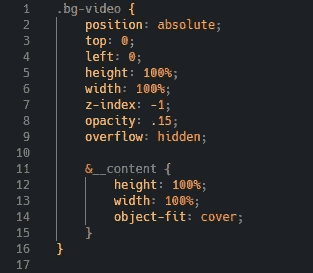

# 时髦…美丽…狡猾

> 原文：<https://levelup.gitconnected.com/sass-y-beauty-crafty-67616688b4da>

理解语法上很棒的样式表(Sass ),以及为什么 Sass/SCSS 应该是下一个你能舒服使用的东西。

照片由[麦克·琼斯](https://unsplash.com/@der_maik_?utm_source=medium&utm_medium=referral)拍摄

从软件工程训练营毕业后，我知道 HTML5 和 CSS3 的基础知识——但是我想创建更美观的网站的愿望让我渴望不仅仅是基础知识。我搜索了一个入门课程来巩固我的理解，以及一个更高级的课程来帮助提高我的技能，这使我参加了 Jonas Schmedtmann 教授的关于 Udemy 的两个课程:[用 HTML5 和 CSS3](https://www.udemy.com/course/design-and-develop-a-killer-website-with-html5-and-css3/) 和[高级 CSS 和 Sass 构建响应性的真实世界网站:Flexbox、Grid、Animations 等等！](https://www.udemy.com/course/advanced-css-and-sass/)我在之前的博客中简要地谈到了这两个问题。

我不会过多地讨论这两门课程的细节，但是在这篇博客中，我将解释普通 CSS 和 Sass 之间的一些区别。那么 Sass 到底是什么？[据维基百科](https://en.wikipedia.org/wiki/Sass_(stylesheet_language))介绍，Sass 是一种预处理器脚本语言，最终编译成 CSS。这意味着无论以 Sass 格式编写什么代码，都将被解释并重写为 CSS。通过使用 Sass，我们能够使用许多在常规 CSS 中不可用或不容易实现的特性，如变量、混合和嵌套——所有这些我将尽力解释。我还将谈论一种我非常喜欢使用的文件架构，称为 7–1 模式。最后，我将概述一下使用萨斯/SCSS 的利与弊。

为了真正理解 Sass，我必须解释变量、混合和嵌套。变量和其他语言中的概念完全一样。不幸的是，这个特性并不像普通 CSS 那样简洁。通过使用美元符号分配 CSS 属性并提供一个名称，该属性可以在代码中以该名称在其他地方重用。在上图中，我的一个扩展实际上展示了如何简单地通过命名然后调用$color-primary，Sass 识别出它引用的是十六进制颜色代码#55c57a。

mixin 允许用户定义特定的样式属性集，并使用@mixin 关键字重用该属性集来定义该属性集。然后可以在代码中的任何地方使用@include 关键字调用该集合。在上图中，我写了一个 mixin 来对齐一个元素到它的绝对中心。通过使用@mixin 并将这四个属性命名为 ab center，我可以在任何时候使用@include 调用 ab center 来插入这四个属性，而不必再次重写它们。Sass 编译完这些文件后，最终的 CSS 将使用 absCenter 引用这四个属性。

还有一个特性叫做继承和扩展。这个概念非常类似于 mixins，但是它们的行为有点不同。事实上，我不得不做一些研究来更好地理解它们的区别，但它们可能会有点令人困惑。我找到的一篇文章很好地解释了它们的区别。

嵌套指的是 Sass 引用编写代码的前一个 CSS 选择器的能力。例如，在下面的代码摘录中，我选择了*。bg-video* 类写了几个 CSS 属性，但是在那个类里面我还指定了一个额外的选择器:*&_ _ 内容*。在编译后的 CSS 中，嵌套部分的选择器实际上会转换为*。bg-video__content* 。这样做可以让我有更干净的代码，因为我不会不断重复自己。

Sass 的另一个重要特性是分部和模块。片段是可以写在主 Sass 文件之外的文件中的代码。通过在 Sass 文件前面加上下划线(_example.scss)，它让 Sass 知道这是一个分部文件，只有包含在@use 中时才应该使用，这是利用模块的关键字。通过使用模块，开发者能够引用他们正在编码的当前 Sass 文件之外的代码。如果我有一个 base.scss 文件，其中包含我的变量和混合，通过在我创建的任何其他 Sass 文件的开头使用@use 'base ',我可以引用在 base.scss 中编写的所有变量和混合。

这让我想到了用 Sass 编写的一个项目的架构。在一门 Udemy 课程中，我学习了 7–1 模式文件结构，它代表 7 个文件夹，1 个文件。这种模式是 Hugo Giraudel 创造的，包含 7 个文件夹，每个文件夹用于特定类别的部分 Sass 文件，以及一个 main.scss 文件。

这七个文件夹通常被称为摘要、供应商、基础、布局、组件、页面和主题。

如果某个类别未被使用，您不需要为它准备文件夹。在这个片段中，没有使用供应商文件或额外的主题。

**抽象**不包含实际的样式，而是像变量、混合、函数等东西。

**供应商**是项目利用的任何第三方风格，比如任何引导。

**基地**将包括样板风格通过网站使用，如排版，字体和动画。

**布局**用于网站的结构方面，比如它的导航栏、页眉、页脚、主要内容等等。

**组件**用于网站的小的、可重复使用的部分，如按钮、表单或个人资料图片。

**页面**用于页面特定的样式，例如，如果一个项目的样式规则只在“关于我们”页面或“联系我们”页面上使用一次。

**主题**适用于一个项目站点有多个不同主题的情况。这方面的一个例子是夜间模式。

这 7 个文件夹中的所有文件都将被命名为 partials，最终的 main.scss 页面将使用@use 来导入每个文件。这有助于使更大的项目更具可伸缩性、组织性和可读性。与任何组织风格一样，如何组织项目完全取决于开发人员和项目的需求。7-1 模式只是一种我觉得有帮助的风格，但绝不是一条要遵循的严格规则。

解释了 Sass 的工作原理后，SCSS 在我的博客中出现了好几次。尽管它们非常相似，有时几乎可以互换使用，[本文解释了萨斯和 SCSS 之间的一些关键区别](https://www.educba.com/sass-vs-scss/)。

现在你对 Sass 有了更多的了解，让我们简单回顾一下使用 Sass 和普通 CSS 的优缺点。

**优点:**由于 Sass 的分部和模块特性，它具有高度的可伸缩性和组织性。由于它的嵌套特性，它是可读的；由于它使用了变量、混合和继承，它是可重用的。开发人员编写的代码明显更少，这可以节省大量时间。由其他团队成员进行故障排除会更容易，因为文件是按其特定类别组织的。

**缺点:**开发者需要学习 Sass 中的这些新特性，因为它们与 CSS 有很大的不同。使用 Sass 还会导致浏览器的内置检查无法按预期工作。最初的编译/构建设置可能需要时间来适应。

有一个话题我没有在这篇博客中涉及，叫做边界元法，因为它在萨斯/SCSS 经常使用。在一些代码片段中，您可能已经注意到在选择器名称前面使用了破折号和下划线。我将在下一篇博客中更详细地介绍这一点，但这是一个命名约定，以便更容易理解 HTML 和 CSS 部分之间的关系。

在对 Sass 进行了非常全面的介绍之后，我希望我能够展示 Sass 的魅力，以及为什么学习 Sass 真的会有回报。许多大公司实际上在样式表中使用 Sass，其中一些是 Asana，Airbnb，Trivago 和 Robinhood。因此，学习 Sass 不仅可以帮助你构建更干净、更可扩展的项目，它还可以成为你简历中的另一部分，这可能会让你获得下一份大工作。