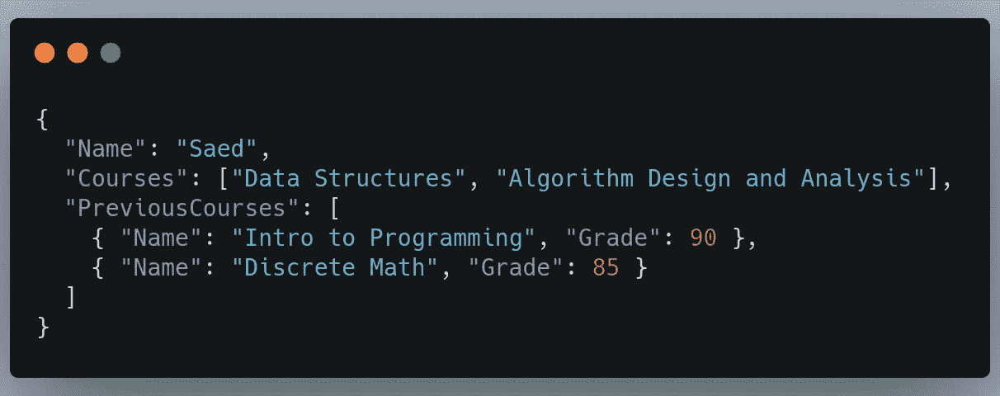
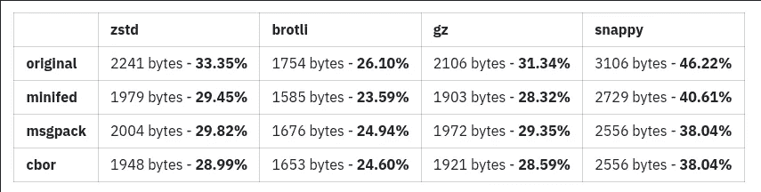
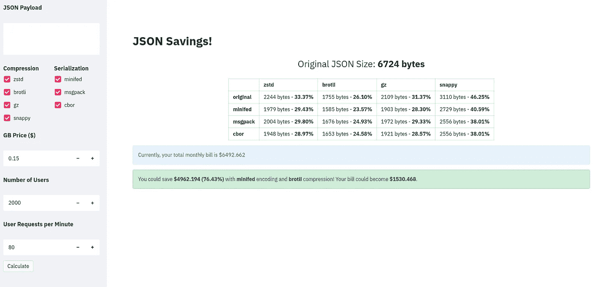

# 通过压缩节省您的云带宽成本

> 原文：<https://levelup.gitconnected.com/save-money-on-your-cloud-bandwidth-with-compression-7ea17d820bc5>


## 使用简单的数据压缩技术为您节省一些钱，并为您的用户节省一些加载时间

如果您的 APIs 服务器使用纯文本(纯 JSON、纯 HTML、纯任何东西)进行通信，并且您使用对数据传输收费的云服务，那么下面的文章可能会为您节省超过 60%的费用。我们将以 JSON 为例，但是大部分内容适用于任何类型的数据。

# 动机

因此，最近，有人告诉我要快速编写一个 python 脚本，该脚本采用 JSON 并对其应用几种压缩和编码技术。然后，我被要求计算使用压缩到最小尺寸的技术的潜在节省。然后，我想我可以写一篇关于它的文章，并开发一个小的网络应用程序，为你做计算。那么，让我们开始吧。

# JSON 是什么？

所以，JSON 是 JaveScript 对象符号的缩写。它由键-值对组成(它只能是值/对象的数组)，其中值可以是任何值(int、float、string、bool、array、objects)。所以这是一种表示数据的方式，也是一种交流数据的方式。随着人们越来越多地在他们的 API 和应用程序中使用它，它已经成为一种标准。一个简单的例子:



JSON 的一个例子

# 为什么要压缩？

上面的 JSON 的大小是 **214 字节**。不太多，是吧？正确。这在我们现在的世界里基本不算什么。然而，想象一下，如果你每隔 **10 秒向你的 API 或网站的 5000 个用户/客户**发送一个类似的有效载荷(这是一个非常低的数字)；这将占**258 GB/月**。AWS 为每 GB (在第一个 1 GB 之后)向您收取 0.09 美元****。这相当于**～23.24 美元**。****

**现在，想象一下，如果您的 API 中有 5 个其他端点同时加载了这个，这个数字将变成 **~$140** 。对于一个企业来说，这可能不算多，但是如果企业有更多的 API 和更多的负载来来回回，那么这个数字很容易变成数千美元。大多数 API 在它们的 JSON 有效负载中发送的信息比上面的例子更多。尽管如此，对于一个个人项目，或者一个非营利项目，你可能会尝试优化你在这些事情上的花费。**

**以下是您可能希望这样做的场景(同样，不仅仅是 JSON，而是所有内容):**

*   **节省一些数据传输费用。**
*   **如果直接复制传输的数据，可以节省一些存储容量。**
*   **您的用户使用移动设备，连接速度非常慢，您希望为他们节省资金或缩短应用程序的响应时间。**
*   ****不是为了安全**，但它们有时会增加一点安全性，因为数据在传输时是不可读的，尽管如果使用的技术是已知的，它可以很容易地被还原。**
*   **因为你可以！大多数浏览器都有对其中许多内容的原生支持，您不必处理前端实现的问题。**

# **什么是编码和压缩？**

*****编码*** 是根据编码系统/规范，将一些数据以不同的形式表示的一种方式。这里的目的是用简洁的方式表示 ***值*** 。这意味着数据仍将以某种方式保持其结构。有些方法更喜欢模式，有些不喜欢(就像我们将要介绍的那些)。**

*****压缩*** 在某些方面是类似的，但是这里的主要目的是在最后有更小的 ***数据*** 。与编码不同，它将数据视为一个整体(一组字节)，而不是单个的值。这导致数据失去了它的语义结构，因为它被当作字节来处理。**

**对于这两者来说，在传输过程中，您的数据将不再相同，它将采用一种不同的表示方式。此外，这意味着您需要为后端和前端添加支持，以便对这些内容进行压缩/编码和解压缩/解码。此外，执行这些操作的少量延迟开销可能会添加到您的流中。**

**幸运的是，很多浏览器和其他工具都支持这些东西，有时你不需要自己做所有的事情，即使你不得不做，这也是相当简单的。**

# **使用的技术:**

**我不打算详细介绍每种方法，但在选择最适合您的方法时，有几件事情需要记住:**

*   **压缩率:有些技术比其他技术更能压缩数据**
*   **编码/压缩时间:一些技术花费更多的时间来完成它们的工作，如果延迟对你很重要的话，你可能想深入分析一下。**
*   **模式 vs 无模式:虽然我们在这里没有介绍，但是有些方法需要模式(预先知道数据的形状)，有些不需要。那些在前面两件事情上做得更好的人，因为他们已经在模式的每一端都有了很多硬编码的部分。**
*   **支持(安全性和可维护性):您可能希望选择符合当前标准(甚至是标准化的)的东西。拥有一个围绕该工具的活跃社区有助于发现漏洞和错误，从而修复它们。**

## **编码/序列化:**

*   **保持 JSON 不变(对后面的例子来说更多的是一个占位符)。**
*   **缩小它(去掉空格、制表符和换行符)
    你可以这样做，不会给前端或后端带来额外的负担，从而节省一些带宽。**
*   **https://cbor.io/
    CBOR(简明二进制对象表示法)**
*   **https://msgpack.org/index.html[msg pack](https://msgpack.org/index.html)** 

## **压缩:**

*   **布罗特利——谷歌
    [https://github.com/google/brotli](https://github.com/google/brotli)**
*   **zstd—https://facebook.github.io/zstd/脸书
    T11**
*   **爽快——谷歌
    [https://github.com/google/snappy](https://github.com/google/snappy)**
*   **zlib(gz)
    [https://github.com/madler/zlib](https://github.com/madler/zlib)**

# **真实世界的例子**

**我在上平均得到了大小为 **~6500 字节**的有效载荷。有 **2000 个用户**，他们每分钟请求 **20 次**。有 **4 个端点**服务相同大小的有效载荷。此外，我们使用的云服务每 GB 收费 0.15 美元。那么，每月要花多少钱呢？**

**`6500 x 2000 * 20 * 4 * 0.15 * 30 * 24 * 60 / (1024³) = $6276.37`**

**费用为 6276.37 美元。现在，我们想看看我们能节省多少。我们做了一个 Python 脚本，让**获取一个 JSON** ，**序列化/编码它**，然后**压缩结果**。这就是使用上述任何一种方法有多容易:**

```
import cbor2
serialized_json_bytes = cbor2.dumps(json_bytes)import brotli
original_compressed_json = brotli.compress(json_bytes)
#or
serialized_compressed_json = brotli.compress(serialized_json_bytes)final_length = len(serialized_json_bytes) # straightforward
```

**我们运行了前面提到的所有技术，只关心大小(您可能也关心延迟——不是说它们很慢)。我们最终得到了以下结果:**

****

**这张表上有几件事需要注意。首先，任何类型的压缩都应该节省一些带宽，尤其是如果你的有效载荷很大的话。其次，在这些候选人中，brotli 似乎做得最好。第三，这是对你的数据传输账单的一个立即转换， **brotli 节省** **%23.59 的大小，意味着节省%23.59 的钱。这意味着我们的账单将降至 1480 美元(节省约 4800 美元)。**值得一提的是，使用一种使用模式或学习数据的方法甚至可能减少到原来大小的 10%**。****

# ****我写了一个计算器****

****所以，我用 ***streamlit*** 写了一个小的 web 应用程序，它用***【Python】、*** 执行所有前述的计算，对于其他语言/框架来说应该是一样直观的。****

*   ****你可以在这里试试 app 本身:
    [https://json-savings.herokuapp.com/](https://json-savings.herokuapp.com/)****
*   ****您可以在这里对回购本身做出贡献(添加新技术或更好的可视化)也可以随意给它打个星:
    、https://github.com/saedx1/json_savings 或 https://share.streamlit.io/saedx1/json_savings/main/app.py****

****下面是使用计算器应用程序的前一个示例(JSON 隐藏):****

********

****JSON 储蓄网络计算器****

****它显示了计算出的每月账单，你可以节省的金额，以及你选择的技术之间的全面比较。****

# ****就这样****