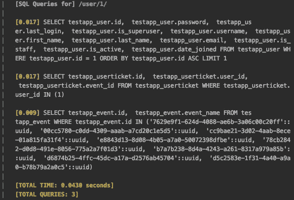
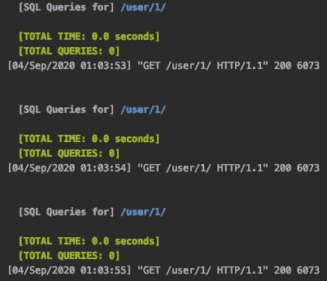

# 保存查询，缓存您的对象！优化 Django:第 5 部分

> 原文：<https://levelup.gitconnected.com/save-the-queries-cache-your-objects-optimizing-django-part-5-f49325f0e9fd>

到目前为止，在本系列中，我们已经介绍了在 Django 服务器的各个部分减少 SQL 内存占用的技巧和诀窍。例如，我们已经处理了[指南，用于设置你的服务器访问自定义缓存](/dealing-with-the-n-1-problem-optimising-django-part-4-f02010c7931d#)等等。

# 缓存能帮你什么呢？

让我们从每个站点的缓存开始。每站点缓存是可以为您的服务器网站进行的最简单的一种缓存。如果您的服务器提供静态网页，这非常适合您。

对于每个站点的缓存，在简单的用例场景中没有太多的 SQL 可言，所以我没有太多的东西来添加每个站点的缓存。然而，每站点缓存确实消除了从内存甚至从 CDN 加载文件的 I/O 工作负载，允许服务器从缓存加载所述网页。

然而，Django 还提供了每视图缓存，这可以在 SQL 前端产生切实的节约。如果您的视图提供相对静态的数据，这对性能非常有利，尤其是在视图被频繁访问的情况下。此外，如果您的视图为每个登录用户提供一个定制结果，您可以包含一个`vary_on_headers`装饰器来缓存每个用户，尽管这有其缺点(对于常见的使用场景来说，这是非常多余的)。

最后，您可以访问 Django 的低级缓存来缓存响应，这是相当强大和直接适用的，足以探索…

# 说够了！是时候读一些代码了

让我们看一下这个视图，它接受一个用户 ID 并返回关于用户的一些细节。

```
class UserSerializer(ModelSerializer):
    class Meta:
        model = User
        fields = ('first_name', 'last_name', 'is_active', 'gender')

class UserView(APIView):
    def get(self, request, user_id):
        user_obj = User.objects.get(id=user_id)
        serializer = UserSerializer(user_obj)
        return Response(serializer.data, status=status.HTTP_200_OK)
```

视图非常简单、公开，不应该有太大变化。非常适合缓存！尽管我们可以使用 per_view 缓存来很好地处理这个问题，但我们将继续演示如何使用低级缓存来为自己缓存结果并将其返回。

我们所要做的就是记住以下几点来设置视图:

1.  检查用户数据是否在缓存中。如果我们找不到它，我们就像平常一样收集数据，并保存到缓存中。
2.  无论哪种方式，我们现在都应该有来自缓存或 SQL 的数据，所以我们正常地提供数据。

结果应该是这样的:

```
# This is the default low-level cache.
from django.core.cache import cacheclass UserView(APIView):
    def get(self, request, user_id):
    # try to get cached data
    user_data = cache.get(USER_CACHE_KEY.format(user_id))
    if not user_data:
         user_obj = User.objects.get(id=user_id)
         serializer = UserSerializer(user_obj)
         user_data = dict(serializer.data)
         cache.set(USER_CACHE_KEY.format(user_id),
                   user_data,
                   timeout=TIMEOUT) return Response(user_data, status=status.HTTP_200_OK)
```

如果您在测试服务器上尝试这样做，您会注意到在第一次调用端点之后，大部分 SQL 似乎都消失了。在这里，我会告诉你:



我们的第一个请求包含 3 个 SQL 查询，

API 调用在第一次执行时需要 3 个查询，但在后续调用中:



零查询！这是因为查询结果是从缓存中提供的，而不是从数据库中收集的。当您频繁提供本质上是静态的数据时，这非常方便。

# 伙计们，现在就这样吧！

感谢您阅读本文！

如果你想知道更多关于如何使你的 Django 管理员可用的技巧，[看看这篇关于如何从你的 Django 变更列表中删除 SQL 计数的文章](/speed-up-your-django-admin-by-removing-sql-counts-optimizing-django-part-2-f5e09da667c?source=friends_link&sk=339d71c0b8a06c281d8b18a21c587d5b)。或者看看在 Django 中使用串行化器时如何[解决](/dealing-with-the-n-1-problem-optimising-django-part-4-f02010c7931d?source=friends_link&sk=34dfcc4f324f48a9e6e4b234d7e7635e) `[n+1](/dealing-with-the-n-1-problem-optimising-django-part-4-f02010c7931d?source=friends_link&sk=34dfcc4f324f48a9e6e4b234d7e7635e)` [问题！](/dealing-with-the-n-1-problem-optimising-django-part-4-f02010c7931d?source=friends_link&sk=34dfcc4f324f48a9e6e4b234d7e7635e)