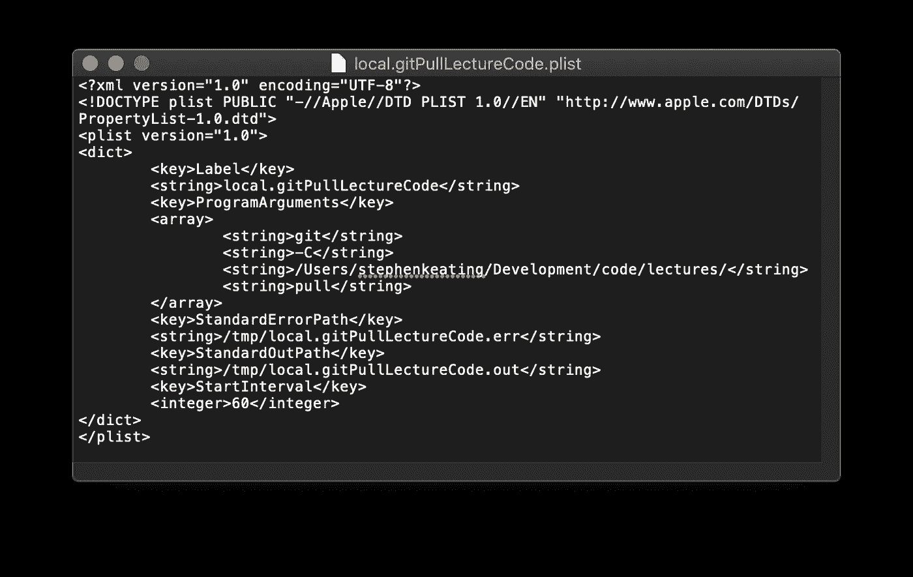

# 通过自动提取 Git 来节省时间

> 原文：<https://levelup.gitconnected.com/save-time-by-automating-your-git-pulls-498120870582>


照片由 [Unsplash](https://unsplash.com/s/photos/lazy?utm_source=unsplash&utm_medium=referral&utm_content=creditCopyText) 上的[霍尔格连杆](https://unsplash.com/@photoholgic?utm_source=unsplash&utm_medium=referral&utm_content=creditCopyText)拍摄

“饭桶拉！git 拉！饭桶拉！”

我喜欢懒惰是程序员的一种美德，所以当我发现自己一遍又一遍地在同一个 repo 上运行`**git pull**`命令时，我知道是时候自动化它了。在这篇文章中，我将回顾一些 git 基础知识，简要介绍 Mac 系统进程和 AppleScripts，最后解释我正在运行的实际脚本来自动执行 ***git pull*** s。哦，对了，最后还有一些额外的东西。在开始之前，这里有一个最终脚本的截图:



剧透警报！

## **为什么我又开始拉 *git 了？***

如果您忘记了您的 [git 基础知识](https://help.github.com/en/github/using-git/getting-changes-from-a-remote-repository)，一个`**git pull**` 命令将从远程存储库中获取内容，将其下载到您的本地机器，并与本地存储库合并，使其匹配。一个`**pull**`结合了一个`**fetch**` 命令和一个`**merge**`命令。

在我的例子中，我希望始终拥有来自 bootcamp 讲座的最新代码，并且讲师将代码发布到 GitHub repo。因为我克隆了回购协议(提醒:如果你已经[分叉](https://stackoverflow.com/questions/7057194/what-is-the-difference-between-forking-and-cloning-on-github)到我 Mac 上的一个文件夹，你将无法拉取更新)，我可以在每节课后进入[终端](https://www.imore.com/how-use-terminal-mac-when-you-have-no-idea-where-start)并`**git pull**`新代码。首先，我会将`**cd**`放入正确的目录，每次都冗长地写出完整的路径，最后才运行 pull 命令。但是，如果在 git 命令中添加-C [标志](https://stackoverflow.com/questions/5083224/git-pull-while-not-in-a-git-directory)，就可以从任何地方更新 repo。在我看来是这样的:

```
git -C /Users/stephenkeating/Development/code/lectures/ pull
```

太棒了。现在，只要我知道 repo 中有新的讲座代码，我就可以在终端的任何目录中键入这个命令来获取新代码。我已经在节省时间了。但是我真的很懒。我不想每次都打开终端输入这个。输入 AppleScripts。

## [**信任流程**](https://www.youtube.com/watch?v=X65BifFVI1E) **。翻转 AppleScript。**

> [进程是在 Mac 上运行的程序。进程可以是 app，macOS 使用的系统应用，也可以是不可见的后台进程。](https://support.apple.com/guide/activity-monitor/view-information-about-processes-actmntr1001/mac)

事情就要深入到这里了，如果你不在乎了解细节，可以跳到下一节。此外，完全披露:在一位朋友建议我考虑使用系统过程之前，我尝试了多种自动化策略(T21)。

如果你不熟悉系统进程，只需在 Mac 上打开[活动监视器](https://support.apple.com/en-us/HT201464)(在应用程序/实用程序文件夹中)，你就能学到很多东西。你会看到所有的东西都在你的电脑后台运行。(免费提示:如果你的 Mac 开始运行缓慢，请记住活动监视器是一个有用的应用程序:启动它查看并杀死 CPU/内存猪。)正如你在 Activity Monitor 中看到的，各种各样的东西都在你的 Mac 上后台运行。开始退出你不理解的系统进程通常是一个非常糟糕的主意，但是我们所做的只是增加一个小的。

我们将编写一个由名为 [**launchd**](https://en.wikipedia.org/wiki/Launchdhttps://en.wikipedia.org/wiki/Launchd) 的系统进程启动的脚本。如果你读了[这篇](https://www.launchd.info/)关于`**launchd**`的精彩描述，你可以找到关于计算机守护进程和代理的所有信息，但是对于我们的目的，你需要知道的是我们将在**中编写一个脚本。列出将由`**launchctl**`启动并由`**launchd**`执行的**文件。我强烈建议在继续之前阅读这些终端命令的手册。在您的终端中键入:

```
man launchd
```

然后:

```
man launchctl
```

这提供了所有有趣的信息(阅读完手册后，按`q`退出)。顺便说一句，这适用于大多数终端命令。

## **说够了，走吧！**

所有这些都可以在没有任何特殊工具的情况下完成，但如果你正在寻找一个管理系统进程的应用程序，请查看 [LaunchControl](https://www.soma-zone.com/LaunchControl/) 。不管怎样，我们开始吧:打开你的代码编辑器，在这个路径下创建一个`.plist`文件:

```
/Users/stephenkeating/Library/LaunchAgents/
```

很可能你的用户名和我的不一样，所以你必须修改`/Users`后面的位。另外，Library 文件夹通常是隐藏的，所以[请到这里](https://appleinsider.com/articles/18/07/27/how-to-see-hidden-files-and-folders-in-macos)寻求在 Finder 或终端中查看隐藏文件夹的帮助。将您的文件命名为:

```
local.gitPullLectureCode.plist
```

最后，下面是我的 plist 文件中的完整代码(你看到了上面的截图):

让我们逐一检查这里的重要部分。

## **标签:**

```
<key>Label</key>
<string>local.gitPullLectureCode</string>
```

这给了我们的进程一个名字，所以当我们在终端或活动监视器中查看所有进程时，我们可以识别它。按照[惯例](https://www.launchd.info/)，域名以反向域名符号书写，带有。私有代理的本地域。

## **论据:**

```
<key>ProgramArguments</key>
 <array>
  <string>git</string>
  <string>-C</string>
  <string>/Users/stephenkeating/Development/code/lectures/</string>
  <string>pull</string>
 </array>
```

鹰眼会从上面注意到我们的 git 命令，只是切碎了一点。这里需要修改的行是:

```
/Users/stephenkeating/Development/code/lectures/
```

此路径必须是您克隆了要提取的存储库的文件夹。运行以下命令进行测试:

```
git -C /Users/yourUserName/yourFolder/yourFolder pull
```

如果您收到一条消息，上面写着“已经是最新的”，那么您就知道您选择了正确的路径。或者“更新……”(不起作用？别担心。最后一个 github [操作链接](https://help.github.com/en/github/creating-cloning-and-archiving-repositories/cloning-a-repository)。

## **日志:**

如果您愿意，您实际上可以省略它，但是这几行代码会创建一个日志，您可以查看您的进程运行情况:

```
<key>StandardErrorPath</key>
 <string>/tmp/local.gitPullLectureCode.err</string>
 <key>StandardOutPath</key>
 <string>/tmp/local.gitPullLectureCode.out</string>
```

## **定时器:**

这部分很辣，很可定制:

```
<key>StartInterval</key>
 <integer>60</integer>
```

参考我们的 [launchd 信息](https://www.launchd.info/)，您可以看到 StartInterval 每隔 *n* 秒运行一次作业。我把我的调到 60 了。换句话说，这个脚本每 60 秒在后台运行一次。你可以把你的改成你想要的，但是因为这几乎不消耗 CPU，我希望它每分钟都运行——我需要我的更新！另一个[选项](https://www.maketecheasier.com/use-launchd-run-scripts-on-schedule-macos/)是让你的脚本在特定的时间间隔运行。

就是这样！如果您已经正确地设置了一切，您的脚本将在您下次登录时自动加载并开始运行。如果您想立即启动它，可以在终端中键入以下内容:

```
launchctl load ~/Library/LaunchAgents/local.gitPullLectureCode.plist
```

你完了！享受自动 git 拉！

当有一天你不再需要这些更新时，只需删除。plist 文件。简单。

拉里·戴维知道发生了什么。

## **但是等等，还有更多！**

好了，我们的脚本正在运行，每 60 秒就会发生一次 git 拉取。非常非常好。不过，我答应给你奖金。

你看，我不仅想让这些更新为我完成，我还想在它们发生时被告知。让我们使用 Mac 的[文件夹动作](https://developer.apple.com/library/archive/documentation/AppleScript/Conceptual/AppleScriptLangGuide/reference/ASLR_folder_actions.html)来设置每当添加文件时的通知。在 Finder 中，导航到您的存储库的本地副本。右击文件夹名称，选择**文件夹动作设置**。选择**运行服务**，选择**添加新项目提醒**。请确保启用文件夹操作，现在您将看到每当添加文件或文件夹时都会收到通知。特别辣。您可以通过再次右键单击文件夹名称并删除操作来关闭这些功能。

## **资源**

代码:

*   [https://gist . github . com/Stephen keating/6 fc 8 c 382 EFC 8 C1 FDD 54995 e 16 b 10019 e](https://gist.github.com/stephenkeating/6fc8c382efc8c1fdd54995e16b10019e)

Github 帮助:

*   [https://help . github . com/en/github/using-git/getting-changes-from-a-remote-repository](https://help.github.com/en/github/using-git/getting-changes-from-a-remote-repository)
*   [https://stack overflow . com/questions/7057194/forking-and-cloning-on-github 有什么区别](https://stackoverflow.com/questions/7057194/what-is-the-difference-between-forking-and-cloning-on-github)
*   [https://help . github . com/en/github/creating-cloning-and-archiving-repositories/cloning-a-repository](https://help.github.com/en/github/creating-cloning-and-archiving-repositories/cloning-a-repository)

Mac 资源—终端和系统进程:

*   [https://www . imore . com/how-use-terminal-MAC-when-you-have-no-idea-where-start](https://www.imore.com/how-use-terminal-mac-when-you-have-no-idea-where-start)
*   [https://support.apple.com/en-us/HT201464](https://support.apple.com/en-us/HT201464)
*   [https://support . apple . com/guide/activity-monitor/view-information-about-processes-actm NTR 1001/MAC](https://support.apple.com/guide/activity-monitor/view-information-about-processes-actmntr1001/mac)
*   [https://en . Wikipedia . org/wiki/Launchdhttps://en . Wikipedia . org/wiki/Launchd](https://en.wikipedia.org/wiki/Launchdhttps://en.wikipedia.org/wiki/Launchd)
*   [https://www.launchd.info/](https://www.launchd.info/)
*   [https://appleinsider . com/articles/18/07/27/how-to-see-hidden-files-and-folders-in-MAC OS](https://appleinsider.com/articles/18/07/27/how-to-see-hidden-files-and-folders-in-macos)
*   [https://www . maketecheasy . com/use-launchd-run-scripts-on-schedule-MAC OS/](https://www.maketecheasier.com/use-launchd-run-scripts-on-schedule-macos/)
*   [https://developer . apple . com/library/archive/documentation/AppleScript/Conceptual/AppleScriptLangGuide/reference/ASLR _ 文件夹 _ 动作. html](https://developer.apple.com/library/archive/documentation/AppleScript/Conceptual/AppleScriptLangGuide/reference/ASLR_folder_actions.html)

启动控制(管理系统进程的应用程序)

*   [https://www.soma-zone.com/LaunchControl/](https://www.soma-zone.com/LaunchControl/)