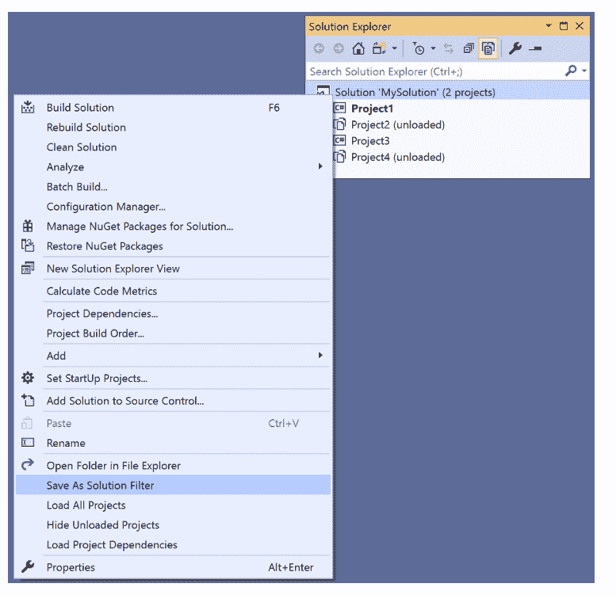
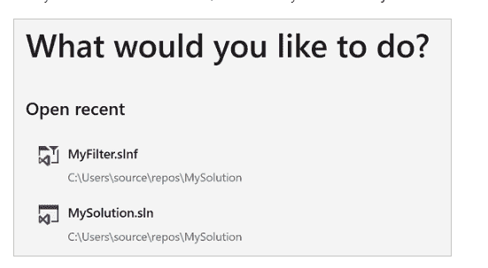

# 使用 Visual Studio 解决方案筛选器节省时间

> 原文：<https://levelup.gitconnected.com/save-time-with-visual-studio-solution-filters-9f475e59aec7>

Visual Studio 2019 引入了一个名为 Solution Filters 的新功能，其背后的想法是如果你不打算使用整个解决方案，可以加快解决方案的加载速度。

如果您只打算在解决方案的几个项目中使用文件，您可以保存解决方案的筛选版本，这样当您启动 Visual Studio 时它会打开得更快。

可视化工作室

我在目前正在开发的一个相当大的解决方案上测试了它，看看它节省了多少时间。继续读下去看看结果吧！

# 它是如何工作的？

这里有一个来自[文档](https://docs.microsoft.com/en-us/visualstudio/ide/filtered-solutions?view=vs-2022)的截图，显示了如何将解决方案保存为过滤后的解决方案。您只需卸载不需要的项目，并选择保存为过滤后的解决方案。

保存解决方案过滤器

这将在目录中创建一个新的解决方案筛选器文件，您可以在启动 Visual Studio 时选择打开该文件。当您再次打开 Visual Studio 时，新筛选的解决方案也会出现在您最近打开的列表中。

使用筛选的解决方案启动 Visual Studio 屏幕

您团队中的所有开发人员都可以使用它，而且它非常容易安装——我没有遇到任何问题。

# 它能加快速度吗？

我将用我正在开发的代码库来测试这一点。我已经准备好秒表，看看解决方案过滤器能让事情加快多少。

我选择在我的笔记本电脑上打开解决方案，而不是在我的虚拟机上，因为它慢得多，也许我会看到更明显的结果。

## 以前

首先，我要测试打开未过滤的解决方案(29 个项目)需要多长时间…开始吧…！！！！

哇，花了很长时间… 01:14.33！

1 分 15 秒的等待时间。让我们看看我们能不能把它弄下来！

## 在...之后

对，我已经应用了我的解决方案过滤器，所以我正在加载 9 个项目来处理应用程序的一部分，而不是原来的 29 个…秒表再次打开…

哦，那快多了… 00:23.57。节省了我 50 秒！可爱！

# 结论

当您处理解决方案的不同部分，并且不需要所有项目时，解决方案筛选器是一种加快 Visual Studio 速度的好方法。

您和您的团队只需从 Visual Studio 的启动屏幕打开您的解决方案筛选器，就可以每天为您节省 50 秒的宝贵时间。结果！