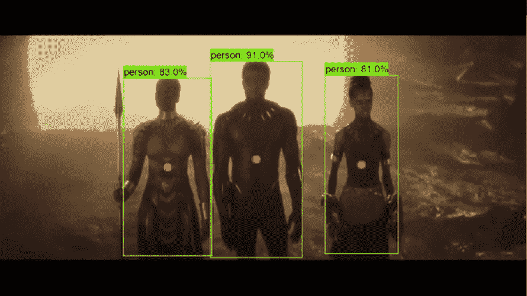
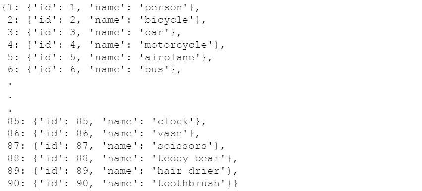

# 使用 TensorFlow 保存来自对象检测器的图像

> 原文：<https://levelup.gitconnected.com/saving-images-from-an-object-detector-using-tensorflow-3f2d058568ba>

## 了解如何使用 TensorFlow 对象检测 API 构建对象跟踪器，并保存您喜欢的对象类型的图像



# 介绍

在本文中，我将使用 [TensorFlow 对象检测 API](https://github.com/tensorflow/models/tree/master/research/object_detection) ，它使用预训练的卷积神经网络并执行对象检测。有几个[预先训练好的 CNN 模型](https://github.com/tensorflow/models/blob/master/research/object_detection/g3doc/detection_model_zoo.md#coco-trained-models)是从 API 给我们的，基于地图(平均平均精度)评级。在本教程中，我将使用`[**ssd_mobilenet_v1_coco**](http://download.tensorflow.org/models/object_detection/ssd_mobilenet_v1_coco_2018_01_28.tar.gz)` 模型。它是最快的，但与其他方法相比，它的准确性较低。

> 可选-如果你有一个好的 GPU，尝试一个更高的地图值 CNN 模型

现在，我们将继续讨论 TensorFlow 对象检测 API 的配置部分:

1.  下载 API(克隆或以 zip 格式下载)——[***点击此处***](https://github.com/tensorflow/models)
2.  安装所有需要的依赖项— [***点击这里***](https://github.com/tensorflow/models/blob/master/research/object_detection/g3doc/installation.md)
3.  从这里下载我的代码— [***点击这里***](https://github.com/ravindu9701/Object-Detection)
4.  现在复制第三步**中的所有文件，粘贴到第一步**目录`models-master/research`****
5.  ***然后我们必须编译`models-master/research/object_detection`中的`.protos`文件，为此，您需要打开`models-master/research`目录中的命令提示符并运行以下代码片段***

```
***for /f %i in ('dir /b object_detection\protos\*.proto') do protoc object_detection\protos\%i --python_out=.***
```

## ***现在一切都设置好了，让我们检查一下代码***

***下面的函数用于加载模型。如果你是第一次运行，模型会自动下载。***

***这部分代码，我已经定义了我们需要使用的模型版本，并将其传递给`load_model`函数。***

***在这部分代码中，首先我将图像从 BRG 颜色模型转换为 RGB 颜色模型。因为`ssd_mobilenet_v1_coc_2017_11_11`使用了 BRG 颜色模型。转换后的图像将传递给`person_detect`函数。***

***`output_dict`由 TensorFlow 对象检测 API 在一张图片通过时给出。这个 output_dict 主要包含 3 个键。***

*   ***detection_scores —检测到的 100 个对象的精确度***
*   ***detection_classes —检测到的 100 个对象的类别 id***
*   ***detection _ boxes 检测到的 100 个对象的边界矩形的尺寸***

***了解了检测类别、方框和分数后，我们要做的是，当检测到一个人时，我们要在检测到的人的边框中间打印一个红点，并将该图像保存在一个文件夹中。我们可以这样写这个函数，***

******

***类别 id***

***最后，我们将从您的网络摄像头捕捉视频，并通过`while`循环逐帧运行。然后将所有图像传递给`show_inference`功能。***

***您也可以通过为`video=cv2.VideoCapture(r'**PATH**')`输入视频的路径来输入存储的视频***

> ***可选——您可以通过将 [DroidCam](https://www.dev47apps.com/) 应用程序下载到 PC 和手机上来使用您的手机摄像头。然后改变`cv2.VideoCapture(1)`***

## ***下面是完整的代码。***

# ***结论***

***大多数物体探测器都是用 YOLO 制造的。这是构建对象检测器的另一种方法。文章到此为止。希望对某个人有用。谢谢，注意安全！***

## ***资源***

***[](https://github.com/ravindu9701/Object-Detection.git) [## ravindu 9701/对象检测

### 在 GitHub 上创建一个帐户，为 ravindu 9701/对象检测开发做出贡献。

github.com](https://github.com/ravindu9701/Object-Detection.git)***