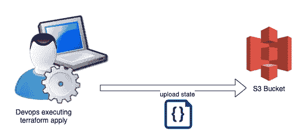
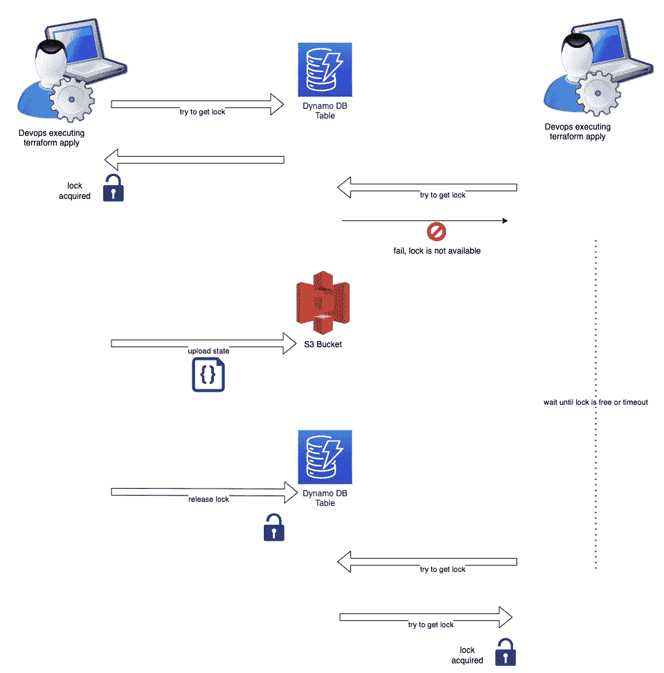

# 在线保存地形状态

> 原文：<https://levelup.gitconnected.com/saving-terraform-state-online-dd61d613b5d9>

## 教程-使用 S3 作为地形状态的后端


图片来自 [Pixabay](https://pixabay.com//?utm_source=link-attribution&amp;utm_medium=referral&amp;utm_campaign=image&amp;utm_content=4004268) 的 [Christel](https://pixabay.com/users/indirafoto-11470024/?utm_source=link-attribution&amp;utm_medium=referral&amp;utm_campaign=image&amp;utm_content=4004268)

# 介绍

在 [Mixlr](https://www.mixlr.com/) ，我们使用 [Terraform](https://www.terraform.io/) 作为我们选择的工具来声明性地定义我们的基础设施。这是我们的 IaC 工具。它允许我们部署到任何云提供商，并保持对我们的虚拟和物理基础架构中的任何变化和发展的控制。

Terraform 处理定义文件，通常是`main.tf`，将其内容应用到我们的基础设施，并生成另一个工件作为输出，通常是`terraform.tfstate`，这是它的当前状态。

默认情况下，开发人员运行命令后，状态文件保存在本地:

```
$ terraform apply
```

然而，这种*本地*持久性不适合在分布式团队中工作，因为许多 devops 工程师在同一基础设施上并行工作。他们需要有一种方法来共享`terraform.tfstate`文件，顺便说一下，该文件不应该存储在`git`存储库中。

这篇博客文章是一篇教程类型的文章，它将向你展示如何将`terraform.tfstate`文件保存在一个远程且安全的地方，在那里你的团队的所有成员都可以访问它。

# 体系结构

在我们看到实际的地形定义文件之前，让我们看一个问题解决方案的示意图。



正在将状态上传到 S3 存储桶

从上图可以看出，当工程师`applies`定义地形时，最后，状态被保存到 AWS S3 桶，而不是本地。

为了让这个架构正确运行，当多个开发人员同时处理同一个 terraform repo 时，需要确保没有两个开发人员可以同时改变 S3 存储桶的内容。

这种并发控制是通过使用基于 AWS DynamoDB 表的分布式锁实现的，如下图所示:



用于并发控制的 DynamoDB 表

从上图可以看出，terraform 的设置是这样配置的，当一个开发人员试图`*apply*`时，它首先需要在 DynamoDB 表上获取一个锁。如果锁不可用，这意味着另一个开发人员已经获取了它，并正在更新 S3 桶中的 terraform 状态。如果锁是自由的，那么`apply`命令毫无问题地继续执行，最后，具有地形状态的 S3 桶被更新，锁被释放。

# 两个 Terraform 配置文件

我们需要 2 个地形配置文件:

1.  `backend_state/backend-state.tf`
2.  `main.tf`

## S3 铲斗和测功机工作台的配置(`backend_state/backend-state.tf`

此文件(`backend-state.tf`)将描述用于锁定的 S3 桶和 DynamoDB 表。我们在名为`backend_state`的文件夹中创建它。

*文件:backend-state.tf*

S3 铲斗和测功机工作台的地形配置

我们希望您注意以下几点:

*   第 12–15 行:您需要提供正确的 AWS 概要文件名称。这是您在本地使用凭据设置的配置文件，允许您访问您的 AWS 帐户。
*   第 13 行:给你的桶一个唯一的名字。
*   第 26–29 行:确保桶受到私有 acl 的保护。
*   第 31–36 行:启用时段版本控制。因此，如果开发人员提交了一个需要恢复的状态，回到以前的版本会容易得多。
*   第 39 行:为 DynamoDB 表选择一个惟一的名称。
*   第 40 行和第 42–45 行:散列键需要是`LockID`。其他值不起作用。类型应该是`S`，即字符串类型。
*   第 41 行:我建议计费模式为`PAY_PER_REQUEST`，因为这个表不会连续使用。

应用后端状态地形配置:

准备好`backend_state/backend-state.tf`文件后，您需要应用它:

```
$ terraform -chdir=./backend_state apply
```

现在，您已经准备好获取您的`main.tf`文件，该文件将使用之前创建的后端进行状态存储。

## 主要配置

下面是一个使用分布式后端的`main.tf`文件的例子:

使用分布式后端进行状态存储的地形配置

上面的配置创建了一个 EC2 实例。不过，重点在于第 2 行和第 8 行之间的`backend`声明。后端是`"s3"`，它声明了 bucket 和 dynamodb 表，该表用于对状态变化进行并发控制。

# 结束语

这是一篇教程类型的帖子，教你如何使用 AWS S3 后端作为 terraform 状态存储。

我希望它对你有用。但是，我从你身上学到的总是比你从我身上学到的多。因此，我们非常欢迎您的评论。

谢谢你，下一篇文章再见。

***注:*** *本帖原载于 Mixlr* [*此处*](https://blog.mixlr.com/2022/11/engineering-tutorial-saving-terraform-state-online/?utm_source=medium&utm_medium=blog_post&utm_campaign=panos_matsinopoulos_saving_terraform_state_online) *。*