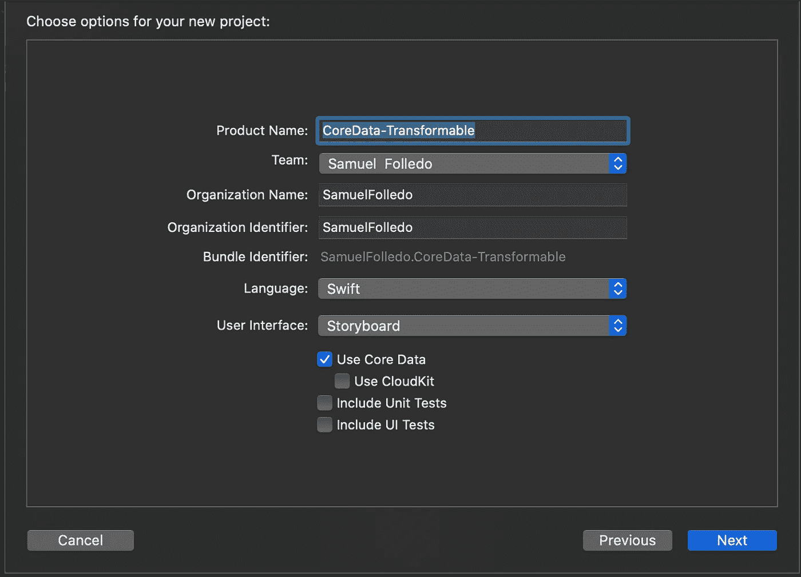
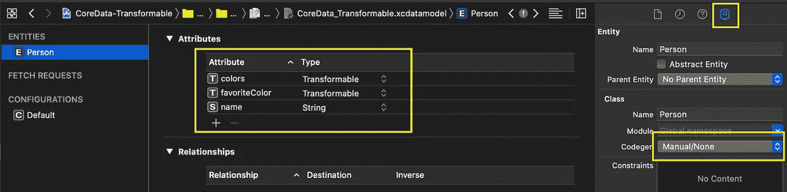
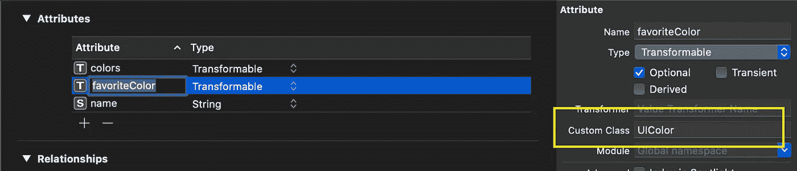
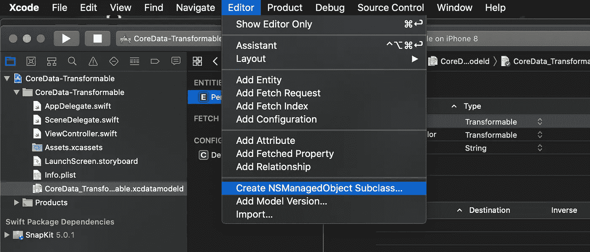
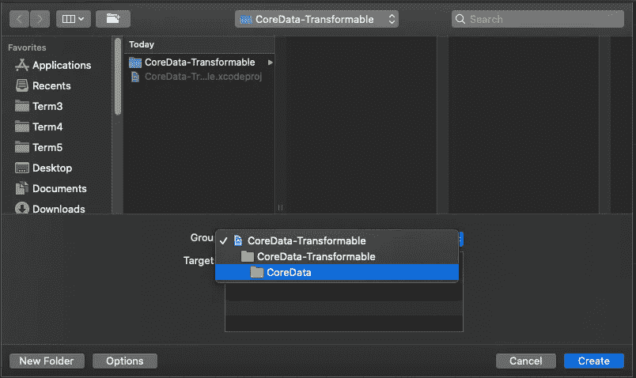
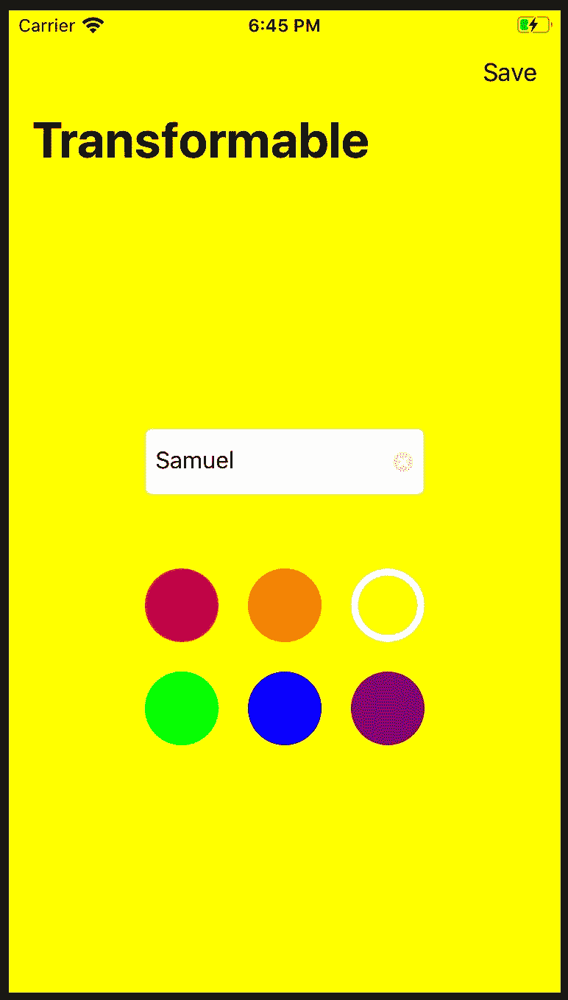
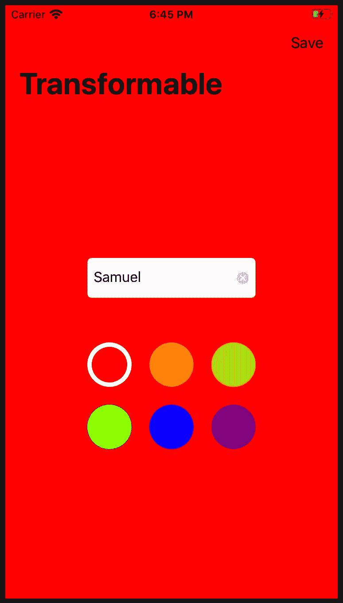

# 使用 Transformable 在 CoreData 中保存 UIColor 和 Array

> 原文：<https://levelup.gitconnected.com/saving-uicolor-and-array-in-coredata-using-transformable-4fb906d0a553>

哦，那么你已经在 Swift 中编写代码有一段时间了，你觉得自己就像拥有所有知识的绿巨人？您可能有过使用 UserDefaults、Keychain 或 flex worthy 持久存储(如文件系统)来持久存储数据的经验。然后你开始拿起 CoreData，应该很容易吧？然后你发现你是绿巨人试图捡起雷神之锤。

关于漫威的介绍已经够多了，让我们开始吧。

# 入门指南

首先创建一个项目。完整的源代码请点击[这里](https://github.com/SamuelFolledo/CoreData-Transformable)



## xcdatamodeld

Xcode 为我们名为`xcodeProjectName.xcdatamodeld`的 CoreData 文件提供了一个漂亮的可视化效果。现在让我们通过点击`+`来添加一个人实体，并添加如下所示的属性。



同样，点击人员实体→数据模型检查器→ Codegen，更改为**手动/无**。因为我们将自己定制这是一个非常常见的做法。

# 可变形的

核心数据允许我们存储整数、布尔值、字符串、UUID、日期等。但有时我们希望存储特定的数据类型，如 UIColor、UIImage、我们自己的类、struct 或 enum，甚至数组，但这根本不是属性类型中的选项。

向**可转换的**属性类型问好，它允许我们将自定义数据类型存储为实体记录的声明属性的对象。唯一的要求是我们的自定义类型应该符合 **NSCoding** 或者我们需要提供一个**自定义值转换器**。

> [当您将一个属性声明为](https://www.kairadiagne.com/2020/01/13/nssecurecoding-and-transformable-properties-in-core-data.html#:~:text=and%20object%20serialization.-,Transformable%20properties,by%20creating%20a%20Transformable%20property.) `[Transformable](https://www.kairadiagne.com/2020/01/13/nssecurecoding-and-transformable-properties-in-core-data.html#:~:text=and%20object%20serialization.-,Transformable%20properties,by%20creating%20a%20Transformable%20property.)` [时，核心数据会将您的自定义数据类型转换为二进制](https://www.kairadiagne.com/2020/01/13/nssecurecoding-and-transformable-properties-in-core-data.html#:~:text=and%20object%20serialization.-,Transformable%20properties,by%20creating%20a%20Transformable%20property.) `[Data](https://www.kairadiagne.com/2020/01/13/nssecurecoding-and-transformable-properties-in-core-data.html#:~:text=and%20object%20serialization.-,Transformable%20properties,by%20creating%20a%20Transformable%20property.)` [，并在保存到持久存储时将其转换回您的自定义数据类型。它通过一个价值转换器来实现这一点。](https://www.kairadiagne.com/2020/01/13/nssecurecoding-and-transformable-properties-in-core-data.html#:~:text=and%20object%20serialization.-,Transformable%20properties,by%20creating%20a%20Transformable%20property.)

这是一个非常有用的特性，但是我们必须小心使用它，特别是当我们使用可变类型作为可转换属性的值时。欲了解更多信息，请阅读这篇[文章](https://medium.com/@rohanbhale/hazards-of-using-mutable-types-as-transformable-attributes-in-core-data-2c95cdc27088)。

您可以选择在这里指定您的属性的`Custom Class`，或者它将默认为 NSObject，当然，一旦我们创建了自己的 NSManagedObject，我们就可以更改它。



# 正在创建 NSManagedObject

让我们通过单击选项卡编辑器→创建 NSManagedObject 子类来创建我们的 NSManagedObject…



确保选择了我们的数据模型并单击 Next，然后确保选择了我们的 Person 实体并单击 Next。指定要存储这些新文件的组目录，然后单击创建。



这将为我们创建两个文件`Person+CoreDataClass.swift`和`Person+CoreDataProperties.swift`。现在转到`Person+CoreDataProperties.swift`文件，你会看到 favoriteColor 是 UIColor 类型，因为我们指定了它，但是 colors 是 NSObject 类型。确保您的`Person+CoreDataProperties.swift`文件看起来像这样…

```
**import** Foundation
**import** CoreData
**import** UIKit.UIColor //add this**extension** Person {
   **@nonobjc** **public** **class** **func** fetchRequest() -> NSFetchRequest<Person> {
      **return** NSFetchRequest<Person>(entityName: “Person”)
   }
   **@NSManaged** **public** **var** colors: [UIColor]? //update NSObject? to [UIColor]?
   **@NSManaged** **public** **var** favoriteColor: UIColor?
   **@NSManaged** **public** **var** name: String?
}
```

就像我之前提到的，我们可以通过将`color`的数据类型改为【UIColor】来更新这些，并且不要忘记导入 UIKit 的 UIColor。

## CoreDataStack

复制这个简单的 CoreDataStack

```
**import** Foundation
**import** CoreData**class** CoreDataStack {
   **private** **let** modelName: String
   **init**(modelName: String) {
      **self**.modelName = modelName
   } **lazy** **var** mainContext: NSManagedObjectContext = {
      **return** **self**.storeContainer.viewContext
   }()
   **private** **lazy** **var** storeContainer: NSPersistentContainer = {
      **let** container = NSPersistentContainer(name: **self**.modelName)
      container.loadPersistentStores { (storeDescription, error) **in
         if** **let** error = error **as** NSError? {
            print("Unresolved error \(error), \(error.userInfo)")
         }
      }
      **return** container
   }()
}// MARK: **Internal
extension** CoreDataStack {
   **func** saveContext () {
      **guard** mainContext.hasChanges **else** { **return** }
      **do** {
         **try** mainContext.save()
      } **catch** **let** nserror **as** NSError {
         fatalError("Unresolved error \(nserror), \(nserror.userInfo)")
      }
   }
}
```

最后，像平常一样加载和保存…

```
**func** loadPerson() {
   **let** personFetchRequest: NSFetchRequest<Person> = Person.fetchRequest() //make a Person Entity fetch request
   **do** {
      **let** results = **try** coreDataStack.mainContext.fetch(personFetchRequest)
      **if** results.count > 0 { //found a person
         person = results.first
      } **else** { //no person found
         person = Person(context: coreDataStack.mainContext)
         coreDataStack.saveContext()
      }
   } **catch** **let** error **as** NSError {
   print("Error: \(error) description: \(error.userInfo)")
   }
}**func** handleSavePerson() {
   **guard** **let** name = nameTextField.text, !name.isEmpty **else** { **return** }
   person!.name = name
   person!.colors = [.red, .orange, .yellow, .green, .blue, .purple]
   person!.favoriteColor = person!.favoriteColor
   //save the managed object context
   **do** {
      **try** coreDataStack.mainContext.save()
   } **catch** **let** error **as** NSError {
      print("Error: \(error), description: \(error.userInfo)")
   }
}
```

就是这样！背景应该是白色的第一次运行应用程序。此外，输入姓名、选择颜色并单击保存将会更新 CoreData 中此人的属性。重新运行应用程序，你会在文本栏上看到你的名字，背景颜色也不会改变。



作为一个额外的挑战，尝试在 CoreData 中存储一个 UIImage，当然是可转换的。您可以在这里找到源代码。

享受编码！😁

外部链接

*   [核心数据中的 NSSecureCoding 和 transformable 属性](https://www.kairadiagne.com/2020/01/13/nssecurecoding-and-transformable-properties-in-core-data.html#:~:text=and%20object%20serialization.-,Transformable%20properties,by%20creating%20a%20Transformable%20property.)
*   [在核心数据中使用可变类型作为可转换属性的危害](https://medium.com/@rohanbhale/hazards-of-using-mutable-types-as-transformable-attributes-in-core-data-2c95cdc27088)
*   [完整源代码](https://github.com/SamuelFolledo/CoreData-Transformable)
*   [我的制作学校作品集](https://www.makeschool.com/portfolio/samuelfolledo)