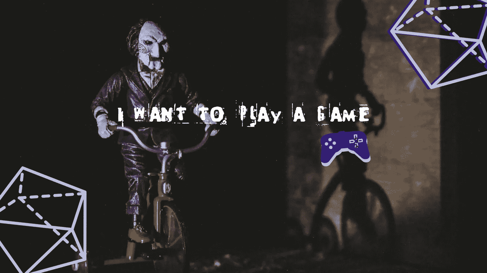
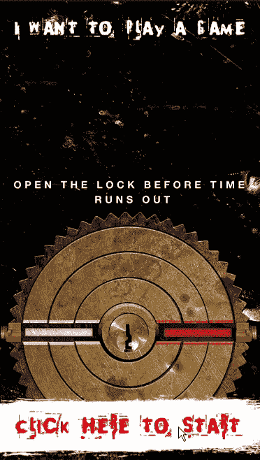
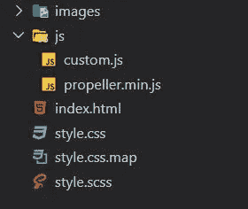

# 使用 JavaScript、HTML 和 CSS 的螺旋桨游戏

> 原文：<https://levelup.gitconnected.com/saw-inspired-game-using-javascript-html-and-css-69ccc650d86c>



创建游戏是如此简单，每个人都可以做到。让我们使用 JavaScript、HTML 和 CSS 创建一个基于“电锯惊魂”电影主题的交互式游戏。我们不会使用画布元素来构建游戏。我们将使用 [Propeller](https://github.com/PixelsCommander/Propeller) JavaScript 库。你可以查看[我之前的故事](/rotate-elements-using-javascript-db5e0bcd3927)来学习如何使用推进器库。

这是我们将要制作的游戏演示:



如果你想玩游戏——[，点击这里。](https://webisora.github.io/saw-movie-themed-game/)

## **怎么玩？**

只需单击或点击“单击此处开始”区域。游戏开始时，圆形刀片内部的三个凹槽会随机改变位置。您将有 10 秒钟的时间将所有凹槽与水平标记对齐，如上面的演示所示。您可以按任何顺序对齐凹槽。

## 最终项目结构



## 让我们从 HTML 开始

## 使用 SCSS 添加样式

上面的 HTML 和 SCSS 将确保所有的元素都为游戏完美定位。

## Java Script 语言

对于外面的圆形刀片，我们不断旋转它，这样游戏看起来会很酷。

```
const bladeRotation = new Propeller(edge, { inertia: 1, speed: 1 });
```

当游戏开始时，对于每个圆形凹槽，我们分配一个随机位置，并确保它不会是最终的正确位置。当旋转凹槽时，如果玩家将其旋转到正确的位置，它会添加发光效果。当旋转停止时，我们检查是否所有的凹槽都在正确的位置。如果所有的凹槽都对准正确的位置，那么玩家获胜。

```
let circle1Rotation = customPropeller("circle-1");
let circle2Rotation = customPropeller("circle-2");
let circle3Rotation = customPropeller("circle-3");function customPropeller(element) {
 let el = geid(element);return new Propeller(el, {
  angle: getRandomAngle(10, 170),
  inertia: 0,
  speed: 1,
  step: 10,
  stepTransitionTime: 100,
  stepTransitionEasing: "Linear",
  onRotate: function () {
   /* Add a glowing effect if the circle is in correct position */
   if (this.angle % 360 == 0 || this.angle == 0) {
    addClass(el, "glow");
   }
   else {
    removeClass(el, "glow");
   }
  },
  onDragStop: function () {
   checkIfUnlocked(this, element);
  },
 });
}
```

我鼓励你尝试玩这个游戏，并在 10 秒内完成。如果你想看完整的项目，可以在 [GitHub](https://github.com/webisora/saw-movie-themed-game) 上找到。通过分叉，您可以随意更改或创建自己的版本。

所有以“电锯惊魂”为主题的文本都是由 https://fontmeme.com/saw-font 创作的。非常感谢 Jon Wong 为我设计并提供了构建这个游戏的资源。