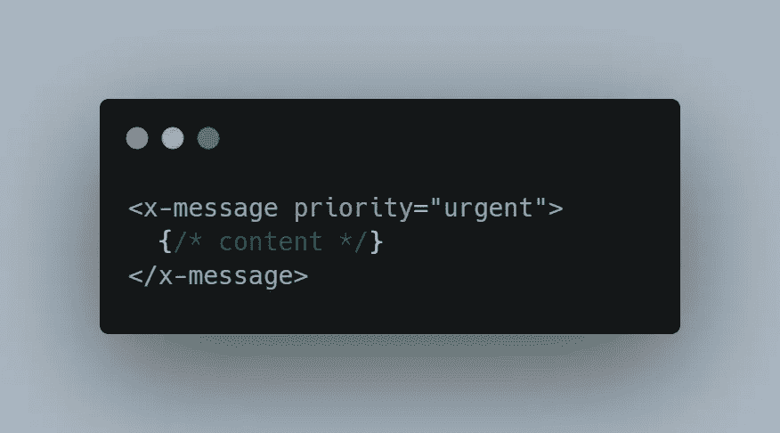

# SCAAR——CSS 的软件设计原则

> 原文：<https://levelup.gitconnected.com/scaar-software-design-principles-for-css-d503ab60672c>

## 写 CSS 不一定要很烦！

随着我越来越深入 CSS 的世界，我接触到了更多与我职业经历截然不同的开发人员的对话。看到对 CSS 的仇视我并不意外，但是当我得知很多高级开发者*对此并不在乎*时，我*却*措手不及。这似乎与区分低年级学生和高年级学生的其他因素不一致，其中最突出的区别是高年级学生更关心。

我一直致力于减少让编写 CSS 如此令人厌恶的常见问题。当这个话题出现时，开发人员似乎经常把这些问题想象成在没有任何第三方工具的情况下唯一的选择。因此，我觉得有必要记录我的过程，因为它似乎已经从这个行业中消失了。

SCAAR 是我为了传达这些原则而创造的一个名字，但它们并不是我必须发明的。为了方便起见，这实际上是几个想法的汇总。正如你可能猜到的，SCAAR 是一个缩写，它代表:

1.  审视
2.  (音乐)可设定的
3.  不可知论者
4.  原子的
5.  可重复使用的

# 1.审视

以强势开始，这可能是解决方案中最重要的部分。对 CSS 最常见的抱怨是覆盖和命名冲突的困难。那么什么是作用域 CSS 呢？

好吧，让我们从它*不是*开始，只是为了弄清楚。我说的作用域 CSS 并不是指像`.about-section h2`这样的嵌套选择器，或者如果你喜欢支持嵌套语法的预处理器:

这可能会达到一个模糊的类似结果，但它通常会导致麻烦。例如，如果你想在`.about-section`中嵌套另一个部分，你必须解决与里面的`h2`的冲突，因为级联。

您通常希望只选择您需要的特定元素，这样您就不必担心级联。这可以通过使用更具体的类名来选择`h2`来完成，例如使用 [BEM](https://getbem.com/naming/) : `.about-section__title`。

那么*就是*作用域 CSS 吗？*还没有！我们正在慢慢变得更好，但仍然不太理想，因为这个类名是在全球范围内公开定义的。如果要和 JavaScript 做个比较，这就是`window.myModule`和`import myModule from 'my-module'`的区别。那么我们怎样才能在 CSS 中实现对等呢？*

在 CSS 领域有点困难，但已经有人为此努力了。值得注意的是， [CSS 模块](https://github.com/css-modules/css-modules)允许你将 CSS 文件导入 JavaScript，而在幕后，它用 GUIDs 转换你的类名以避免命名冲突。

类似的结果可以通过各种 CSS-in-JS 库来实现，比如 [StyledComponents](https://styled-components.com/) 或 [Emotion](https://emotion.sh/docs/introduction) ，有些人更喜欢这些库，因为这样可以减少命名的数量，并且方便地将所有内容保存在一个文件中。*需要注意的是，这里有* [*利弊*](https://dev.to/srmagura/why-were-breaking-up-wiht-css-in-js-4g9b) *。香草精***包装或许是对这些反对意见的一个回答。**

*最后，一些框架使用了一种稍微不同的开箱即用策略，例如 [Vue](https://vue-loader.vuejs.org/guide/scoped-css.html) 和 [Angular](https://angular.io/guide/view-encapsulation) 。这种模拟作用域比 CSS 模块或 CSS-in-JS 稍弱，因为它不转换类名。相反，它为每个元素添加了一个惟一的属性，将`.heading`转换成类似于`.heading[_ngcontent-rsm-c42]`的东西。这留下了潜在的冲突，因为它也将继承级联的所有`.heading`风格。深度选择器和第三方样式表会让这变得特别危险。*

*所有这些都是*大概*范围的 CSS，因为通过正确的方法，命名冲突的机会可以减少到几乎为零——但它仍然不太完美，因为在全局级别定义的任何东西仍然可以最终选择你的标记。命名约定不能完全保护你的标记不被其他东西选中。*

*那么如何保护我们的标记不继承不需要的样式呢？幸运的是有一个解决方案，而且为了使事情变得更加方便，它完全是本地的。使用一种叫做[影子 DOM](https://developer.mozilla.org/en-US/docs/Web/Web_Components/Using_shadow_DOM) 的东西，我们可以*真正地*确定 CSS 的范围，这样就不会有全局选择器影响内部的标记，也不会有内部的选择器影响外部的标记。这意味着您不必担心在您面前的文件之外的任何地方遇到或产生冲突。*

*当然，web 组件有一些[成长的烦恼](https://space.matthewphillips.info/posts/where-web-components-went-wrong/)需要解决，但是有[工具来解决缺失的部分](https://www.youtube.com/watch?v=p0wDUK0Z5Nw)。影子 DOM 也可以在组件之外使用，最终，[声明式影子 DOM](https://web.dev/declarative-shadow-dom/) 也将是一个可行的选择。另外，值得注意的是一些框架([像 Angular](https://angular.io/api/core/ViewEncapsulation#ShadowDom) )允许你在幕后使用 shadow DOM。*

*为了保持这篇文章的重点，我将避免跑题，但我鼓励您自己调查风险和收益，也许我会写另一篇文章来更详细地探讨这个主题！我将在这里提出另外一点:*

> *问题存在并不意味着它们不值得解决。*

# *2.(音乐)可设定的*

*范围界定很好，但这只是等式的一部分。大多数情况下，样式将被限定在每个组件中，无论是 React、web 组件还是其他什么。重要的是使它们可以组合，以避免重复的样式。*

*下次创作需要多种布局的组件时，请记住这一点。一个很好的例子可能是一种产品:*

**

*上面的 JSX 表明有一些逻辑来决定基于视图的输出。你可能已经听过很多次了，在你的模板中尽可能的避免逻辑是有好处的，所以这些最好作为完全独立的组件。*

**

*…但是由于它们确实有一些共同的风格，这就出现了重复的问题。为了纠正这一点，您应该将共享的 CSS 提取到第三个组件中，并在两个组件的模板中重用。*

**

*这确保了所有样式只定义一次，模板中没有多余的逻辑。*

# *3.不可知论者*

*另一个有用的实践是保持选择器不受 HTML 语义和结构的影响。*

*回到前面的例子，`.about-section h2`依赖于以特定方式嵌套的标题。看看下面的代码片段，使用 shadow DOM 来确定范围。*

*将`section > h2`写在你的 CSS 中:*

**

*如果您决定稍后重新排列您的标记，您将需要重新访问这个 CSS。*

*现在是`section > header > h2`:*

**

*然而，有了像`h2`这样的直接选择器，你可以不受限制地自由重新排列。*

*然而，在这种情况下，最好使用一个类名，这样标签`<h2>`就可以自由地更改为`<h1>`或任何其他标题级别。这样做将可访问性特性和 SEO 从美学中分离出来。当在`<a>`和`<button>`或者任意数量的类似表单控件之间共享样式时，这同样有价值。*

# *4.原子的*

*当考虑防止特殊性问题和重复的最佳方式时，最好尽可能地缩小每个范围。让我们再来看看前面代码片段的标记。我们可能会将那个组件分解成许多更小的组件。*

*`<x-heading>`模板，假设`const Heading = `h${h}``:*

**

*`<x-section>`模板:*

**

*`<x-page-section>`模板:*

**

*关于页面模板:*

**

*现在“关于”页面与样式无关，部分模板更加可组合，标题组件可以在许多地方重用*和*它是不可知的，因此它可以被赋予不同的语义，但在视觉上保持一致。这符合前面概述的所有原则，但这一次，我们将重点关注原子范围的好处。*

*现在每个部分都被分离了，每个部分都有一个小模板，我们已经有效地消除了特异性冲突的危险。不仅如此，每个组件现在都足够专注于:*

1.  *减轻理解每个组件所需的认知负担*
2.  *减少变更的影响(这应该让您的风险管理团队感到高兴！)*
3.  *保持所有内容在屏幕上方便可见，没有滚动条或多个文件*

*你可能会担心这会导致文件混乱，但是根据我的经验，很少会出现这种情况。一个网站只需要这么多组件，你可能会发现它没有你想象的那么强大。另外，在编辑器中使用键盘快捷键可以很容易地找到您要找的文件。*

# *5.可重复使用的*

*尽管前面提到的几点应该有助于提高可重用性，但是我们可以采取额外的步骤来改善未来维护人员的体验。*

*我注意到一个非常普遍的错误，许多开发人员甚至不知道这是一个错误。[信息隐藏](https://en.wikipedia.org/wiki/Information_hiding)对于可重用性至关重要，而且那种层次的[封装](https://en.wikipedia.org/wiki/Encapsulation_(computer_programming))不仅仅是限定了作用域的 CSS。例如，让我们看看自定义属性。CSS 不必直接暴露给组件来泄露表示细节。*

**

*属性向外界公开了样式，这意味着组件不再完全控制它的显示方式。*

*想象一下上面的标记被用在 73 个地方——根据我的经验，这不是一个不合理的数字。现在，假设需求发生了变化，但是并不是所有的 73 个事件都符合这个场景。在手动检查每一个之后，您发现其中 35 个需要更改，然后您在一个巨大的拉请求中提交这些更改。那么，我们如何确保这种情况不会发生呢？*

*答案是暴露*用例*，而不是*风格*。想想*为什么*大胆总是有帮助的。风格背后的动机将永远保持不变，即使风格本身不变。*

**

*由于消息被用于不同的原因，`priority`的值将会改变。多个案例在视觉上完全相同*是完全可以接受的*；我们所做的就是把决定权留给组件内部。*

*回想一下新的需求，他们现在觉得微不足道，因为只有一个文件需要审查。尽管它仍在 35 个地方被使用，但它与手头的任务无关。过去是一项巨大的事业，现在只是一个简单的改变。这就是封装的真正力量。*

*当然，暴露风格并不总是不好的，只要你注意在表示层这样做，表示层是做决定的地方。如果你想更深入地了解这个讨论，你应该读一下我的文章[掌握演示组件](https://medium.com/front-end-weekly/mastering-presentation-components-614e847efbce)。*

*主要的收获是最大化可重用性，这样你就可以花更少的时间来修改你已经写好的 CSS，而花更多的时间来构建它。*

*SCAAR 的学习曲线应该不会比任何其他设计原则更具挑战性。同样，结果也是值得努力的。另一方面，认知开销消失了，取而代之的是你不必考虑的好习惯。*

*我已经应用这些原则很多年了，它如此有效地缓解了我所有的 CSS 问题，以至于我几乎忘记了黑客攻击和命名冲突的痛苦。我再也无法想象用其他方式写 CSS 了。*

*一如既往，我喜欢听到你的反馈，批评或其他。如果这篇文章有需要改进的地方，我很乐意修改。*