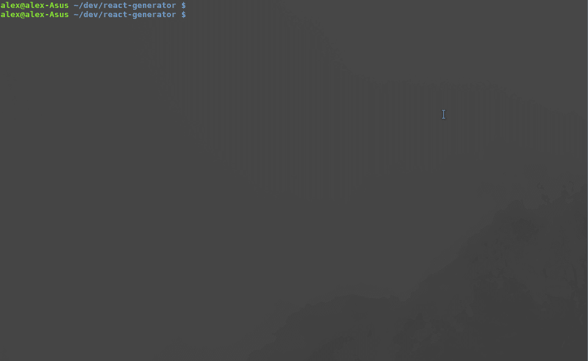

# 用代码生成器搭建 Redux 样板

> 原文：<https://levelup.gitconnected.com/scaffolding-redux-boilerplate-with-code-generators-27df4b35ea7c>


在我的[上一篇文章](/speed-up-your-react-developer-workflow-with-code-generators-f8181eced241)中，我们看到在 React 组件的例子上使用 JavaScript 代码生成器是多么容易。在这篇文章中，我们将基于这些知识，通过一个更高级的例子——搭建 Redux 样板文件——更深入地研究代码生成。

当我第一次开始使用 Redux 时，我对它的能力印象深刻，它可以很好地将一些复杂的组件逻辑抽象成动作。然而，我也对在复杂的应用程序中正确设置需要多少样板文件感到惊讶。

首先，您需要声明动作类型，然后将它们导入到动作创建者中，并定义动作创建者本身。当然，动作创建者是可选的，但是它们使代码更干净。最后，动作类型必须导入到 reducer 中，这也需要设置。当您将 Redux 中间件加入进来时，步骤的数量会增加。在 Redux 用于处理 API 调用的情况下，这一点尤其重要。在这种情况下，您通常希望在获取数据时显示一个加载指示器，然后在数据加载后显示数据，或者在出错时显示一条错误消息。我最终会为一个 API 调用使用三种动作类型— `ACTION_BEGIN`、`ACTION_SUCCESS`和`ACTION_ERROR`，或者它们的一些变体。

让我们通过用生成器生成样板代码来加速这个为数据获取设置 Redux 动作的特殊例子。这个生成器将有两个选项——从头创建新的操作或通过添加新的操作来修改现有的操作。最终代码可在 [Github](https://github.com/Clarity-89/react-generator) 上获得。

我们将继续构建上一篇文章中的例子，并为 Redux 操作添加一个单独的提示。首先，让我们将 React 组件生成器的模板和配置移动到它们自己单独的文件夹中，并添加 Redux 操作的文件夹。

经过这些更改后，我们的文件结构如下。

```
mysite/
  src/
    scripts/
      generator/
        ***config***/
          react.js
          redux.js
        templates/
          react/
          redux/
        ***config***.js
        ***index***.js
        listComponents.js
```

将两个生成器的配置分开将使导航和更新代码变得更加容易。我们仍然将所有的提示保存在同一个文件中，但是如果需要的话，也可以将它们分开。

我们将从向我们的主`config.js`添加更多提示开始。

在最高层，我们询问用户他们是否想要支持 React 组件或 Redux 动作。在这之后，我们必须将`when: answer => answer.select === "redux_action"`添加到所有与 Redux 动作相关的提示对象和一个类似的对象中，用`react_component`检查答案，以对提示做出反应。之后，我们按照熟悉的路径检查用户是否想从头创建一个新的动作或者修改一个现有的动作。如果选择创建一个新的动作，我们需要为它获取一个前缀(例如。如果你正在搭建用户动作，你提供`user`前缀，生成器将创建`userActions`、`userReducer`等。).如果选择修改现有的动作，则要求用户选择将动作添加到哪个文件。应该提到的是，下面的生成器假设您的 Redux 设置结构如下，尽管它可以很容易地调整到任何文件夹结构。

```
mysite/
  src/
    actions/
      actionTypes.js
      testActions.js
    reducers/
      initialState.js
      rootReducer.js
      testReducer.js
```

还要注意的是`listComponents`被修改为接受`type`参数，所以它能够列出不同类型的文件。

浏览完提示之后，是时候进入生成器的核心了，也就是动作。我们将它们添加到 **config** 文件夹中的 **redux.js** 文件中。

这是相当多的代码，但是本质上可以归结为 3 个主要部分:

*   用于创建新 Redux 操作的操作；
*   用于修改 Redux 操作的操作；
*   两种情况下的常见操作。

这里的常见操作是声明操作类型，其模板如下所示:

大量的手工输入已经自动化了！然而，这仅仅是开始。创建或更新操作时，我们可以使用此模板以类似的方式构建操作创建者:

减压器可以这样搭建:

其余的模板可以在 [Github 库](https://github.com/Clarity-89/react-generator/tree/master/src/scripts/generator)中检查。

我们使用一种新的动作类型— `modify`，与`append`不同，它替换了位于`path`的文件中的文本。在我们的例子中，我们使用`modify`动作在模板中的特定点添加生成的代码。为了指定应该在哪里插入代码，我们提供了一个特殊的`//plopImport`注释(可以命名为任何东西)，然后在 action 对象的`pattern`属性中引用它。因为 plop 将用它收到的模板替换这个注释，我们需要记住将注释添加到模板中，在我们希望添加新代码的相同位置。另一个选择是[创建你自己的动作](https://github.com/amwmedia/plop#setactiontype)，对代码生成进行更细粒度的控制。

最后一步是添加新创建的 Redux 生成器动作，并将它们与主 **config.js** 文件中现有的 React 生成器合并。

新创建的发电机可以进行试驾了。注意，在使用之前，需要创建 **actions** 和 **reducer** 文件夹，后者包含 **rootReducer.js** 。



有了这个，我们就有了一个方便的生成器，它将抽象出大量的手工工作。这个例子可以进一步扩展，例如支架中间件动作，可以是 redux-thunk，redux-saga，或者其他任何东西。

对这篇文章有任何问题/评论或其他类型的反馈吗？请在评论中或在 [Twitter](https://mobile.twitter.com/Clarity_89) 上告诉我。

*原载于 https://claritydev.net*[](https://claritydev.net/blog/scaffolding-redux-boilerplate-with-code-generators/)**。**