# Scala 初学者系列(1):基础知识

> 原文：<https://levelup.gitconnected.com/scala-beginner-series-1-basics-d1dae1f3458d>

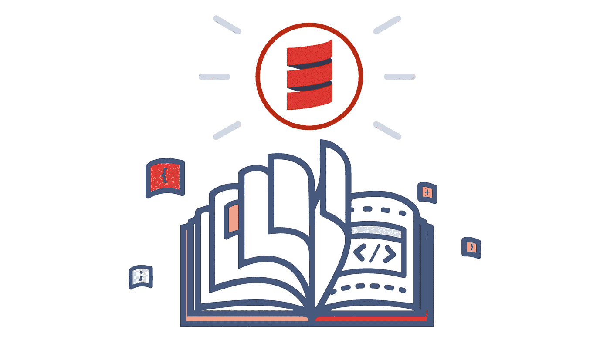

> 这个系列讲的都是 Scala 的味道。最适合所有 Scala 新手。所以我们开始吧…

本文将涵盖 Scala 语言的基础知识。

# 价值观念

在 Scala 中，我们处理值:

值用于定义常数。修饰符的意思是常量或不可变的，这意味着一旦它被创建，我们就不能改变它的值。因此禁止重新分配到`val` 。

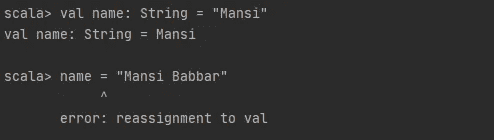

仅在定义时对其进行评估。一旦求值，它对它的所有引用重用相同的值。

# 变量

Scala 还允许我们定义可变值。变量用于定义对值的可变引用。`var` 修饰符的意思是可变的，也就是说我们可以在程序的整个生命周期中改变它的值。因此允许重新分配到`var` 。

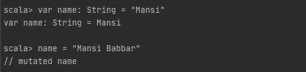

我们在 Scala 中确实有变量的概念，但是我们不鼓励这样做。一般来说，我们使用不可变的数据结构:对现有实例的任何修改都应该返回一个新的(修改后的)实例。

# 类型

在 Scala 中，我们并不总是需要指定我们的值的数据类型，因为编译器足够聪明来为我们推断。我们也可以写:

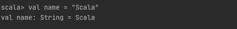

我们可以看到，编译器自动推断出值的数据类型。

# 用线串

Scala 中的字符串类似于我们在其他语言中看到的，但是有一些特殊的功能:

字符串被定义为:

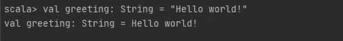

每当编译器在代码中遇到一个字符串文字，它就用它的值创建一个`java.lang.String`类的字符串对象。

用于获取对象信息的方法称为访问器方法。

一个可用于字符串的访问器方法是`length()`方法，它返回 string 对象中包含的字符数。

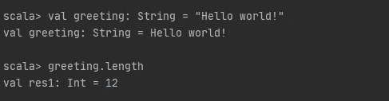

String 类包含一个连接两个字符串的方法`concat()`。但是字符串通常用`+`操作符连接起来。

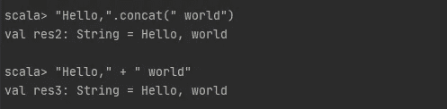

也可以使用`s` 字符串插值器进行字符串插值。通过注入一个带有`$`符号的值，它允许在处理字符串时直接使用变量。

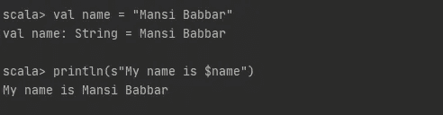

# 公式

在 Scala 中，我们处理值，并组合它们以获得其他值。组成结构是表达式**、**，它们正是我们所期望的。

之前我们已经定义了分配给文字的值。但是，更准确的说法是，它们被赋给了表达式的返回值。

因此，表达式是一个单一的代码单位，可以简化为一个值。它可以是文字、计算或函数调用。表达式有自己的范围，可能包含表达式块的局部值。

我们可以将基于表达式的值定义为:

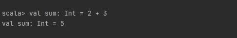

在 Scala 中，我们也可以定义表达式块。可以使用花括号将多个表达式组合起来，创建一个表达式块。块中的最后一个表达式是整个块的返回值。

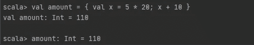

If 结构也是表达式。

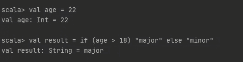

在类 C 语言中，我们有等价的三元运算符，但是在 Scala 中，可读性更好，因为我们可以在无限的 if/else 结构中链接 if 表达式，而没有误解任何逻辑的风险。

我们还有其他类型表达式，比如 for 表达式、match 表达式等等。我们稍后会谈到它们。

# 功能

Scala 既有函数又有方法，我们可以互换使用方法和函数这两个术语，只是有一点点不同。Scala 方法是一个类的一部分，它有一个名字和一个签名，而 Scala 中的函数是一个完整的对象，它可以被赋给一个变量。

函数的声明和定义如下:

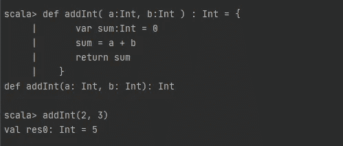

所以我们有:

*   `def`
*   函数名
*   `arg : Type`形式的论据
*   `: ReturnType`
*   `=`
*   那么函数将返回一个表达式。

递归在纯函数式编程中扮演着重要角色，Scala 非常支持递归函数。在 Scala 中，我们不考虑循环。我们从递归的角度来思考。

递归意味着函数可以重复调用自己。

递归的一个简单示例如下所示:

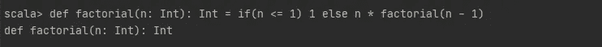

必须提到递归函数的返回类型。

# 单位类型

最后，我将用不返回任何有意义的值的表达式类型来结束本文，即`Unit`。它相当于其他语言中的`void` 函数。当函数不需要返回任何内容时使用它。

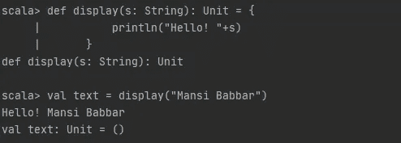

一个例子是返回`Unit`的`println()`函数。它是一个包含一个表示为`()`的值的类型。

返回`Unit` 的表达式被称为副作用，因为它们与计算有意义的值无关。在纯函数式编程中，我们倾向于将副作用降到最低。

# 类似文章-

你也可以查看我在 *Scala 初学者系列*上的其他文章

*   [Scala 初学者系列(2):面向对象的 Scala](/scala-beginner-series-2-object-oriented-scala-4e2496ec2e9f)
*   [Scala 初学者系列(三) :函数式 Scala](/scala-beginner-series-3-functional-scala-eedd9090a3ac)