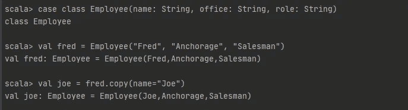

# Scala 初学者系列(2):面向对象的 Scala

> 原文：<https://levelup.gitconnected.com/scala-beginner-series-2-object-oriented-scala-4e2496ec2e9f>

> 这个系列讲的都是 Scala 的味道。
> 最适合所有 Scala 新手。
> 
> 你可能也喜欢: [Scala 初学者系列(一) :基础知识](https://dzone.com/articles/scala-beginner-series1-basics)

在[之前的](https://dzone.com/articles/scala-beginner-series1-basics)部分，我们介绍了:

*   值、变量、表达式和类型
*   函数和递归
*   单位类型

本文将介绍 Scala 语言面向对象的本质。

# 班级

Scala 拥有和其他语言一样的类概念。

Scala 中的类是创建对象的蓝图。它们可以包含方法、值、变量、对象、特征和超类，统称为成员。与其他语言类似，使用点运算符访问字段和方法。

此外，类的所有字段和方法在默认情况下都是公共的，除非我们用`private`和`protected`修饰符限制它们的可见性。我们不必明确指定`public` 访问修饰符。

最小的类定义只是关键字`class`和一个标识符。关键字`new`用于创建类的一个实例。

# 构造器

Scala 中的类可以接受参数——这些是构造函数的参数。当我们定义一个类时，我们也可以定义它的构造函数签名。

注意构造函数参数不是类字段。没有`val`或`var`的参数是私有值，只在类中可见。因此，下面的代码将生成错误:

因此，为了将构造函数参数提升到类字段，我们可以在参数名称前加上一个`val`或`var`。

# 遗产

当一个类从另一个类继承时，意味着它扩展了另一个类。这使得一个类可以从它扩展的类中继承成员，并提供代码的可重用性。

为了实现 Scala 继承，我们使用关键字`extends`:

在上面两个类的例子中，`Person` 类是基类或超类，`Employee`类是派生类或子类。

`extends` 条款有两个作用:

*   它使`Employee` 类继承`Person` 类的所有非私有成员
*   它使类型 `Employee` 成为类型`Person` 的子类型。

Scala 也像 Java 一样只允许单一类继承。

Scala 拥有和我们在其他静态类型的面向对象语言中看到的相同的子类型多态性。在子类型多态性中，子类的实例可以传递给基类。

在编译时，编译器只知道我们正在调用`Element` 对象的`demo()`方法。但是在运行时，最派生的方法即`ArrayElement`的`demo()`方法被调用。当然，派生类可以重写它们的超类方法。

# 抽象类

Scala 还有一个抽象类的概念，类似于 Java 的抽象类，既包含抽象方法，也包含非抽象方法，不能支持多重继承。它们也不能被实例化。

为了实现 Scala 抽象类，我们对它的声明使用了关键字`abstract` :

子实现父类的所有抽象方法也是强制性的。抽象类的抽象方法是那些不包含任何实现的方法。

# 特征

Scala 的特性类似于 Java 的接口。类和对象可以扩展特征，但是特征不能被实例化，因此没有参数。

特征就像部分实现的接口。它可能包含抽象和非抽象方法。有可能所有方法都是抽象的，但它至少应该有一个抽象方法。

扩展特征的类必须实现特征的抽象方法，但不需要实现特征的具体方法。

为了定义 trait，我们使用了`trait` 关键字:

Scala 具有单类继承和多性状混合。可以用一个类或一个抽象类来扩展任意数量的 Scala 特征。

# 匿名类

Scala 也有匿名类的概念，很像 Java。

我们已经看到了如何实现父类声明的方法。为父类的方法提供实现的一种不太正式的方式是使用匿名类，一种不可重用的无名类定义。

要定义一个一次性的匿名类，实例化父类(可能是抽象的),在类名和参数后面加上包含实现的花括号。

结果是一个实例，它用一次性实现扩展了给定的父类，但可以像传统类定义中的实例一样使用。

对于编译器来说，匿名类看起来像这样:

对于匿名类，编译器在幕后做了大量的工作。这允许我们从代码中抽象出复杂性。

# 单一对象

Scala 中没有`static` 的概念，取而代之的是单例对象。

对象是一个只有一个实例的类。它是在被引用时被延迟创建的，就像一个延迟 val。在 singleton 对象中声明的方法和字段是全局可访问的，我们不需要一个对象来访问它们。我们可以从程序中的任何地方导入它们。此外，我们不能将参数传递给它的主构造函数。

使用关键字`object`声明一个单例对象:

单例对象可以扩展类和特征。它还为程序执行提供了一个入口。如果没有这样的对象，代码可以编译，但不会产生输出。

# 伴随物体

当一个单例对象的名字和一个类的名字相同时，它被称为一个伴随对象，而这个类被称为伴随类。相伴的类对象对必须在单个源文件中。这对成员中的任何一个都可以访问其同伴的私有成员。我们对不特定于 companion 类实例的方法和值使用 companion 对象。

我在这里进入了`:paste`模式，因为我在`REPL`工作。由于同伴需要在同一个源文件中，所以`REPL`中的`:paste`模式允许同伴一起定义。

`static`Java 中的成员被建模为 Scala 中一个伴随对象的普通成员。

# 该应用方法

Scala 类和 Scala 对象都提供了一个默认方法，我们称之为`apply` 方法。我们有时称之为注射器法。我们也可以在没有名字的情况下调用这个方法。让我告诉你我的意思:

记住，`apply`只是一个特殊的函数，让我们像函数一样直接调用父对象。它与面向对象、类或构造函数毫无关系。

我们可以在伴随对象中使用 apply 作为工厂方法。工厂方法的思想是在没有`new`的情况下构造类实例。

# 案例类别

Scala case 类就像普通类一样，有一些关键的区别，我们将会谈到。当编译器看到`class`前面的`case`关键字时，它会为我们生成代码，有以下好处:

*   Scala case 类在默认情况下是不可变的，并且可以通过模式匹配进行分解。
*   它不使用`new` 关键字实例化对象。这是因为默认情况下 case 类有一个`apply`方法负责对象的构造。

*   生成了一个`unapply`方法，让我们在`match`表达式中以更多的方式使用 case 类。
*   生成一个默认的`toString`方法，有助于调试。
*   产生了`equals`和`hashCode`方法，它们让我们可以比较对象，并在地图中轻松地将它们用作键。它用于检查所有单个成员字段的值是否相等，而不仅仅是检查对象的引用是否相等。

*   我们可以简单地通过使用`copy`方法创建一个 case 类实例的浅层副本。我们也可以改变构造函数的参数。

*   默认情况下，case 类中列出的所有参数都是公共的和`val` 。可以在 case 类中使用`var`,但不鼓励这样做。

# 案例对象

一个`case object`就像一个`object`，但是就像一个 case 类比一个常规类拥有更多的特性一样，一个 case 对象比一个常规对象拥有更多的特性。其特点包括:

*   它是可序列化的
*   它有一个默认的`hashCode`实现
*   它具有改进的`toString`实现

case 类和 case 对象最大的优点是支持模式匹配。模式匹配是函数式编程语言的一个主要特性，Scala 的 case 类和对象提供了一种在匹配表达式和其他领域实现模式匹配的简单方法。

> *你可能也喜欢:* [*模式匹配 Scala 中的任何东西*](https://medium.com/swlh/pattern-match-anything-in-scala-3a22f5d3535)

# 类似文章-

你也可以查看我在 *Scala 初学者系列*上的其他文章

*   [Scala 初学者系列(1):基础知识](/scala-beginner-series-1-basics-d1dae1f3458d)
*   [Scala 初学者系列(三) :函数式 Scala](/scala-beginner-series-3-functional-scala-eedd9090a3ac)