# Scala 初学者系列(3):函数式 Scala

> 原文：<https://levelup.gitconnected.com/scala-beginner-series-3-functional-scala-eedd9090a3ac>

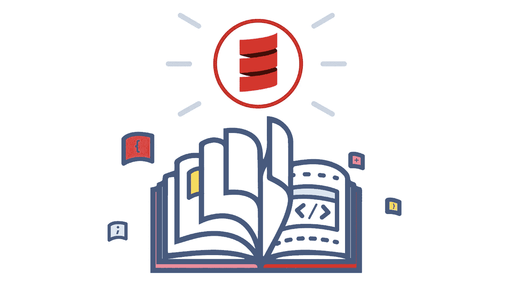

> *这个系列完全是关于 Scala 的品味。
> 最适合所有 Scala 新手。*
> 
> *你可能也喜欢:* [*Scala 初学者系列(1):基础知识*](/scala-beginner-series-1-basics-d1dae1f3458d)[*Scala 初学者系列(2):面向对象 Scala*](/scala-beginner-series-2-object-oriented-scala-4e2496ec2e9f)

在[的上一部分](/scala-beginner-series-2-object-oriented-scala-4e2496ec2e9f)中，我们介绍了:

*   类、构造函数、继承和抽象类
*   特征和匿名类
*   单例对象和伴随对象
*   案例类和案例对象

本文将介绍 Scala 语言的函数性质。

# 纯函数

函数式 Scala 的第一个基本概念是纯函数。

这里有一个非常严格的纯度定义:

*   如果给定相同的参数，它将返回相同的结果
*   它不会引起任何明显的副作用

# 在 Scala 中充当一等公民

在 Scala 中，函数是一等公民，因为我们可以用它们做以下事情:

*   我们可以用函数作为值或者像正态变量。这可以表现为:

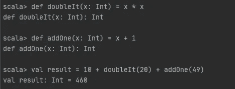

*   我们可以给一个变量指定一个匿名函数，也就是一个函数文字。这可以表现为:

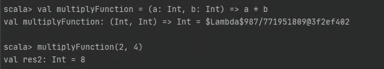

*   我们可以将一个或多个函数作为参数传递给另一个函数。
*   我们可以从一个函数返回另一个函数

让我们深入研究上面提到的最后两点的细节。这两个功能是由 Scala 中的高阶函数提供的。

# 高阶函数

高阶函数将其他函数作为参数，或者返回一个函数作为结果。换句话说，我们可以说一个与函数一起工作的函数叫做高阶函数。

高阶函数允许你创建函数组合，lambda 函数或匿名函数等。

下面演示了一个在函数中将函数作为参数传递的示例:

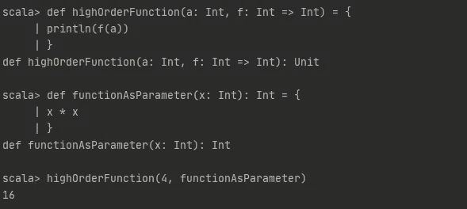

从函数返回函数的示例如下所示:

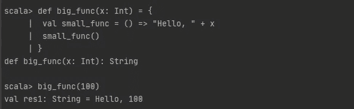

有一些经典的 Hof 我们用的很多，有`map`、`flatMap`和`filter`。让我们依次以它们为例。

## 映射方法

集合的`map`方法将一个函数作为参数，并返回一个新的集合，其中包含该函数在每个元素上的应用。它可以表现为:

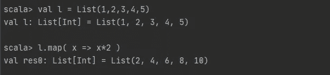

## 平面图方法

集合的`flatMap`方法将一个函数作为参数，将其应用于集合中的每个元素，并为每个元素返回一个新的集合。`flatMap`方法实质上是先运行`map`方法，然后运行`flatten`方法的组合。它可以表现为:

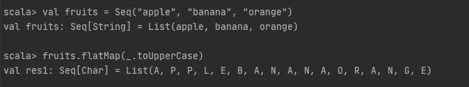

## 该过滤方法

集合的`filter`方法将一个函数作为参数，并返回一个新的集合，该集合只包含该函数返回 true 的元素。它可以表现为:

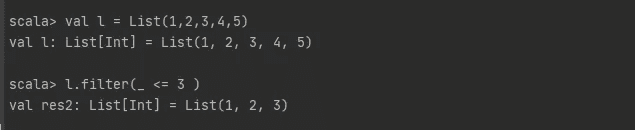

因此，我们不是遍历集合并手动构造值，而是通过它们的高阶函数来操作现有的集合。

# Currying

Currying 是将带有多个参数的函数转换成带有一个参数的函数序列的过程。每个函数返回另一个使用以下参数的函数。

以下是一个约定函数的示例:

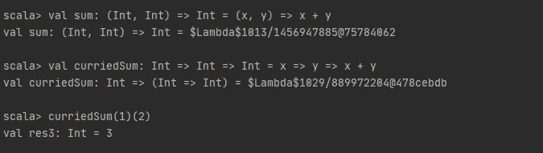

# 部分应用的功能

部分应用的函数是没有应用于由所述函数定义的所有自变量的函数，即，当调用函数时，我们可以提供一些自变量，并且在需要时提供左边的自变量。

部分应用功能的示例如下所示:

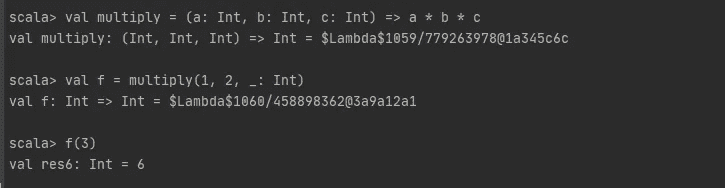

# 尾部递归

Scala 提供了尾部递归优化，以降低递归函数导致堆栈溢出错误的风险。

尾递归函数优化的递归函数，其递归调用是该函数执行的最后一个操作，当函数返回时，不需要保存任何操作。

Scala 提供了`@tailrec`注释来检查递归是否是尾递归。

尾部递归函数的一个例子如下所示:

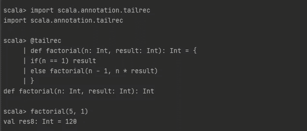

# 结论

如果想入门函数式编程，输入 Scala。

当今大多数流行的编程语言都是从面向对象开始的，现在随着需求的增长，集成了越来越多的函数式编程的特性。而 Scala 从第一天起就准备集成这两者。

Scala 为您提供了足够多的面向对象编程，让您感觉似曾相识。同时，这也是按照自己的进度了解函数式编程的一个很好的方式。

# 类似文章-

你也可以查看我在 *Scala 初学者系列*的其他文章

*   [Scala 初学者系列(1):基础知识](/scala-beginner-series-1-basics-d1dae1f3458d)
*   [Scala 初学者系列(2):面向对象的 Scala](/scala-beginner-series-2-object-oriented-scala-4e2496ec2e9f)