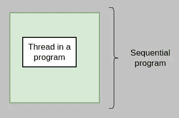
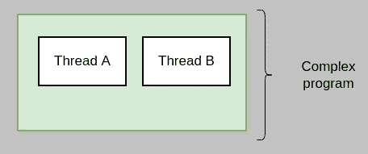
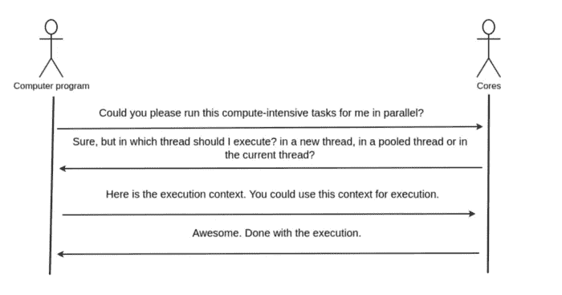
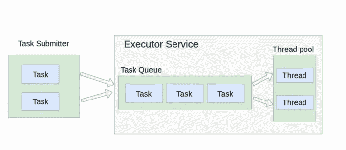

# Scala 执行上下文——简单解释

> 原文：<https://levelup.gitconnected.com/scala-execution-context-simply-explained-76c9b9408a2e>

## [编程](https://medium.com/@anasanjaria/list/programming-c490480e617e)

## 首先解释了执行上下文的基本概念。然后深入这个话题。最后，分享了一些关于在生产系统中使用它的技巧。


詹姆斯·哈里森在 Unsplash 的照片

每种编程语言都提供了一种实现并行的方法。Scala 为这个概念使用了 *Future* ，但是它需要一个 *ExecutionContext* 。作为一个初学者，这总是让我感到困惑和好奇——为什么需要一个 *ExecutionContext* ？

我在网上看过几篇文章来理解这个概念。即使看了那些文章，我脑海中的画面也没有完全清晰。我无法把这些点联系起来。

在这篇文章中，我试图一步一步地解释这个概念。第一部分说明了基本思想，但没有涉及太多的细节。我已经在第二部分介绍了这些额外的细节。最后一部分包括我在生产环境中使用它的经验。

# 基本概念

每当我们编写一个简单的顺序程序(或应用程序)时，它总是在一个线程中执行。



执行顺序程序的线程

随着我们增加复杂性，并试图通过并行执行多个计算密集型任务来利用多核的能力，这些执行将在不同的线程中开始。



多线程程序

*Scala* 使用 *Future* 这个占位符对象进行并发。此占位符包含一个计算密集型任务，其结果可能尚不可用。但是只有在执行计算密集型任务后，结果才可用。

那么它会在哪个线程中执行呢？这个问题的一个答案是`ExecutionContext`。执行上下文负责执行计算。



阐述执行上下文的概念

让我们看一个在执行上下文中执行任务的简单例子。

上述程序的输出如下。

```
2022-06-08T18:43:32.210 - [main] - Application has been started.
2022-06-08T18:43:32.249 - [pool-1-thread-1] - Task has been executed.
```

正如你所看到的，这个应用程序有两个线程，即`main`和`pool-1-thead-1`。计算密集型任务(即`executeComputeIntensiveTask`)使用执行上下文并在线程`pool-1-thread-1.`中执行

# 幕后是怎么回事？

让我们更深入地研究一下这个主题，通过并行执行两个计算密集型任务来增加上述程序的复杂性。

上述程序的输出如下。

```
2022-06-08T18:49:37.233 - [main] - Application has been started.
2022-06-08T18:49:37.275 - [pool-1-thread-1] - Task-A has been started.
2022-06-08T18:49:38.275 - [pool-1-thread-1] - Task-B has been started.
```

现在让我们从`1 -> 2`开始改变线程池的大小

```
val *executorService* = Executors.*newFixedThreadPool*(2)
```

并观察其结果。

```
2022-06-08T18:50:19.697 - [main] - Application has been started.
2022-06-08T18:50:19.737 - [pool-1-thread-1] - Task-A has been started.
2022-06-08T18:50:19.737 - [pool-1-thread-2] - Task-B has been started.
```

如果你**密切注意时间戳**，当**线程池只包含 1 个线程**时，两个计算都顺序执行**。但是，当线程池的**大小增加到 2** 时，它们都在 **并行**中执行*。幕后是怎么回事？这个问题的答案是`Executor Service`。***



执行者服务理念。这个概念是借用了这篇[文章](https://www.baeldung.com/thread-pool-java-and-guava)

每当*未来*被创建时，未来块被添加到任务队列中。如果线程池有一个空闲线程，那么未来块将在空闲线程上执行。否则，它将一直等到线程池中有可用的线程。

我们的情况也是如此。当线程池的大小为 1 时，计算密集型任务按顺序执行**。当`task-a`被执行时，`task-b`正在等待线程从池中可用。然而，当线程池中有 2 个线程时，这两个计算密集型任务都在 **中并行**执行。**

# **我在生产系统中使用它时学到的经验**

**我相信现在已经清楚执行上下文的目的是什么了。我将分享一些在生产系统中使用执行上下文的技巧。**

## **每个组件使用单独的执行上下文**

**在软件工程中，有一个原则叫做*关注点分离。*这个设计原则允许我们编写模块化代码，每个模块负责执行一个简单的截然不同的任务。**

**同样的原则也适用于执行上下文。**不要在整个应用程序中只使用一个执行上下文，**但是每个组件都有一个专用的执行上下文。例如，DAO 和服务层不应该共享执行上下文，而应该有一个专用的上下文。**

**即使 DAO 层从 MongoDB 和 MySql 检索数据，也要为两者使用专用的执行上下文。**

## **对线程池使用合理的名称**

**为线程池使用一个合理的名称。例如，DAO 可能使用与 MySQL 数据库通信。所以使用池前缀`mysql-pool`比仅仅使用默认的池前缀`pool-x-thread-y`更有意义。这可以通过如下使用`Guava`来完成。**

```
// [https://stackoverflow.com/a/9748697](https://stackoverflow.com/a/9748697)val *threadFactory* = new ThreadFactoryBuilder().setNameFormat(s"mysql-pool-%d").build()val *executorService* = Executors.*newFixedThreadPool*(2, *threadFactory*)
implicit val *ec* = ExecutionContext.*fromExecutor*(*executorService*)
```

**它通过使用 [visualvm](https://visualvm.github.io/) 帮助我们调试生产系统中的问题。**

## **阻止执行上下文—使其可见**

***未来*模块有助于并行执行计算密集型任务。但是长时间运行的计算会阻塞执行上下文。因此，在代码中反映这种阻塞行为也是至关重要的。让我们用一个例子来理解这个概念。**

**下面的方法将只从数据库中检索特定公司的用户 id。这个方法将阻塞执行上下文，直到它检索到所有的 id。**

```
class UsersDAO(implicit mysqlExecutionContext: ExecutionContext) { def findUserIds(companyId: Long): Future[Seq[Long]] = *???* }
```

**但是如果我们将上述方法的签名更改如下。**

```
def findUserIds(companyId: Long): Future[Iterator[Long]] = ???
```

**由于一个*迭代器*，它将阻塞调用者的执行上下文(例如服务执行上下文)。这些类型的错误很难在生产系统中调试。我经历过。**

**因此可以将签名更改如下。**

```
// *Returning userIds as an* [[*Iterator*]] *would not overload memory 
// and respect memory utilization. But at the same time, it would 
// block caller's execution context.*
def findUserIds(companyId: Long): Iterator[Long] = ???
```

**这样，调用者必须将它包装在一个`Future`中，让它异步执行，并显式指定所需的执行上下文。这样更容易看到。**

**我同意这不是一个理想的解决方案，但至少它使它可见，更具可读性。我追求的要点是明智地使用执行上下文，如果可能的话，使它可读和/或可见**

**感谢阅读。**

**你有什么问题吗？欢迎在评论区提问。**

**如果你喜欢这篇文章，你可能也会喜欢下面的系列文章。**

**

[阿纳斯·安贾里亚](https://medium.com/@anasanjaria?source=post_page-----76c9b9408a2e--------------------------------)** 

## **编程；编排**

**[View list](https://medium.com/@anasanjaria/list/programming-c490480e617e?source=post_page-----76c9b9408a2e--------------------------------)****7 stories****************

[阿纳斯·安贾里亚](https://medium.com/@anasanjaria?source=post_page-----76c9b9408a2e--------------------------------)** 

## **代码审查**

**[View list](https://medium.com/@anasanjaria/list/code-reviews-6dc76dbc03ea?source=post_page-----76c9b9408a2e--------------------------------)****6 stories**************

```
**Want to connect?** [Facebook](https://www.facebook.com/anas.anjaria.kh) | [LinkedIn](https://www.linkedin.com/in/anasanjaria/) | [Newsletter](https://medium.com/subscribe/@anasanjaria)
```