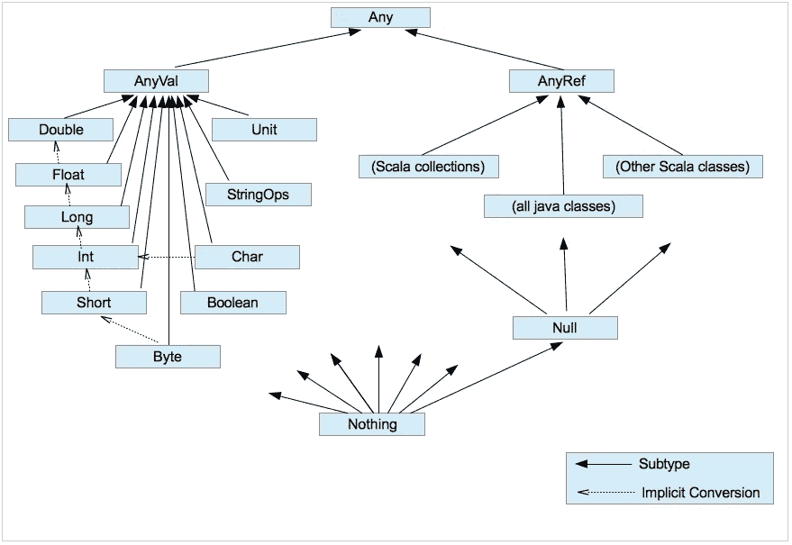

# Scala 期刊—参数多态性

> 原文：<https://levelup.gitconnected.com/scala-journals-parametric-polymorphism-sounds-scarier-than-it-is-818714b31fe8>

我想以承认我发现非常正确的一件事开始这篇博客:函数式编程与泛型行话的混合会使理解甚至是直观的概念变得困难。今天，我将尽我最大的努力去钻透类型界限、参数多态、抽象类型、泛型类型、类型推理和所有其他听起来…嗯…至少是外国的东西的混乱世界。请原谅我在这篇文章中重复了几次。这都是为了更大的利益！

# 总体来说…我们到底在谈论什么？

多态性！不多不少。让我们回顾一下它的含义:

> *Poly' —许多，' morphism' —形状。*

有三种类型的多态性(什么？！):

*   亚型多态性—良好的 ould OOP(猫是动物的一个亚型)
*   **参数多态性—仿制药。这就是我们今天要谈论的**
*   特殊多态性——我们暂时不考虑这一点。这有点像泛型，但是更灵活

你猜对了——Scala 支持所有这些！所以下一次你在面试的时候，你可以继续回答一个问题“告诉我关于多态性的事情”，用“哦，但是你想让我谈论哪种多态性？”。如果你问我，我会觉得很酷！

# 好的。什么是什么？

正如我提到的，行话让我们这些凡人不容易。但是没关系。我们很快就会长生不老。让我们试着理解这些大词，看看隐藏在它们背后的东西实际上是非常直观的东西。

让我们考虑下面这段代码。把类`Zone`想象成一个区域，在这里只允许特定的**类型**的东西。也许就像城市中的一个区域，那里只允许特定类型的建筑。有趣的事实:由于这个博客是我的旅行职业休息项目，我需要提到的是，我是在秘鲁的许多地方看到这个项目的，并从中获得了灵感！你可能会认为把 20 家药店放在一条街上(或者，我在这里称之为一个药店“区”)是个坏主意，会让其中一半的药店破产，但秘鲁人不会同意。让我们来模拟一下:

```
trait Building
trait School extends Building
trait Shop extends Building
trait Pharmacy extends Shop
trait Llama

class Zone[A](val anything: A)
```

重要的事情先来。条款。给定我们的`Zone`类的定义，考虑这个疯狂的命名:

*   `Zone[A]`是一个**通用类**。将类型作为其构造函数参数的类。泛型类需要实例化类型，因为(顾名思义)它只对泛型值进行操作，而不对具体类型进行操作。所以想想`List`——我们能知道把`List[A]`的所有元素加起来意味着什么吗？那`List[Int]`呢？
*   `A`是一个**抽象类型**。仔细想想还是有点道理的。它是“抽象的”，因为我们不能对它进行推理。仅仅因为我们不知道它实际上可能是什么。我们可以直觉地猜测，我们需要提供一些具体的东西。
*   我们的泛型类`Zone`展示了第二种类型的多态- **参数多态**，这意味着我们需要传递一个**类型参数**来实现多态。

总结一下，我们的`Zone[A]`可以被称为“一个以抽象类型 A 作为参数的泛型类‘区域’”。听起来很聪明，但是…太长了。在现实生活中，当讨论它的时候，我可能会称它为`generic class "Zone"`。将一个类称为“泛型”意味着它是一个将类型作为参数的类，正如我上面提到的。

# 使用泛型(又名参数多态性)

如上所述，泛型类采用类型参数(提醒:这就是为什么它被称为参数多态)。这意味着，如果我们想从上面的代码中构建一个药房区域，我们将把药房作为一个类型传递给泛型类区域:

```
val pharmacyZone = new Zone[Pharmacy](new Pharmacy)
```

很好。如果我们只想拥有一个商店区呢？

```
val shopZone = new Zone[Shop](new Pharmacy) 
val shopZone2 = new Zone[Shop](new School) // will get an error here: School is not the same type as Shop
```

# 类型推断——用编译器玩猜谜游戏

关于与上述代码相关的注释，我们来谈谈**类型推理**。Scala 编译器很棒，它可以帮你做很多思考……它可以推断类型。

让我们看看“推断”在现实生活中是什么意思:

> 推断(动词):通过证据或推理得出结论

因此，换句话说，上面的类型推断就是 Scala 编译器*“从证据*推断出类型”，也就是猜测你指的是哪种类型。

也许你已经知道这是怎么回事了？

```
val shopZone = new Zone(new Pharmacy)
```

记得`Zone`类需要一个类型参数吗？注意，在上面的代码中，我们没有传递类型。但是我们仍然需要它！在这种情况下，Scala 编译器会查看上面的代码，并计算出既然类签名是`Zone[A](val anything: A)`，然后你传递一个类型为`Pharmacy`的实例，那么你一定意味着类型 A 等于`Pharmacy`。

请注意**类型推断**是一个通用术语，不仅与泛型有关，也与其他对象(函数、值)有关:

```
val name = "John" // value type inferred to be String
def add(one: Int, two: Int) = one + two // function return type inferred to be Int
```

总而言之，只要让 Scala 编译器判断出类型，类型推断就会发生。尽管这很酷，但我尽量避免使用它，并显式声明我的类型，尤其是当涉及嵌套代码时。代码可读性更好，也更容易推理，更不用说我不太可能看到臭名昭著的`Product with Serializable`类型破坏我的代码(原因之一可能是您让编译器过度思考了您的意思)。

# 类型上限和下限——都是关于它们的健康边界

`Bounds`引用你为类/方法的类型参数设置的边界。如果果汁和咖啡是液体，而土豆是固体，那么建模一个泛型类`Glass[???]`只接受类型为`Liquids`(谁会点一杯土豆？)因此，您为 Glass 类的类型参数设置了一个 **bound** (ary ),从而得到了类似于`Glass[Liquid]`的结果。你可能听说过`upper type bounds`和`lower type bounds`——那我们就来看看吧。

## 上类型界限

上限是传递给类构造函数的参数类型必须“小于或等于”你的类型边界(“小于”=子类，“等于”=本身)。所以相对于上面的例子,“upper”意味着我们的类型`Liquid`是“最高”允许的类型。这是一个从顶部开始的边界，因此称为“上限”。现在知道了这一点，Scala 语法“小于或等于”`<:`也就很有意义了:

```
class Glass[T <: Liquid] // our type T has to be "less or equal" to Liquid
trait Liquid
trait Solid
class Juice extends Liquid
class Coffee extends Liquid
class Potato extends Solid

new Glass[Juice] // ok!
new Glass[Coffee] // ok!
new Glass[Liquid] // ok!
new Glass[Any] // nop! "Any" is "higher" than Liquid 
new Glass[Potato] // hmm.. why? nop! compile error
```

懂 Java 的注意:`T <: Liquid`基本就是`<T extends Liquid>`

## 下界

下限是指传递给类构造函数的参数类型必须“大于或等于”你的类型边界(“大于”=超类，“等于”=自身)。在与以下代码的关系中,“较低”再次意味着`Liquid`是“最低”允许类型。这是一个自下而上的边界，因此称为“下界”。同样，语法`>:`也很有意义:

```
class Glass[T >: Coffee] // our type T has to be "greater or equal" to Coffee
trait Liquid
trait Solid
class Juice extends Liquid
class Coffee extends Liquid
class Potato extends Solid

new Glass[Coffee] // ok!
new Glass[Liquid] // ok!
new Glass[Any] // ok!
new Glass[Juice] // nop! Juice is not "greater" than Coffee
new Glass[Potato] // again, nop!
```

# 摘要

这次有点脑子进水了！让我们来回顾一些重要的词汇:

*   **泛型类** —需要类型参数的类`class Something[A]`
*   **类型参数** —作为参数传递给类/方法的类型
*   **参数多态性**——基本上……泛型编程(“参数化”是因为类型是作为类/函数参数传递的)
*   **类型推断**——当 Scala 编译器猜测你指的是什么类型时
*   **类型限制** —一种类型，它限制了什么类型可以作为参数
*   **上类型界限**——不允许任何“大于”(`T >: A`)该类型界限的东西
*   **较低的类型界限**——不允许比该类型“更小”(`T <: A`)的任何内容

作为结束语，我建议你花几分钟时间学习 Scala 中的类层次结构。使用泛型时，了解这一点至关重要。或者从现在开始我们可以称之为参数多态性。



参考资料:
[Scala docs](https://docs.scala-lang.org/tour/variances.html)—Scala 官方文档
[巴托兹·维特科夫斯基的博客](http://like-a-boss.net/2013/03/29/polymorphism-and-typeclasses-in-scala.html) —关于一些 Scala 事物的很棒的小博客
[Java9s YouTube 频道](https://www.youtube.com/channel/UCGOoAhrv-mOe3dB2PeSVQGw) —一组关于 Java 9 的 YouTube 视频