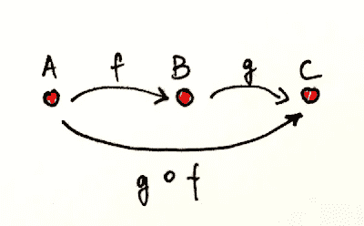

# Scala 期刊——什么是函数式编程？

> 原文：<https://levelup.gitconnected.com/scala-journals-part-1-whats-functional-programming-d6300979bae6>


每个程序员迟早都会遇到函数式编程范式。我们中的一些人开始使用它，一些人只是听说过它，一些人甚至尝试过它，不禁想知道——为什么它现在被如此炒作？开始的时候我自己也在想这个。

函数式编程一开始可能没什么意义——事实上，在某种程度上，它甚至会让你觉得它违背了你以前所学的东西。如果你和我刚开始学习数学的时候一样，你可能会有一个普遍的误解，认为你首先需要非常了解数学，或者认为函数范式是解决任何编程问题的灵丹妙药。

在这篇文章中，我将尝试指出一些基础知识，让你理解函数式编程到底是什么，它不是什么，它基于什么，为什么人们在上下文中如此多地提到数学，为什么你可能听说它很难，以及为什么这些天它到处都是新闻。请耐心听我说，我会试着回答所有这些问题。

## 都是数学，对吧？

这个问题很简短的回答就是:**否**。

对这个问题的一个稍微长一点的回答是:它比命令式语言更接近数学，但这并不意味着你需要对数学了如指掌才能编写函数式代码。了解数学的某些分支会有帮助吗？是的。很关键吗？号码

想想一个建筑工人。是否要求他们学习建筑和土木工程的基础知识？不会。这是否有助于他们理解为什么某些任务必须以某种方式完成，尽管这看起来有些矫枉过正？很有可能是的。

这个问题的一个很长的答案是:函数式编程基于一个叫做*范畴理论*的数学分支。在**大规模**过度简化范畴理论是数学的一个分支，它推理类别和它们之间的关系，而不是关注类别中的对象，例如，范畴理论将负数推理为抽象概念，而不是关注像-2 或-23 这样的文字值。有点像鸟瞰图，你看不到细节，但看到图案。

我不打算深入探讨，因为这很容易成为一个单独的博客的主题——但是让我们同意，从范畴理论中主要学到的应该是**可组合性**——将较小的功能 ***** 组装成较大的功能。这在函数式编程中随处可见。我们来稍微说一下:



考虑到上图——如果`f`是一个从`A`到`B`的函数，而`g`是一个从`B`到`C`的函数，那么一定有一个像`g o f`(f 之后的 g)这样的从`A`到`C`的组合。来吧——不要只是浏览我写在这里的东西——读一读！

用 Scala 术语来说(这是一种非常麻烦的获取数字长度的方法，显示了可组合性):

```
val A = List(1, 11, 111) 
def f: Int => String = _.toString  
def g: String => Int = _.length // g and f composed  A.map(gof) // List(1, 2, 3)
)def gof: Int => Int = g compose f
```

让我们重写上面的语句来匹配我们的 Scala 示例:

如果`f`是一个从`Int`到`String`的函数，而`g`是一个从`String`到`Int`的函数，那么一定有一个类似于`g o f`(f 之后的 g)的组合，它从`Int`到`Int`。

想象可组合性的另一种方式是 shell 命令的管道(下面的例子实际上已经类似于一个真实的程序流)。下面的每个函数都可以由更小的函数组成:

```
get_data_command | verify_data_command | process_data_command > output.data.file
```

# 那么什么是函数式编程呢？

当我想到函数式编程时，我会想到代数 T21——你评估函数并组合它们，直到你得到你需要的。你远离副作用，不变异数据。由于没有突变和副作用，结果总是确定的。如果结果总是确定的，就没有必要担心隐藏状态的变化。如果你不必担心隐藏状态的改变，那么你可以并行执行。如果你能并行执行，那就意味着多线程的快乐时光。这也意味着拥有多核 CPU 和/或分布式执行我们的计算的美好时光——如今这几乎已经成为一种标准。

让我们理解**代数**部分——我相信这是为什么数学在函数式编程中被经常提及的原因之一。

回想以前在数学课上做代数时，很明显`z`总是会计算为`8`:

```
x = 5
y = 3
z = x + z
```

变异是不允许的，所以想象一下你的老师会怎么说:

```
x = 5
x = 3
y = 3
z = x + z
```

…这是不是有点像命令式的方式？

```
var number = 5 
number = 3 
var number2 = 3 
println(number + number2) // 6
```

现在，上面这个带有变异的`number`的例子看起来并不像是世界末日，但是试着想象一下，如果`number = 3`实际上被另一个函数调用，可能是在另一个线程上，会发生什么。这个功能需要时间。我们的结果实际上不是`6`，而是`8`，即使一旦代码被执行`number`将会是`3`。现在来看一下，想象一下`number`和`number2`不是整数，而是更新客户数据的实际对象…

函数式编程远离可变性以避免这些问题(从现在开始所有的例子都在 Scala 中):

```
val number = 3 // val is immutable 
number = 5 // error: reassignment to val
```

但是如果你不能改变任何东西，那你怎么编程呢？

这是将**纯函数**带到桌面上的好时机。纯函数是没有副作用的函数。一个纯函数接受一个输入值，在不修改它的情况下做一些计算并返回一些新的东西。纯函数是可组合的、确定的，没有副作用，因此可以并行化，这又回到了我之前的观点。

有两条经验法则可以帮助你永远不要进行变异和升级:

*   复制时更新
*   只使用 val，不要使用 var

这在 Scala 的 case 类中表现得最好。

```
case class User(id: String, name: String) val user = User("123", "annette") // pure function, update as you copy: 
def updateUser(user: User, newName: String) = 
    user.copy(name = newName) val newUser = updateUser(user, "john")// User(123,john)
println(newUser)
```

由于 case 类在默认情况下是不可变的，所以甚至不可能编写一个不纯的更新函数来编译。

但是如果你不能变异，那么 for 循环呢？

说到 Scala，真正的答案是，这取决于你想成为一个多么纯粹的函数主义者。我已经可以想象在局部未公开函数中使用可变数据的话题，以及这是否是一个坏习惯的巨大争论。就我自己而言，我更喜欢坚持不可变性，这意味着我不使用 for 循环，而是映射或使用递归——这使我的代码很好，很纯粹，感觉很一致。此外，看到完美的递归函数通过所有测试用例也是一件非常令人满意的事情…

如果一切都是纯粹的、不变的，你如何设计你的程序？

这是一个非常重要的问题，我被这个问题困扰了很长一段时间，因为存在明显的差异，但显然没有金科玉律。有关于这个主题的书籍，但是我注意到的一般经验法则是尽可能地将数据和函数分开。想想我上面展示的构图图像。它可能看起来像这样:

```
case class A // only data 
case class B // only data 
case class C // only data def f: A => B = ??? // only function 
def g: B => C = ??? // only function 
def gof: A => C = ??? // only function
```

# 摘要

有了以上所有的信息，让我们试着和我在文章开头提到的一些误解作斗争。

**误区一:** **函数式编程讲的都是数学。**

看你想挖多深了。它来源于范畴理论，但是学习函数式编程根本不需要成为数学大师。只要你懂代数:)

误解 2:函数式编程是银弹。

编程没有灵丹妙药。函数式编程就像任何其他范式一样，只是你工具箱中的一个工具——它不会是所有任务的最佳选择。当然你可以用撬棍敲钉子，但是其他工具可能更合适。

**误解 3:函数式编程很难。**

这是一种不同的思维方式，使它看起来更复杂。这显然不是一条规则，但我个人发现，有时在函数式编程中，被认为非常简单的事情(命令式方法)往往看起来有点复杂或麻烦。这完全是一个实践的问题，随着时间的推移，你会“重新连接”你的思维方式。但是，即使一旦你的大脑重新布线，我可以保证学习将永远不会停止，无论是功能或任何其他范式！

******* *我故意跳过正确的范畴理论术语，以免混淆。澄清一下:正确的术语是“态射”，而不是“函数”。*

参考资料:B. Milewski 的
*程序员范畴理论*t . Leinster 的
*基础范畴理论*
t . Alexander 的 *Scala 食谱*

演职员表:
[M .巴格妮卡](https://www.linkedin.com/in/malgorzata-bagnicka/)——感谢你帮我润色我的建造者类比:)