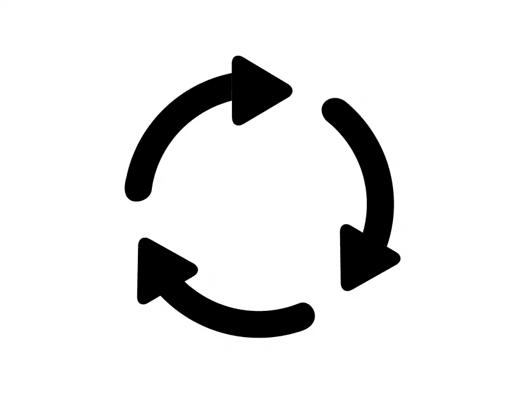

# Scala 期刊——为了理解

> 原文：<https://levelup.gitconnected.com/scala-journals-part-5-for-comprehensions-4eac96fdc791>



现在我们已经知道了所有关于`map`和`flatMap`的内容，还有一件事非常重要，那就是理解的**，你可以把它看作是 for 循环的“一种”替代——尽管你很快就会发现这是不一样的。**

简而言之——理解的**给了我们使用`flatMap`、`map`和`filter`处理大型、有序和/或嵌套计算的语法糖。**

**事不宜迟，让我们先看看下面的例子。假设我们有两个整数列表，我们想要得到它们元素上乘法的所有组合，所以对于`List(1, 2)`和`List(3, 4)`我们想要一个`List(3, 4, 6, 8)`的结果**

```
val list1 = List(1, 2) 
val list2 = List(3, 4) list1.flatMap(     
   list1Element => list2.map(         
        list2Element => list1Element * list2Element
        ) 
   ) // List(3, 4, 6, 8)
```

**…呀。这看起来不太好。令人欣慰的是，理解的**给了我们一个很好的语法糖，使我们很容易将上面的内容重写为****

```
val list1 = List(1, 2) 
val list2 = List(3, 4) for {     
 l1Element <- list1 // for each list1 element called l1Element
 l2Element <- list2 // and for each list2 element called l2Element   } yield l1Element * l2Element // multiply l1Element and l2Element// List(3, 4, 6, 8)
```

**这看起来更愉快，对不对？**

# **理解中允许的表达式**

**通常，理解遵循以下语法:**

```
for {       
 sequenceOfExpressions
} yield computeResultExpression
```

**以下是理解表达式的列表(上图中的`sequenceOfExpressions`):**

*   **发电机(`element <- list`)，把它想成“对`list`的每一个`element`”**
*   **定义(`name = element.name`)，把它当成一个简单的赋值，就像`val dogName = dog.name`**
*   **滤镜(`if (name == "Joe")`)，嗯。只是一个滤镜:)**

**`yield`这是我们通向理解的门吗——这是你的价值观和表达评估在理解范围内的唯一地方，这是一个对你的结果采取行动的地方。**

# **对于理解规则**

**现在我们知道了允许的表达式和`yield`的作用，我们来谈谈一些规则。让我们从一个重要的注意事项开始:**

# **不要试图记住这些！**

**随着时间的推移，它会自然而然(也是合乎逻辑的)来到你身边。**

## **规则一:**

**为了理解，必须总是从发电机开始。**

```
val list1 = List(1, 2) 
val list2 = List(3, 4) for {     
 l1Element = list1(1) // error: '<-' expected but '=' found
 l2Element <- list2   
} yield l1Element * l2Element 
```

## **规则二:**

**用一个生成器来理解是一个简单的`map`:**

```
for {     
 element <- list
} yield element * 2
```

**…翻译过来就是…**

```
list.map(_ * 2)
```

## **规则三:**

**用于理解两个发生器的 a 是后面跟有`map`的`flatMap`。**

```
for {     
 element1 <- list1
 element2 <- list2 
} yield element1 * element2
```

**…翻译过来就是…**

```
list1.flatMap(     
 element1 => list2.map(
     element2 => element1 * element2
     )
  )
```

## **规则四:**

**用于理解发生器和滤波器的是一个`withFilter`后跟一个`map`:**

```
for {     
 element <- list     
 if(element > 3)   
} yield element + 3
```

**…翻译过来就是…**

```
list.withFilter(     
 element => element > 1
).map(_ + 3)
```

## **规则五:**

**没有`yield`的理解的 a 是一个`forEach`(注意副作用！不推荐)**

```
for {     
 element <- list     
 if(element > 3)   
} println(element)
```

**…翻译过来就是…**

```
list.foreach(element => println(element))
```

# **对现实生活的理解**

**如果你有像下面这样的任务，Scala **将成为你的救命稻草。考虑到上面的规则，想想你会创建一个什么样的平面地图-地图-过滤器怪物，在没有理解的情况下进行同样的计算。****

```
for {     
 result <- operation // generator     
 result2 <- operation(result) // generator     
 result3 <- operation(result, result2) // generator     
 if(result3 == 0) // filter   
} yield doSomething(result3) // yield
```

**让我们看看。我不打算尝试建立一个非理解性的解决方案，但是根据我们上面的规则，我们可以猜测它将包括:**

*   **三个嵌套的生成器平面图**
*   **带过滤器的过滤器**
*   **产量图**

**在现实生活中，对于任何需要排序和编排大量操作的情况，理解是一个很好的解决方案。如果你的解决方案是单一的`map`或`flatMap`，也许不值得用 a 来理解。另一方面，如果你正在处理一些顺序操作，并且发现自己在映射、过滤和平面映射中使用了像`Try`、`Option`、`Future`这样的类型，或者这些类型的任意顺序，这就是理解的时候了。**

**我们来列举几个用法:**

*   **发出几个返回`Try`的数据库请求**
*   **发出几个返回`Future`的 http 请求**
*   **跨多个序列的计算，例如跨 4 个列表**
*   **引导应用程序——数据库、模块、http 客户端等。(虽然你可能会想到用依赖注入来代替！)**

# **摘要**

**For comprehension 是处理嵌套的`flatMap`、`map`和`filter`表达式的语法糖。**

## **(不那么)硬核笔记**

**如果你听说过单词 **monad** (我肯定你听说过并想过“wtf”——但别担心我也是)，这里是我要提到它的第一个地方(但还没有进入细节或解释)。在**大规模**过度简化中，可以被平面映射的东西是单子(这意味着简单的`Option`也是单子——知道你已经处理了这个(不那么)可怕的东西是多么酷啊！).**

**所以你对总结的核心补充是:**

> **因为理解对于处理和编写单子非常有用。**

***原载于 2019 年 6 月 20 日*[*https://arfro . github . io*](https://arfro.github.io/for-comprehensions/)*。***