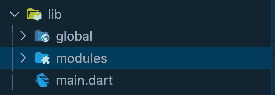
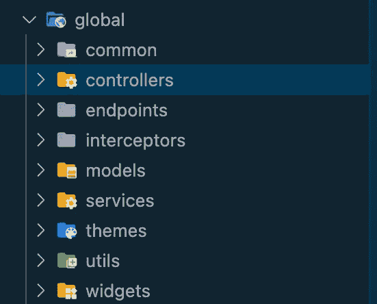
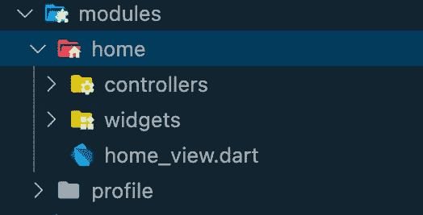

# 适用于大型应用的可扩展 Flutter 文件夹结构

> 原文：<https://levelup.gitconnected.com/scalable-flutter-folder-structure-for-big-apps-480a9b266793>

[Med Badr Chemmaoui](https://unsplash.com/@medbadrc?utm_source=medium&utm_medium=referral) 在 [Unsplash](https://unsplash.com?utm_source=medium&utm_medium=referral) 上拍摄的照片

当开始一个新项目时，你需要做长期计划，以便干净利落地完成项目。

我是一名有 3 年经验的专业颤振开发者。我将向你展示我是如何为我的 Flutter 应用程序设计文件夹结构的。

首先，我们从名为“全局”和“模块”的两个文件夹开始

我们将在全局文件夹中添加对我们的应用程序有全局帮助的功能和小部件。

全局文件夹将包含这些文件夹

*   Common 将包含常用的小部件，如加载指示器、对话框和您在模块中经常使用的任何小部件。
*   小部件填充包含高级小部件文件，例如 https://pub.dev/packages/flutter_form_builder 字段的[包装函数或数据表小部件。](https://pub.dev/packages/flutter_form_builder)
*   Utils 将包含您创建的常量变量。这些可以是风格，设计值。它还可以包含您经常使用的功能。
*   主题将包含你用官方文档创建的主题:[https://docs.flutter.dev/cookbook/design/themes](https://docs.flutter.dev/cookbook/design/themes)
*   控制器将包含您在模块中或启动应用程序之前全局使用的控制器。
*   拦截器将包含例如获取拦截器或路由拦截器。我使用 Dio 获取数据，所以我在那里创建了 Dio 的拦截器。
*   端点将包含用于数据提取的字符串 URL 函数。像这样使用端点可以更快地更新和查看您正在使用的端点。
*   模型将包含你用官方文档创建的 JSON 模型:[https://docs.flutter.dev/development/data-and-backend/json](https://docs.flutter.dev/development/data-and-backend/json)
*   服务将包含从 API 获取的函数。
*   服务和模型都必须在大应用程序的全局文件夹中。这是因为您可以在个人资料模块和主页模块等中使用服务..
*   如果您为每个模块创建模型和服务，从长远来看，这将变得复杂。

通过这种方式，您可以创建适合您的应用程序兴趣的整个全局文件夹。

在 modules 文件夹中，我们将拥有包含视图文件、控制器和小部件文件夹的模块，以便分离大块的 flutter 代码。

我们将创建基于页面的模块。例如，这里我们有主页和个人资料模块。

*   控制器将包含控件(或视图模型。我正在使用 GetX，这就是为什么我把它们命名为“控制器”)。可以是 GetX 控制器，也可以是你用过的其他状态管理包。
*   Widgets 文件夹将包含我们将在视图中使用的小部件。我总是建议尽可能把你的视图分成小块。
*   然后是你的观点。你的观点是什么..令人惊奇不是吗？它最多不应该超过 300 行代码。
*   业务逻辑应该在控制器中处理。视图中的小部件应该由文件分隔，然后在视图中调出。

有了这个结构，你可以轻松地扩展一个大的 Flutter 应用程序。

在推特上关注我。我贴的主要是关于 SaaS 和我在生活中发现的小贴士:)

[https://twitter.com/umutarpt](https://twitter.com/umutarpt)

# 分级编码

感谢您成为我们社区的一员！更多内容请参见[升级编码出版物](https://levelup.gitconnected.com/)。
跟随:[推特](https://twitter.com/gitconnected)，[领英](https://www.linkedin.com/company/gitconnected)，[通迅](https://newsletter.levelup.dev/)
**升一级正在改造理工大招聘➡️** [**加入我们的人才集体**](https://jobs.levelup.dev/talent/welcome?referral=true)