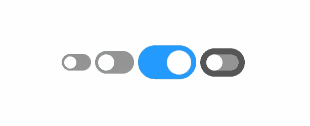
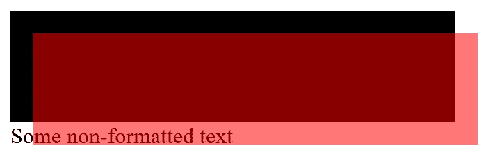

# 仅使用 CSS 的可缩放的“样式化”复选框。它叫 EM，利用它们！

> 原文：<https://levelup.gitconnected.com/scalable-styled-checkboxes-using-just-css-its-called-em-use-em-db21bae5f216>



在回复 [Omar Sharak](https://medium.com/@omarsharaki) i 的文章“[从静态到动态 CSS 值](https://medium.com/better-programming/from-static-to-dynamic-css-values-23b2d258f60d)”关于重新调整来自 W3schools 的[垃圾示例时，我说这是一个严重的——也是不必要的——过度思考的解决问题的方法。W3Fools 的傻瓜们用像素硬编码，并添加计算来尝试缩放像素，这一事实造成了一个问题。](https://www.w3schools.com/howto/howto_css_switch.asp)

它的大部分问题是固定的像素测量是固定的，可访问性垃圾，并且使用 position:absolute 来移动滑块会将其从 flow 中移除，使得自动调整大小更加困难。

# 等等，像素怎么了？

这些是用户界面元素，就像文本一样，它们应该使用像 EM 这样的弹性度量。99%的时候，你看到 PX 被用于内容文本、界面元素和布局，你看到的是完全的垃圾代码，是由那些对可访问性不够了解的人编写的，他们不会编写前端代码。

EM 根据用户偏好缩放，因此用户不必缩放。如果你在流体或半流体设计中使用 EM，你的布局在缩放时不太可能被破坏。EM 是乘法的，所以如果你把它用于你所有的测量，你调整父对象的大小，所有的子对象也随之改变。

不要将 PX 用于字体大小、填充、边距、宽度、高度或像媒体查询这样的布局控制！你只是在告诉大批潜在用户滚蛋。*因此，为什么许多 derpy 框架，如 bootcrap、tailwind 等，会导致布局混乱，因为它们要么将 PX 强加给用户和开发人员，要么不情愿地将 PX 与 EM/REM 混合。*

# 如果不是绝对定位，那是什么？

`position:relative;` —保持元素流动。

相对定位是 CSS 中使用最少但最强大的属性之一。有点遗憾的是，很少有人理解它的作用，更不用说尝试使用它做任何事情，除了说“将这个的上角作为绝对定位子元素的 0:0”。

理解`position:relative`的关键是将每个元素想象成在流模型中有两个独立的“盒子”。一个“流动框”是页面上的其他元素认为它在哪里以及它有多大，一个“呈现框”是它被绘制的地方。

大多数人都知道`position:absolute;`和`position:fixed;`都从流中移除元素，并且“float”对流做了各种各样奇怪的事情。很少解释和理解的是，你实际上可以移动“渲染框”而不改变流程。这就是`position:relative;`所做的。

请考虑以下情况:

```
<div class="test"><div></div></div><br>
Some non-formatted text
```

使用此 CSS:

```
.test {
  display:inline-block;
  background:#000;
}.test div {
  display:inline-block;
  position:relative;
  top:1em;
  left:1em;
  width:20em;
  height:5em;
  background:#F008;
}
```

渲染后，我们得到:



等等，什么？

我们能够移动内部的盒子，但是注意到没有其他东西像它被移动过一样。就文本乃至父 DIV 而言，元素仍在流动，保持其原始大小，并仍在原始位置。页面上的其他元素认为它就在原来的位置，我们根本没有移动它！

这就是我们可以利用来实现这些简单的“风格化”复选框。

# 所以让我们开始吧！

通过将输入包装在标签中，我们可以跳过 FOR/ID，而不必到处抛弃类。通过简单地在`INPUT` 后面放一个标签来代替它。我建议使用`INS` 标签，因为我们不需要一个关于它的类，1)很少有人使用它，2)它在大多数情况下在表单中没有意义，3)它不会干扰像 font-awesome 这样的东西使用的斜体标签，4)我们将把生成的内容放入其中。如果那不是正在被"`INS`转变"…

由于额外的标签仅用于屏幕媒体*(因此，在您的<链接>或<样式>标签上应该有 media="screen ",如果没有的话，您就大错特错了)*确保它对非屏幕媒体 UA 是“隐藏的”。HTML 5 的“隐藏”属性和 aria-hidden 属性都实现了这一点。UA 对此的支持很粗略，但在大多数现代浏览器中都存在，所以只要声明两者都 100%肯定就可以了。添加这两个简单的属性会使浏览器和其他用户代理忽略额外的标记，除非我们在样式表中另有说明。

```
<label>
  <input type="checkbox" class="switch">
  <ins hidden aria-hidden="true"></ins>
</label>
```

这样，标签(可能需要相对于输入的不同位置)就不会受到干扰。

## 隐藏输入

我们不希望复选框显示，虽然有许多隐藏元素的方法，但大多数都有一些…问题。其中最大的问题是像`opacity:0;`这样的东西，它会在拒绝将元素收缩到特定大小以下的 UA 上咬你一口。这就是 W3Fools 方法被打破的原因。

同样地，让它保持流畅，这可能会干扰其他造型。`visibility:hidden;`和`display:none;`都可能导致屏幕阅读器和搜索引擎无法识别内容*(对我们的空元素来说不是问题，只是需要记住的东西)*，因为它们认为这种用法是为了“内容伪装”；一种黑帽搜索引擎优化人渣诡计。

最终显示:无；阻止它被点击，破坏了我们的复选框的功能。

因此，最好的解决办法是用绝对定位把它从屏幕上滑下来。

```
.switch {
  position:absolute;
  left:-999em;
}
```

## CSS 变量

虽然肯定他们没有 IE 的支持，在这一点上，我甚至没有发送 CSS 到 IE 了。我让它优雅地退化为我的语义标记，然后就这样了。我们不能一直竭尽全力支持已经过时十年的浏览器，尤其是大多数版本都停止了安全更新。

我曾经认为 CSS 变量没有用，但那是你需要像 LESS/SASS/SCSS 这样的预处理器来使用它们的时候。它们不是变量，因为你不能动态地重新分配它们，它们是定义/常量。**不是变量！**

现在一切都变了，因为它们是浏览器的原生功能。

现在，在我们的例子中，除了计算边界半径，我们不需要太多的`var`和`calc`。你必须记住，边界半径应用于边界之外，而不是内部。因此，我们的外半径需要是滑块的内半径**加上**边框宽度！

```
:root {
  --switch-size:1em;
  --switch-border-size:0.2em;
  --switch-inner-radius:calc(var(--switch-size) / 2);
  --switch-outer-radius:calc(
    var(--switch-inner-radius) +
    var(--switch-border-size)
  );
}
```

它也给你一个很好的简单的地方来改变页面上的所有内容。

现在你可能会想“为什么我们不能只用 50%”？因为滑块所在的“轨道”不是方形的，而是矩形的。50%的边界半径会给我们一个椭圆形！

## 设计惯性导航系统

```
.switch + ins {
  display:inline-block;
  padding-right:var(--switch-size);
  background:#949494;
  border:solid #777;
  border-width:var(--switch-border-size);
  border-radius:var(--switch-outer-radius);
  transition:background 0.3s, border 0.3s;
  vertical-align:middle;
}
```

设置内联块和中间垂直对齐可以让它们与我们的文本正确对齐。因为都是 EM 驱动的，所以默认情况下，它们会调整大小以匹配旁边的文本。我们的默认总高度为 1.4em *(1em 滑块，0.2em 边框顶部/底部)*意味着它们非常适合 1.4em 或更高的行高。我通常设置 1.5em 行高，因为我发现它可以提高可读性。

“开关大小”右边的填充为我们的“滑块”腾出了空间。Boom，container 元素现在自动调整其内部滑块的高度和宽度，同时还可以通过简单地改变字体大小来调整大小！

## 为“滑块”生成的内容

```
.switch + ins:before {
  content:"";
  position:relative;
  display:block;
  width:var(--switch-size);
  height:var(--switch-size);
  left:0;
  border-radius:var(--switch-inner-radius);
  background:#FFF;
  transition:left 0.3s;
}
```

我使用相邻的兄弟选择器“+”，这样我们就不需要任何额外的类，也避免了特殊性问题。对于悬停状态，我们无论如何都要使用它，那么为什么不把它用在任何事情上呢？

注意，如果你不显式声明`left:0;` …这是很愚蠢的，一些浏览器不会做动画转换，但总的来说，CSS3 在“自动”属性方面有点笨拙。*看你怎么不能在固定高度和* `*height:auto;*`之间过渡

## 选中时移动“滑块”

```
.switch:checked + ins:before {
  left:var(--switch-size);
}
```

同样，由于相对定位使任何其他元素认为它没有移动，我们可以在填充上将其向左滑动“开关大小”。简单的柠檬榨汁机。真正神奇的是“新的”(如果十年可以称之为新的话)`:checked`伪状态和相邻同胞选择器。当它被选中时，在它之后改变输入。因此，当我们到达:

## 选中时改变颜色

```
.switch:checked + ins {
  background:#29F;
  border-color:#17D;
}
```

就是这么简单。`:checked`和相邻的兄弟姐妹。

*注意，勾选或不勾选如果你想让边框和背景匹配，只需让边框颜色和背景匹配即可。我不应该这么说，但显然有些人没有意识到这一点。【T7:】*

## 控制尺寸

改变这些输入的大小简单得可笑。字体大小！

要使它变小:

```
.switch + ins { font-size:0.5em; } /* half size */
```

要使其变大:

```
.switch + ins { font-size:1.5em; } /* 50% larger */
```

或者改变我们的第一个 CSS 变量。有时您希望它们在页面的不同部分有不同的大小，所以能够通过变量或相关 INS 标签上的 font-size 来设置它是很方便的。

# 现场演示

这里有一个代码笔来展示它:

# 结论

CSS 的变化和改进让我们有了更多的控制，但是不要坐在那里微观管理绝对定位，在不必要的时候把事情从流程中去掉。同样，EM 基于字体大小可能是制作可伸缩元素的最简单方法，因为，嗯…它已经可以伸缩了！

简单来说，你看到有人用像素做界面元素？**跑。**跑得快，跑得远，但最重要的是，**只管跑！**

W3Schools 推广的那些技术的问题是，没有真正的思想进入它们，它们没有解释它们所做的选择，并且直截了当地违反或忽略可访问性规范。他们做的任何事情都有可能做得更好。好多了。它被戏称为“W3Fools”是有原因的，几十年的骗局艺术、虚假信息、错误信息和彻底的网络腐败使它成为学习网络开发最差的地方之一；不管有多少了解杰克的人对****大加赞赏。

不，W3Schools 与 W3C 没有任何关系！

就像愚昧无知、无能和不称职的愚蠢纪念碑一样，为 W3fools 编写内容的人没有资格编写一行该死的 HTML 代码，更不用说告诉别人如何去做了。

[它叫 MDN，访问它](https://developer.mozilla.org/en-US/)！