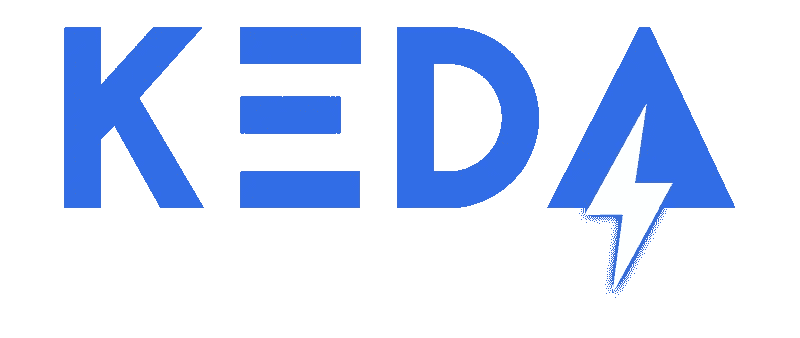
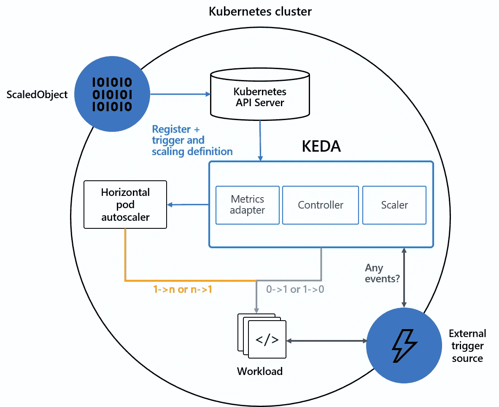
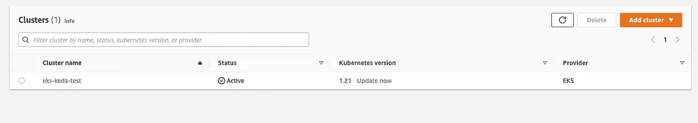
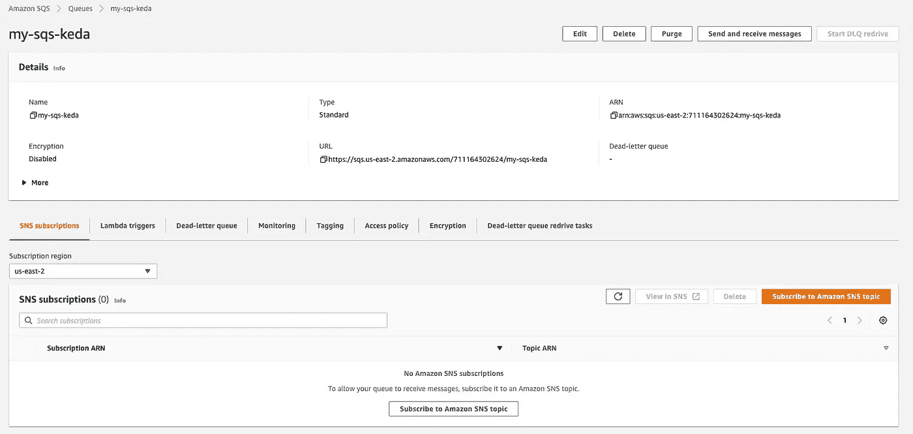
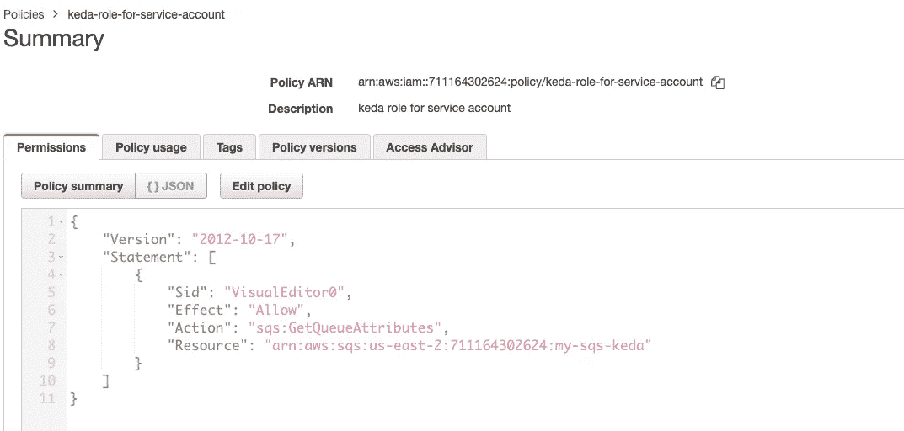
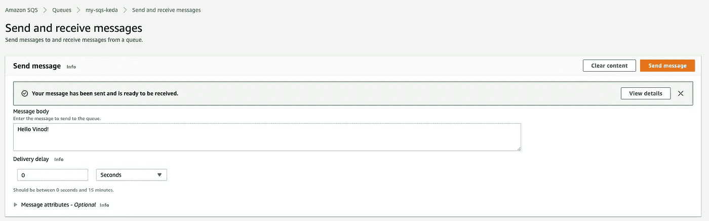

# 使用 Kubernetes 中的 KEDA 扩展您的应用程序

> 原文：<https://levelup.gitconnected.com/scale-your-apps-using-keda-in-kubernetes-a1f2142ecc20>

K **EDA** (或者， **Kubernetes 事件驱动自动缩放**)是一个基于 Kubernetes 事件驱动的 Pods 自动缩放器。有了 KEDA，我们可以轻松地扩展我们的应用程序，然后回退到 0，这在 Kubernetes 的默认 HPA(水平 Pod 自动缩放器)中是不可能的。对于 HPA，我们只能将其降低到 1 个 pod，而不是 0 个，因为只有 CPU &内存提供度量支持。然而，KEDA 拥有强大的外部指标/服务支持，可以作为事件源，提供事件数据来扩展应用程序。例如，我们可以有 **KEDA** **缩放器**像 AWS SQS、Datadog、RabbitMQ、Kafka、CloudWatch、DynamoDB、Elasticsearch 等等。



KEDA

与简单的 Kubernetes HPA 相比，KEDA 的主要优势在于

1.  支持用于扩展的多个指标/事件
2.  吊舱可以缩小到零

## 建筑:



科达

在本文中，我们将看到如何使用 KEDA 来根据在 AWS SQS(简单队列服务)中收到的消息，扩展在 AWS EKS(弹性 Kubernetes 服务)中运行的应用程序。

## 步骤 1:创建一个 EKS 集群(可选，以防集群不可用)

```
apiVersion: eksctl.io/v1alpha5
kind: ClusterConfig
metadata:
 name: eks-keda-test
 region: us-east-2
 version: '1.21'
managedNodeGroups:
 - name: ng
   instanceType: m4.xlarge
   minSize: 1
   maxSize: 2
```



AWS EKS 集群

## 步骤 2:使用 Helm 在 Kubernetes 中安装 KEDA

```
#Adding the Helm repo
helm repo add kedacore [https://kedacore.github.io/charts](https://kedacore.github.io/charts)#Update the Helm repo
helm repo update#Install Keda helm chart
kubectl create namespace keda
helm install keda kedacore/keda --namespace keda
```

检查 KEDA 运算符和度量 API 服务器是否在 KEDA 命名空间中:-

```
kubectl get pod -n kedaNAME                                               READY   STATUS    RESTARTS   AGE
keda-operator-68cd48977c-swztq                     1/1     Running   0          23h
keda-operator-metrics-apiserver-7d888bf9b5-s2fqs   1/1     Running   0          23h
```

## 步骤 3:在 Kubernetes 集群中部署一个测试应用程序

在这里，我用 1 个副本运行 nginx 部署

```
apiVersion: apps/v1
kind: Deployment
metadata:
 labels:
  app: my-nginx
 name: my-nginx
spec:
 replicas: 1
 selector:
  matchLabels:
   app: my-nginx
 strategy: {}
 template:
   metadata:
     labels:
       app: my-nginx
   spec:
     containers:
     - image: nginx
       name: nginx
       resources: {}
       status: {}
```

## 步骤 4:创建一个 AWS SQS 队列(标准队列)

转到 AWS 控制台-> AWS SQS 并创建一个标准队列。复制其区域、队列 URL



AWS SQS —标准队列

## 步骤 5:使用 ScaledObject 创建 KEDA 缩放器(SQS)

*(注意，基于 KEDA SQS Scaler 的不同类型的集成 Scaler(比如 CloudWatch，Datadog 等)，请参考官方文档* [*这里*](https://keda.sh/docs/2.7/deploy/) *。)*

```
apiVersion: keda.sh/v1alpha1
kind: ScaledObject
metadata:
 name: aws-sqs-queue-scaledobject
 namespace: default
spec:
 scaleTargetRef:
   name: my-nginx
 pollingInterval: 5 #Interval for polling
 cooldownPeriod: 10
 idleReplicaCount: 0 # When idle, scale-in to 0 pods
 minReplicaCount: 1
 maxReplicaCount: 3
 fallback: # Fallback strategy when metrics are unavailable for the apps
 failureThreshold: 5 #when metrics are unavailable, match the desired state of replicas -> 2
replicas: 2 #Keep this desired state when metrics are unavailable
triggers:
- type: aws-sqs-queue
  authenticationRef:
    name: keda-trigger-auth-aws-credentials
  metadata:
    queueURL: [https://sqs.us-east-2.amazonaws.com/711164302624/my-sqs-keda](https://sqs.us-east-2.amazonaws.com/711164302624/my-sqs-keda)
    queueLength: "5" #batch size
    awsRegion: "us-east-2"
    identityOwner: operator #when node role has required permission
```

KEDA 既支持 **ScaledObjects** (比如 Kubernetes 部署、StatefulSet、自定义资源)也支持 **ScaledJobs (** 比如 Kubernetes Job)。上面的例子是基于 ScaledObject 进行部署的。

在上面的 ScaledObject 中，有几件事需要注意

1.  ScaledObject 将在默认的名称空间中创建
2.  它将管理名为' **my-nginx** '的部署
3.  事件源是 AWS SQS，队列 URL 为[**https://SQS . us-east-2 . amazonaws . com/711164302624/my-SQS-keda**](https://sqs.us-east-2.amazonaws.com/711164302624/my-sqs-keda)在地区 **us-east-2** 。注意，您也可以给出队列名称。如果有任何歧义，最好使用 URL。
4.  队列长度为 **5** ,这意味着一旦 5 条消息的批量到达队列，它将被触发。
5.  身份所有者是**操作员**(或者默认为 **pod** )，这意味着 EKS 节点角色应该有与 SQS 通信的权限。所需的策略是附加到其节点角色的 **sqs:GetQueueAttributes** 。
6.  **idleReplicaCount** 为 0，这使 pod 在空闲时降至 0

## 步骤 6:创建 KEDA 触发器身份验证(可选)

如果 KEDA 操作员要求对源事件(在我的例子中是 SQS)进行认证，那么我们需要遵循以下认证机制之一

6.1) **使用附加到 EKS 节点的 IAM 角色—** 这是最简单的方法，创建一个 **sqs:GetQueueAttributes** 的 IAM 策略，然后将它与现有/新的 IAM 角色一起附加到节点实例。我们需要确保在 ScaledObject 中将 I**identity owner**作为 **operator** (我上面的例子就是这样)。这使得 KEDA 可以访问 SQS 来获取度量数据。



IAM 策略

6.2) **使用 IAM 用户凭证** —在这里，我们需要在 AWS 中创建一个 IAM 用户，在 Kubernetes 中创建一个密码，在 Kubernetes 中创建一个 TriggerAuthentication，并在 Kubernetes 中的 ScaledObject 中使用这个 TriggerAuthentication，如下所示

(a)在 AWS 中创建一个 IAM 用户，其策略是访问 SQS。记下它的 Base64 编码版本的访问和秘密访问密钥，并使用它来创建秘密。

(b)用 IAM 用户的 BASE64 编码访问和秘密访问密钥在 Kubernetes 中创建一个秘密

```
apiVersion: v1
kind: Secret
metadata:
  name: iam-user-secret
  namespace: default
data:
  AWS_ACCESS_KEY_ID: <base64-encoded-key>
  AWS_SECRET_ACCESS_KEY: <base64-encoded-secret-key>
```

创建触发身份验证

```
apiVersion: keda.sh/v1alpha1
kind: TriggerAuthentication
metadata:
  name: keda-trigger-auth-aws-credentials
  namespace: default
spec:
  secretTargetRef:
  - parameter: awsAccessKeyID     # Required.
    name: iam-user-secret         # Required.
    key: AWS_ACCESS_KEY_ID        # Required.
  - parameter: awsSecretAccessKey # Required.
    name: test-secrets            # Required.
    key: AWS_SECRET_ACCESS_KEY    # Required.
```

(d)使用 TriggerAuthentication 创建 ScaledObject

```
apiVersion: keda.sh/v1alpha1
kind: ScaledObject
metadata:
  name: aws-sqs-queue-scaledobject
  namespace: default
spec:
  scaleTargetRef:
    name: my-nginx
  minReplicaCount: 0
  maxReplicaCount: 2
  triggers:
  - type: aws-sqs-queue
    authenticationRef:
      name: keda-trigger-auth-aws-credentials
    metadata:
      queueURL: [https://sqs.us-east-1.amazonaws.com/012345678912/Queue](https://sqs.us-east-2.amazonaws.com/711164302624/my-sqs-keda)
      queueLength: "5"
      awsRegion: "us-east-2"
```

瞧啊。现在都准备好了。来测试一下吧:)

# 演示时间:-

**步骤 1**——将部署保持在观察模式

```
kubectl get deploy --watchNAME       READY   UP-TO-DATE   AVAILABLE   AGE
my-nginx   0/0     0            0           4h52m
```

**步骤 2** —将一些消息添加到 SQS 队列中(注意，将超过 5 条消息放入队列中，因为 ScaledObject 中给定的批处理大小是 5)



## 结果:-

当消息到达队列时，KEDA 自动将应用程序扩展到 2 个副本。

```
NAME       READY   UP-TO-DATE   AVAILABLE   AGE
my-nginx   0/0     0            0           4h52m
my-nginx   0/1     0            0           4h54m
my-nginx   0/1     0            0           4h54m
my-nginx   0/1     0            0           4h54m
my-nginx   0/1     1            0           4h54m
my-nginx   1/1     1            1           4h54m
my-nginx   1/2     1            1           4h54m
my-nginx   1/2     1            1           4h54m
my-nginx   1/2     1            1           4h54m
my-nginx   1/2     2            1           4h54m
my-nginx   2/2     2            2           4h54m
```

在空闲状态下过一会儿，pod 将自动按比例缩小到 0。

```
my-nginx   0/0     0            0           4h57m
```

# 总结:

在本文中，我们看到了如何使用 KEDA 根据外部指标/事件，尤其是基于 AWS SQS 队列中的消息，将我们的应用程序从 0 个副本扩展到“n”个副本。

和往常一样，您可以在 GitHub 链接中找到本文中使用的全部源代码

[https://github . com/vinod 827/k8s-nest/tree/main/IAC/AWS/eks/ked](https://github.com/vinod827/k8s-nest/tree/main/iac/aws/eks/keda)a

随时分叉这个项目，并添加更多的 IaC(基础设施作为代码)，反馈，在它的问题。

# 参考:

[https://keda.sh/docs/2.7/deploy/](https://keda.sh/docs/2.7/deploy/)

# 分级编码

感谢您成为我们社区的一员！更多内容请参见[升级编码出版物](https://levelup.gitconnected.com/)。
跟随:[推特](https://twitter.com/gitconnected)，[领英](https://www.linkedin.com/company/gitconnected)，[通迅](https://newsletter.levelup.dev/)
**升一级正在改造理工大招聘➡️** [**加入我们的人才集体**](https://jobs.levelup.dev/talent/welcome?referral=true)