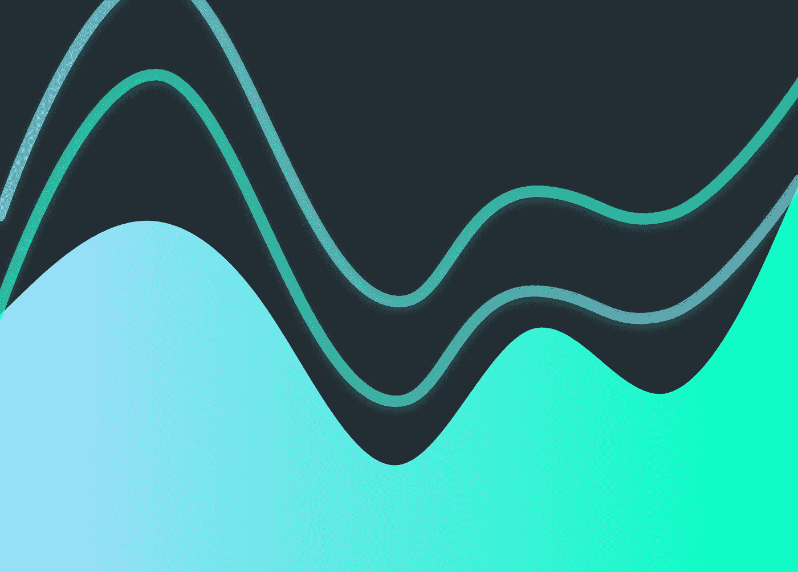

# 为自定义 SwiftUI 形状缩放 UIBezierPath

> 原文：<https://levelup.gitconnected.com/scaling-an-uibezierpath-for-a-custom-swiftui-shape-c6d1d6c30a88>

## 让-马克·布里安内



缩放 UIBezierPath 以创建自定义 SwiftUI 形状

今天的快速提示！当您从设计器或设计程序获得 SVG 输出时会发生什么？如何将其转换成定制的 SwiftUI `Shape`结构呢？

> 在开始之前，请考虑使用这个[链接](https://trailingclosure.com/signup/?utm_source=medium&utm_medium=blog_post&utm_campaign=scaling_uibezierpath)订阅，如果你没有在[TrailingClosure.com](https://trailingclosure.com/?utm_source=medium&utm_medium=blog_post&utm_campaign=scaling_uibezierpath)上阅读这篇文章，请随时来看看我们！

## 转换 SVG 路径

1.  首先，您可以使用 Mike Engel 创建的流行工具 [SwiftVG](https://swiftvg.mike-engel.com/) 将 SVG 路径代码转换为 Swift UIBezierPath 代码。
2.  从这里开始，你需要缩放`UIBezierPath`以适应`path(in rect:)`函数中提供给你的自定义`Shape`结构的`CGRect`。您可以使用`Path`上的扩展来应用`CGAffineTransform`来完成此操作。从那里，您可以像往常一样返回路径。

```
struct Wave: Shape {
    func path(in rect: CGRect) -> Path {
        let path = UIBezierPath()

        // Path drawing code here
        // ...

        return Path(path.cgPath).scaled(for: rect)
    }
}

extension Path {
    func scaled(for rect: CGRect) -> Path {
        let scaleX = rect.width/boundingRect.width
        let scaleY = rect.height/boundingRect.height
        let scale = min(scaleX, scaleY)
        return applying(CGAffineTransform(scaleX: scale, y: scale))
    }
}
```


缩放前(左)，缩放后(右)

## 沿 X 或 Y 方向缩放

如果你想在一个方向上进一步缩放路径，那么你可以再次为`Path`写一个扩展。通过在`Path`上执行`CGAffineTransform`，您可以获得想要的结果。

```
struct Wave: Shape {
    func path(in rect: CGRect) -> Path {
        let path = UIBezierPath()

        // Path drawing code here
        // ...

        return Path(path.cgPath).scaled(for: rect).scale(x: 1, y: 5)
    }
}

extension Path {
    func scale(x: CGFloat, y: CGFloat) -> Path {
        return applying(CGAffineTransform(scaleX: x, y: y))
    }
}
```


仅在 Y 方向缩放的波形