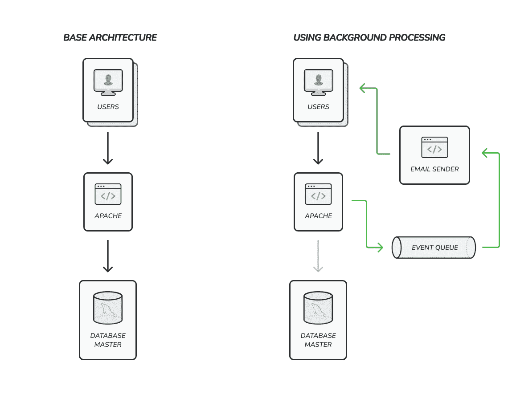

# 为虚拟对象扩展后端应用程序

> 原文：<https://levelup.gitconnected.com/scaling-backend-applications-for-dummies-31c713ec04a4>

照片由[西格蒙德](https://unsplash.com/@sigmund?utm_source=unsplash&utm_medium=referral&utm_content=creditCopyText) / [Unsplash](https://unsplash.com/es/s/fotos/lego-blocks?utm_source=unsplash&utm_medium=referral&utm_content=creditCopyText) 拍摄

也许你，作为每一个开发人员，都曾面临过应用程序开始变慢，表现不佳的情况。

我知道，这很令人失望，但它就是发生了。当您开始在一个应用程序中工作，并且它得到更多的用户和请求时，就会出现一些与过载、意外的系统故障和服务停机有关的问题。这完全没问题，只是意味着您需要扩展您的系统。

如果你有足够的经验，你可以根据以前的项目预先计划一些场景，这是一个很好的起点，因为这意味着你的架构至少在某些方面是可伸缩的。

如果您不熟悉这个概念，请不要担心，我已经撰写了一系列文章，从基础开始介绍一些扩展应用程序的概念。

# 尺度…什么？

在继续之前，我认为是时候澄清一些概念了。

当我们谈论软件开发中的伸缩时，我们指的是添加更多资源(硬件)来运行特定应用程序的行为。

但是如果我的程序运行完美，为什么我需要伸缩？

很棒的问题！通常，当你开发一个应用程序时，你是在一个特定的环境中进行的，当这个环境发生变化时，你的应用程序就会受到影响。

我举个例子解释一下。你是一个像 Shopify 电子商务编程。一开始你并没有关注数据库性能，这完全没问题，该应用程序有几个用户，响应时间也很好。有一天性能下降了，你意识到在营销活动之后，你的应用程序同时有 10 万用户。你的应用程序是一样的，但它不像以前那样工作，所以发生了什么…正是！应用程序运行的上下文已更改。

这些情况往往时有发生。这就是为什么从一开始就关注应用程序的性能和可伸缩性是如此重要。

我并不是说你应该从第一天起就创建下一个数据中心遍布全球的谷歌或脸书，但是你需要一个策略和工具来扩展你的应用程序。这也是这个系列文章存在的原因。

# 如何扩展我的应用程序？

既然我们已经达成共识，那么是时候深入探讨可伸缩性概念了。

首先，我想描述一下扩展应用程序时的典型流程。

扩展一个应用程序的第一步是了解它的内部情况。换句话说，我们需要找到导致性能下降的原因，以便应用解决方案来解决问题。

显然，第二部分是应用一个解决方案。在这一点上，我们真的很幸运，因为有很多解决方案可以帮助我们扩展我们的应用程序。

如果你问我对这个过程的简要总结应该是这样的:

1.  分析:

*   启用可观察性工具
*   进行根本原因分析

2.改进:

*   优化代码和业务逻辑
*   优化数据库使用(例如缓慢的查询)
*   使用后台处理
*   应用高级缩放模式

在这篇文章和接下来的文章中，我们将涵盖这个过程的所有方面和阶段。先说可观测性。

# 启用可观察性工具

这听起来很明显，但事实并非如此。

在对您的扩展问题应用任何解决方案之前，您需要知道问题在哪里以及是什么导致了问题。我们应该根据问题采用不同的解决方案。我们不会对数据库中的慢速查询和无法处理更多请求的过载服务器应用相同的改进。

所以首先你需要审核你的申请。在最好的情况下，您的应用程序有一些可观察性工具，如 Kibana、Grafana、Prometheus 或类似的工具。如果是这样，你很幸运，因为你可以检查这些数据来发现问题。如果没有，我的建议是你现在就需要实现一个可观察性工具。

因为这篇文章是对一般概念的介绍，所以我不打算深入解释如何安装和使用这些工具。你在网上有数百篇关于它的文章。但是我想给你一些提示，告诉你应该收集哪些数据来获得应用程序的良好可观察性。

关于您的应用，您想知道的最重要的信息是:

*   应用程序 id:如果您有很多应用程序，可以用它来标识您的应用程序
*   请求状态:真/假或错误代码，由您决定
*   请求时间:从请求开始到结束所用的时间，以秒或毫秒为单位
*   服务器信息:服务器名称/集群 id 或类似信息，帮助您发现具体问题
*   分析信息:关于运行应用程序的某些方法或类、调用外部 API 等的时间的信息。

您应该为每个请求收集这些信息。如果你的应用有大量的请求，考虑收集至少 10%-20%的请求数据。您可以将这些信息存储为日志，但是如果您使用一个可观察性工具来显示它，您会更有效率，因为您可以一目了然地获得所有数据。

如果你想让你的可观察性更上一层楼，你可以看看 APM 库。APM 允许您通过使用库的几行代码从应用程序中收集低级信息，如错误和堆栈跟踪。这些库可用于大多数编程语言和框架，并且与所有可观察性工具兼容。

在本节中，我们应该提到另一个对处理性能问题非常有用的信息源，它就是经典的服务器监控。这些信息通常可以通过特定的服务器监控应用程序获得，如 Nagios、Centreon、Zabbix、Pandora FMS 或更一般的应用程序，如上面提到的可观察性工具。

关于 CPU、RAM、网络等资源使用情况的信息。可以为您提供许多关于应用程序性能的信息，并帮助您分析问题。因此，在对应用程序进行性能分析时，不要低估这类信息。

通过对应用程序内部发生的事情的深入了解，我们可以发现性能问题并开始改进。

# 进行根本原因分析

现在，你有了所有可用的信息，你需要开始寻找问题。

根据我的经验，与应用程序性能差相关的典型问题通常是由以下原因引起的:

*   对外部 API 的请求耗时太长
*   未优化的数据库查询
*   不可伸缩代码
*   缺乏资源

第三方请求的问题应该很容易发现，因为它们往往是一致的。通常，它们是由供应商系统中的问题引起的，可能是暂时的或结构性的。除了更容易发现之外，这些问题也不那么容易修复，主要是因为你无法控制这个 API 的代码。所以基本上你应该联系你的供应商，看看他们能做些什么。如果你足够幸运，它是由另一个团队开发的内部 API，只要喝杯咖啡，和你的同事聊聊，看看发生了什么，你能帮上什么忙。

如果您的问题与非最优查询有关，那么方法就完全不同了。您应该使用一些“解释”命令根据您的数据库引擎分析您的查询，并寻找一些改进。我们将在接下来的章节中讨论这个主题。

另一个典型的问题是非优化代码，我知道这很普遍…但是根据我的经验，很多问题都是由在业务逻辑和资源使用方面没有优化的代码引起的。一些例子是:在同一个请求中重复查询，在可以推迟的请求中执行业务逻辑，遗留代码没有用但没有重构，等等…

如果你有正确的观察能力，缺乏资源的问题有时很容易被发现。有时，即使您的代码、查询等已经过优化和完善，您也可能会达到数据库引擎、web 服务器等的极限。在这种情况下，您会看到类似“已达到连接限制”的错误消息。我们将在接下来的几节中探讨一些选项来解决这些问题。

使用可观察性信息，你应该能够很容易地识别问题。一旦你这样做了，下一步就是知道如何开始解决它们。

# 通过提高代码性能进行扩展

首先，我想谈谈代码性能，因为在我看来，这是最容易解决的问题，但也是人们最不愿意解决的问题。

在优化数据库查询或在代码中进行重大重构或改进硬件之前，您应该检查您实现的业务逻辑。

但是…你应该寻找什么？很棒的问题！我可以给你列举一些例子:

*   在同一请求中重复执行代码，结果应该被缓存，不要重复同样的事情
*   不再需要但正在执行的遗留代码，请立即删除
*   重循环或多次迭代相同的集合，尽可能少地循环集合，尽可能避免循环的循环

这些建议是最常见的陷阱，但肯定有很多坏习惯要避免。这是一个介绍性的课程，因此，这应该作为一个例子来指导您进行根本原因分析。

如果你改善了这些问题，你就可以不费吹灰之力获得更高的性能，而不需要进行大规模的重构，甚至不需要花很多钱来为你的服务器获得更高的性能。

# 通过提高数据库性能进行扩展

第二名是查询性能优化。

根据我的经验，使用数据库时最常见的问题之一就是只写结构或插入信息，而不关注性能。

例如，创建正确的索引可以使您的应用程序速度提高 10 倍。

因此，确保拥有正确的索引以及查询和数据结构对于充分利用数据库引擎来说是最佳的，这一点至关重要。

我不会深入探讨数据库优化，因为这是一篇介绍性文章。您的数据库引擎在网上有很多资源

# 通过利用后台处理进行扩展

当您的代码和数据库查询得到优化，而您的流程中仍有一些部分需要花费很长时间时，您就有了最后一颗银弹…您可以尝试后台处理。

业务逻辑的某些部分会降低应用程序请求的速度，比如日志记录、插入大量数据等。有时这些动作不属于 request 的业务逻辑，您可以推迟它们。

一个很好的例子是“创建用户”请求，它在同一请求中发送欢迎电子邮件。在这种情况下，请求只需要将用户信息插入数据库，并在完成后返回 OK，几秒钟后，您可以使用后台进程发送电子邮件。

但是..你怎么做到的？好吧，这比看起来容易。

您可以使用任何可用的消息队列服务器(如 RabbitMQ、Kafka、AWS SQS 等)来实现事件总线模式。

这个想法是在主请求中发送一个通知某些动作的事件，例如“用户创建的”。然后，您将有一个单独的进程，通常是一个守护进程，在后台运行监听这些事件，例如“WelcomeEmailSenderListener”发送欢迎电子邮件。

使用后台处理，您可以使您的请求更快，它允许您扩展系统的每个部分，分别分配它们所需的资源。

# 一些高级缩放模式

当你实现了上述所有技术，而你的应用程序仍然表现不佳，那么你需要应用一些高级的伸缩模式。这些模式将帮助您提高应用程序的性能。

这些模式包括:

*   实现一些缓存系统
*   垂直扩展服务器
*   水平扩展服务器
*   实现数据库分片

我们将在下面的文章中深入讨论这些模式，但简单介绍一下，它们都是基于提高运行应用程序所需的硬件资源的利用率。

在现实世界中，我们混合和匹配以获得所有这些的最佳效果，因此您最终将拥有更复杂的基础架构和应用程序，但另一方面，您将拥有更可靠的系统，允许您毫不费力地增加请求和用户的数量。

# 结论

伸缩性对于确保您的应用程序能够处理大量请求和大量用户非常重要，这是业务表现良好的良好迹象。

实现从应用程序收集性能数据的良好可观察性是理解应用程序性能低下的关键。

在添加更多硬件来运行您的应用程序之前，检查您的代码和数据库性能是一个很好的做法。一些容易解决的问题，如删除遗留代码、在业务逻辑中进行重构或在数据库中创建一些索引，可以将应用程序的性能提高十倍。

您可以通过使用更高级的扩展模式来提高应用程序的性能，如:缓存、垂直和水平扩展、分片等。让您能够充分利用硬件来运行您的应用程序。

这是一个系列的第一篇文章，它将涵盖扩展应用程序的一些方面，您将在接下来的文章中找到关于如何扩展应用程序的更多信息。