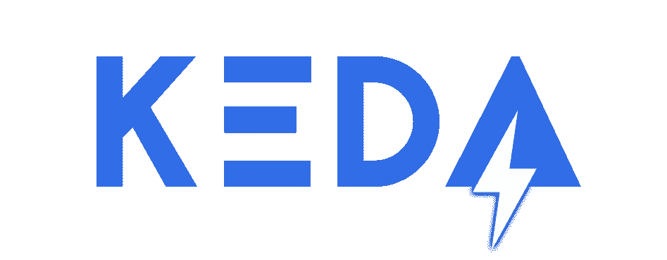
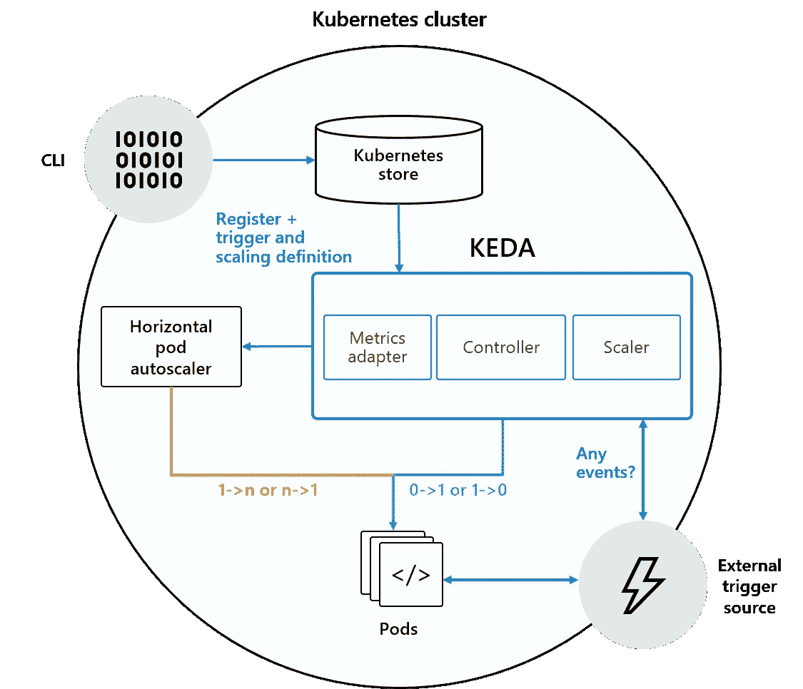

# 缩放 Kubernetes:基于 Kubernetes 的事件驱动自动缩放简介(KEDA)

> 原文：<https://levelup.gitconnected.com/scaling-kubernetes-intro-to-kubernetes-based-event-driven-autoscaling-keda-60d835a35cfd>

Kubernetes 集群需要计算资源来运行应用程序，这些资源可能需要根据应用程序的需求而增加或减少。这通常属于“扩展”的范畴，可以大致分为集群和应用程序扩展。

为了处理不断增长的需求，比如高流量，可以通过运行多个实例来扩展应用程序。在 Kubernetes 中，这相当于扩展部署来添加更多的单元。

您可以手动完成，但是`Horizontal Pod Autoscaler`是一个内置的组件，可以自动处理这个问题。您可能还需要横向扩展底层 Kubernetes 节点，比如虚拟机、裸机实例等。这也可以手动完成，但是您可以使用一个[集群自动缩放器](https://docs.microsoft.com/azure/aks/cluster-autoscaler?WT.mc_id=openMS-blog-abhishgu)，它将自动缩放您的集群。

这个博客系列将涵盖可以在现有 Kubernetes 原语之上使用的开源组件，以帮助扩展 Kubernetes 集群和应用程序。我们将探索:

以下是这一系列博文的分类:

*   第 1 部分(这篇文章)将涵盖基本的 KEDA 概念
*   第 2 部分将通过一个实例展示 KEDA 自动缩放的实际应用
*   第 3 部分将介绍虚拟 Kubelet
*   第 4 部分将用另一个例子来结束本系列，展示如何将 KEDA 和 Virtual Kubelet 结合起来提供可伸缩性

在这篇文章中，你将对 KEDA、它的建筑以及它的幕后运作有一个大致的了解。这将为你深入下一篇文章打下良好的基础，在下一篇文章中，你将通过一个实际的例子亲自探索 KEDA。



KEDA(基于 Kubernetes 的事件驱动自动缩放)是由微软[和红帽](https://cloudblogs.microsoft.com/opensource/2019/05/06/announcing-keda-kubernetes-event-driven-autoscaling-containers/)开发的开源组件，允许任何 Kubernetes 工作负载受益于事件驱动架构模型。这是 CNCF 的官方项目，目前是 CNCF 沙盒的一部分。KEDA 通过水平缩放一个 Kubernetes [部署](https://kubernetes.io/docs/concepts/workloads/controllers/deployment/)或一个[作业](https://kubernetes.io/docs/concepts/workloads/controllers/jobs-run-to-completion/)来工作。它构建在[Kubernetes Horizontal Pod auto scaler](https://kubernetes.io/docs/tasks/run-application/horizontal-pod-autoscale/)之上，允许用户利用 Kubernetes 中的`External Metrics`来基于来自任何事件源的信息定义自动缩放标准，例如 Kafka 主题延迟、Azure 队列长度或从 Prometheus 查询中获得的指标。

您可以从一系列[预定义触发器](https://keda.sh/#scalers)(也称为`Scalers`)中进行选择，这些触发器充当自动扩展部署(或`Job`)的事件和指标的来源。这些可以被认为是适配器，包含连接到外部源(例如 Kafka、Redis、Azure Queue)的必要逻辑，并获取驱动自动缩放操作所需的指标。KEDA 使用 [Kubernetes 操作符模型](https://kubernetes.io/docs/concepts/extend-kubernetes/operator/)，它定义了[自定义资源定义](https://kubernetes.io/docs/concepts/extend-kubernetes/api-extension/custom-resources/)，比如`ScaledObject`，你可以用它来配置自动缩放属性。

> *KEDA 内置了可插拔性，可以扩展以支持新的触发器/定标器*

在高层次上，KEDA 做了两件事来推动自动缩放过程:

*   提供一个组件来激活和停用部署，以便在没有事件时从零开始扩展
*   提供 Kubernetes 度量服务器来公开事件数据(例如，队列长度、主题延迟)



KEDA 使用三个组件来完成其任务:

*   `Scaler`:连接到外部组件(例如 Kafka)并获取指标(例如主题延迟)
*   `Operator`(代理):负责“激活”部署并创建水平窗格自动缩放对象
*   `Metrics Adapter`:将外部来源的指标呈现给水平 Pod 自动缩放器

让我们更深入地了解这些组件是如何协同工作的。

# 攀登者

如前所述，`Scaler`是由`ScaledObject`(自定义资源)清单定义的。它与在`ScaledObject`中定义的外部源或触发器集成，以获取所需的指标，并将它们呈现给 KEDA 指标服务器。KEDA 集成了多种来源，还可以使用可插拔接口添加其他定标器或外部指标来源。

一些定标器包括:

在 [KEDA 主页](https://keda.sh/#scalers)上可以找到最新的定标员列表。

KEDA 操作符由一个控制器组成，该控制器实现一个“协调循环”,并充当一个代理来激活和停用一个部署，以便从零扩展到零。这是由安装 KEDA 时运行的 KEDA 操作器容器驱动的。

它通过创建`Horizontal Pod Autoscaler` (HPA)对`ScaledObject`资源的创建做出“反应”。需要注意的是，KEDA 负责将部署从零扩展到一个实例，然后再扩展回零，而 HPA 则负责自动扩展`Deployment`。

然而，`Horizontal Pod Autoscaler`也需要指标来使自动缩放工作。它从哪里获得指标？输入度量适配器！

# 度量适配器

除了定义一个`Custom Resource Definition`和一个控制器/操作器来操作它，KEDA 还实现并充当外部度量的服务器。准确地说，它实现了 [Kubernetes 外部指标 API](https://github.com/kubernetes/community/blob/master/contributors/design-proposals/instrumentation/external-metrics-api.md) ，并作为一个“适配器”将来自外部来源的指标(如上所述)转换成一种形式，使`Horizontal Pod Autoscaler`能够理解和使用，从而驱动自动缩放过程。

虽然我们将在随后的博客文章中讨论细节，但这里是从开发人员的角度快速浏览一下如何使用 KEDA。一旦它被安装到您的 Kubernetes 集群，这就是您通常使用 KEDA 的方式(详细信息，请参考 https://github.com/kedacore/samples[的示例)。](https://github.com/kedacore/samples)

1.  创建一个`Deployment`(或者一个`Job`):这就是你希望 KEDA 基于缩放触发器缩放的应用程序。除此之外，它是完全独立的。
2.  创建一个`ScaledObject`:这是定制的资源定义，您可以用它来定义度量的来源，以及自动缩放标准。

一旦完成，KEDA 将开始从事件源收集信息，并相应地驱动自动缩放。下面是一个`ScaledObject`的例子，它定义了如何自动缩放一个 Redis 列表消费者，称为处理器，作为 Kubernetes `Deployment`在集群中运行。

```
apiVersion: keda.k8s.io/v1alpha1
kind: ScaledObject
metadata:
  name: redis-scaledobject
  namespace: default
  labels:
    deploymentName: processor
spec:
  scaleTargetRef:
    deploymentName: processor
  pollingInterval: 20
  cooldownPeriod:  200
  minReplicaCount: 0
  maxReplicaCount: 50
  triggers:
  - type: redis
    metadata:
      address: redis:6739
      listName: jobs
      listLength: "20"
    authenticationRef:
      name: redis-auth-secret
```

注意，`ScaledObject`定义主要分为两部分:一部分是通用的，另一部分是特定于事件源的(Redis 已经被用作一个例子)。

通用参数包括:

*   `scaleTargetRef.deploymentName`:您想要自动缩放的`Deployment`的名称
*   `minReplicaCount`:KEDA 将缩减部署的最小副本数量。您可以缩小到零，但也可以使用任何其他值
*   `cooldownPeriod`:在最后一个触发被报告为活动之后，在将部署缩放回`minReplicaCount`之前等待的时间段
*   `pollingInterval`:检查每次触发的时间间隔
*   `maxReplicaCount`:KEDA 将向外扩展部署的最大副本数量

事件源或触发器的具体参数有:

*   `triggers.type`:正在使用的事件源(如`redis`)
*   `triggers.metadata`:因触发器而异的属性(例如在`redis`的情况下，其地址、`listName`和`listLength`)
*   `triggers.authenticationRef`:允许您引用`TriggerAuthentication`对象，这是另一个 KEDA 特有的对象，用于捕获事件源的认证机制

KEDA 是一个轻量级组件，可以添加到任何 Kubernetes 集群中以扩展其功能。它可用于自动扩展从传统部署到 FaaS(无服务器功能)的各种工作负载。

您可以明确地选择和配置特定的应用程序(`Deployment`和`Job`)，让 KEDA 自动伸缩而不影响其他组件。KEDA 将确保您的应用程序缩减到零实例(可配置)，除非有工作要做。最后但同样重要的是，它是可扩展的。您可以以缩放器的形式集成自定义事件源，以驱动自动缩放过程。

请继续关注本系列的下一部分，在那里我们将借助一个实际的例子更深入地研究 KEDA。其他问题或意见？请在下面的评论中告诉我。

*原载于 2020 年 5 月 12 日*[](https://cloudblogs.microsoft.com/opensource/2020/05/12/scaling-kubernetes-keda-intro-kubernetes-based-event-driven-autoscaling/)**。**