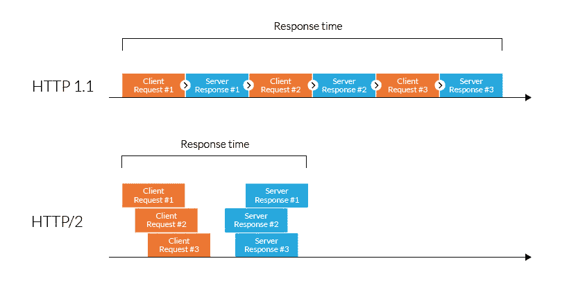
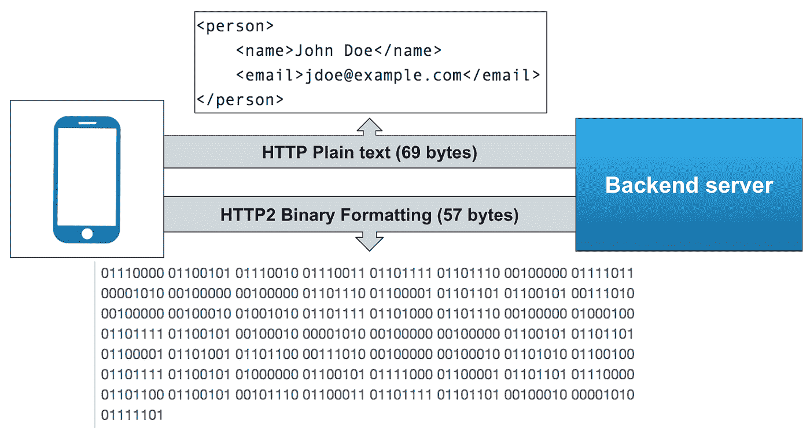
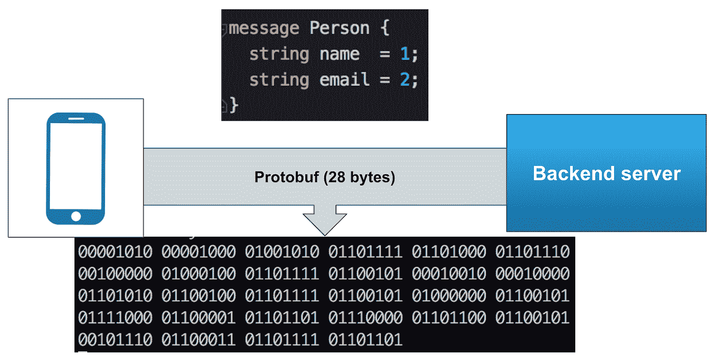
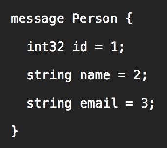
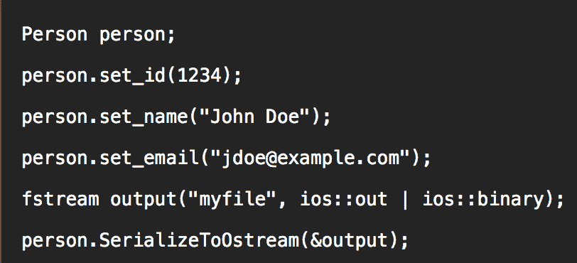
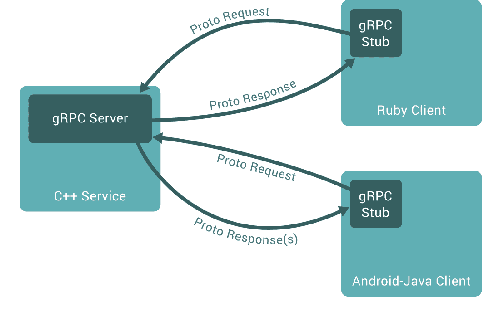

# 使用 gRPC 和 Envoy 代理扩展微服务—第一部分—使用 gRPC

> 原文：<https://levelup.gitconnected.com/scaling-microservices-with-grpc-and-envoy-72a64fc5bbb6>

你做过最终变得太大而无法处理的整体系统吗？您的组织是否倾向于将这样的大型整体系统分解为微服务架构风格？如果你还没有，那么也许你应该。虽然旅程并不容易，但绝对值得。原因如下。

# 微服务

微服务是一种软件开发技术——面向服务的架构(SOA)结构风格的变体——它将应用程序安排为松散耦合的、可单独部署的服务的集合。

它们提供了以下好处:
**模块化** 使得应用程序更容易理解、开发、测试，并且对架构侵蚀更有弹性。
**可扩展性** 由于微服务是彼此独立实现和部署的，因此可以独立地对它们进行监控和扩展。
**分布式开发** 它通过支持小型自治团队独立开发、部署和扩展他们各自的服务来实现开发的并行化。

现在想象一下，你正在任何叫车应用程序上预订一辆车。如果应用程序提供不同类型的车辆，您将选择一个更好的车辆，然后分别输入您的接送位置，选择您的付款方式，确认您的预订，并等待分配的司机来接您。

让我们将处理上述请求的后端服务称为预订订单管理系统。如果这个后端是使用微服务架构风格构建的，它可能会有以下微服务，每一个服务于不同的目的。

1.  一个根据用户的当前位置向用户显示可用的交通方式。
2.  一个显示可供用户选择的支付方式。
3.  一个用于在用户下订单后验证用户的真实性。
4.  一个用于处理预订请求，并将司机与用户匹配。

它可以包含更多具有规模的微服务，但上面的示例应该让您对微服务架构风格有所了解。

# 网络延迟

网络延迟是一个术语，用来表示网络数据通信中发生的任何类型的延迟。在 monolith 系统的情况下，网络延迟是客户端请求到达服务器和服务器的响应到达客户端的时间延迟。然而，在微服务架构中，不同的微服务可以提供不同的功能，每个微服务部署在不同的节点上。因此，单个流(比如预订创建)可能有多个服务依赖项，每个依赖项都会产生自己的网络延迟成本。

请求和响应的字节越大，通过网络传输数据的网络延迟就越大。gRPC 有助于减少网络延迟，但是在我分享如何减少延迟之前，让我先分享一些关于 HTTP 1.1 和 HTTP 2 的背景知识。

## HTTP 2 相对于 HTTP 1.1 的优势

HTTP 2 是运行在 TCP(第 4 层—传输层)协议之上的第 7 层(应用层)协议，TCP(第 4 层—传输层)协议运行在 IP(第 3 层—网络层)协议之上。下面是 HTTP 2 相对于 HTTP 1.1 的一些优势。

1.  **使用 HTTP 2 复用请求**

HTTP 1.1 的缺点之一是**行头阻塞**。

HTTP 1.1 行首阻塞和 HTTP 2 多路复用对响应时间的影响

考虑从客户端到服务器的单一网络连接，如上图所示。使用 HTTP 1.1，客户端会被阻塞，直到它收到对其请求#1 的响应，然后才能发送请求#2。您可以通过打开多个 HTTP 连接并发出并发请求来避免这种等待时间。但是，您可能会受到 HTTP 池大小或浏览器对并发连接数目的限制。

另一端的 HTTP 2 向服务器提供**多路复用**请求。
如上图所示，客户端可以发送请求#2，而不必等待响应#1，因此，上述必须创建多个 HTTP 连接来进行并发调用的方法消失了。

2.**从客户端到服务器的数据包传输**

每个请求/响应的网络延迟取决于传输的数据量。数据包越小，延迟越短。

使用 HTTP 1.1 和 HTTP 2 的数据包大小

让我们考虑一个在客户机和服务器之间传输的 XML 文档。如上图所示，您可以看到 HTTP 纯文本格式的 XML 包含的字节数(69 字节)比二进制格式的字节数(57 字节)多。这意味着二进制格式产生的网络延迟较少。

但是 57 字节仍然很高。也许我们可以进一步减少它？如果你想知道如何在 **Protobuf** 中找到答案。使用 Protobuf，您可以实现更小的数据大小，只有 28 个字节。

使用协议缓冲区的数据包大小

## 协议缓冲区

协议缓冲区(ProtoBuf)是一种灵活、高效、自动化的结构化数据序列化机制——想想 XML，但是更小、更快、更简单。

人.原型

您可以通过在中定义 Protobuf 消息类型来指定您希望序列化的信息的结构。原型文件。每个 Protobuf 消息都是一个小的信息逻辑记录，包含一系列名称-值对。下面是一个. proto 文件的例子，它定义了一条包含个人信息的消息。

一旦定义了消息，您就可以在上运行适用于您的应用程序语言的 Protobuf 编译器。生成数据访问类的原型文件。这些为每个字段提供了简单的访问器(如 *name()* 和 *set_name()* )，以及将整个结构序列化/解析为原始字节/从原始字节解析整个结构的方法。例如，如果您选择的语言是 C++，运行上面例子中的编译器将生成一个名为 **Person** 的类，通过编写如下代码，您可以使用该类在您的应用程序中填充、序列化和检索 Person 协议缓冲区消息:

使用从 Person.proto 生成的 Person 类的示例应用程序

## gRPC

**通用远程过程调用**或简称为 **gRPC** 是在 HTTP2 之上实现的现代 RPC 协议。与传统的 HTTP/REST/JSON 机制相比，gRPC 有很多优势，比如

1.  二元协议(HTTP/2)
2.  在一个连接上多路复用多个请求(HTTP/2)
3.  标题压缩(HTTP/2)
4.  强类型服务和消息定义(Protobuf)
5.  许多语言中惯用的客户机/服务器库实现

*   在 gRPC 中，客户端应用程序可以直接调用不同机器上的服务器应用程序上的方法，就像它是本地对象一样，这使得您可以更容易地创建分布式应用程序和服务。
*   gRPC 基于定义服务的思想，指定可以用参数和返回类型远程调用的方法。在服务器端，服务器实现这个接口，并运行一个 gRPC 服务器来处理客户端调用。在客户端，客户机有一个存根(客户机),它提供与服务器相同的方法。
*   使用 Protobuf 编译器，您可以从服务定义自动生成存根。原型文件)的任何 gRPC 支持的语言。

[gRPC 架构](https://grpc.io/docs/what-is-grpc/introduction/)

借助 gRPC，您可以降低网络延迟，从而在更短的时间内满足更多的请求。但这带来了另一个问题。现在，服务器每分钟需要处理比以前更多的请求。为了避免现有服务器过载，我们可以引入更多的服务器来分担负载。但是不均衡的负载分布仍然会导致少数服务器被过度利用，少数服务器被利用不足。这时，您可能会引入负载平衡器。

在这篇博文的第 2 部分[中，我将讨论负载平衡和特使代理。](https://medium.com/@nagaraj.kamalashree/scaling-microservices-with-grpc-and-envoy-proxy-part-2-148f589b2a83)

[1]协议缓冲器—[https://developers.google.com/protocol-buffers](https://developers.google.com/protocol-buffers)

[2] gRPC 负载均衡—[https://grpc.io/blog/grpc-load-balancing/#why-grpc](https://grpc.io/blog/grpc-load-balancing/#why-grpc)

# 参考

 [## gRPC 负载平衡

### 这篇文章描述了部署 gRPC 时看到的各种负载平衡场景。如果您使用 gRPC 和多个后端…

grpc.io](https://grpc.io/blog/grpc-load-balancing/)  [## 指导

### 本文向您介绍 gRPC 和协议缓冲区。gRPC 可以使用协议缓冲区作为其接口…

grpc.io](https://grpc.io/docs/guides/)