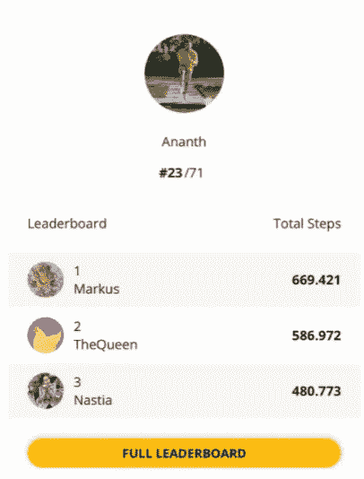
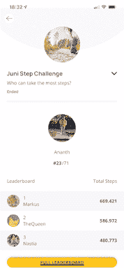
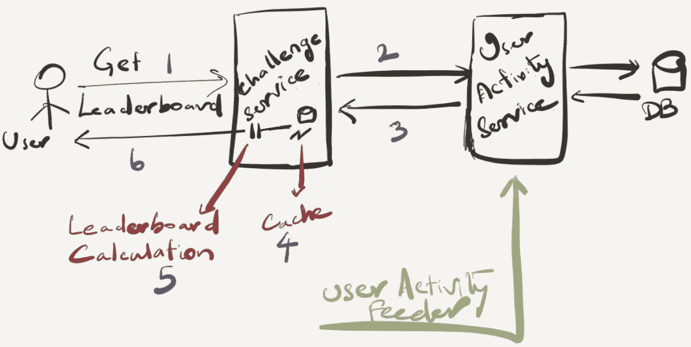
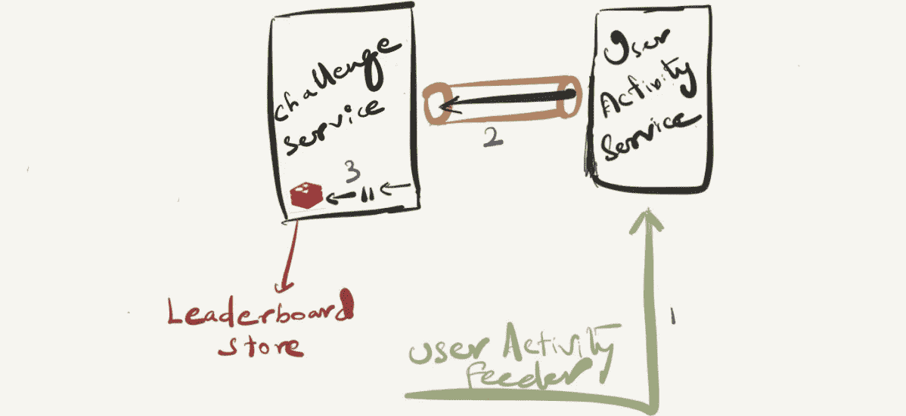
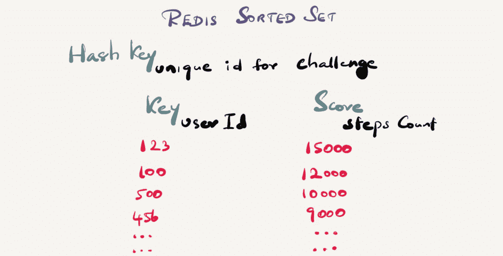
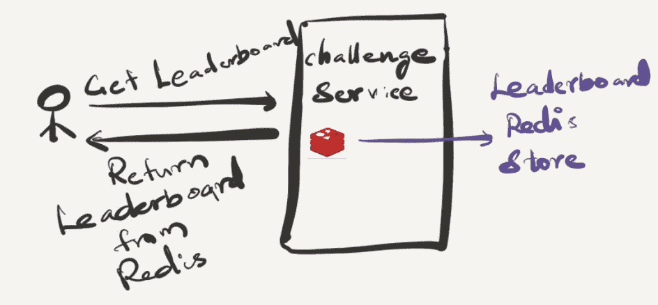

# 将我们的排行榜扩大到数百万用户

> 原文：<https://levelup.gitconnected.com/scaling-our-leaderboard-possibly-to-millions-of-users-778b0ca20ba3>

> "完美的架构决策是永远不需要做出的."罗伯特·马丁

在当今时代，保持健康意味着进行大量的体育锻炼，从工作中抽出一些时间，专注于“你”。在 [HUMANOO](https://www.humanoo.com/en/) 这里，我们正在构建这样一个健康& wellness 应用程序，为用户提供大量功能，以各种可能的方式过上健康的生活。

我们有一个这样的特征叫做“挑战”。这是一项功能，用户可以在我们的平台上根据他们的身体/应用内活动(如步数、跑步、骑自行车、锻炼时间等)相互竞争。为了简单起见，让我们假设我们正在为计步挑战建立一个排行榜。这是一个复杂的特性，还有很多其他方面，我不会在本文中涉及。**我们以排行榜的形式显示参与一项挑战**的用户排名。第一次创建排行榜时，我们为少量用户设计了排行榜。作为一种折衷，它最终变得不实时且不可扩展。

极速排行榜

在本文中，我将带您了解我们如何重新设计我们的排行榜功能，以便它可以扩展到数百万用户，同时考虑到实时性、极快的渲染速度和容错能力。

重新构建我们的排行榜是一次艰难的旅程，所以系好安全带！

# 排行榜规范

让我们先看看排行榜的规格，然后再深入了解它的技术方面。

用户活动排行榜—快照视图

*   应显示登录用户的姓名和所有参与者的排名
*   排行榜应根据参与者的活跃度对所有参与者进行排名(第一名是活跃度最高的参与者)，并提供以下详细信息:用户资料图片、用户名、排名、总活跃度
*   “完整排行榜”选项应显示所有参与者的完整排行榜。默认情况下，它显示 10 个参与者。在滚动时，它获取后续集合
*   挑战赛从 X 日开始到 y 日结束。排行榜只能在这段时间内更新

用户活动排行榜—完整视图

我们需要支持的两个主要功能需求是排行榜的**超快的渲染**和基于用户活动的**实时更新**。

## 非功能性需求

作为一个非功能性需求，排行榜应该是高度可扩展的、容错的、最终一致的。

*   ***高可扩展性*** :支持高扩展性。可能有数百万用户相互竞争

*   *****最终一致*** :排行榜中的用户活动更新可能会稍微晚一点(几秒钟)，这不是什么大问题。在设计系统时，可以考虑到这一点，以使高可用性优先于一致性**

# **遗留实现及其缺点**

**理解它是如何在我们的遗留系统中实现的以及它们的缺点是很重要的。以下是为客户呈现排行榜数据时涉及的组件:**

*   *****挑战服务*** :为用户举办挑战的服务，用户可以加入挑战并根据他们的活动相互竞争**
*   *****用户活动服务*** :聚合并存储不同用户活动的服务。无论我们系统中的哪个服务需要知道用户的活动，它都必须从这个服务中获取数据**
*   *****用户活动数据库*** :用户活动服务数据库**
*   *****排行榜缓存*** :排行榜缓存。每场挑战赛的排行榜将被缓存，每 30 分钟更新一次。这意味着，即使用户执行了一些活动，他们也会看到旧数据。**
*   ***:从不同的内部和外部系统(追踪器)获取用户活动数据并反馈给用户活动服务的服务***

******

***排行榜—传统架构***

***下面是用户流程:***

1.  ***用户请求他参加的挑战的排行榜。挑战赛服务公开了一个 REST API，用于返回特定挑战赛的排行榜。***
2.  ***只有当挑战服务知道挑战中所有参与者的活动数据时，才能建立排行榜。因此，为了获取所有参与者的活动，它批量调用用户活动服务中的 api(例如，每批 1000 个用户)。如果挑战中有 50k 个参与者，它将调用用户活动服务 api 100 次。***
3.  ***用户活动服务聚合特定用户从质询开始日期到结束日期的所有活动，这些活动将通过 api 传递。必须对所有参与者进行汇总***
4.  ***由于这已经是很大的工作量，为了不使用户活动服务过载，质询服务缓存从用户活动服务获得的接下来 30 分钟的用户活动响应。***
5.  ***挑战服务根据用户活动计算整个排行榜，然后向用户发送回复***
6.  ***在 api 响应中发回排行榜***

## ***缺点***

*   ***排行榜**无法实时更新**对于参与者来说是一个重大缺陷，人们会觉得参与挑战的动力不足，因为排行榜总是根据缓存的用户活动数据而不是真实数据计算得出的。下次更新仅在 30 分钟后进行。这是一个巨大的用户参与这一功能的滞后。***
*   ***缓存用户活动的原因是我们实现的可伸缩性差。当参与者不断增加时，我们必须多次调用用户活动服务，排行榜计算也不可扩展。***
*   ***还记得用户流第三步吗？—由于用户活动聚合是动态发生的，**它进一步降低了排行榜 api 的响应速度*****
*   ***我们只缓存用户活动，不缓存排行榜。也就是说，每次有用户要求时，我们都必须根据参与者的活动对他们进行排名。如果所有 50k 参与者都要求排行榜，排名计算会发生 50k 次。**一点也不理想，因为它由于资源消耗增加而给系统带来很大压力**。当然，这又会降低 api 的响应速度***

***上述传统实现具有所有缺点:糟糕的架构导致的可扩展性差，没有排行榜的实时更新，缓慢的 api 响应和高资源消耗。我们需要一个能克服上述大部分缺点并为我们的用户提供良好体验的重新架构。***

# ***重新架构***

***通过重新架构，我们希望解决遗留方法的缺点。我们通常需要重新思考构建分布式系统和消费数据 b/w 服务的方式，并为此选择正确的工具/技术。***

## ***事件驱动方法***

***我们决定将挑战服务改为事件驱动的方法，而不是调用用户活动服务“n”次。这意味着，每当用户活动有更新时，它都会发布该事件。Challenge service 订阅了它，并以某种方式使用它，以便它可以在每次用户活动更新时即时更新排行榜。数据结构尚未确定，因此挑战赛服务无法了解排行榜数据的确切存储位置和方式，以便更新数据。***

***最重要的是，使用事件驱动的方法，排行榜计算不会在用户请求时发生。它发生在后台，每当用户要求排行榜时，它只是返回它，而不是我们之前所做的 api 调用和所有计算。***

******

***排行榜—订阅用户活动变化***

***以下是当用户活动更新到来时，使用事件驱动方法更新排行榜的流程:***

1.  ***用户活动馈送器馈送用户活动的更新，并将存储在用户活动数据库中***
2.  ***用户活动服务进一步通过队列发布用户活动更新***
3.  ***挑战服务监听来自用户活动队列的消息，并为该特定挑战更新排行榜存储***

## ***为排行榜商店选择正确的数据结构***

***按照事件驱动的方法，我们需要一个在挑战服务中存储排行榜存储的数据结构。它必须是可扩展的，支持大量读写。使用 write，排行榜排名应该根据用户活动重新计算，这也需要支持高可扩展性。例如百万参与者排行榜。***

***仅举一些我们运营规模的快照，**每天至少有一百万条用户活动更新流入我们的系统**。最糟糕的情况是，由于我们不断增长的用户群和他们的活动，排行榜数据存储应该支持这一规模，甚至是两倍于此的规模。***

***如果我们选择任何类型的传统数据库，如 SQL、MongoDB 等。，他们没有任何内置的功能来为我们计算排名和排行榜。我们必须自己做，最重要的是**操作必须是原子的**，因为每个参与者都会有大量的更新。此外，考虑到从数据库的读取操作，我们可以微调查询、添加索引、使用物化读取等。但是**传统数据库可能不是排行榜用例**的合适选择，要记住不断增长的参与者和他们的活动。***

***Redis 有一个数据结构，称为[**排序集**](https://redis.com/solutions/use-cases/leaderboards/) **，这是为我们的排行榜用例**量身定制的，可提供高性能和实时用户体验。这也使得建立排行榜变得简单而直观。让我们在下一节看看它的核心功能。***

## ***我们如何使用 Redis 排序集***

***排序集实际上是一个键和一个值之间的映射，键是唯一的，值是与每个键相关联的分数。有了排序后的集合，你可以以一种非常快速的方式添加、删除或更新元素。由于元素是按顺序获取的，而不是按顺序获取的，所以您也可以通过分数或排名(位置)快速获取范围。访问一个有序集合的中间也非常快，所以你可以使用有序集合作为一个非重复元素的智能列表，在这里你可以快速访问你需要的一切:元素排序，快速存在测试，快速访问中间的元素！***

***让我们看看我们将如何在排行榜用例中使用排序集。这很简单。用户 id 是关键，他们的步骤计数将是排序集的值。每当一个新的条目被添加到已排序的集合中或者一个现有键的值被更新时，它会根据分数自动对已排序的集合重新排序。由于我们将在我们的平台上主持多个挑战，我们需要为每个挑战维护单独的排序集。现在我们需要另一个惟一的键来标识特定挑战的有序集合。为此，我们可以使用已排序集合的散列键。***

***这就是我们最终排序后的集合:**HashKey、Key、Value 或 Score 的组合。HashKey —质询的唯一标识符，Key —用户 id，Value —步数。*****

******

***排行榜的 Redis 排序集示例***

*****我们如何从有序集合中查询数据？*****

***在任何时候，我们都不需要加载整个排行榜。逻辑上我们可以分页显示排行榜。排序集应该支持存储条目的分页。 *zrevrange (* 以及 *zrange)* 取O(log(N)+M)执行，其中 N 是集合中的总条目数，M 是要返回的元素数。对于我们的排行榜，M 可以忽略不计，因为我们通常会对前 10 个条目或某个关键字周围的条目感兴趣，但不会对非常大的 M 感兴趣(非常大的 M 往往会使执行时间更接近线性)。***

***需要注意的是，在示例中，我们使用了 *zrevrange* 来获取使用 0 和 9 作为参数的前 10 个条目，但是我们可以在相同的执行时间内获取排行榜的任何范围。***

*****我们如何将数据存储到有序集合中？*****

***[z *add*](https://redis.io/commands/ZADD)***

# ***从用户角度看 API***

***让我们在获取特定挑战的排行榜时，从用户角度重新审视 api 的外观。由于我们已经将排行榜的读写操作分开，排行榜的读取操作将非常简单，如下图所示:***

******

***重新设计的排行榜 API 流程***

***要获取排行榜，只需从排序后的数据集中获取适当范围的数据。就是这样！没有更多的 api 调用，没有来自缓存的陈旧数据和真正快速的排行榜渲染。正是用户所要求的！***

# ***学习和后续步骤***

***在整个过程中，我们确实学到了很多东西:***

*   ***缓慢比失败更致命。建议采用快速失效和容错设计，以免消耗太多资源，最后惨败。缓慢会导致我们系统的连锁故障。***
*   *****将任何新技术或方法带入等式总是有风险的**。使用 Redis，我们还需要设置对 CPU 和内存等 it 资源的监控&可观察性，以便我们可以在正确的时间采取行动***
*   ***一般来说，Redis 缺乏记忆。**所以要小心处理 Redis 数据。**建议不要在 Redis 中长时间保存数据。每当不需要 Redis 时，最好将数据从 Redis 转移到 DB 等其他数据存储中，或者让 Redis 中的数据过期。***
*   ***Redis 不支持相同分数的用户使用相同的排名。因此，事情并不总是一成不变的。有时我们不得不**定制它或者用我们自己的实现来扩展它*****
*   ***事件驱动的方法伴随着谨慎，但却非常实用。也就是最终的一致性。**最终的一致性需要被产品和工程团队所接受**,它的行为必须被正确理解。选项之间总会有一些权衡，但需要与所有利益相关者沟通。***
*   ***[**读取和写入应被视为独立的操作**](https://medium.com/interviewnoodle/scalable-read-and-write-operations-in-backend-systems-4c3ef32b6ea0) 它需要一种不同的思维方式来从根本上重新思考我们构建数据密集型实时应用的方式***
*   *****任何时候任何事情都可能失败**。我们需要有一种方法来以可扩展的方式重建排行榜，即使有些事情失败了。***
*   *****不要忘记房间里的大象——那是数据**。仅仅这一点就会给你的系统带来很多挑战，甚至可能需要合适的工具和技术来配合使用。所以要小心处理。***

***这就是目前的情况——需要消化的信息很多，但我们的排行榜和挑战功能还没有涉及太多。我在这里展示的只是冰山一角。但我希望它能让我们对排行榜功能的系统设计有所了解。***

***你对排行榜功能的架构有什么想法，或者你对重新架构一些功能有什么经验？—我很想知道你的想法。***

******注:本帖与 Redis 合作撰写。******

# *****参考文献*****

*   ***[免费试用 Redis 云](https://redis.info/3NBGJRT)***
*   ***[观看此视频，了解 Redis 云相对于其他 Redis 提供商的优势](https://redis.info/3Ga9YII)***
*   ***[Redis 开发者中心——关于 Redis 的工具、指南和教程](https://redis.info/3LC4GqB)***
*   ***[RedisInsight 桌面图形用户界面](https://redis.info/3wMR7PR)***

****阅读阿南特·拉玛钱德朗(以及媒体上成千上万的其他作家)的每一个故事:**——你的会员费直接支持阿南特·拉玛钱德朗和你阅读的其他作家。你也可以在媒体上看到所有的故事。****