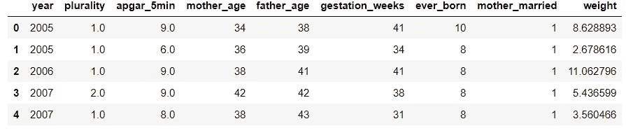
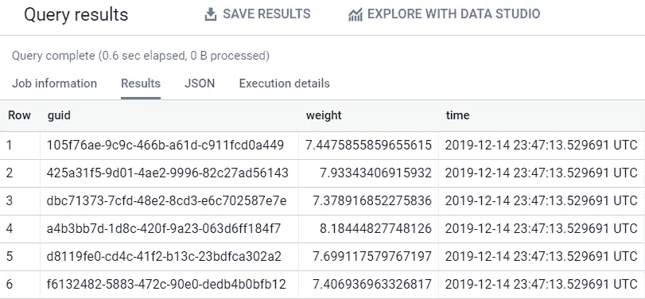
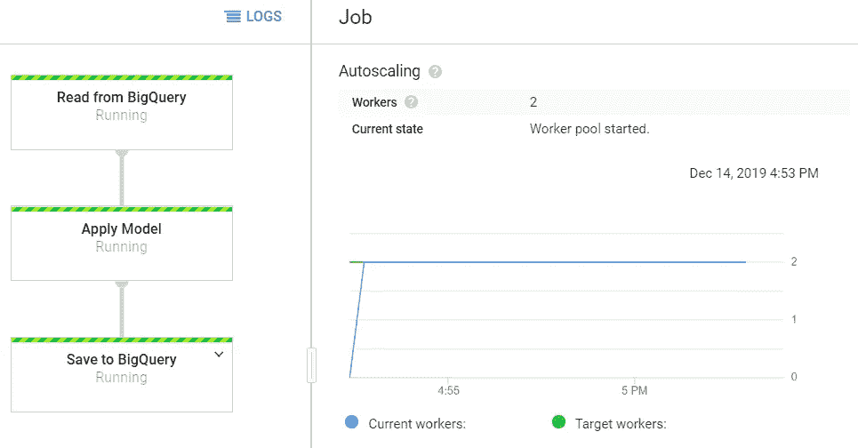

# 缩放 sci kit-使用 Apache Beam 学习

> 原文：<https://levelup.gitconnected.com/scaling-scikit-learn-with-apache-beam-251eb6fcf75b>


来源:https://www.pxfuel.com/en/free-photo-ozymu

## 第 7 章摘自“生产中的数据科学”

*Apache Beam 是一个开源项目，使数据科学家能够创作可以扩展到海量数据集的机器学习管道。我的书的这一章着重于用 Beam 构建批处理模型管道，它可以在使用云数据流的集群上运行。该节选展示了如何使用 BigQuery 作为数据源和数据宿来执行分布式模型应用，本章的完整源代码可在* [*GitHub*](https://github.com/bgweber/DS_Production/blob/master/CH7.ipynb) *上获得。有关设置 JSON 凭证文件的详细信息，请参见 GCP* [*文档*](https://cloud.google.com/iam/docs/creating-managing-service-account-keys) *和我的* [*书样*](https://leanpub.com/ProductionDataScience) *。*

[](https://leanpub.com/ProductionDataScience) [## 生产中的数据科学

### 从初创公司到数万亿美元的公司，数据科学在帮助组织最大化…

leanpub.com](https://leanpub.com/ProductionDataScience) 

Dataflow 是一个用于构建数据管道的工具，可以在本地运行，也可以在托管环境中扩展到大型集群。虽然 Cloud Dataflow 最初是作为一个特定于 GCP 的工具在谷歌孵化的，但它现在建立在开源的 Apache Beam 库之上，使其可以在其他云环境中使用。该工具提供了不同数据源的输入连接器，如 BigQuery 和云存储上的文件，用于转换和聚合数据的操作符，以及云数据存储和 BigQuery 等系统的输出连接器。

在这一章中，我们将使用数据流构建一个管道，从 BigQuery 读入数据，应用 sklearn 模型来创建预测，然后将预测写入 BigQuery 和云数据存储。我们将首先在数据子集上本地运行管道，然后使用 GCP 扩展到更大的数据集。

数据流旨在实现高度可扩展的数据管道，例如执行 ETL 工作，您需要在云部署中的不同系统之间移动数据。它还被扩展到构建 ML 管道，并且内置了对 TensorFlow 和其他机器学习方法的支持。结果是，Dataflow 使数据科学家能够建立大规模管道，而不需要工程团队的支持来扩大生产规模。

数据流中的核心组件是管道，它定义了作为工作流的一部分要执行的操作。数据流中的工作流是包括数据源、数据接收器和数据转换的 DAG。以下是一些关键组件:

*   **Pipeline:** 定义作为作业的一部分要执行的一组操作。
*   **集合:**工作流中不同阶段之间的接口。工作流中任何步骤的输入都是对象的集合，输出是新的对象集合。
*   DoFn: 对集合中的每个元素执行的操作，产生一个新的集合。
*   **转换:**对集合中的元素集执行的操作，例如聚合。

Dataflow 支持多种语言，但在本书中，我们将重点关注 Python 实现。Python 版本有一些注意事项，因为 worker 节点可能需要从源代码编译库，但它确实很好地介绍了 Apache Beam 中的不同组件。要使用 Beam 创建工作流，可以使用 Python 中的管道语法将不同的步骤链接在一起。结果是要执行的 DAG 操作可以分布在集群中的机器上。

在数据流管道中转换数据的两种方式是`DoFn`和`Transform`步骤。一个`DoFn`步骤定义了对集合中的每个对象执行的操作。例如，我们将查询 Natality 公共数据集，得到的集合将包含 dictionary 对象。我们将定义一个`DoFn`操作，该操作使用 sklearn 为每个字典对象创建一个预测，并输出一个新的字典对象。一个`Transform`定义了在一组对象上执行的操作，例如执行特征生成以将原始跟踪事件聚合到用户级摘要中。这些类型的操作通常与分区转换步骤结合使用，以将对象集合划分成可管理的大小。我们不会在本书中探索这一过程，但可以使用转换来应用 Featuretools，以作为数据流管道的一部分来执行自动化特征工程。

在这一章中，我们将着手构建可以在本地和完全管理的 GCP 集群中运行的数据流管道。我们将首先构建一个处理文本数据的简单管道，然后构建一个在分布式工作流中应用 sklearn 模型的管道。

Apache Beam 是一个开源库，用于使用 Java、Python 和 Go 构建数据处理工作流。Beam 工作流可以跨多个执行引擎执行，包括 Spark、Dataflow 和 MapReduce。使用 Beam，您可以使用`Direct Runner`在本地测试工作流，然后使用`Dataflow Runner`在 GCP 部署工作流。波束管道可以是批处理的，即执行工作流直到完成，也可以是流式的，即管道连续运行，在接收数据时近乎实时地执行操作。我们将在本章重点讨论批处理管道，在下一章讨论流式管道。

为了开始运行，我们需要做的第一件事是安装 Apache Beam 库。从命令行运行下面显示的命令，以便安装库，并在本地运行测试管道。`pip`命令包括`gcp`注释，用于指定数据流模块也应该被安装。如果最后一步成功，管道将输出莎士比亚的李尔王的字数。

```
**# install APache Bean** pip install --user apache-beam[gcp]**# run the word count example** python3 -m apache_beam.examples.wordcount --output outputs
```

为了执行这种计数逻辑，示例流水线执行多个不同的步骤。首先，管道以字符串对象集合的形式读入剧本，其中剧本中的每一行都是一个字符串。接下来，管道将每一行拆分成一个单词集合，然后传递给 map 和 group 转换，计算每个单词的出现次数。映射和分组操作是内置的 Bean 转换操作。最后一步是将字数统计集合写入控制台。

# 7.2 批量模型管道

云数据流为将 sklearn 模型扩展到海量数据集提供了一个有用的框架。我们可以在流程函数中单独评估每条记录，并使用 Apache Beam 将这些输出流式传输到数据接收器，如 BigQuery，而不是将所有输入数据放入 dataframe。只要我们有一种跨工作节点分发模型的方法，我们就可以使用数据流来执行分布式模型应用程序。这可以通过将模型对象作为辅助输入传递给操作者或者从持久存储(比如云存储)中读取模型来实现。在本节中，我们将首先使用 Jupyter 环境训练一个线性回归模型，然后将结果存储到云存储中，以便我们可以在大型数据集上运行该模型，并将预测保存到 BigQuery 和云数据存储中。

# 模型培训

我们将要执行的建模任务是在给定一些因素的情况下，使用出生率公共数据集来预测孩子的出生体重。要使用 sklearn 构建模型，我们可以在将数据集加载到 Pandas 数据框架并拟合模型之前对其进行采样。下面的代码片段显示了如何从 Jupyter 笔记本中对数据集进行采样，并可视化记录的子集，如图 [1.3](/1-2-batch-model-pipeline.html#fig:7-train) 所示。

```
from google.cloud import bigquery
client = **bigquery.Client**()sql = """
SELECT year, plurality, apgar_5min, 
       mother_age, father_age,    
       gestation_weeks, ever_born
       ,case when mother_married = true 
             then 1 else 0 end as mother_married
       ,weight_pounds as weight
  FROM  `bigquery-public-data.samples.natality`
  order by rand() 
  limit 10000
"""natalityDF = **client.query**(sql)**.to_dataframe**()**.fillna**(0)
**natalityDF.head**()
```



图 1.3:用于训练的抽样出生率数据集。

一旦我们有了用于训练的数据，我们就可以使用 sklearn 中的`LinearRegression`类来拟合模型。我们将使用完整的数据集进行拟合，因为维持数据是未被采样的数据集的剩余部分。一旦完成训练，我们可以使用`pickle`来序列化模型并保存到磁盘。最后一步是将模型文件从本地存储移动到云存储，如下所示。我们现在有一个经过训练的模型，它可以作为分布式模型应用程序工作流的一部分。

```
from sklearn.linear_model import LinearRegression
import pickle
from google.cloud import storage*# fit and pickle a model* 
model = **LinearRegression**()
**model.fit**(natalityDF.iloc[:,1:8], natalityDF['weight'])
**pickle.dump**(model, **open**("natality.pkl", 'wb'))*# Save to GCS*
bucket = **storage.Client**()**.get_bucket**('dsp_model_store')
blob = **bucket.blob**('natality/sklearn-linear')
**blob.upload_from_filename**('natality.pkl')
```

# 7.2.2 大查询发布

我们将首先构建一个 Beam 管道，它从 BigQuery 读入数据，应用一个模型，然后将结果写入 BigQuery。在下一节中，我们将添加云数据存储作为管道的附加数据接收器。这个管道将比前一个例子稍微复杂一些，因为我们需要在流程函数中使用多个 Python 模块，这需要更多的设置。

这一次，我们将遍历管道的不同部分，以提供关于每个步骤的更多细节。第一项任务是定义构建和执行管道所需的库。我们还导入了 json 模块，因为我们需要它来创建指定输出 BigQuery 表结构的 schema 对象。像上一节一样，我们仍然在对数据集进行采样，以确保我们的管道在处理完整的数据集之前工作正常。一旦我们对管道充满信心，我们就可以删除`limit`命令并自动扩展集群来完成工作负载。

```
import apache_beam as beam
import argparse
from apache_beam.options.pipeline_options import PipelineOptions
from apache_beam.options.pipeline_options import SetupOptions
from apache_beam.io.gcp.bigquery import parse_table_schema_from_json
import jsonquery = """
    SELECT year, plurality, apgar_5min, 
    mother_age, father_age,    
       gestation_weeks, ever_born
       ,case when mother_married = true 
          then 1 else 0 end as mother_married
      ,weight_pounds as weight
      ,current_timestamp as time
      ,GENERATE_UUID() as guid
    FROM `bigquery-public-data.samples.natality` 
    rand() 
    limit 100    
"""
```

接下来，我们将定义一个实现`process`函数的`DoFn`类，并将 sklearn 模型应用于出生率数据集中的单个记录。与以前的变化之一是我们现在有了一个`init`函数，我们用它来实例化一组字段。为了引用我们需要在`process`函数中使用的模块，我们需要在类中将这些模块指定为字段，否则当在分布式工作节点上运行函数时，引用将是未定义的。例如，我们用`self._pd`来指代熊猫模块，而不是`pd`。对于模型，一旦需要，我们将使用惰性初始化从云存储中获取模型。虽然可以实现由`DoFn`接口定义的`setup`函数来加载模型，但是对于运行者调用这个函数有一些限制。

```
class **ApplyDoFn**(beam.DoFn): def **__init__**(self):
        self._model = None
        from google.cloud import storage
        import pandas as pd
        import pickle as pkl
        self._storage = storage
        self._pkl = pkl
        self._pd = pd

    def **process**(self, element):
        **if** self._model is None:
            bucket = **self._storage.Client**()**.get_bucket**(
                                                 'dsp_model_store')
            blob = **bucket.get_blob**('natality/sklearn-linear')
            self._model =**self._pkl.loads**(**blob.download_as_string**())

        new_x = **self._pd.DataFrame.from_dict**(element, 
                            orient = "index")**.transpose**()**.fillna**(0)
        weight = **self._model.predict**(new_x.iloc[:,1:8])[0]
        return [ { 'guid': element['guid'], 'weight': weight, 
                                   'time': **str**(element['time']) } ] 
```

一旦模型对象被延迟加载到流程函数中，就可以使用它将线性回归模型应用到输入记录。在数据流中，从 BigQuery 检索到的记录作为字典对象的集合返回，我们的流程函数负责独立地操作每一个字典。我们首先将字典转换为熊猫数据框架，然后将其传递给模型以获得预测体重。process 函数返回一个字典对象列表，它描述了要写入 BigQuery 的结果。返回的是一个列表而不是一个字典，因为 Beam 中的过程函数可以返回零个、一个或多个对象。

下面的清单显示了一个传递给流程函数的示例`element`对象。对象是字典类型，其中键是查询记录的列名，值是记录值。

```
{'year': 2001, 'plurality': 1, 'apgar_5min': 99, 'mother_age': 33, 
     'father_age': 40, 'gestation_weeks': 38, 'ever_born': 8, 
     'mother_married': 1, 'weight': 6.8122838958, 
     'time': '2019-12-14 23:51:42.560931 UTC', 
     'guid': 'b281c5e8-85b2-4cbd-a2d8-e501ca816363'}
```

为了将预测保存到 BigQuery，我们需要定义一个模式，该模式定义了预测表的结构。我们可以使用一个实用函数将表模式的 JSON 描述转换成 Beam BigQuery 编写器所需的模式对象。为了简化这个过程，我首先创建了一个 Python dictionary 对象，并使用`dumps`命令生成 JSON。

```
schema = **parse_table_schema_from_json**(**json.dumps**({'fields':
            [ { 'name': 'guid', 'type': 'STRING'},
              { 'name': 'weight', 'type': 'FLOAT64'},
              { 'name': 'time', 'type': 'STRING'} ]}))
```

下一步是创建管道并定义射束操作的 DAG。这一次，我们不向管道提供输入或输出参数，而是将输入和输出目的地传递给 BigQuery 操作符。管道有三个步骤:从 BigQuery 读取、应用模型和写入 BigQuery。为了读取 BigQuery，我们传递查询并指定我们使用标准 SQL。为了应用该模型，我们使用自定义类来构建预测。为了编写结果，我们将模式和表名传递给 BigQuery 编写器，并指定如果需要，应该创建一个新表，如果数据已经存在，应该将数据追加到表中。

```
*# set up pipeline options* 
parser = **argparse.ArgumentParser**()
known_args, pipeline_args = **parser.parse_known_args**(None)
pipeline_options = **PipelineOptions**(pipeline_args)*# define the pipeline steps*
p = **beam.Pipeline**(options=pipeline_options)
data = p | 'Read from BigQuery' >**>** **beam.io.Read**(
       **beam.io.BigQuerySource**(query=query, use_standard_sql=True))
scored = data | 'Apply Model' >**>** **beam.ParDo**(**ApplyDoFn**())
scored | 'Save to BigQuery' >**>** **beam.io.Write**(**beam.io.BigQuerySink**(
                'weight_preds', 'dsp_demo', schema = schema,
   create_disposition=beam.io.BigQueryDisposition.CREATE_IF_NEEDED,
   write_disposition=beam.io.BigQueryDisposition.WRITE_APPEND))
```

脚本的最后一步是运行管道。虽然可以从 Jupyter 运行这个完整的代码清单，但是管道将无法完成，因为`project`参数需要作为命令行参数传递给管道。

```
*# run the pipeline*
result = **p.run**()
**result.wait_until_finish**()
```



图 1.4:big query 上的出生率预测表。

在数据流上运行管道之前，最好使用数据子集在本地运行管道。为了在本地运行管道，有必要将 GCP 项目指定为命令行参数，如下所示。使用 BigQuery 读写数据需要 project 参数。运行管道后，您可以通过导航到 BigQuery UI 并检查目标表中的数据来验证工作流是否成功，如图 [1.4](/1-2-batch-model-pipeline.html#fig:7-bq) 所示。

要在云数据流上运行管道，我们需要传递一个参数，将数据流运行器标识为执行引擎。我们还需要传递项目名称和云存储上的暂存位置。我们现在传入一个需求文件，该文件将`google-cloud-storage`库标识为一个依赖项，并使用 max workers 参数设置一个集群大小限制。提交后，您可以通过导航到 GCP 控制台中的数据流 UI 来查看作业的进度，如图 [1.5](/1-2-batch-model-pipeline.html#fig:7-scale) 所示。

```
*# running locally* 
python3 apply.py --project your_project_name*# running on GCP* 
echo $'google-cloud-storage==1.19.0' > reqs.txt
python3 apply.py \
  --runner DataflowRunner \
  --project your_project_name \
  --temp_location gs:**//**dsp_model_store/tmp/ \
  --requirements_file reqs.txt \
  --maxNumWorkers 5
```



图 1.5:使用自动缩放运行托管管道。

我们现在可以从管道中的查询中删除 limit 命令，并将工作负载扩展到整个数据集。当运行全面的管道时，关注这项工作以确保集群大小不会超出预期是很有用的。设置最大工作线程数有助于避免问题，但是如果您忘记设置此参数，集群大小可能会迅速扩大，并导致代价高昂的管道运行。

将 Python 用于数据流管道的一个潜在问题是，初始化集群可能需要一段时间，因为每个工作节点将从源代码安装作业所需的库，这对于 Pandas 等库来说可能需要大量时间。为了避免长时间的启动延迟，避免在需求文件中包含已经包含在数据流 SDK 中的库是有帮助的。例如，Pandas 0.24.2 包含在 SDK 版本 2.16.0 中，这是一个足够新的版本。

云数据流的一个有用方面是它是完全受管的，这意味着它处理硬件供应，在出现问题时处理故障，并可以自动扩展以满足需求。Apache Beam 对于数据科学家来说是一个很好的框架，因为它支持使用相同的工具进行本地测试和云部署。

本·韦伯是 Zynga 的一名杰出的数据科学家。我们正在[招聘](https://www.zynga.com/job-listing-category/data-analytics-user-research/)！