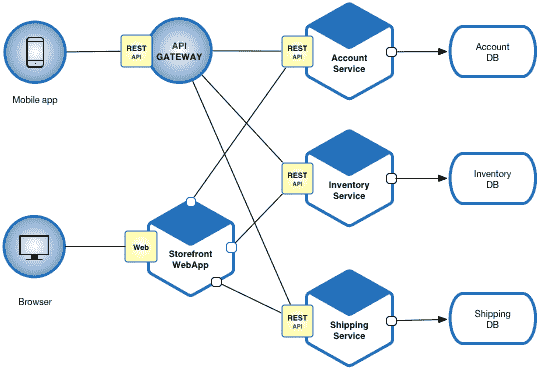

# 扫描微服务的依赖性

> 原文：<https://levelup.gitconnected.com/scanning-microservices-for-dependencies-d612096a4052>

## 在您的团队中应用自动化依赖管理

[照片](https://unsplash.com/photos/52gEprMkp7M)由[丹尼斯·库默](https://unsplash.com/@dekubaum?utm_source=medium&utm_medium=referral)在 Unsplash 上拍摄

在本文中，我们将介绍什么是软件依赖，以及如何在微服务架构中管理它们。然后，我们将看看在处理依赖性管理时要遵循的一些风险和良好实践。

📝*在本文中，我将使用术语包来指代一段代码，但是也可以使用其他术语来代替包(例如，库)。*

让我们从说明什么是依赖和存在什么类型的依赖开始。

依赖项可以是一个外部包，它本身可以有零个或多个依赖项。一旦包含在项目中，它就成为该项目的依赖项。同样的情况也会发生在它的所有依赖项上。

让我们来看一个代表在线商店的[微服务架构](https://martinfowler.com/articles/microservices.html)的例子。在订单购买过程中，系统需要处理一笔付款。为此，支付网关包作为外部依赖项包含在内。

[来源](https://microservices.io/i/Microservice_Architecture.png)

当支付网关包被添加到项目中时，它被称为直接依赖。如果它有链接到其他包的依赖项，这些依赖项被称为[传递依赖项](https://en.wikipedia.org/wiki/Transitive_dependency)。

既然我们已经知道了依赖关系及其类型的基本知识，让我们来看看如何管理它们。

# 依赖性管理

现在，假设上面例子中的微服务数量开始增长，开发团队为每个微服务创建不同的代码存储库。直接的和可传递的依赖关系的数量将变得难以管理，团队无法手动处理。

一个可能的解决方案是使用一个免费的工具，比如自动扫描依赖关系的[white source renewal](https://www.whitesourcesoftware.com/free-developer-tools/renovate)，把开发团队的负担带走。这样，就有可能检测到易受攻击的依赖版本，并将它们更新到最新版本。

每当一个依赖项需要更新时，renew 做两件事:它创建一个新分支，并打开一个包含新分支中的变化的 [pull 请求](https://en.wikipedia.org/wiki/Distributed_version_control#Pull_requests)。

因此，它通知开发团队已经创建了一个新的拉请求，团队成员可以决定是否要通过合并拉请求来修复依赖关系。

随着项目的不断发展，翻新将:

*   持续搜索易受攻击的依赖项。
*   在主分支中包括变更日志和依赖性变更的提交历史。
*   在每次更新时运行测试，以避免回归错误。

它还有一个[依赖仪表板](https://docs.renovatebot.com/key-concepts/dashboard/)，显示了存储库依赖状态的概述，允许团队跟踪和管理项目依赖。

让我们看看如果没有建立一个适当的依赖关系管理过程，会出现什么问题。

# 存在易受攻击的依赖关系的风险

当项目开始增长时，依赖项的数量也在增长，存在易受攻击的依赖项的风险也在增长。让我们来看看其中的一些风险。

*   **安全**:某些软件包在特定版本中可能存在安全漏洞。不更新到已修复漏洞的较新版本会使项目易受攻击。
*   **性能**:使用旧的包可能意味着那些包的最新版本中的一些性能优化被错过了。因此，项目的整体绩效也可能达不到其全部潜力。
*   质量:有些包可能已经过时了。在项目中使用这些包会产生一个漏洞，如果过时的包突然变得不可用，项目可能会崩溃。
*   **许可**:一个软件项目不仅绑定到它的直接依赖项的许可，还绑定到正在使用的传递依赖项的许可。跟踪所有依赖关系的[许可证](https://en.wikipedia.org/wiki/Software_license)很重要，这样公司就不会因为使用不兼容的软件许可证而产生高额费用。

现在，让我们来看看一些与依赖管理相关的良好实践。

# 良好做法

管理项目依赖关系可能会带来一些挑战。您如何知道依赖项何时容易受到攻击？识别易受攻击的依赖项后，与依赖项更新相关的更改将如何影响现有的代码库？

让我们来看看开发团队可以实施的一些好的实践。

*   **自动化**:对于开发团队来说，保持依赖关系的更新是一项耗时的任务。正如我们之前看到的，为此目的采用自动化工具可以使开发团队的生活更加轻松。
*   **优先化**:从了解哪些依赖项与系统核心紧密相关开始，花更多时间调查更新这些依赖项的影响。
*   **写一个策略**:写一个关于处理易受攻击的依赖项的策略可以帮助开发团队在更新易受攻击的依赖项时，不用怀疑要跟踪的路径。

应用上述实践将减少易受攻击的依赖项的风险。

# 包扎

每当一个新的软件项目开始时，依赖管理自动化应该成为一个优先事项。

如果公司有专门的安全或基础设施团队，这些团队将有适当的程序来处理依赖性管理。然而，在公司依赖于负责项目整个生命周期的自给自足的团队的情况下，那么就要由团队来关注这个主题，并为他们自己的利益建立一个自动化的过程。

有了这个过程，开发团队跟踪易受攻击的依赖项并解决它们就容易多了。

应该应用一个简单的规则:**越早、越频繁地查看依赖关系，越好**。

编码快乐！

# 分级编码

感谢您成为我们社区的一员！在你离开之前:

*   👏为故事鼓掌，跟着作者走👉
*   📰查看[升级编码出版物](https://levelup.gitconnected.com/?utm_source=pub&utm_medium=post)中的更多内容
*   🔔关注我们:[Twitter](https://twitter.com/gitconnected)|[LinkedIn](https://www.linkedin.com/company/gitconnected)|[时事通讯](https://newsletter.levelup.dev)

🚀👉 [**加入升级人才集体，找到一份神奇的工作**](https://jobs.levelup.dev/talent/welcome?referral=true)