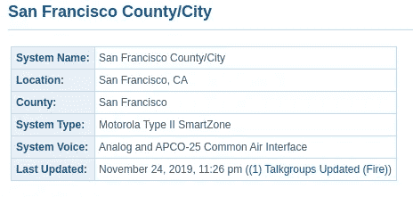
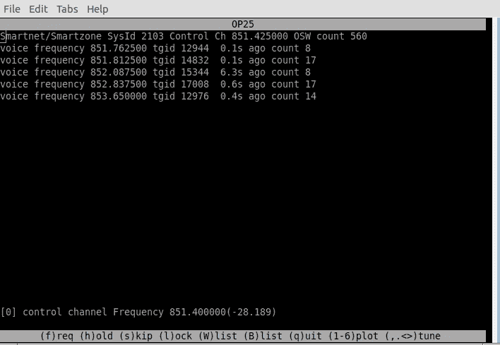

# 使用 SDR 和 OP25 扫描摩托罗拉 SmartZone 系统

> 原文：<https://levelup.gitconnected.com/scanning-motorola-smartzone-systems-with-sdr-and-op25-cd6d164d4b71>


照片由[伊戈尔](https://unsplash.com/@sakurayon?utm_source=unsplash&utm_medium=referral&utm_content=creditCopyText)在 [Unsplash](https://unsplash.com/s/photos/antenna?utm_source=unsplash&utm_medium=referral&utm_content=creditCopyText) 上拍摄

还记得过去的美好时光吗？那时你可以从 Radio Shack 拿起任何模拟扫描仪，就能听到当地警察局和消防局的声音。如果你住在任何一个相当大的城市附近，那么那些日子已经一去不复返了。大多数大规模市政无线电系统已经过渡到一种[数字中继](https://en.wikipedia.org/wiki/Trunked_radio_system)技术，这使得收听比仅仅调谐到一个特定的频率更加困难。

使用集群无线电系统，如果你想成功收听，你需要考虑多个不同的*移动*频率。集群系统使用控制信道向调谐到它的无线电设备发送连续的命令流，这样它们就知道使用什么频率。如果系统使用数字语音编码，那么你还必须考虑特定的语音编解码器。

当这些系统首次亮相时，为它们寻找硬件扫描仪是相当困难的。随着新技术的出现，业余无线电硬件爱好者(即使是买得起的)进入市场通常需要时间。如今，有许多手持和基站扫描仪可以让您成功地收听这些系统，但价格相当昂贵:

*   Uniden SDS 100(649 美元)
*   Uniden SDS 200(699 美元)
*   Uniden BCD 436 HP(499 美元)
*   惠斯勒·TRX-1(559 美元)

虽然这些是非常复杂和优雅的扫描仪，但如果您只想扫描普通的 SmartZone 或 P25 系统，您可能不需要所有额外的功能。还有一种更便宜的方法。

使用一个 [SDR](https://en.wikipedia.org/wiki/Software-defined_radio) 。

## SDR 硬件

软件定义无线电本质上是一个外部 RF 接收器(有时是收发器)，它连接到您的计算机(通常通过 USB)。这使您能够将计算机用作收音机来接收或发送信号。您可以使用不同的应用来调谐不同的频率，并完成复杂的、有时计算量很大的任务，这些任务通常需要昂贵的复杂硬件来完成。

有许多非常便宜的 SDR 加密狗，你可以花不到 50 美元买到，它不仅能扫描集群系统，还能探索你周围的射频环境。如果你是一个有执照的业余无线电操作员，你也可以在有执照的业余波段使用 SDR 收发器。

*   NooElec NESDR 智能 v4 套装(37.95 美元)
*   [NESDR SMArTee XTR SDR——高级版](https://www.amazon.com/NooElec-NESDR-SMArTee-XTR-SDR/dp/B06Y1D7P48/ref=sr_1_30?dchild=1&keywords=sdr&qid=1595892836&sr=8-30)(39.95 美元)

这两个 SDR 加密狗只会让你接收信号，如果你想传输我强烈推荐 [HackRF One](https://www.amazon.com/NooElec-Software-Defined-Antenna-Adapter/dp/B01K1CCHR0/ref=sr_1_4_sspa?dchild=1&keywords=sdr&qid=1595892926&sr=8-4-spons&psc=1&spLa=ZW5jcnlwdGVkUXVhbGlmaWVyPUExQ1hYOUVCVTEwODVWJmVuY3J5cHRlZElkPUEwMzU1ODI0TkRRNFJPR08xRjNRJmVuY3J5cHRlZEFkSWQ9QTA5NTczMTkxUjBMQzZYNTY3Wk5TJndpZGdldE5hbWU9c3BfYXRmJmFjdGlvbj1jbGlja1JlZGlyZWN0JmRvTm90TG9nQ2xpY2s9dHJ1ZQ==) 。它更贵，大约 300 美元，但它是一个优秀的成熟的设备。

如果你要扫描集群系统，选择多个 SDR 加密狗是很有用的。这是因为大多数集群系统覆盖了相当多的带宽。你需要两个或更多的 SDR 来适应不同的声音频率。首先，我建议买两个价格较低的 RX 专用加密狗。

## 基础和软件

有很多有趣的 SDR 软件。一些应用面向业余无线电，而其他应用可能面向科学分析目的或卫星跟踪。找到合适的应用程序集可能很困难，也很累人。试错是 SDR 世界的一大部分。你必须愿意亲自动手，学习一些核心概念，这样事情才能顺利进行。

*   这里有一个[很棒的视频](https://www.youtube.com/watch?v=dwDRAqfA7GI)，它包含了很多 WiFi 知识，但有来自 CWNPTV 的精彩射频基础知识。
*   如果你正在寻找更多的教育资源，我也在文章末尾提供了额外的链接。

一旦您掌握了 RF 基础知识，让我们开始安装扫描 SmartZone 和 P25 系统所需的东西。主包叫 [OP25](https://github.com/boatbod/op25) 。它是建立在 GNU Radio 之上的。这两个都是*非常密集的*应用。你可能会独自在 GNU 电台呆上一年，甚至连皮毛都没有。幸运的是，在开始基本扫描时，您不需要做太多的配置。

安装 OP25 不是一件容易的事情，所以我建议不要自己下载和编译。相反，有一个名为 DragonOS 的优秀 Linux 发行版，它为您预装和预构建了所有这些软件。浏览并下载可启动的 ISO:

[](https://sourceforge.net/projects/dragonos-lts/files/) [## LTS 德拉戈诺斯

### DragonOS LTS PublicBeta2(开始构建文档)升级了 Kismet 2020-03-R1 Jmbe-1.0.4 (P25 第 2 阶段支持)…

sourceforge.net](https://sourceforge.net/projects/dragonos-lts/files/) 

你要确保你得到了最新的公开版本，这个时候是 R4。一旦你把 DragonOS 操作系统拷贝到 u 盘上，你就可以启动你的电脑进入操作系统并开始安装 OP25。

每个 SDR 应用程序的所有文件都位于`/usr/src`中，所以现在就去那里浏览吧。您应该看到在这个目录中列出了`op25`。导航到`op25/op25/gr-op25_repeater/apps/`，找到标题为`smartnet_example.json`的文件。在这里，您将配置所有信息来扫描您的本地系统。

## 扫描

如果你还没有，前往[radioreference.com](https://www.radioreference.com/apps/db/)找到你想要扫描的当地无线电系统的详细信息。找到控制信道部分，并为下一步选择主要控制信道频率。例如，我在旧金山的本地系统是这样的:



来自 radioreference.com 的主要系统信息。


来自[radioreference.com](https://www.radioreference.com/apps/db/?sid=60)的频率和控制信道信息。

复制一份`smartnet_example.json`然后打开它，开始编辑里面的信息。这种配置要求您连接两个 RTL-SDRs 加密狗，因此当您看到两个不同的通道或频率参考时，请记住这一点。在配置中，每一个都将被标记为`rtl=0`和`rtl=1`。

找到标题为“设备”的部分，将两个 SDR 频率更改为您的控制通道频率:

```
"devices": [
        {
            "args": "rtl=0", 
            "frequency": 851400000, 
            "gains": "LNA:49", 
            "name": "rtl0", 
            "offset": 0, 
            "ppm": 0.0, 
            "rate": 1000000, 
            "tunable": true
        },
        {
            "args": "rtl=1", 
            "frequency": 851400000, 
            "gains": "LNA:49", 
            "name": "rtl1", 
            "offset": 0, 
            "ppm": 0.0, 
            "rate": 1000000, 
            "tunable": true
        }
    ]
```

在上面的例子中，我的控制信道频率是`851.400 Mhz`，但它是以原始 Hz 输入的，所以去掉小数点并添加适当数量的零。也可以随意将“收益”部分调整为`LNA:49`。

接下来进入“中继”部分。您可以在这里配置特定于扫描仪如何浏览音频和显示通话组的项目:

```
"trunking": {
        "module": "tk_smartnet.py",
        "chans": [
            {
                "sysname": "Example",
                "control_channel_list": "851400000",
                "tgid_tags_file": "",
                "tgid_hold_time": 2.0,
                "blacklist": "",
                "whitelist": "",
                "bandplan": "800_reband"
            }
        ]
    }
```

将`control_channel_list`更改为与上一步相同的控制信道频率。在`tgid_tags_file`中，您可以指定通话组 id 文件的路径以及它们相应的名称，但是到目前为止，我还不能成功地让它工作。

所有其他部分可以保持不变。这些是让大多数系统工作的基本初始配置更改。接下来让我们启动它，看看我们是否能听到什么。

如果您还没有保存之前的文件，那么从同一个`apps`目录运行以下命令(将配置文件的名称改为您的配置文件的名称):

```
./multi_rx.py -c <name_of_your_config> 2>stderr.log
```



OP25 扫描摩托罗拉 SmartZone 系统。

此时，您应该会看到一个新窗口，显示当前控制信道和正在接收的通话组的详细信息。如果您没有收到任何信息或听不到任何声音，那么您需要确认 SDR 是否调到了正确的频率。

如果你接近频率，但需要微调，使用`tune`热键向上或向下微调，找到控制频道的锁定。您也可以在 OP25 窗口激活的情况下按`1`进入显示信号最强位置的图表。


OP25 频率图窗口。

您也可以使用 CubicSDR 确认控制信道频率。这是 DragonOS 上提供的另一个 SDR 应用程序，让您探索 RF 并调谐到不同的频率。您可以从启动菜单访问 CubicSDR。一旦 CubicSDR 打开，调谐到控制信道频率，并确认您有一个良好的信号，可以听到连续的音调。


以立方为单位的强控制信道频率。

当你在隔间内探索时，你还可以研究周围的波段并找到额外的控制通道。如果您发现列出的系统主控制信道是无声的，请查看附近的信号尖峰以定位辅助信道。你有可能离主要频道太远，但离次要频道很近。

假设您已经找到了最近的控制信道并正确配置了中继，您应该会听到有电话进来。每个通话组及其相应的 ID 显示在 OP25 窗口中。你可以从[radioreference.com](https://www.radioreference.com/apps/db/)找到你系统的通话组 id，看看哪个部门在沟通。

## 更多资源

有大量免费和开放的资源可用于探索更多软件定义无线电世界。从学习射频基础知识到与卫星通信，什么都有。最好的开始方式之一就是探索你周围的环境。下面列出了一些精彩的附加资源，以了解更多信息:

*   [约翰·哈根西克的博客文章——第 25 章《假人》](https://www.hagensieker.com/wordpress/2018/07/17/op25-for-dummies/)(教育性)
*   [艾伦·施瓦茨日的博客帖子— OP25 指南](https://www.aaronswartzday.org/op25/)(教育性)
*   [立方数](https://cubicsdr.com/)(调谐器)
*   [Gqrx SDR](https://gqrx.dk/) (调谐器)
*   [SDR Sharp](https://airspy.com/download/) (调谐器)
*   [g 预测](http://gpredict.oz9aec.net/)(卫星追踪)
*   [带 HackRF 的 SDR](https://greatscottgadgets.com/sdr/)(教育)
*   [Ettus Research](https://www.ettus.com/) (高端 SDR 硬件)
*   [noolec](https://www.nooelec.com/store/)(经济实惠的 SDR 硬件)
*   黑客入侵无线世界 4.0——巴林特·塞伯(视频)
*   你所有的自由区都属于我——巴林特·塞伯(视频)
*   ARRL (业余无线电资源)

*感谢阅读！在* [*Twitter*](https://twitter.com/Tate_Galbraith) *上接触一些自己喜欢的 SDR 资源或故事。*