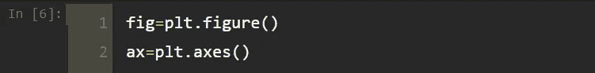
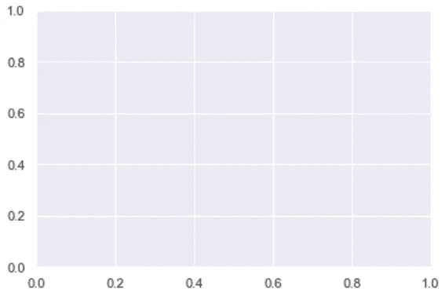
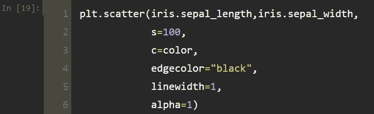
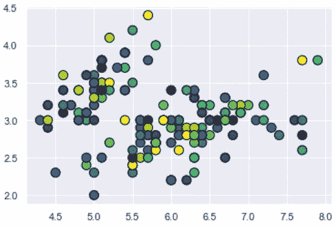
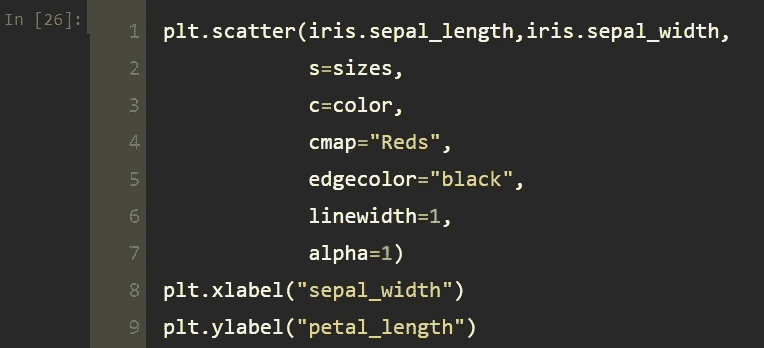

# 使用 Python 中的 Matplotlib 实践散点图

> 原文：<https://levelup.gitconnected.com/scatter-plot-with-matplotlib-in-python-abb1a6ad042>

## 数据可视化教程

## 如何使用绘图和散点图方法绘制优秀散点图的实用指南。

照片由 [Count Chris](https://unsplash.com/@countchris?utm_source=medium&utm_medium=referral) 在 [Unsplash](https://unsplash.com?utm_source=medium&utm_medium=referral) 上拍摄

散点图是一种用于显示两个变量的值的图。散点图也称为散点图、散点图或散点图。在这篇文章中，我将解释以下主题:

*   什么是散点图？
*   用绘图法绘制散点图
*   使用散点图方法的散点图
*   散点图法与图法

让我们开始吧！

 [## 蒂伦达兹学院

### 嗨，欢迎来到提伦达兹学院。Tirendaz 学院是一个在线教育平台，制作视频和写博客…

www.youtube.com](https://www.youtube.com/channel/UCFU9Go20p01kC64w-tmFORw) 

# 什么是散点图？

散点图是一种数据显示类型，它使用点来表示两个不同数值变量的值。您可以绘制一个散点图来查看两个数值变量(如体重和身高)之间的关系。你可以用散点图找到变量之间的相关性。

让我们使用 matplotlib 绘制一个散点图。为了展示这一点，让我们导入必要的库。

你可以在这里找到笔记本和数据集[。现在，让我们使用`%matplotlib inline` magic 命令来启用内嵌绘图。](https://github.com/TirendazAcademy/DATA-VISUALIZATION-WITH-PYTHON/blob/main/06-Scatter%20Plot%20with%20Matplotlib.ipynb)

让我们用 seaborn 指定图形的样式。

我将使用虹膜数据集来显示散点图。让我们用 seaborn 加载 iris 数据集。

让我们看看数据集的第一行。

数据集中有 4 个数值变量，它们是萼片高度和宽度、花瓣高度和宽度，还有一个变量表示鸢尾花的三种类型。您可以使用`plot`方法和`scatter`方法绘制散点图。首先，我将展示如何使用`plot`方法。

# 用绘图法绘制散点图

为了展示如何用`plot`方法绘制散点图，让我们创建一个图形对象和图形区域。

让我们画一个萼片长度和萼片宽度变量的散点图。

萼片长度和萼片宽度变量的散点图

你可以改变点的形状。为此，让我们使用`+`符号。

带+的散点图

让我们使用`v`选项查看三角形散点图。

三角形散点图

默认情况下，点的颜色是蓝色。你可以改变颜色。例如，让我们使用带有`rv`选项的红色。

三角形和红色散点图

您也可以使用`marksize`参数指定点的大小，如下所示:

三角形和红色散点图

# 使用散点图方法的散点图

你也可以用`scatter`方法画散点图。该方法类似于`plot`方法。让我们用这种方法画出萼片宽度和花瓣宽度的散点图。

使用散点图方法的散点图

您可以使用`s`参数调整圆点的大小。

带 s 参数的散点图

# 散点图法与图法

对于大样本，绘图法比分散法更快。此外，点的属性在散点法中单独输入。`c`参数用于点的颜色。例如，让我们使用紫色。

紫色散点图

您可以将`marker`参数用于点的形状。例如，让我们用三角形来画散点图。

带三角形的散点图

您可以使用`edgecolor`参数表示圆点的边框颜色，使用`linewidth`参数表示粗细。

带点边框颜色的散点图

您也可以使用`alpha`参数调整点的可见性。

使用 alpha 参数的散点图

您可以为每个点指定一种颜色。为了展示这一点，让我们为此创建一个颜色变量，并用`random.randint`方法生成 150 个介于 0 和 10 之间的数字。

接下来，让我们将这个颜色变量设置为`c`参数。

带颜色的散点图

您可以使用`cmap`方法调整点的颜色。在设置`cmap`方法的颜色时，需要以大写字母开始第一个字母，以字母 s 结束。

散点图

对于更多不同的颜色，您可以使用`"viridis"`选项。

带`viridis`选项的散点图

您也可以使用`colorbar`方法添加一个显示颜色数值的条。

带颜色条的散点图

您也可以使用`set_label`方法命名颜色条。

带颜色条的散点图

此外，您可以调整圆点的大小。为此，让我们用`random.randint`方法创建一个变量。

接下来，让我们将这个变量设置为参数 s。

不同大小点的散点图

您可以使用`xlabel`和`ylabel`方法来命名轴。

带轴名的散点图

最后，让我们用`title`的方法给这个情节起一个标题。

带标题的散点图

# 结论

您可以使用散点图来查看两个变量之间的关系。在这篇文章中，我谈到了使用`plot`和`scatter`方法的散点图。就是这样。我希望你喜欢它。感谢您的阅读。你可以在这里找到这个笔记本。别忘了在 YouTube 上关注我们

[提伦达兹艾](https://tirendazacademy.medium.com/?source=post_page-----abb1a6ad042--------------------------------)

## 用 Python 实现数据可视化

[View list](https://tirendazacademy.medium.com/list/data-visualization-with-python-72919ad57b84?source=post_page-----abb1a6ad042--------------------------------)11 stories

*如果这篇文章有帮助，请点击拍手👏按钮几下，以示支持👇*