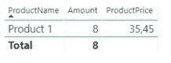

# Power BI 中用时态表实现 SCD

> 原文：<https://levelup.gitconnected.com/scd-implementation-with-temporal-tables-in-power-bi-35a6ca2a2c82>

缓慢变化的维度(SCD)，即随着时间推移缓慢且不可预测地更新的维度数据，而不是定期更新的维度数据，通常是任何数据仓库实现的重要部分。在 SQL Server 2016 中，微软为我们提供了[临时表](https://docs.microsoft.com/en-us/sql/relational-databases/tables/temporal-tables)，这让我们可以自动在表中保留数据更改的历史记录。

在本文中，我们将解释如何使用 SQL Server 时态表在 Power BI 中实现带有开始和结束日期的 type 2 SCD。

# 步骤 1:在 SQL Server 中创建时态表

首先，我们需要将要加载到 Power BI 中的数据。对于这个例子，我们创建了两个表，一个是系统版本的“Product ”,这是我们的维度，另一个是“Sales”表，包含我们的事实。我们为产品“产品 1”添加了一条价格为 35.45 的记录，并为该产品的“销售”表添加了三条记录。

稍后，我们将“产品 1”的价格从 20.00 更新为 35.45，并向“销售”表中添加新的采购。

如果我们将这两个表结合起来考虑日期，我们将会看到该产品的 7 次购买价格为 20.00，一次购买价格为 35.45。如果我们将表直接加载到 Power BI 中，并通过 ProductId 字段将它们连接起来，我们会发现并没有达到预期的效果。我们从时态表中获取维度的数据，而不是历史表。

为了让历史记录出现在我们的 Power BI 报告中，我们需要使用 SQL 加载“Product”历史记录表，并对数据导入应用一些逻辑，以将其正确地加入到“Sales”表中。

# 步骤 2:在 Power BI 中加载历史表并添加索引列

使用“FOR SYSTEM_TIME ALL”语句，我们可以从历史表中获取数据，并将其加载到 Power BI 中。

然后，我们将这个新表重命名为“ProductSCD ”,以区别于我们示例中的“Product”表。我们的模型中现在有三个表，“Product”、“ProductSCD”和“Sales”。

下一步是向“ProductSCD”表添加一个惟一的索引列，并添加逻辑，使用新的索引将该表链接到“Sales”表。在查询编辑器中，我们通过单击“Add Column > Index Column > From 1”将索引列添加到“ProductSCD”表中。这将为表创建一个名为“Index”的列，从数字 1 开始。然后，我们将该列重命名为“ProductIndex”。

接下来，我们将“Sales”表与“ProductSCD”表合并，以便从该表中获取链接值。我们使用 ProductId 字段连接它们，然后扩展该字段，从“ProductSCD”表中添加 ProductIndex、SysStartTime 和 SysEndTime。

我们现在希望在“Sales”表中创建一个新字段，该字段将链接到正确的 ProductIndex 字段。为此，我们使用以下代码将名为“ProductIndex”的自定义列添加到“Sales”表中:

然后，我们对新列进行过滤，只显示值> 0 的行，并删除我们在合并中加载的链接的 ProductSCD 行，因为它们不再需要，我们单击“Close and Apply”将更改应用到我们的模型。

# 第三步:加入新的维度

如果我们成功地完成了到目前为止描述的所有步骤，我们应该能够使用 ProductIndex 字段将“Sales”表链接到“ProductSCD”表。

如果我们现在创建与开始时相同的表，但是使用新的“ProductSCD”维度表，我们将能够看到我们期望的数据。

# 结论

正如我们所看到的，使用 SQL Server 时态表和 Power BI 中的一点调整，我们可以轻松地跟踪维度的变化，而不需要在 ETL 过程中实现和管理 SCD。

*来源:*

[https://docs . Microsoft . com/en-us/SQL/关系数据库/表/时态表？view=sql-server-ver15](https://docs.microsoft.com/en-us/sql/relational-databases/tables/temporal-tables?view=sql-server-ver15)

【https://www.zartis.com】最初发表于**。**

**作者:**

* [## Richard Goodman Martínez -高级 BI &分析开发人员◆ eShopWorld - Zartis | LinkedIn

### 理学硕士。在计算机工程从马德里理工大学与商业智能，数据经验…

www.linkedin.com](https://www.linkedin.com/in/rgoodmanmartinez/)*