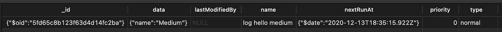

# 使用 agenda.js 安排 Node.js 任务📔

> 原文：<https://levelup.gitconnected.com/schedule-your-node-js-task-with-agenda-js-3dc40aab3316>

需要创建周期性任务？稍后执行任务？你可能需要议程。


扬森斯大学

# 介绍

构建 Node.js 应用程序时，您可能需要执行重复性任务或稍后运行它们。⏰

您可能知道 Linux 系统上的 CRON 作业。CRON 是一个基于时间的作业调度程序。它让我们每分钟、每一天、每一个月等等都能实现任务。

通过我们的 Node.js 应用程序，我们希望运行类似 CRON 的东西。但是怎么做呢？希望存在多种在 Node.js 上调度任务的解决方案:

*   节点时间表
*   节点克隆
*   公牛
*   议程

今天，我们将看看议程。在 [NPM](https://www.npmjs.com/package/agenda) 上，它被描述为“Node.js 的轻量级作业调度库”。

它提供了并发作业、延迟作业、可重复作业等功能。以 MongoDB 为动力。

在本文中，我们将使用 Node.js 和 Agenda 创建一个示例应用程序。🗓

# 设置

在使用 Agenda 之前，我们需要一个 Node.js 应用程序和一个 MongoDB 数据库来存储我们的作业。

**让我们初始化应用:**

```
npm init && touch app.jsnpm install agenda
```

**编写一点代码，并将其连接到 MongoDB:**

(如果没有 Mongo 数据库，可以创建一个 Docker 容器，如下所示)

```
docker run -d -p 27017:27017 --name mongodb mongo
```

*   app.js:

app.js

您只需要创建一个议程实例，传递 db URL 和集合名称。

将在您的数据库中创建一个新集合。

# 创造一份工作

现在我们有了一个议程实例，我们可以创建我们的工作了。

在此示例中，我们将创建一个虚拟作业来记录“Hello ${name}”。所以在 app.js 中，我们可以添加:

app . js-创建作业

创建作业时，可以在 attrs 变量中获取数据。

# 安排工作

一旦我们有了工作，我们就可以运行它们。在这一部分，我们将计划作业在 10 分钟内运行，如下所示:

app . js-计划作业

这将在我们的议程集合中创建一个文档:



MongoDB 中的计划作业

# 重复运行作业

议程允许我们运行重复性作业。例如每年。我们将创建一个虚拟作业来祝新年快乐:

app . js-重复作业

在这个例子中，您可以观察到我正在使用 CRON 语法。

议程帮助您计划作业，稍后或重复运行它们。您可以在此找到更多信息和功能[。](https://www.npmjs.com/package/agenda)

GitLab 回购:[dmg.link/blog-agenda-repo](https://dmg.link/blog-agenda-repo)

**你可以在这里** **找到我的其他文章并关注我** [**。感谢阅读，我希望你今天学到了一些新东西🚀**](http://nicolas-dmg.medium.com)

[](/automate-your-react-native-app-with-fastlane-ea516b4a893) [## 使用浪子自动化您的 React 原生应用程序

### 简化截图、测试版部署、应用商店部署和 React 原生应用的登录🚀

levelup.gitconnected.com](/automate-your-react-native-app-with-fastlane-ea516b4a893) [](/build-your-standalone-expo-app-locally-with-turtle-cli-87de3a487704) [## 使用 Turtle CLI 在本地构建您的独立 Expo 应用程序🐢

### 构建 iOS。ipa 和 Android。使用 Turtle CLI 在本地使用 apk expo 应用程序

levelup.gitconnected.com](/build-your-standalone-expo-app-locally-with-turtle-cli-87de3a487704)