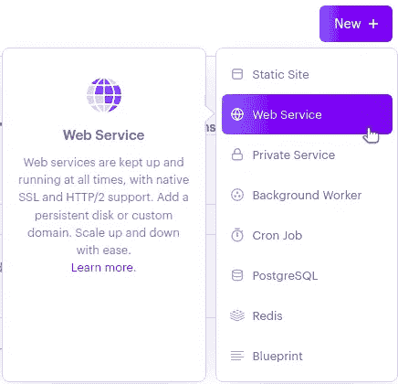
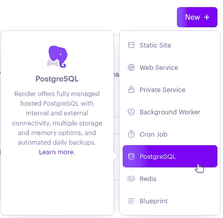
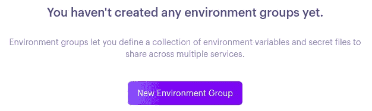
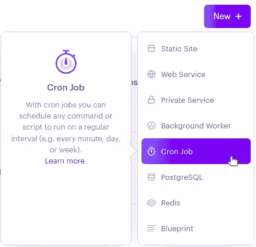

# 使用渲染调度 Cron 作业

> 原文：<https://levelup.gitconnected.com/scheduled-cron-jobs-with-render-92ae3d6cfc8f>


[阿卜杜勒·阿](https://unsplash.com/@abdullishere?utm_source=unsplash&utm_medium=referral&utm_content=creditCopyText)在 [Unsplash](https://unsplash.com/@abdullishere?utm_source=unsplash&utm_medium=referral&utm_content=creditCopyText) 上的照片

## 咖啡店里的编码

## 云托管和计划作业都在一个地方

程序员经常需要在固定的时间间隔或特定的时间自动运行一些循环过程。这个问题的一个常见解决方案是使用 cron 作业。当您拥有对自己的服务器的完全访问权时，配置 cron 作业就非常简单了。然而，当您使用应用程序托管服务时，配置 cron 作业有多难呢？谢天谢地，有些服务为你提供了这样做的方法。

在本文中，我们将通过一个小型项目展示如何在 [Render](https://render.com/) 上轻松设置和部署 cron 作业。

# 核心概念

## 什么是 Cron 工作？

cron 作业是一个 Unix 命令，`cron`按照由 [Cron 表达式](https://en.wikipedia.org/wiki/Cron#CRON_expression)确定的时间表作为后台进程运行。通常，cron 通过 crontab 配置文件来确定要运行的作业，crontab 配置文件由成对的 cron 表达式和相应的命令组成。

## 什么是渲染？

Render 是一个云应用程序托管服务，提供各种 web 服务托管解决方案，比如静态站点、web 服务器、数据库，是的，甚至是 cron 作业！Render 为您处理托管和部署的麻烦，以便您可以将所有时间用于构建项目。

## 什么是渲染 Cron 作业？

Render 提供了 cron 作业托管服务，简化了在云中部署和维护 cron 作业的过程。要设置 Render cron 作业服务，只需链接一个 GitHub repo，选择一个运行时，并提供要运行的命令和 cron 表达式来确定时间表。

# 我们的小型项目概述

我们的项目将是一个简单的服务，让我们创建和存储笔记。该服务还每小时运行一次 cron 作业，通过电子邮件向我们发送上一小时创建的所有笔记。该应用程序由三部分组成:

1.  处理创建便笺请求的 Express web 服务器
2.  存储注释的 PostgreSQL 数据库
3.  发送 notes digest 电子邮件的 cron 作业

我们将为每个组件使用渲染服务。我们还将使用 [Mailjet](https://www.mailjet.com/) 作为发送邮件的服务。对于我们的 Node.js 应用程序，我们将添加以下依赖包:

*   `pg`与数据库交互
*   作为生活质量的升级，允许我们使用异步函数作为我们的快速处理程序
*   `node-mailjet`，它是与 Mailjet API 交互的官方客户端库

我们假设您已经在开发机器上安装了 node . js。在我们的演示代码中，我们将使用 [Yarn](https://yarnpkg.com/) 作为我们的包管理器。

# 设置项目回购

让我们首先在 Render 上设置我们的项目 repo 和 web 服务。我们可以将 Render 的 [Express Hello World repo](https://github.com/render-examples/express-hello-world) 作为初始 Express server 样板代码。

在 Render 中，我们[创建了一个使用分叉 repo 的 web 服务页面](https://dashboard.render.com/web/new)。



我们为我们的 web 服务输入一个名称，然后继续使用所有的默认值。Render 完成部署后，我们会看到一个服务 URL。我们可以在浏览器中访问该 URL，以验证一切设置是否正确。

现在，我们可以将分叉回购克隆到我们的开发机器上，然后添加我们的依赖项:

```
~/project$ yarn add pg express-async-handler node-mailjet
```

随着我们最初的项目回购设置，让我们继续设置我们的数据库。

# 设置数据库

我们的数据库非常简单，只包含一个名为 notes 的表。该表将有一列存储注释文本，另一列存储注释创建时的时间戳。

我们将[在 Render 上创建一个 PostgreSQL 数据库服务](https://dashboard.render.com/new/database)。



我们为数据库服务提供一个名称，然后对所有其他选项使用默认值。创建数据库后，我们可以从本地机器连接到它，并创建`notes`表。从数据库仪表板中复制**外部**连接字符串，然后在本地项目目录中启动一个`node` [REPL](https://nodejs.dev/learn/how-to-use-the-nodejs-repl) 。我们将使用一个[连接池](https://node-postgres.com/features/pooling)来查询我们的数据库，所以我们需要导入`Pool`类，并用我们的外部连接字符串创建一个`Pool`对象:

```
const { Pool } = require('pg');
const pool = new Pool(
  { connectionString: '<External Connection String>?ssl=true'}
);
```

注意，因为我们在`node` REPL 中通过 SSL 连接，所以我们需要将`?ssl=true`附加到连接字符串的末尾。创建了池对象后，我们可以执行查询来创建表:

```
pool.query(
  'CREATE TABLE notes (text text, created timestamp);',
  console.log
);
```

瞧啊。我们的数据库是用我们的`notes`表建立的！

# 在渲染中设置环境组

在我们向 web 服务添加功能以开始填充表之前，让我们确保我们的 web 服务能够访问我们的数据库。事实上，因为我们的 web 服务和 cron 作业都需要连接到数据库，所以我们可以利用 Render 的环境组来创建一个共享的环境变量组，供两个服务使用。

为此，我们需要来自数据库仪表板的**内部**连接字符串，因为 web 服务和 cron 作业都将通过 Render 的内部网络与数据库通信。点击主渲染导航中的**环境组**。


接下来，点击**新环境组**。



为您的环境组选择一个名称。然后添加一个新变量，键为`CONNECTION_STRING`，粘贴内部连接字符串作为值(这次不需要`ssl=true`)。

一旦您创建了这个组，您就可以返回到 web 服务的**环境**设置。在**链接的环境组**部分，您可以选择刚刚创建的环境组，并点击**链接**。现在，我们的 Node.js 代码可以通过全局`process.env`对象访问我们在这个组中定义的任何变量。当我们开始构建我们的 Express 应用程序时，我们将看到一个这样的例子。让我们现在就做吧！

# 创建快速应用程序

我们的 Express 应用程序只有一个端点`/notes`，在这里我们将处理`POST`和`GET`请求。

当我们收到一个`POST`请求时，我们在数据库中创建一个新的注释行。我们希望请求的`Content-Type`是`application/json`，请求体的格式是`{"note": "<note text>"}`。我们还将记录请求的时间，并将该时间戳存储为注释的`created`值。

当我们收到一个`GET`请求时，我们将在数据库中查询所有的注释，并将它们作为 JSON 响应返回。

让我们从去除样板文件中所有不必要的代码开始。我们只需要保留下面几行，我们稍微改变一下`app.listen`回调:

```
const express = require('express');
const app = express();
const port = process.env.PORT || 3001;app.listen(port, () => console.log(`Notes server listening on port ${port}!`));
```

接下来，让我们添加我们需要的所有导入。同样，我们将使用连接`Pool`来连接数据库:

```
const { Pool } = require('pg');
```

此外，我们将使用`express-async-handler`包:

```
const asyncHandler = require('express-async-handler');
```

我们用`CONNECTION_STRING`环境变量实例化我们的`Pool`:

```
const connectionString = process.env.CONNECTION_STRING;
const pool = new Pool({connectionString});
```

因为我们期待一个 JSON `POST`请求，所以让我们也使用来自 Express 的 [JSON 中间件，它将把请求体解析成一个我们可以在`req.body`访问的 JavaScript 对象:](http://expressjs.com/en/api.html#express.json)

```
app.use(express.json());
```

## 处理`GET /notes`请求

现在我们可以进入应用程序的核心部分:请求处理程序。我们将从我们的`GET`处理程序开始，因为它稍微简单一些。我们先展示代码，然后解释我们做了什么。

```
app.get('/notes', asyncHandler(async (req, res) => {
  const result = await pool.query('SELECT * FROM notes;');
  res.json({ notes: result.rows });
}));
```

首先，我们使用`app.get`在`/notes`端点用`asyncHandler`注册一个异步函数。在回调的主体中，我们希望使用`pool.query`选择数据库中的所有笔记。我们返回一个 JSON 响应，其中包含从数据库中收到的所有行。

这就是我们所需要的`GET`处理器！

此时，我们可以提交并推动这些变更。Render 自动构建和重新部署我们更新的应用程序。我们可以验证我们的`GET`处理程序工作正常，但是现在，我们看到的只是一个悲伤的空 notes 对象。

## 处理`POST /notes`请求

让我们继续我们的`POST`处理程序，这样我们可以开始用一些注释填充我们的数据库！我们的代码如下所示:

```
app.post('/notes', asyncHandler(async (req, res) => {
  const query = {
    text: 'INSERT INTO notes VALUES ($1, $2);',
    values: [req.body.note, new Date()],
  };
  await pool.query(query);
  res.sendStatus(200);
}));
```

首先，我们用注释文本和创建时间戳在数据库中插入一个新行。我们从`req.body.note`获取注释文本，并使用`new Date()`获取当前时间。通过使用[参数化查询](https://node-postgres.com/features/queries#parameterized-query)，将`Date`对象转换为 PostgreSQL 数据类型。我们发送插入查询，然后返回一个`200`响应。

## 部署和测试

在推送我们的代码并进行 Render redeploy 之后，我们可以通过发送一些测试请求来测试我们的服务器。在命令行，我们使用`curl`:

```
curl -X POST <INSERT WEB SERVICE URL>/notes \
     -H 'Content-Type: application/json' \
     -d '{"note": "<INSERT NOTE TEXT>"}'
```

然后，您可以在浏览器中访问`/notes`端点，查看所有新创建的笔记！

# 创建 Cron 作业

将我们的项目联系在一起的最后一个组件是 cron 作业。这个 cron 作业将在每小时开始时运行，通过电子邮件向我们发送上一小时创建的所有笔记。

## 设置 Mailjet

我们将使用 Mailjet 作为我们的电子邮件递送服务。你可以在这里注册一个免费账户。

您需要从 API 密钥管理页面获得 Mailjet API 密钥和秘密密钥。让我们将这些键添加到我们之前创建的环境组中。添加以下环境变量:

*   `MAILJET_APIKEY`
*   `MAILJET_SECRET`
*   `USER_NAME`:邮件收件人的名字(你的名字)
*   `USER_EMAIL`:收件人的邮件地址(您的邮件地址)

## 实施 Cron 作业脚本

现在让我们编写我们将作为 cron 作业运行的脚本，我们可以称之为`mail_latest_notes.js`。同样，我们将使用一个`Pool`来查询我们的数据库，我们还想用我们的环境变量来初始化我们的 Mailjet 客户机:

```
const { Pool } = require('pg');
const mailjet = require ('node-mailjet')
  .connect(process.env.MAILJET_APIKEY, process.env.MAILJET_SECRET);
const connectionString = process.env.CONNECTION_STRING;
const pool = new Pool({connectionString});
```

接下来，让我们在数据库中查询最近一个小时创建的所有笔记。由于这将是一个异步操作，我们可以将脚本的其余部分包装在一个[async life](https://developer.mozilla.org/en-US/docs/Glossary/IIFE)中，这将允许我们使用`await`关键字使其更容易使用:

```
(async () => {
  // all remaining code will go here
})();
```

我们使用另一个带有`new Date()`的参数化查询来捕获当前时间，并使用它来过滤笔记。然而，这一次，我们希望获得比当前时间早一个小时的时间，这可以使用`setHours`和`getHours` Date 方法来实现，这样我们就可以过滤该时间戳之后的所有笔记:

```
const timestamp = new Date();
timestamp.setHours(timestamp.getHours() - 1);
const query = {
  text: 'SELECT * FROM notes WHERE created >= $1;',
  values: [timestamp],
};
const result = await pool.query(query);
```

我们检查返回了多少行，如果没有要发送的注释，我们就不会发送电子邮件。

```
if (result.rows.length === 0) {
  console.log('No latest notes');
  process.exit();
}
```

如果有行，那么我们用检索到的注释创建电子邮件。我们用`map`从每个注释行中提取文本，并使用 HTML 进行一些简单的格式化，用`<br>`标签连接所有注释文本:

```
const emailMessage = result.rows.map(note => note.text).join('<br>');
```

最后，我们使用 Mailjet 客户端向[发送一封电子邮件](https://dev.mailjet.com/email/guides/send-api-v31/#send-a-basic-email)，其中包含我们刚刚创建的消息和我们之前设置的环境变量。我们还可以记录从 Mailjet 返回的响应，以确保我们的电子邮件已发送:

```
const mailjetResponse = mailjet
  .post('send', {'version': 'v3.1'})
  .request({
    'Messages':[{
      'From': {
        'Email': process.env.USER_EMAIL,
        'Name': process.env.USER_NAME
      },
      'To': [{
        'Email': process.env.USER_EMAIL,
        'Name': process.env.USER_NAME
      }],
      'Subject': 'Latest Notes',
      'HTMLPart': `<p>${emailMessage}</p>`
    }]
  });console.log(mailjetResponse);
```

这就是我们的剧本所需要的！

# 设置渲染 Cron 作业服务

最后，让我们在 Render 上创建 cron 作业服务。



我们给我们的 cron 作业服务命名，并将环境设置为`Node`。然后，我们将命令字段设置为`node mail_latest_notes.js`。为了每小时运行一次脚本，我们将 schedule 字段设置为 cron 表达式`0 * * * *`。Render 在输入下面有一个漂亮的标签，用简单的英语显示了 cron 表达式的意思。我们创建 cron 作业。

接下来，我们转到 cron 作业服务的**环境**选项卡，并链接我们之前创建的环境组。剩下要做的就是等待 Render 完成构建我们的 cron 作业服务。然后，我们可以测试它！在构建完成之前，您可以创建更多注释，以确保脚本发送电子邮件。最后，您可以单击 cron 仪表板上的 **Trigger Run** 按钮来手动运行脚本，并检查您的收件箱以确保您收到了那封电子邮件。

至此，我们完成了 notes 项目！

# 结论

像`cron`这样的任务调度器是强大的工具，它提供了一个简单的接口来按照严格的时间表运行自动化流程。一些应用程序托管服务——如 Render——使您可以轻松地在 web 和数据库服务的同时设置 cron 作业服务。在本文中，我们通过构建一个小型项目来实现这一点，该项目保存笔记，然后由 cron 作业每小时发送一次电子邮件摘要。有了 Render，协调各种组件之间的通信和设置 cron 作业变得简单明了。

编码快乐！

【本文原载[此处](https://dzone.com/articles/scheduled-cron-jobs-with-render)。]