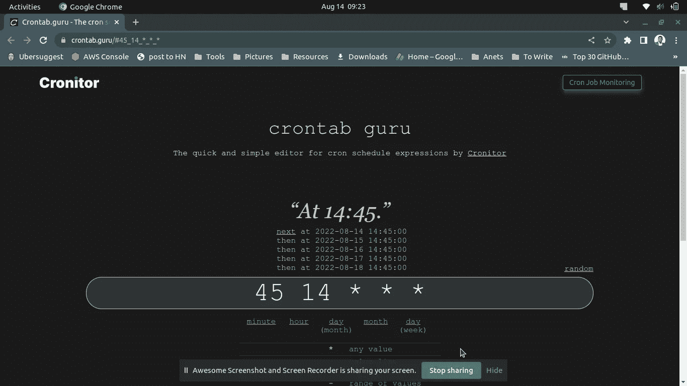

# 使用 Python 的无痛任务调度

> 原文：<https://levelup.gitconnected.com/scheduling-python-scripts-be0ef592d7d>

## 可以使用 Crontab，也可以使用这个


按计划运行任务并不是罕见的用例。几乎每个程序员都这么做。

用于调度的标准技术是使用 Cron 作业。我不反对使用 Cron，仍然认为这是一种稳定的方式。

但是如果您想要一个完全用 Python 编写的调度程序呢？如果您还希望更容易配置，该怎么办？

这是这篇文章的重点。

[](https://towardsdatascience.com/the-prefect-way-to-automate-orchestrate-data-pipelines-d4465638bac2) [## 自动化和编排数据管道的完美方式

### 我正在将我所有的 ETL 工作从 Airflow 迁移到这个超级酷的框架中

towardsdatascience.com](https://towardsdatascience.com/the-prefect-way-to-automate-orchestrate-data-pipelines-d4465638bac2) 

# 在 Python 中调度任务

python 中的任务调度通过名为' [schedule](https://schedule.readthedocs.io/en/stable/) 的 Python 包变得很容易您可以从 PyPI 存储库中安装它。

```
$ pip install schedule# If you're using [poetry instead of virtualenv](https://www.the-analytics.club/virtualenv-alternative-for-python-dependency-management)
poetry add schedule
```

该时间表使用了一种熟悉的构建器模式。它可以让你像用自然语言说话一样制定时间表。也就是说，如果你想每小时运行一次函数(比如说`send_email`)，你可以这样做:

```
schedule.every().hour.do(send_email)
```

这很接近正常的对话，不是吗？这是一个完整的发送电子邮件的脚本，但是是每天一次，而不是每小时一次。

上面的代码将在系统时间下午 2.45 调用 send_email 函数。

除了易于安排之外，该软件包还提供了一系列其他功能。

## 带装饰者的日程安排

我个人倾向于尽可能使用装饰者。更干净优雅。

“schedule”包支持现成的装饰器。这是我们发送电子邮件的例子，这次使用了 decorators。

在上面的例子中，您还可以看到我们已经为同一任务安排了两次。第一个将每 10 秒调用一次函数。第二个会每 5 秒叫一次。

## 运行带参数的计划任务

光靠排班是没多大用的。我们经常希望对函数的执行有更多的控制。我们通过传递参数来实现。

正如我们所看到的，我们的发送电子邮件函数带有一个可选参数，电子邮件。在调度时，我们可以将参数作为关键字参数传入。

这些只是在 Python 中使用库的几个例子。更多有价值的例子请参考[官方文件](https://schedule.readthedocs.io/en/stable/examples.html)。

# 用 cron tab 调度任务——传统方式。

Crontab 是运行计划任务最流行的技术。它出名有几个原因。

一个是由操作系统提供的。Crontab 是针对 Linux 的。甚至 Windows 用户也可以使用 WSL 使用 [Crontab。](https://www.howtogeek.com/746532/how-to-launch-cron-automatically-in-wsl-on-windows-10-and-11/)

另一个原因是 Crontab 独立于任务的编程语言。您还可以使用相同的技术来运行 node js 脚本。

首先，我们需要修改代码，使其按需运行，而不是按计划运行，因为 Crontab 会负责计划。

我在上面的版本中使用了 argparse 模块来[接受命令行参数](https://www.the-analytics.club/argparser-example-python-script)。你也可以使用 Typer 来[在 Python](https://www.the-analytics.club/python-cli-tutorial) 中创建更高级的 CLI。

[](https://towardsdatascience.com/a-simplified-guide-to-create-clis-for-your-data-science-project-bf9bcaa26e1) [## 为您的数据科学项目创建 CLI 的简化指南

### CLI 是一种与机器学习模型交互的强大而直接的方式...](https://towardsdatascience.com/a-simplified-guide-to-create-clis-for-your-data-science-project-bf9bcaa26e1) 

我们可以在终端中运行上面的脚本，如下所示:

```
$ python send_mail.py -e thuwarakesh@abc.com# OR without any arguments
$ python send_email.py
```

我们可以用下面的命令开始编辑 Crontab。

```
crontab -e
```

首次编辑时，命令提示符会要求您选择一个编辑器。我选择了 vim，因为它对我来说很舒服。但是你可以选择任何东西。

我在文件末尾添加了下面一行。

```
45 14 * * * /<ENV_PATH>/env/bin/python /<PROJECT PATH>/send_email.py -e thuwarakesh@abc.com
```

这个配置告诉 Crontab 在每天下午 2.45 运行`send_email.py`脚本。保存它并关闭文件。您的脚本应该按预期运行。

如果你不清楚 crontab 的配置，我最好的建议是使用 [Crontab.guru](https://crontab.guru/) 。



使用 [Crontab Guru](https://crontab.guru/) 创建 Crontab 配置—由[作者](https://thuwarakesh.mediu.com)截屏。

# Crontab 还是 Python 调度？

这两个工具都非常适合安排任务。但是根据不同的情况，一种比另一种更有效。

Python 的时间表的优点是它的灵活性和友好性。任何人只要看一下就能明白这个时间表。你甚至不需要参考文档。

尽管 crontab 配置并不难理解，但初学者需要花点功夫来理解它们。

一切都在一个地方，这使得时间表库很简单。在 Crontab 中，您必须在正在开发的模块之外编辑配置文件。如果其他人想使用你的应用程序，你必须指导他们。

此外，如果我想创建一个新的调度，我所要做的就是用另一个函数来注释这个函数。`@repeat`。此外，在 Crontab 中，您需要添加另一个配置行。但是没有在 Python 脚本中那么快。

这些优点使得 Python 的时间表库适合大多数用例。但是看看[库的文档页面](https://schedule.readthedocs.io/en/stable/#when-not-to-use-schedule)。

> 这个库旨在为简单的调度问题提供一个简单的解决方案。如果您需要记住重启之间的时间安排、亚秒精度执行、多线程、时区、工作日或假日支持，您可能应该去别的地方看看。—计划库文档。

# 最后的想法

在软件开发中，按计划运行任务是经常需要的。我经常发现在旅途中运行一些有效率的小程序很有用。

我使用 Crontab 已经好几年了，认为这是完成这项工作的唯一方法。但是 schedule Python 库让它变得超级简单。

它可能不是每个实例的完美工具。但并不是我们每天做的每件事都需要更复杂的技术。

现在，我已经将许多这样的定期执行转换为 Python 时间表。

> 感谢阅读，朋友！在[**LinkedIn**](https://www.linkedin.com/in/thuwarakesh/)[**Twitter**](https://twitter.com/Thuwarakesh)[**Medium**](https://thuwarakesh.medium.com/)上跟我打招呼。
> 
> 还不是中等会员？请使用此链接 [**成为会员**](https://thuwarakesh.medium.com/membership) 因为，在没有额外费用的情况下，我赚取了一点佣金。