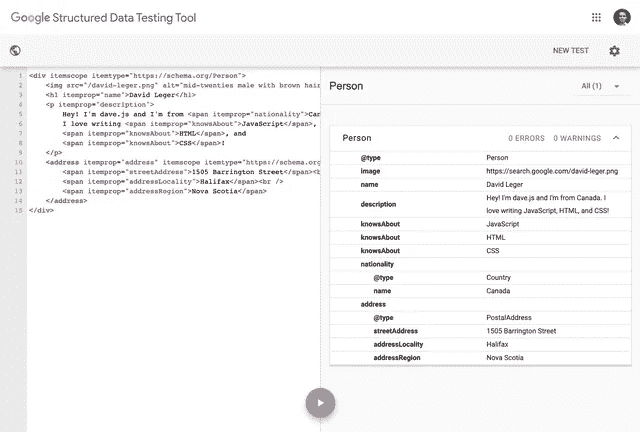

# Schema.org:你从未听说过的流行网络标准🤫

> 原文：<https://levelup.gitconnected.com/schema-org-the-popular-web-standard-youve-never-heard-of-d9b7ff28a22d>


在我做前端开发人员的大部分时间里，Schema.org 对我来说是一个*未知的未知*。我从 2010 年开始建立网站，就在一年多前，当我开始在 [Manifold](https://manifold.co/) 工作时，我才知道它的存在。

作为一个紧跟现代网络发展趋势的人，Schema.org 在我的视线之外已经太久了。为什么？

没有人谈论它！永远不会。

现在我是了。

# 什么是 Schema.org？

由谷歌、微软、雅虎和 Yandex 建立的开放标准，Schema.org 在 2013 年 4 月削减了其 v1 版本。是的，它确实已经存在*很久了。然而，它继续发展以支持人们以新的和不可预测的方式使用网络。*

那到底是什么？根据[Schema.org 主页](https://schema.org/):

> *Schema.org 是一个协作性的社区活动，其任务是创建、维护和推广互联网、网页、电子邮件等中的结构化数据模式。*

简单来说:Schema.org 帮助赋予网络内容以意义。它建立在语义 HTML 元素概念的基础上，赋予网络内容更丰富的含义。

就像语义 HTML，Schema.org 有助于搜索引擎优化(SEO)。通过给你的内容更多的上下文，搜索引擎可以更好地解析和分类你的内容，让人们更容易找到。搜索引擎甚至可以使用这些结构化数据来创建丰富的预览。


在 IMDb 的*复仇者联盟 4：终局之战*的预览中，我们看到评级数据已经被添加到搜索结果中。这是因为 IMDb 已经使用 Schema.org 正确地标记了内容。

另一种看待 Schema.org 的方式是它就像[的咏叹调](https://developer.mozilla.org/en-US/docs/Web/Accessibility/ARIA)，但是是为了 SEO 而不是可访问性。它不会改变你的网站的功能，但会为特定的受众(在这种情况下，这个受众就是搜索引擎)增强它。

# 向 HTML 内容添加 Schema.org

Schema.org 支持几种编码，然而，最常用的是*微数据*，它允许我们通过 HTML 属性直接用模式数据标记标记。

这个 API 非常简单。只有三个属性:

*   `itemtype`:定义项目的模式。
*   `itemscope`:定义物品的容器。
*   `itemprop`:定义项目的属性。

# 基本用法

下面是一个使用[人员类型](https://schema.org/Person)的简单示例:

```
<div itemscope itemtype="https://schema.org/Person">
  
  <h1 itemprop="name">David Leger</h1>
  <p itemprop="description">
    Hey! I'm dave.js and I'm from <span itemprop="nationality">Canada</span>. I
    love writing <span itemprop="knowsAbout">JavaScript</span>,
    <span itemprop="knowsAbout">HTML</span>, and
    <span itemprop="knowsAbout">CSS</span>!
  </p>
</div>
```

将`itemscope`和`itemtype`设置在顶层`<div>`上，使得其中的每一个`itemprop`都属于 Person 类型。

`itemtype`值只是您想要使用的类型的文档的 URL。为了知道哪一个`itemtype`和`itemprop`值最适合您的内容，您可以研究 Schema.org 文档，其中有关于如何使用每种模式类型的详细描述和示例。

注意`description`是如何包装另外两个`itemprop`的。不管级别如何，`itemprops`都将与最近的祖先`itemscope`相关联。我们也可以定义同一个`itemprop`的多个实例，如`knowsAbout`所示。

# 嵌套项目

但是，如果我们想在一个项目中嵌套项目呢？为此，我们可以定义一个新的`itemscope`。让我们扩展我们的 Person 项，并添加一个 [PostalAddress](https://schema.org/PostalAddress) 。

```
<div itemscope itemtype="https://schema.org/Person">
  
  <h1 itemprop="name">David Leger</h1>
  <p itemprop="description">...</p>
  <address
    itemprop="address"
    itemscope
    itemtype="https://schema.org/PostalAddress"
  >
    <span itemprop="streetAddress">1505 Barrington Street</span><br />
    <span itemprop="addressLocality">Halifax</span><br />
    <span itemprop="addressRegion">Nova Scotia</span>
  </address>
</div>
```

通过将`itemscope`添加到`<address>`元素中，我们将该标签中的所有`itemprop`限定到 PostalAddress 项目中。PostalAddress 通过使用`itemprop="address"`链接到 Person 项，如果没有它，它们将被解释为单独的、不相关的项。

# 隐式数据

有时我们想给搜索引擎提供一些我们不一定想在页面上显示的上下文。这可以通过使用`<meta>`标签来实现。这可能看起来有点奇怪，因为标签通常出现在网页的标签中，但是 Schema.org 建议对隐含内容使用元标签。

对于 Person 项，让我们使用一个`<meta>`标签添加我的昵称(dave.js ):

```
<div itemscope itemtype="https://schema.org/Person">
  
  <h1 itemprop="name">David Leger</h1>
  <p itemprop="description">...</p>
  <address
    itemprop="address"
    itemscope
    itemtype="https://schema.org/PostalAddress"
  >
    ...
  </address>
  <meta itemprop="alternateName" content="dave.js" />
</div>
```

# 测试 Schema.org 项目

测试你的项目很简单。谷歌提供了一个结构化数据测试工具来验证你的项目。它解析您的 HTML 并显示一个如何解释项目属性的树。它还显示每个`itemtype`所需或推荐的缺失属性的错误和警告。

这是我们用结构化数据测试工具解析的例子。



# 生活水平

Schema.org 是一个开源社区项目。虽然它得到了谷歌、微软、Mozilla 等大公司的支持，但还是鼓励公众投稿。尽管 Schema.org 自 2013 年就已经存在，但它是一种适应网络需求的生活标准。例如，最近发布的产品包括 [CovidTestingFacility](https://schema.org/CovidTestingFacility) 等项目类型，以帮助疫情救灾工作。

要了解更多关于 Schema.org 及其用法，请查看[文档](https://schema.org/docs/documents.html)。对于无数的项目类型有如此多的模式和关于如何使用它们的详细文档。

如果你想为 Schema.org 做贡献，请访问[社区页面](https://www.w3.org/community/schemaorg/)，看看你能帮上什么忙。