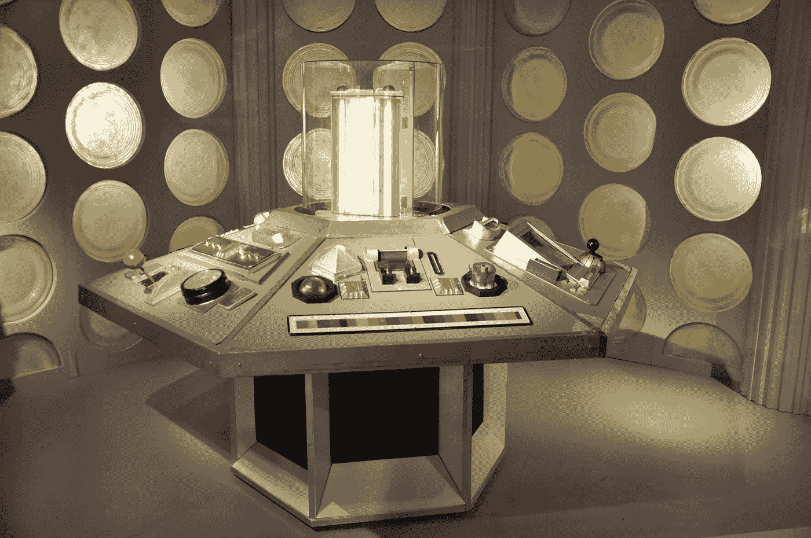

# 科幻与无障碍

> 原文：<https://levelup.gitconnected.com/sci-fi-and-accessibility-7bebba9bd92c>

## 这两者之间没有明显的联系

查理·西曼在 [Unsplash](/s/photos/sci-fi?utm_source=unsplash&utm_medium=referral&utm_content=creditCopyText) 上拍摄的照片

**作者注:**由于 Medium 拒绝为作者和读者解决其可访问性问题，我已经把我过去三年的博客移到了[子栈](https://accessability.substack.com/)。请在那里登记所有新文章的通知。此外，我会更新旧的文章(像这篇)，更新只会在[子栈](https://accessability.substack.com/)上发布。感谢您一直以来的读者和支持。

本月早些时候，我们举行了月度团队会议。有介绍(我们有了新的团队成员)和一些打破僵局的活动，人们被要求回答我们主任的一个问题。她在这次会议上的问题是这样的:

> 如果你有一台时光机，你会去哪里，为什么？

当人们开始回答这个问题时，有些人想回到未来，有些人想回到过去。我最大的“时间机器”愿望就是回到玛丽·居里的实验室和她一起工作。只要我能随身携带我需要的所有胰岛素:-)，也许还能服用一些格列卫来治愈她的白血病。

随着团队成员开始在 slack 中聊天，有一件事变得很清楚——我们中的许多人对科幻小说有着惊人的浓厚兴趣，这是我们以前没有意识到的。当每个人都在回答他们的问题时，背景聊天激烈地讨论着最受欢迎的作家(Vinge、Hamilton、Stross 和 Haldeman 被列在名单上)和即将到来的改编(如苹果的[基金会](https://www.esquire.com/entertainment/tv/a32944802/foundation-apple-tv-release-date-trailer-cast-spoilers-plot-details/))。巧合的是，我丈夫在会议的同一天晚些时候给我发了一篇 NYT 的文章，谈到乔治·马丁可能会如何完成《冬天的风》，这是《权力的游戏》系列的一个期待已久的总结，由于 COVID 隔离和无法按计划前往新西兰，他在过去两周内完成了三章。

当天晚些时候，在演讲会上，我是计时器——告诉每位演讲者他们讲了多长时间，以及他们何时达到了最短发言时间(绿色)、中等警告时间(黄色)和最长时间(红色)。我不擅长在缩放时切换背景(作为一个只使用键盘的用户，这真的很难做到)，所以我从附近的满书架上拿了三本书，分别有红色、黄色和绿色的封面。三部都是科幻片。

我们的“餐桌主题大师”问了一个关于我们在团队成员中发现的“小乐趣”的问题。当我们谈到易访问性团队对科幻感兴趣的例子时，我问自己“对科幻感兴趣和对易访问性感兴趣之间有共同点吗？”

# 答案是肯定的。

*   科幻是关于建立一个尚不存在的未来。
*   可及性是关于建立一个尚不存在的未来。

我的朋友们，这就是为什么我怀疑无障碍环境中热爱科幻的人比普通人多得多。我们一生都在为残疾人创造尚不存在的未来。

请在评论里加上你最喜欢的书/作者。总是寻找新的，好的读物！