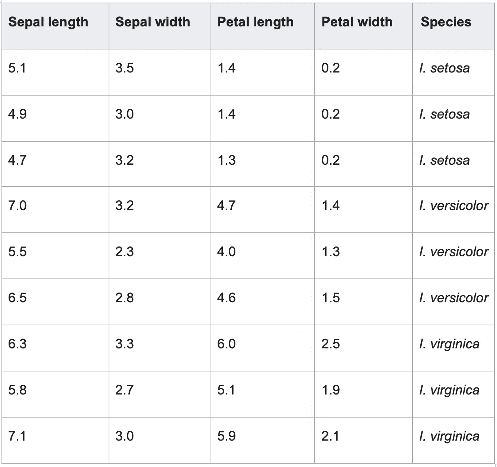
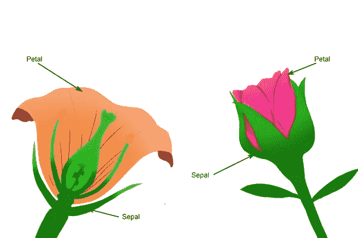

# Scikit-Learn 机器学习分类 101

> 原文：<https://levelup.gitconnected.com/scikit-learn-machine-learning-classification-101-c431de2dc2b2>


[https://www . prompt cloud . com/WP-content/uploads/2019/02/machine-learning-head-aid-article . jpg](https://www.promptcloud.com/wp-content/uploads/2019/02/machine-learning-hearing-aid-article.jpg)

这篇文章不是关于移动或 web 开发或云平台，而是关于我对机器学习世界的探索。虽然我仍然是这个领域的探索者，但我会时不时地在博客上写下我的观察。

在我们继续之前，让我们理解这篇文章的目标。这篇文章提出了一个常见的机器学习问题，这个问题之前已经讨论并解决了。我的主要意图不是再次解决问题本身，而是使用 [Scikit-Learn Python 库](https://scikit-learn.org/stable/)解释用于教育目的的机器学习分类程序的过程。

# 最低要求条款

在深入研究要解决的问题之前，我想指出一些我们需要理解的重要术语。

## 监督学习

你有一个针对特定问题的输入输出数据(又名训练数据)(通常由领域专家提供)，目标是让机器在做了**训练**后，发现一个将输入数据映射到输出数据的一般规律。经过适当的训练后，机器可以以特定的精度水平预测任何输入的输出。

例如，我们将在本文中讨论的分类问题(虹膜问题)。我们将有一些花瓣和萼片宽度和高度的数据，以及它们相应的物种类型。这样，我们就可以根据花瓣和萼片的宽度和高度来预测花卉的种类(在分类中，输出必须是训练数据中的可用输出之一)。

监督学习也包括类似于分类问题的回归问题。基于以前的训练，输入被映射到输出。但是在回归的情况下，输出是一个估计值**而不仅仅是一类输出**(例如，根据特定公司的股票价格历史数据预测其股票价格，它可以是任何正数)。

## 无监督学习

在无监督学习中，您有没有标签的输入数据，机器学习算法的责任是找出数据中所需的逻辑关系。这在聚类等问题中很有用。聚类和分类之间的区别在于，在聚类中(与分类不同)，您不知道数据组是什么。

无监督学习超出了本文的范围，但是我将在单独的帖子中讨论它。

还有其他类型的学习，如**半监督**和**重新执行**学习，但它们也超出了本文的范围。

# 虹膜问题描述

这是一个很常见的问题，在[维基百科](https://en.wikipedia.org/wiki/Iris_flower_data_set)中有很好的记录。Iris flower 数据集或 Fisher's Iris 数据集是由英国统计学家和生物学家罗纳德·费雪在其 1936 年的论文*“多元测量在分类问题中的使用，作为线性判别分析的一个例子”中引入的多元数据集。*

数据集由来自鸢尾属三个花种(`setosa`、`virginica`和`versicolor`)的每一个的许多样本组成。从 cm 中的每个样本测量四个特征:
1。萼片的长度。
2。花瓣的长度。
3。萼片的宽度。
4。花瓣的宽度。

基于这四个特征的组合，Fisher 开发了一个线性判别模型来区分花卉物种。下面是每个物种的样本数据。



你可能会问一个合理的问题——花瓣和花萼有什么区别？要回答这个问题，我参考 [Quora](https://www.quora.com/What-is-the-difference-between-sepals-and-petals) 里的一个很棒的回答:两者的主要区别是花瓣形成花的内轮，而萼片形成花的外轮，如下图。



[https://www . quora . com/萼片和花瓣的区别是什么](https://www.quora.com/What-is-the-difference-between-sepals-and-petals)

给定这个数据集，我们希望训练我们的分类器能够根据其萼片和花瓣数据预测鸢尾花的类别。

# 分类过程

为了对虹膜进行分类，我们将执行以下步骤:
1 .加载虹膜数据集。
2。将数据分成训练集和测试集。
3。在训练集上训练模型。
4。计算模型精确度。
5。对外部输入数据执行预测。

为了执行所有这些步骤，我们将使用 scikit-learn python 库:
[https://scikit-learn.org](https://scikit-learn.org/stable/tutorial/basic/tutorial.html)

scikit-learn 库是一个非常强大的 Python 库，它通过 Python 中一致的 API 提供了广泛的监督和非监督学习算法。它建立在安装 Sci-kit learn 之前必须安装的 SciPy 和 NumPy 之上。

使用 python pip3，您可以通过以下方式安装它:

```
pip3 install -U numpy scipy scikit-learn
```

现在，让我们进入分类步骤的细节。

## 1.正在加载数据集

scikit-learn 附带了 iris 数据集，因此我们在第一步中只需加载现有数据集，提取输入数据`iris.data`，并输出目标数据`iris.target`，如下面的代码所示。

```
from sklearn.datasets import load_irisiris = load_iris()data = iris.datatarget = iris.targettarget_names = iris.target_names
```

`iris.target_names`是指我们在引言中所说的特征名称。对于这个问题，我们有 4 个特性，所以如果我们打印`iris.target_names`，我们将得到如下输出。

```
[‘setosa’ ‘versicolor’ ‘virginica’]
```

## 2.为培训和测试拆分数据

为了测试我们的训练模型的准确性，我们需要一些关于准确性的参考，其中一种技术是将实际数据分成训练集和测试集，以便我们可以使用训练来进行实际的训练过程，然后使用测试集来验证模型输出并验证模型的准确性。让我们看看如何使用 scikit-learn API 来实现这一点。

```
from sklearn.model_selection import train_test_splitdata_train, data_test, target_train, target_test = train_test_split(self.data, self.target, test_size=0.3, random_state=12)
```

使用`train_test_split()` API，在一行中就可以进行数据分割，它需要以下参数:

1.**输入**数据(`self.data`)。
2。**目标**数据(`self.target`)。
3。**测试大小**，这表示我们想要在测试分割中包含整个数据集的多少，如果该参数是 float，它应该在 0.0 和 1.0 之间，并表示要包含在测试分割中的数据集的比例(`test_size=0.3`)。
4。**随机**状态只是一个随机数种子(`random_state=12`)。

## 3.培训模式

现在，我们需要开始在训练集上训练模型。我们将使用 K-Neighbors 分类器来执行这个分类(关于这个分类器如何工作的细节超出了这篇介绍性文章的范围):
[https://sci kit-learn . org/stable/modules/generated/sk learn . Neighbors . kneighborsclassifier . html](https://scikit-learn.org/stable/modules/generated/sklearn.neighbors.KNeighborsClassifier.html)

可以使用下面两行代码来训练模型。

```
from sklearn.neighbors import KNeighborsClassifierclassifier = KNeighborsClassifier()classifier.fit(data_train, target_train)
```

我们使用`fit()`方法训练模型，将训练的输入数据`data_train`作为第一个参数，将目标输出数据`target_train`作为第二个参数。

## 4.计算模型精确度

为了计算模型精度，我们将使用测试分割`data_test`来预测步骤 3 中建立的模型，然后我们将使用`metrics.accuracy_score()` API 来计算预测输出`target_pred`如何远离原始正确输出`target_test`。

```
from sklearn import metricstarget_pred = classifier.predict(data_test)accuracy = metrics.accuracy_score(target_test, target_pred)
```

`accuracy_score()`将原始正确输出`target_test`作为第一个参数，在第二个参数中，将预测输出`target_pred`作为第二个参数。最后，`accuracy_score()`返回一个从`0`到`1`的分数，其中`1`表示性能最好，0 表示性能最差。

如果我们打印精度变量，我们会发现它等于`0.9777777777777777`，这是一个非常好的精度。

## 5.执行实际预测

最后，我们到了最后一步，即执行实际的预测。为此，我们创建了一些外部测试输入样本，并将询问模型是否可以预测鸢尾花的数据是属于 setosa、virginica 还是 versicolor。让我们用下面的三行代码来看看如何做到这一点。

```
external_input_sample = [[5, 2, 4, 1], [6, 3, 5, 2], [5, 4, 1, 0.5]]prediction_raw_values = classifier.predict(external_input_sample)prediction_resolved_values = [target_names[p] for p in prediction_raw_values]
```

如果我们打印`prediction_resolved_values`，我们会发现预测出来的是:

`[‘versicolor’, ‘virginica’, ‘setosa’]`

# 把所有的部分连接起来，包装起来

实际上，我们可以将前面的所有分类步骤总结为两个抽象步骤:

1.培训(从步骤 1 到 4)。
2。预测(第五步)。

我们还可以按需添加额外的抽象步骤模型保存/加载，以避免每次都重新训练模型。这都由这个简单的**basicrisclassifier**类来处理。

运行这个 Python 类后，我们将得到以下输出。

```
Model Accuracy: 0.9777777777777777Prediction for [[5, 2, 4, 1], [6, 3, 5, 2], [5, 4, 1, 0.5]] =>[‘versicolor’, ‘virginica’, ‘setosa’]
```

正如你可能在最后注意到的，我们调用了`saveModel()`，它使用 joblib 的`dump()` API 保存了实际的模型。还有一个调用`loadModel()`的注释行，它可以使用 joblib 的`load()` API 加载模型，如果你想避免每次执行这个类时重新训练你的模型，这一步很重要。这意味着我们可以简单地做以下事情来预测任何外部输出。

```
basic_iris_classifier.loadModel()prediction = basic_iris_classifier.predict(external_input_sample)print(“Prediction for {0} => \n{1}”.format(external_input_sample, prediction))
```

注意，这段代码在我的 GitHub 里有，你可以随意检查它，提问，想怎么玩就怎么玩:
[https://github.com/hazems/basic-knn-classifier-python](https://github.com/hazems/basic-knn-classifier-python)

快乐学习:)。

感谢 [@mohammed_nabil](http://twitter.com/mohammed_nabil) 和 [Rao，Yogeswara](https://www.linkedin.com/in/yogeswararaol/) 。

[](https://gitconnected.com/learn/python) [## 学习 Python -最佳 Python 教程(2019) | gitconnected

### 80 大 Python 教程-免费学习 Python。课程由开发人员提交并投票，使您能够…

gitconnected.com](https://gitconnected.com/learn/python)