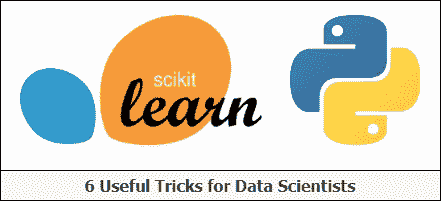
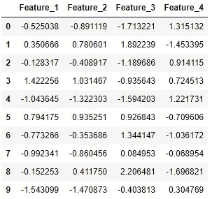
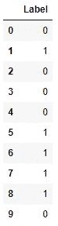
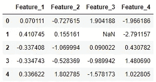
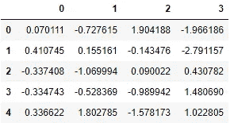
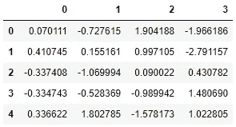
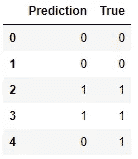
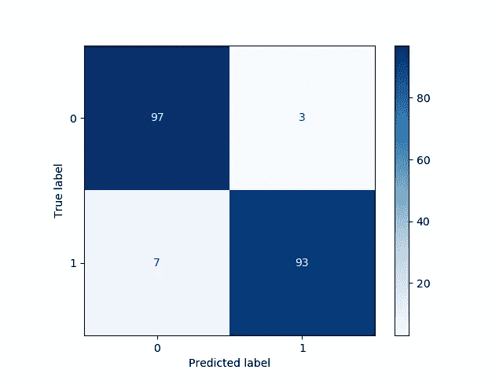
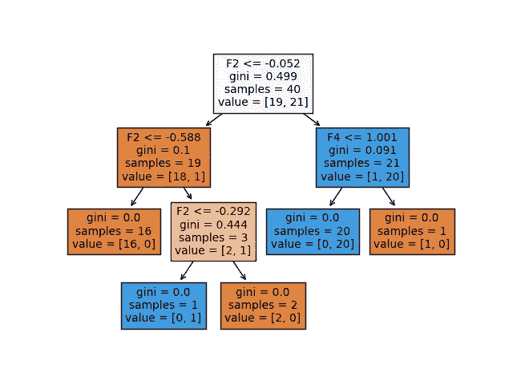

# Scikit-Learn (Python):数据科学家的 6 个有用技巧

> 原文：<https://levelup.gitconnected.com/scikit-learn-python-6-useful-tricks-for-data-scientists-1a0a502a6aa3>

## 使用 scikit-learn (sklearn)改进 Python 中的机器学习模型的技巧



**Scikit-learn (sklearn)** 是一个强大的开源**机器学习库**构建在 Python 编程语言之上。这个库包含许多用于机器学习和统计建模的高效工具，包括各种分类、回归和聚类算法。

在本文中，我将展示关于 scikit-learn 库的 6 个技巧，以使某些编程实践变得简单一些。

# 1.生成随机虚拟数据

为了生成随机的“虚拟”数据，我们可以在**分类数据**的情况下使用`make_classification()`函数，在**回归数据**的情况下使用`make_regression()`函数。这在某些情况下非常有用，例如在调试时，或者当您想要在(小的)随机数据集上尝试某些东西时。

下面，我们生成 10 个分类数据点，包括 4 个特征(在 X 中找到)和一个类标签(在 y 中找到)，其中数据点属于负类(0)或正类(1):

```
from sklearn.datasets import make_classification
import pandas as pdX, y = make_classification(n_samples=10, n_features=4, n_classes=2, random_state=123)
```

这里，X 由生成的数据点的 4 个特征列组成:

```
pd.DataFrame(X, columns=['Feature_1', 'Feature_2', 'Feature_3', 'Feature_4'])
```



y 包含每个数据点的相应标签:

```
pd.DataFrame(y, columns=['Label'])
```



# 2.估算缺失值

Scikit-learn 提供了多种方法来**估算**缺失值。这里，我们考虑两种方法。`SimpleImputer`类提供了输入缺失值的基本策略(例如通过平均值或中值)。更复杂的方法是`KNNImputer`类，它使用**K-最近邻**方法提供填补缺失值的插补。使用具有特定要素值的`n_neighbors`最近邻的值来估算每个缺失值。邻居的值被均匀地平均或根据到每个邻居的距离加权。

下面，我们展示了一个使用两种插补方法的应用示例:

```
from sklearn.experimental import enable_iterative_imputer
from sklearn.impute import SimpleImputer, KNNImputer
from sklearn.datasets import make_classification
import pandas as pdX, y = make_classification(n_samples=5, n_features=4, n_classes=2, random_state=123)
X = pd.DataFrame(X, columns=['Feature_1', 'Feature_2', 'Feature_3', 'Feature_4'])print(X.iloc[1,2])
```

>>> 2.21298305

将 X[1，2]转换为缺失值:

```
X.iloc[1, 2] = float('NaN')X
```



首先我们使用**简单估算器**:

```
imputer_simple = SimpleImputer()

pd.DataFrame(imputer_simple.fit_transform(X))
```



导致值为 **-0.143476** 。

接下来，我们尝试使用 **KNN 估算器**，其中考虑了两个最近的邻居，并对这些邻居进行了统一加权:

```
imputer_KNN = KNNImputer(n_neighbors=2, weights="uniform")pd.DataFrame(imputer_KNN.fit_transform(X))
```



导致值为**0.997105**(= 0.5 *(1.904188+0.090022))。

# **3。利用管道将多个步骤链接在一起**

scikit-learn 中的**管道**工具对于简化你的机器学习模型非常有帮助。管道可以用来将多个步骤连接成一个步骤，这样数据将通过一个固定的步骤序列。因此，管道将所有步骤连接成一个系统，而不是分别调用每个步骤。为了创建这样的管道，我们使用了`make_pipeline`函数。

下面显示了一个简单的示例，其中管道由一个估算器和一个逻辑回归分类器组成，估算器用于估算缺失值(如果有)。

```
from sklearn.model_selection import train_test_split
from sklearn.impute import SimpleImputer
from sklearn.linear_model import LogisticRegression
from sklearn.pipeline import make_pipeline
from sklearn.datasets import make_classification
import pandas as pdX, y = make_classification(n_samples=25, n_features=4, n_classes=2, random_state=123)

X_train, X_test, y_train, y_test = train_test_split(X, y, test_size=0.2, random_state=123)

imputer = SimpleImputer()
clf = LogisticRegression()

pipe = make_pipeline(imputer, clf)
```

现在，我们可以使用管道来拟合我们的训练数据，并对测试数据进行预测。首先，训练数据经过 imputer，然后它开始使用逻辑回归分类器进行训练。然后，我们能够预测测试数据的类别:

```
pipe.fit(X_train, y_train)

y_pred = pipe.predict(X_test)pd.DataFrame({'Prediction': y_pred, 'True': y_test})
```



# 4.使用 joblib 保存管道模型

通过使用 **joblib** 可以很容易地保存通过 scikit-learn 创建的管道模型。如果您的模型包含大型数据数组，每个数组都存储在一个单独的文件中。一旦保存在本地，用户就可以轻松地加载(或恢复)他们的模型，以便在新的应用程序中使用。

```
from sklearn.model_selection import train_test_split
from sklearn.impute import SimpleImputer
from sklearn.linear_model import LogisticRegression
from sklearn.pipeline import make_pipeline
from sklearn.datasets import make_classification
import joblibX, y = make_classification(n_samples=20, n_features=4, n_classes=2, random_state=123)
X_train, X_test, y_train, y_test = train_test_split(X, y, test_size=0.2, random_state=123)

imputer = SimpleImputer()
clf = LogisticRegression()

pipe = make_pipeline(imputer, clf)

pipe.fit(X_train, y_train)joblib.dump(pipe, 'pipe.joblib')
```

现在，拟合的管线模型通过`joblib.dump`保存(转储)在您的计算机上。该模型通过`joblib.load`恢复，之后可以照常应用:

```
new_pipe = joblib.load('.../pipe.joblib')new_pipe.predict(X_test)
```

# 5.绘制混淆矩阵

**混淆矩阵**是用于描述分类器对一组测试数据的性能的表格。这里，我们关注一个**二元分类问题**，即观察值可能属于两个可能的类别:“是”(1)和“否”(0)。

让我们利用`plot_confusion_matrix`函数创建一个二进制分类问题的例子，并显示相应的混淆矩阵:

```
from sklearn.model_selection import train_test_split
from sklearn.metrics import plot_confusion_matrix
from sklearn.linear_model import LogisticRegression
from sklearn.datasets import make_classificationX, y = make_classification(n_samples=1000, n_features=4, n_classes=2, random_state=123)
X_train, X_test, y_train, y_test = train_test_split(X, y, test_size=0.2, random_state=123)

clf = LogisticRegression()

clf.fit(X_train, y_train)

confmat = plot_confusion_matrix(clf, X_test, y_test, cmap="Blues")
```



在这里，我们通过混淆矩阵以一种很好的方式可视化了:

*   93 **真阳性(TP)；**
*   97 **真底片(TN)；**
*   3 **误报(FP)**；
*   7 **假阴性(FN)** 。

所以，我们达到了(93+97)/200 = 95%的准确率。

# 6.可视化决策树

最著名的分类算法之一是**决策树**，其特点是其树状可视化非常直观。决策树的思想是根据描述性特征将数据分割成更小的区域。然后，在测试观察所属的区域中的训练观察中最常出现的类别是预测。为了决定如何将数据分割成区域，必须应用**分割度量**来确定每个特征的相关性和重要性。一些众所周知的分裂措施是信息增益，基尼指数和交叉熵。

下面，我们展示了一个如何利用 scikit-learn 中的`plot_tree`函数的示例:

```
from sklearn.model_selection import train_test_split
from sklearn.tree import DecisionTreeClassifier, plot_tree
from sklearn.datasets import make_classification

X, y = make_classification(n_samples=50, n_features=4, n_classes=2, random_state=123)
X_train, X_test, y_train, y_test = train_test_split(X, y, test_size=0.2, random_state=123)

clf = DecisionTreeClassifier()

clf.fit(X_train, y_train)

plot_tree(clf, filled=True)
```



在这个例子中，我们在 40 个训练观察值上拟合决策树，这些观察值属于否定类(0)或肯定类(1)，因此我们正在处理一个**二元分类问题**。在树中，我们有两种节点，即**内部节点**(预测器空间被进一步分割的节点)或**终端节点**(端点)。连接两个节点的树段被称为**分支**。

让我们仔细看看为决策树中的每个节点提供的信息:

*   在特定节点中使用的**分裂标准**显示为例如‘F2<=-0.052’。这意味着满足第二特征的值低于-0.052 的条件的每个数据点属于左边新形成的区域，而不满足该条件的数据点属于内部节点右边的区域。
*   **基尼指数**在这里被用作分割指标。基尼指数(称为杂质的量度)衡量的是随机选择的特定元素被错误分类的程度或概率。
*   节点的“样本”指示在特定节点中找到了多少训练观测值。
*   节点的“值”指示分别在负类(0)和正类(1)中找到的训练观察的数量。因此，value=[19，21]意味着在该特定节点中，19 个观察值属于负类，21 个观察值属于正类。

# 结论

本文介绍了 6 个有用的 scikit-learn 技巧，以改进 sklearn 中的机器学习模型。我希望这些技巧在某种程度上对您有所帮助，并祝您在使用 scikit-learn 库的下一个项目中好运！

# 分级编码

感谢您成为我们社区的一员！ [**订阅我们的 YouTube 频道**](https://www.youtube.com/channel/UC3v9kBR_ab4UHXXdknz8Fbg?sub_confirmation=1) 或者加入 [**Skilled.dev 编码面试课程**](https://skilled.dev/) 。

[](https://skilled.dev) [## 编写面试问题

### 掌握编码面试的过程

技术开发](https://skilled.dev)