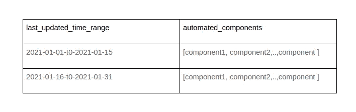

# SCOAT——智能覆盖自动化框架

> 原文：<https://levelup.gitconnected.com/scoat-a-smart-coverage-automation-framework-a907d268932>

## 一个开发工具，以智能方式实现测试自动化覆盖。


假设您有一个包含 500 个案例的自动化列表，它将覆盖您的应用程序的所有组件，但是您必须对前 100 个案例进行优先级排序。而且，它应该仍然像 500 个自动化案例一样有效。你是做什么的？(求老板现实一点？:p)。听着，获得合理的时间来自动化所有的 500 本该是最好的方法，但是这个世界并不公平，不是吗？

好吧。我就不那么戏剧化了，直奔主题。

选择自动化测试的一种方法是了解产品中使用最多的是什么。因为最终，我们编写自动化是为了向用户交付尽可能少错误的产品。对于任何产品来说，20%的功能被 80%的客户使用或多或少是正确的。因此，首先自动化并在产品的这一部分早期捕捉缺陷不是很聪明吗？在这一部分中捕获的每一个错误都会阻止 80%的人使用该产品。很划算，对吧？带着这个明确的目标，我在 HackerEarth 开发了 SCOAT，我希望越来越多的人将使用这个框架以更智能的方式实现更好的质量。

# SCOAT 是什么？

SCOAT 是由“**S**mart**CO**verage**A**automation**T**ESTs”缩写而成。它是一个工具，用来帮助任何质量保证团队以比传统方法更有效的方式实现产品的自动化覆盖。

SCOAT 关注的一个重要问题是，在开发测试自动化计划时，大多数 QA 团队可能都忽略了这个问题:“我们的客户使用我们优先考虑自动化的特性吗？”

以下是 SCOAT 的基本功能:


# 实施 SCOAT

SCOAT 是用 Python 语言编写的。任何具有 python 编程(或任何其他等效程序)、正则表达式、数据库和/或 AWS 服务基础知识的开发人员或 SDET 都可以为他们的产品开发它。

# 下面我们来详细了解一下 SCOAT 组件！

## SCOAT 刮刀

*Scrapper 会负责获取数据。*

**选择数据源:**实现这个框架最重要的事情是找到一个拥有足够多用户正在进行的网络调用数据的数据源。然后数据可以被清理，并以 SCOAT 理解的方式建模。在 HackerEarth，我们使用 Amazon redshift，它存储了任何用户进行的每个网络呼叫的条目。我们有 redash，可以让我们查询所需的信息。有一个名为 requestlog 的表，它存储了我们产品中发生的每个网络调用的详细信息。

让我们举一个 redash 表 requestlog 列的基本例子。


示例表模式:requestlog 表

**准备来自上述数据源的查询:**因为我们将继续使用 redash，所以我们可以使用 SQL 查询，它将给出下面的结果。在上表中，我的查询可以简单到如下所示:

1)实际客户点击的 URL

```
select path_info from requestlog where <conditon for actual users>
```

2)用户点击的 URL，这些 URL 是专门为测试自动化而创建的

```
select path_info from requestlog where <conditon for test users>
```

这将为我们提供两个不同表的数据，我们将在组件 SCOAT 数据存储中注意到这两个表。

## SCOAT 解析器

*解析器将从 SCOAT scrapper 获取数据，重新格式化并转换成组件。*

**第 n 级深度格式化:**

从 SCOAT scrapper 接收的查询结果集将包含用户点击的每个 URL 的大量具体细节。我们需要清理并重新格式化这些 URL，以便它们可以归入特定的组件类别。

通过使用第 n 层深度来格式化 URL，我们将把每个匹配模式"*/recruiter/question-report/** "的记录转换为*/recruiter/question-report/*。这意味着我们使用了第二层深度，并在那里停下来把它当作一个组件。为了更好地理解它，请看下面的例子。


对所有记录使用这种方法，SCOAT 解析器将生成格式化组件及其计数的映射(组件在所有记录中的出现)。

## SCOAT 数据存储

*Datastore 是存储计算所需的各种数据的模块，也存储 dynomoDB 表中的 fina scoat 输出。*

每次运行 SCOAT 时，格式化组件的映射及其出现次数都存储在两个 dynomoDB 表中。最终计算的细节将存储在第三个 dynamoDB 表中。

**表 1 automation_covered_urls** :自动化组件列表。这是一个单独的条目，每次运行时都会进行更新和调整，以保持自动化组件的列表是最新的。



*样表模式:***automation _ covered _ URLs**

**表 2 prod _ usage _ URLs**:prod 用户常用组件列表。这是一个单独的条目，每次运行时都会进行更新和调整，以保持所用组件的列表是最新的。


*样表模式:* **prod_usage_urls**

**表 3 smart_coverage_data :** 每个运行细节的最终 SCOAT 输出。每次运行时，都会在该表中添加一个新条目。


样表模式: **smart_coverage_data**

在每次运行时，URL 的增量将被添加到上面的表中，以便它们总是被更新，以具有自从我们开始使用 SCOAT 以来的历史数据。

## SCOAT 分析仪

分析器是一个模块，它实际上为应该自动化的组件计算覆盖率和建议。

一旦数据存储在 dynomoDB 表中，SCOAT analyzer 将使用这些数据并计算所需的覆盖率细节。这将存储在一个名为 **smart_coverage_data** 的单独的 **dynamoDB 表**中。该表将包含以下详细信息:

1.  计算中使用数据的持续时间(例如，*2021–03–01 _ 至 _ 2021–04–01*)
2.  自动绘制元件图并计数
3.  使用的组件和计数图
4.  覆盖率百分比
5.  用户使用但未自动化的组件
6.  用户不再使用的自动化组件

使用这些数据，QA 团队将优先考虑 SCOAT 推荐的自动化组件。通过这种方式，我们确保自动化人们更频繁使用的领域。

这本质上是一个 python 项目，几乎可以在任何机器上实现和运行。您可以使用 Amazon EC2 机器并在那里查看项目。我们使用 AWS CodeBuild 来运行 SCOAT，因为它不需要我们维护机器。

# SCOAT 模块示例

从 redash 获取数据、解析数据、分析数据并生成 scoat 数据的最终 python 模块如下所示。

```
*scoat.py*import scoat_data_store
import scoat_scrapper
import scoat_parser
import run_scoatdef refresh_and_run_scoat(start_date, end_date):build_id = “{}_to_{}”.format(start_date, end_date)
    redash_data = scoat_scrapper.get_data(start_date, end_date)
    formatted_data = scoat_parser(redash_data)
    scoat_data_store.update_dynamodb_tables(
                     redash_data,
                     start_date,
                     end_date)
    coverage_data = run_scoat.run_smart_coverage()
    run_scoat.send_slack_digest(coverage_data, start_date, end_date)
    run_scoat.update_dynamo_db_tables(scoat_coverage_data, build_id)
```

注意:以上每个导入的模块( *scoat_data_store.py，scoat_scrapper.py 等*)都有不止一个方法。以上只是伪级实现的一个例子。

我已经在 Amazon CodeBuild 中实现了 SCOAT。这也可以在任何机器上进行。

现在，无论有没有 AWS CodeBuild，都可以安排这个运行。该命令将是*" python scoat . py<to _ date><from _ date>"*

我们已经安排 AWS 代码构建项目每 15 天运行一次。这意味着查询最近 15 天的数据，并且 prod_used_urls 和 automation_covered_urls 的相应表每 15 天更新一次。然后从这些最新的表数据中生成覆盖结果和建议。

如果有人以任何创新的方式解决了覆盖自动化问题，请分享！

编码快乐！